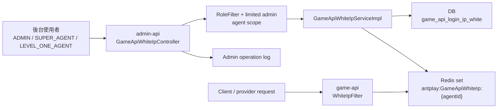
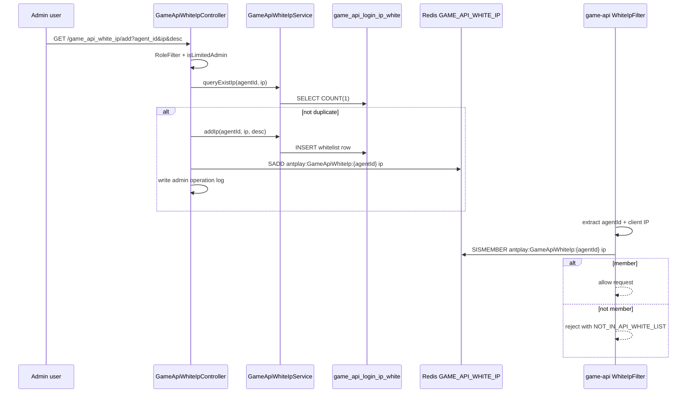

# game-api-whitelist-sync Flow

日期: 2026-05-28

## 0. 閱讀定位

- Flow 中文名稱: Game API 白名單控制面 / DB + Redis 同步
- Flow slug: `game-api-whitelist-sync`
- 完成狀態: Step 3 / Level 2 Flow 深掃已完成
- 證據層級: 真實開發過 + code-backed；Nick / `10gt12nc` 有 `#682` admin-api 白名單 direct commits，game-api runtime filter 有 `#684` direct commits；內網 remote fetch 失敗，本輪依本地 refs / 本地工作樹保守分析
- 本 flow 類型: 後台 control plane / runtime access-control support flow
- 是否只確認到入口: 否。已確認 admin-api controller / service / mapper / Redis 寫入，以及 game-api `WhiteIpFilter` 讀同一 Redis key 做 request allow / reject；但完整 gateway / security platform、production deploy policy 與後續 team 改動效果仍待確認

## 1. 白話導讀

這條 flow 在做「誰可以呼叫 Game API」的 IP 白名單控制。

後台 admin-api 提供新增、查詢、刪除 Game API 白名單的 API。新增或刪除時，資料會寫進 DB 的 `game_api_login_ip_white`，同時更新 Redis set `antplay:GameApiWhiteIp:{agentId}`。game-api runtime 端的 `WhiteIpFilter` 收到登入或 public API request 時，會取出 request 裡的 `agentId` 和來源 IP，到 Redis set 檢查這個 IP 是否允許。

所以它不是單純後台 CRUD。它是 control plane 影響 runtime access-control 的流程:

```text
後台設定白名單
  -> DB 保存設定
  -> Redis 更新 runtime cache
  -> game-api filter 讀 Redis 判斷 request 是否放行
```

最直覺的風險是 DB 和 Redis 不一致。DB 有資料但 Redis 沒更新，runtime 可能拒絕合法 request；Redis 有舊資料但 DB 已刪除，runtime 可能暫時放行不該放行的 IP。

## 2. 初中階 Code 分層對照

| Layer | Code path | 本 flow 責任 |
| --- | --- | --- |
| Admin API | `GameApiWhiteIpController` | `/game_api_white_ip/add`、`getList`、`delete`、`sync_ss00172r001` |
| Role / scope | `@RoleFilter`、`AdminAuthService#isLimitedAdmin`、`AgentRoleUtil#processAgentIds` | 限制誰能改、誰能看哪些 agent 的白名單 |
| Service | `GameApiWhiteIpServiceImpl` | DB mapper 呼叫、batch sync、Redis delete / add |
| Mapper | `GameApiWhiteIpMapper` / XML | insert / delete / query / exists |
| DB | `game_api_login_ip_white` | 白名單設定的持久化來源 |
| Redis | `RedisKey.GAME_API_WHITE_IP` | runtime filter 使用的白名單 set |
| Runtime filter | `antplay-slot-game-api WhiteIpFilter` | 從 request 找 `agentId`，用 Redis 判斷來源 IP 是否可呼叫 |
| Audit | `AdminOperationLogService#insertAdminOperationLogsNew` | 新增 / 刪除白名單時寫後台操作紀錄 |

## 3. 最小架構圖



## 4. 正常流程圖



## 5. 正常流程逐步說明

### 新增白名單

1. 後台呼叫 `/game_api_white_ip/add`，帶 `agent_id`、`ip`、`desc`。
2. controller 要求 role 是 `ADMIN`、`SUPER_AGENT` 或 `LEVEL_ONE_AGENT`。
3. controller 先確認 `adminAuthService.isLimitedAdmin()`，不符合就回 `Not limited account`。
4. 若 `ip` 空值，直接回錯誤訊息。
5. 若 `queryExistIp(agentId, ip)` 已存在，回「同商戶 ip 重複」。
6. 不重複時，`addIp` insert 到 `game_api_login_ip_white`。
7. controller 對 Redis set `antplay:GameApiWhiteIp:{agentId}` 做 `SADD ip`。
8. 寫後台 operation log。
9. 查回列表，回傳最新白名單。

### 查詢白名單

1. 後台呼叫 `/game_api_white_ip/getList`。
2. controller 從 `SecurityContextHolder` 取 `AuthPayloadData`。
3. `AgentRoleUtil#processAgentIds` 依 role、查詢 agentId、登入者 agentId 決定可查範圍。
4. `getIpWhiteList` 查 `game_api_login_ip_white`，可依單一 agent 或 agent list 篩選。

### 刪除白名單

1. 後台呼叫 `/game_api_white_ip/delete`，帶 `agent_id`、`ip_id`。
2. controller 確認 limited admin。
3. 先用 `getIpById(ipId)` 取 IP。
4. `deleteIp(ipId)` 刪 DB。
5. 對 Redis set `antplay:GameApiWhiteIp:{agentId}` 做 `SREM ip`。
6. 寫 operation log。

### 同步特定 merchant 白名單

1. 後台呼叫 `/game_api_white_ip/sync_ss00172r001`，只允許 `ADMIN`。
2. service 找出 `merchant_code = SS00172R001` 的來源 agentId。
3. 依 hard-coded prefix 找出同 prefix 的 enabled agents。
4. 從來源 agent 的 `game_api_login_ip_white` 取 source IPs。
5. 對每個目標 agent 先刪 Redis set，再把 source IPs 加回 Redis。
6. 對每個目標 agent 刪 DB 舊資料，再 batch insert source IPs。

## 6. 業務問題

這條 flow 解決的是 Game API 開放入口的 IP 控制。Game API 通常面向商戶、代理或外部整合方，如果不限制來源 IP，風險會落在:

- 非授權來源嘗試呼叫 login / public API。
- 商戶或代理更換機器後，需要後台即時放行新 IP。
- 多個下屬 agent 要同步同一組白名單時，人工逐筆設定容易漏。

但它也帶來 production 取捨:

- DB 是後台可查與可維護的設定來源。
- Redis 是 runtime filter 實際判斷來源。
- DB / Redis 雙寫沒有明確 transaction 包在一起，所以要處理不一致與補償。
- sync 是 batch 操作，部分成功會讓部分 agent runtime 狀態不同。

## 7. DB / Redis / Runtime

| 類型 | 名稱 | 說明 |
| --- | --- | --- |
| DB table | `game_api_login_ip_white` | 欄位包含 `id`、`agent_id`、`ip`、`desc`、`created_at`、`updated_at` |
| Redis key | `antplay:GameApiWhiteIp:{agentId}` | Set 結構；value 是可放行 IP |
| Admin API | `/game_api_white_ip/add` | 新增 DB row + Redis `SADD` |
| Admin API | `/game_api_white_ip/delete` | 刪 DB row + Redis `SREM` |
| Admin API | `/game_api_white_ip/getList` | 依角色與 agent scope 查 DB |
| Admin API | `/game_api_white_ip/sync_ss00172r001` | 來源 merchant IP 同步到 prefix agents |
| Runtime | game-api `WhiteIpFilter` | 讀 Redis set 判斷 request source IP 是否在白名單 |

## 8. 資料狀態與 State Transition

白名單資料有兩份狀態:

```text
DB persistent config
  -> Redis runtime cache
  -> game-api request allow / reject
```

新增:

```text
not exists in DB
  -> DB inserted
  -> Redis SADD
  -> runtime starts allowing this IP
```

刪除:

```text
exists in DB
  -> DB deleted
  -> Redis SREM
  -> runtime stops allowing this IP
```

同步:

```text
source merchant IP list
  -> target agents selected by prefix
  -> each target Redis delete + SADD
  -> each target DB delete + batch insert
```

目前 Step 3 看到的主要一致性問題是「DB 與 Redis 的更新順序不完全一致」。新增 / 刪除是 controller 先 DB 後 Redis；sync 是 service 裡對每個 agent 先 Redis 後 DB，且 service method 有 `@Transactional` 只保證 DB transaction，不保證 Redis rollback。

## 9. Failure Window

| Failure window | 已確認行為 | 風險 / 判斷 |
| --- | --- | --- |
| 新增 DB 成功、Redis SADD 失敗 | controller 先 `addIp` 再 `SADD` | DB 顯示已放行，但 runtime 仍拒絕 |
| 新增 DB 失敗 | Redis 尚未寫 | 較安全，runtime 不會放行；使用者看到新增失敗 |
| 刪除 DB 成功、Redis SREM 失敗 | controller 先 delete DB 再 remove Redis | DB 看不到，但 runtime 可能仍放行舊 IP |
| 刪除前 `getIpById` 查不到 | `ip` 可能為 null，但仍可能 delete by id | Redis remove null / mismatch 風險，需更嚴格錯誤處理 |
| duplicate check race | `queryExistIp` 再 insert | 若 DB 無 unique key，併發新增可能重複 |
| sync Redis 成功、DB transaction rollback | `WhitelistSync` 內先 delete / add Redis，再 delete / insert DB | Redis 不會跟 DB transaction rollback，可能出現 runtime 與 DB 不一致 |
| sync batch 中途失敗 | 逐 agent loop | 部分 agent 已同步，部分未同步 |
| source merchant / prefix hard-coded | 目前只看到 `SS00172R001` | 適合臨時批次需求；長期應設定化 |
| runtime filter agentId missing | game-api 取 query/body `agentId` | agentId null 時 Redis key 可能錯，實際行為需補測 |

## 10. Senior / Owner 分析

### Source of Truth

這條 flow 的設定 source of truth 是 DB `game_api_login_ip_white`，但 runtime truth 是 Redis set。面試時要主動說清楚: 「DB 是管理與查詢來源，Redis 是 runtime 判斷來源」，兩者不是天然一致。

### Consistency

這不是 money correctness，但它是 access-control correctness。錯誤結果不是錢包錯帳，而是:

- 合法商戶被拒絕，造成整合不可用。
- 不該放行的 IP 被放行，造成安全風險。

因此 owner 會關心:

- DB / Redis 雙寫失敗時怎麼補償。
- 是否有定期 reconcile，把 DB 重建到 Redis。
- Redis key 是否有 TTL；目前 Step 3 未看到 TTL evidence。
- 是否有操作 log 與審計。

### Idempotency

新增前有 `queryExistIp(agentId, ip)`，刪除用 `ipId`。這能擋一般重複操作，但不能取代 DB unique key。若要強化，建議 DB 對 `(agent_id, ip)` 加 unique key，再讓 insert duplicate 走明確錯誤或 upsert。

### Transaction Boundary

`WhitelistSync` 有 `@Transactional`，但 Redis 操作不受 DB transaction 控制。新增 / 刪除 API 沒看到 method-level transaction 把 DB 與 Redis 包在同一層，而且即使有 DB transaction，也不能 rollback Redis。正確口徑是「需要補償 / reconciliation」，不是宣稱強一致。

### Observability

目前可確認有 admin operation log 與部分 debug log。正式 owner 還會補:

- 白名單新增 / 刪除成功率。
- Redis 更新失敗告警。
- sync 影響 agent 數、成功 / 失敗 agent 清單。
- runtime filter reject count by agentId / IP。
- DB / Redis diff 檢查。

## 11. Owner Decision

如果我是 owner，會把取捨講成:

- 這條 flow 用 DB 保存可管理設定，用 Redis 支撐高頻 runtime check。
- Runtime filter 不應每次打 DB，否則登入 / public API 會被 DB latency 影響。
- 因為 DB / Redis 是雙寫，不能假裝強一致；要用 operation log、rebuild cache、reconcile job 與告警降低風險。
- batch sync 是實務上的批量維運工具，但 hard-coded merchant / prefix 只能算特定需求，不宜包裝成完整白名單平台。

## 12. 面試 / 履歷邊界摘要

可面試講:

- 參與 Game API 白名單控制面，後台新增 / 刪除 / 查詢白名單並同步 Redis，game-api runtime filter 讀 Redis 判斷來源 IP。
- 能拆 DB source、Redis runtime cache、RoleFilter / limited admin、operation log、runtime `WhiteIpFilter`。
- 能分析 DB / Redis 雙寫失敗、batch sync 部分成功、duplicate check race、runtime reject observability。

不可誇大:

- 不說主導完整 security platform。
- 不說完整 Game API gateway owner。
- 不說 DB / Redis 強一致已完整解決。
- 不說完整 production access-control / WAF / IAM owner。
- 不把白名單控制面包裝成 money correctness。

## 13. Step 3 待補

- Step 4 要轉成正式面試 case，補 30 秒 / 90 秒 / 3 分鐘說法與追問。
- Step 5 再做 claim gate，判斷是否只作 project-level supporting evidence，或能回填 `antplay-slot-admin-api` contribution refresh。
- 若要升級成更強 owner case，需補 DB DDL / unique key、Redis rebuild / reconciliation、filter deployment scope 與 production reject metrics。
