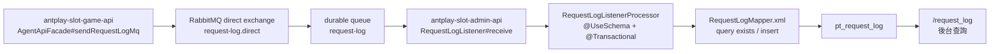
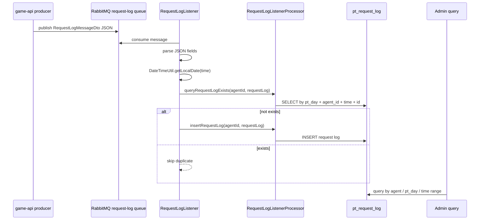

# request-log-rabbitmq-admin-consumer Flow

日期: 2026-05-28

## 0. 閱讀定位

- Flow 中文名稱: RequestLog RabbitMQ 非同步入庫 / admin audit consumer
- Flow slug: `request-log-rabbitmq-admin-consumer`
- 完成狀態: Step 5 / 單條 flow claim gate 已完成；Level 2 Flow 深掃沿用 Step 3 evidence
- 證據層級: 真實開發過 + code-backed；Nick / `10gt12nc` 有 admin-api #774 consumer direct commits，game-api producer 也有 #774 direct commits；內網 remote fetch 失敗，本輪依本地 refs / 本地工作樹保守分析
- 本 flow 類型: async audit / observability / admin consumer flow
- 是否只確認到入口: 否。已確認 admin-api consumer、processor、mapper、RabbitMQ config、`pt_request_log` insert 與 admin query context；producer 端以既有 game-api flow + 本地 code 作上下游定位

## 1. 白話導讀

這條 flow 在做一件事：把 game-api 送來的 request / response log message，從 RabbitMQ 收下來，轉成資料庫裡的 `pt_request_log`。

它不是下注、結算、錢包異動的 source of truth。真正的交易結果仍看 bet record、wallet state、provider response。request log 的價值是 audit / troubleshooting：客服、營運或工程師之後可以在後台查某次 provider API request 發了什麼、回了什麼、花了多久、是否錯誤。

正常情境是:

1. game-api 呼叫第三方 provider API。
2. game-api 在 finally 裡組 request log message。
3. message 被送到 RabbitMQ `request-log` queue。
4. admin-api `RequestLogListener` 消費 message。
5. consumer parse JSON，算出 `ptDay`，組成 `RequestLog`。
6. processor 先查 `pt_request_log` 是否已有相同紀錄。
7. 不存在才 insert。
8. 後台 `/request_log` 查詢時讀 `pt_request_log`。

如果失敗，最直覺會壞在 audit 而不是主交易：下注可能已完成，但 request log 沒入庫、延遲入庫或重複入庫，導致後續查問題比較困難。

## 2. 初中階 Code 分層對照

| Layer | Code path | 本 flow 責任 |
| --- | --- | --- |
| Upstream producer | game-api `AgentApiFacade#sendRequestLogMq` | provider API call 後送 request log message；本輪只作上下游定位 |
| Message DTO | game-api `RequestLogMessageDto` | 定義 id、time、agentId、step、target、request / response / error / elapsedTime |
| MQ config | admin-api `RabbitMQConfig#requestLogExchange / requestLogQueue / requestLogBinding` | 宣告 direct exchange、durable queue 與 routing key binding |
| MQ constants | admin-api `RabbitMq.REQUEST_LOG_*` | exchange / routing key / queue key |
| Consumer | `RequestLogListener#receive` | 監聽 `request-log` queue，parse JSON，組 `RequestLog` |
| Consumer service | `RequestLogListenerProcessor` | 切 schema、查重、transaction insert |
| DAO / SQL | `RequestLogMapper` / `RequestLogMapper.xml` | 查 `pt_request_log` 是否存在，insert request log |
| Entity | `domain.manage.data.entity.RequestLog` | request log DB 欄位模型 |
| Admin query | `RequestLogController` / `RequestLogsService` | 後台依 agent / date / target / error 查 log；本 flow 的讀取端 context |

## 3. 最小架構圖



## 4. 正常流程圖



## 5. 正常流程逐步說明

1. game-api producer 在 provider API call 結束後，送出 request log message。
2. admin-api `RabbitMQConfig` 宣告 `request-log.direct` direct exchange、durable `request-log` queue 與 routing key `request-log`。
3. `RequestLogListener#receive` 透過 `@RabbitListener(queues = RabbitMq.REQUEST_LOG_QUEUE_KEY)` 監聽 queue。
4. listener 收到 `String message` 後用 `JSONObject.parseObject(message)` 解析。
5. listener 逐一取 `id`、`time`、`agentId`、`type`、`step`、`target`、`uri`、`method`、request / response body、`status`、`errorMessage`、`elapsedTime`。
6. listener 用 `DateTimeUtil.getLocalDate(time)` 算出 `ptDay`。
7. listener new `RequestLog(...)`，把 message 轉成落庫 entity。
8. `RequestLogListenerProcessor#queryRequestLogExists` 使用 `@UseSchema`，依 `agentId` 路由到對應 schema。
9. `RequestLogMapper.xml#queryRequestLogExists` 用 `(pt_day, agent_id, time, id)` 查 `pt_request_log` 是否已有紀錄。
10. 若查不到，`insertRequestLog` 進入 `@Transactional` + `@UseSchema`，insert `pt_request_log`。
11. 若查得到，consumer skip，不重複 insert。
12. 後台 `RequestLogController` 查詢時，依登入角色 / agent scope、日期範圍、target、error flag，讀 `pt_request_log`。

## 6. 業務問題

這條 flow 解決的是「provider API request log 不要卡住主交易，但仍要能查得到」。

同步寫 log 的問題是：DB 慢、分表 schema 錯、request body 過大、連線問題，都可能拖慢或污染 provider API 主流程。改成 MQ 後，game-api 先把 log 投遞出去，admin-api 後續處理落庫。

代價是 request log 變成 eventual consistency:

- provider API 完成，不代表 log 已立即入庫。
- MQ 或 consumer 掛掉時，後台可能短時間查不到。
- message 可能重送，所以 consumer 要查重。
- 若沒有 DLQ / retry / alert，audit loss 需要靠 log 或外部監控補。

## 7. DB / Redis / MQ / 外部 API

| 類型 | 名稱 | 說明 |
| --- | --- | --- |
| MQ exchange | `request-log.direct` | admin-api 宣告的 durable direct exchange |
| MQ queue | `request-log` | admin-api consumer 監聽 queue |
| MQ routing key | `request-log` | binding routing key |
| DB table | `pt_request_log` | request log 寫入與後台查詢來源 |
| DB dedupe key | `(pt_day, agent_id, time, id)` | SQL 查重條件；是否有 DB unique constraint 未確認 |
| Redis | 不適用 | 本 flow 不依賴 Redis |
| External API | provider API | 實際呼叫在 game-api producer 端，本 flow 只消費 audit message |

## 8. 資料狀態與 State Transition

本 flow 的核心不是交易狀態，而是 audit message lifecycle:

```text
message published
  -> message consumed
  -> JSON parsed
  -> RequestLog entity built
  -> duplicate checked
  -> inserted into pt_request_log
  -> queryable by admin
```

已確認:

- consumer 有 application-level dedupe check。
- insert 被包在 `@Transactional` 方法中。
- `@UseSchema` 會嘗試從 method parameter `agentId` 或物件 `getAgentId()` 推出 schema。
- 查詢端也依 agentIds + ptDays 建 partition key 查 `pt_request_log`。

待確認:

- `pt_request_log` 是否有 DB unique key 防止併發重複 insert。
- Rabbit listener ack mode、retry、DLQ / requeue policy。
- queue lag / consumer failure 是否有正式監控。
- message schema 是否有 versioning 或 backward compatibility。

## 9. Failure Window

| Failure window | 已確認行為 | 風險 / 判斷 |
| --- | --- | --- |
| producer publish 前 crash | 本 flow 只看到 consumer；producer finally 送 MQ | 交易可能完成但 audit message 沒送出 |
| routing key / queue 不一致 | admin-api 宣告 direct exchange / queue / binding | 曾有 UAT / G2 修正 commits，部署一致性重要 |
| message JSON parse error | listener catch exception 並 log error | 若 ack mode 是 auto，可能造成 message loss；ack / retry 未確認 |
| missing required field | `time` / `agentId` 若 null 會影響 `ptDay` / schema route | 需要 schema validation；目前未看到明確 validator |
| duplicate message | 先查 exists 再 insert | 可擋一般重送；併發重送仍需 DB unique key，本輪未確認 |
| insert DB failed | catch 在 listener 外層 | 是否 retry 取決於 listener container，未確認 |
| schema route failed | `SchemaRouteAspect` 找不到 agent group 時記 error 並 fallback | 可能寫到 default schema 或查不到資料，需監控 |
| admin query delay | MQ async 天然延遲 | 後台短時間查不到，不代表交易沒發生 |

## 10. Senior / Owner 分析

### Source of Truth

`pt_request_log` 是 audit / troubleshooting source，不是 money correctness source。它能回答「當時 request / response 長什麼樣」，但不能單獨判斷下注或結算是否成立。

### Idempotency

consumer idempotency 目前靠:

- message 內的 `id`
- message 內的 `time`
- `agentId`
- `ptDay`
- `queryRequestLogExists` 查 `pt_request_log`

這是 application-level dedupe。面試要保守講：它能降低重複寫入，但如果同一 message 併發重送，query 和 insert 中間仍有 race，最好用 DB unique key 或 insert ignore / upsert 類策略補強。本輪未確認 DDL，所以不能宣稱已完整防重。

### Transaction Boundary

`insertRequestLog` 有 `@Transactional`，但 `queryRequestLogExists` 和 `insertRequestLog` 是兩個 method call。也就是說，查重和 insert 並不一定在同一個 transaction boundary 內完成。這對 audit log 通常可接受，但要知道它不是 exactly-once。

### Retry / Compensation

本輪未看到明確 listener retry、DLQ、manual ack、publisher confirm 設定。可提出 owner 改善:

- 消費失敗進 DLQ。
- parse failure 記 bad message sample 與 alert。
- DB insert duplicate 改由 unique key 承擔。
- queue lag / consumer error 指標化。
- producer / consumer message schema 加版本。

### Observability

目前 code 有 log error，但 Step 3 沒看到明確 metrics / alert。這條 flow 若作 Senior case，應主動說「我不會把 log error 誇大成正式 observability；正式 owner 會補 queue lag、consumer error rate、DLQ count、DB insert failure rate」。

## 11. Owner Decision

如果我是 owner，會把設計邊界講成:

- 交易主流程優先，不因 audit log 寫庫失敗 rollback money flow。
- request log 用 async MQ 解耦，降低 provider API latency 和 DB coupling。
- 因為它不是交易 truth，可以接受 eventual consistency。
- 但 audit loss 會影響事故排查，所以需要 DLQ / retry / alert / unique key 補足 reliability。
- Step 3 目前只確認到 consumer dedupe + transaction insert，不宣稱完整 reliable messaging。

## 12. 面試 / 履歷邊界摘要

可面試講:

- 參與 request log 從同步寫庫改成 RabbitMQ async 的 consumer 落庫側。
- 能拆 producer、direct exchange、durable queue、consumer、dedupe、DB insert、後台查詢。
- 能說明 request log 是 audit data，不是交易 source of truth。
- 能分析 duplicate message、ack / retry、DLQ、DB unique key、schema route 等 production 風險。

履歷保守 bullet 候選:

- 參與 AntPlay 後台 RequestLog RabbitMQ consumer 與 audit log 入庫流程，處理 message parse、schema route、查重與 `pt_request_log` 寫入，支援 provider API request / response 後台追查。

不可誇大:

- 不寫完整 RabbitMQ platform owner。
- 不寫 exactly-once / outbox / DLQ 已完整落地。
- 不寫主導完整 AntPlay slot platform。
- 不把 request log 說成 money correctness source。

## 13. 本次實際掃描範圍

Vault:

- `AGENTS.md`
- `senior-owner-playbook/00-operating-rules.md`
- `senior-owner-playbook/09-ai-prompt-manual.md`
- `senior-owner-playbook/03-flow-learning-package-template.md`
- `projects/CONVENTIONS.md`
- `projects/antplay/antplay-slot-admin-api/README.md`
- `step1-candidate-flows.md`
- `step2-flow-comparison.md`
- `contribution-claim-consolidation.md`
- 既有 `antplay-slot-game-api/request-log-rabbitmq-async` flow / evidence 作 upstream context

Source:

- admin-api `RequestLogListener`
- admin-api `RequestLogListenerProcessor`
- admin-api `RequestLogMapper`
- admin-api `RequestLogMapper.xml`
- admin-api `RequestLog` / `RequestLogPK`
- admin-api `RabbitMQConfig`
- admin-api `RabbitMq`
- admin-api `RequestLogController` / `RequestLogsService`
- admin-api `UseSchema` / `SchemaRouteAspect`
- game-api `AgentApiFacade#sendRequestLogMq`
- game-api `RequestLogMessageDto`
- game-api `RabbitMqService`
- game-api `RabbitMQConfig`
- path-specific git log / selected commit stats

未掃 / 待確認:

- 未做 Level 3 逐檔逐行。
- 未確認內網 remote 最新狀態。
- 未確認 Rabbit listener container ack / retry / DLQ 設定。
- 未確認 `pt_request_log` DDL / unique key。
- 未確認 production queue lag / monitoring / alerting。

## 14. Step 4 面試包摘要

Step 4 已完成，正式面試素材放在:

- [career-interview.md](/Users/nick/Git/nick/nick-vault/projects/antplay/antplay-slot-admin-api/flows/request-log-rabbitmq-admin-consumer/career-interview.md)
- [materials/interview.md](/Users/nick/Git/nick/nick-vault/projects/antplay/antplay-slot-admin-api/flows/request-log-rabbitmq-admin-consumer/materials/interview.md)

本 flow 面試主軸:

- RequestLog 是 async audit / troubleshooting data，不是交易 source of truth。
- game-api producer 與 admin-api consumer 以 RabbitMQ direct exchange / durable queue 解耦。
- consumer 端重點是 JSON parse、`ptDay` partition key、`@UseSchema` multi-schema route、application-level dedupe 與 `pt_request_log` insert。
- Senior 追問要主動承認未確認 DLQ / retry / ack mode / DB unique key，不誇大成 exactly-once。

## 15. Step 5 Claim Gate

### 結論

本 flow 可以作為 `antplay-slot-admin-api` project-level contribution consolidation 的 supporting evidence，也可以作為正式面試 case。證據足以支撐「參與 AntPlay 後台 RequestLog RabbitMQ consumer 與 audit log 入庫流程」。

但本 flow 不直接更新 `05 / 08` 成獨立履歷 bullet。原因是 `05 / 08` 原則上吃 project-level consolidation；`antplay-slot-admin-api` 目前已有 rolling consolidation，本 flow Step 5 只回填 project claim 的證據邊界，不代表整個 project final consolidation 完成。

### 可放履歷的保守口徑

若後續做 project-level refresh，可併入既有 AntPlay 後台 API / control plane bullet:

```text
參與 AntPlay 後台 API / 商戶控制面與非同步資料處理開發維護，範圍包含 RequestLog RabbitMQ consumer、message parse、schema route、查重與 audit log 入庫，支援 provider API request / response 後台追查。
```

目前不建議單獨放成最大主成果；它比較適合作為「後台 async audit / troubleshooting」支撐句。

### 可面試講

- game-api producer 與 admin-api consumer 的 RabbitMQ producer / consumer 邊界。
- request log 是 audit / troubleshooting data，不是 money correctness source。
- `ptDay`、`agentId`、`time`、`id` 的查重與 partition / schema route 風險。
- application-level dedupe、query-then-insert race、DB unique key / upsert 改善方向。
- 未確認 DLQ / retry / ack mode / queue lag monitoring，不能誇大成完整 reliable messaging。

### 不可誇大

- 不寫主導完整 AntPlay slot platform。
- 不寫完整 RabbitMQ platform / exactly-once / outbox owner。
- 不寫已落地完整 DLQ / retry / metrics / masking。
- 不把 request log 說成下注、結算或錢包正確性的 source of truth。
- 不寫量化改善、事故修復或 latency 改善，除非後續補 production metric / ticket。

### Evidence level

| Claim | Step 5 判斷 |
| --- | --- |
| admin-api request log consumer | 真實開發過 + code-backed，可作 project-level supporting evidence |
| game-api producer 對接 | 真實開發過 + code-backed，可作上下游 context |
| async audit / troubleshooting 面試 case | 可正式面試講 |
| 完整 RabbitMQ reliability / exactly-once | 不可宣稱 |
| 直接更新 05 / 08 | 已透過 project contribution refresh 同步狀態；不作單條 flow standalone 主成果 |

## 16. 下一步

這條 flow 已完成 Step 5。後續同 project 的下一條代表 flow `game-api-whitelist-sync Step 5` 也已完成，且 project-level contribution refresh 已完成。目前沒有預設下一步；其他候選 flow 只作可選後台 control plane 廣度補強。
