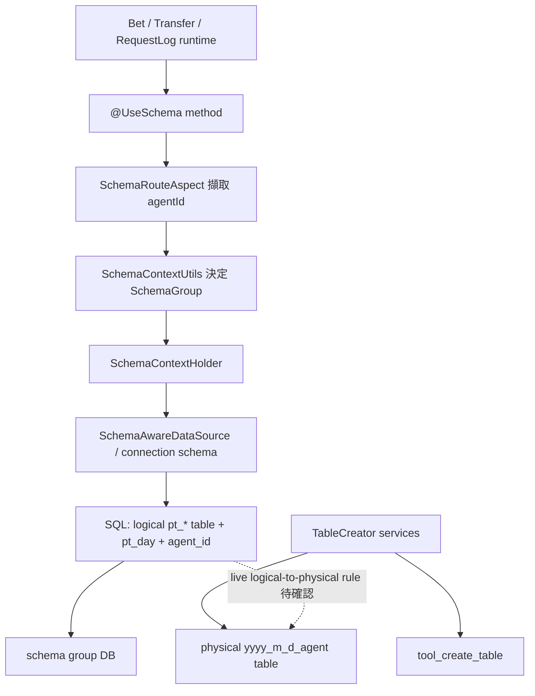
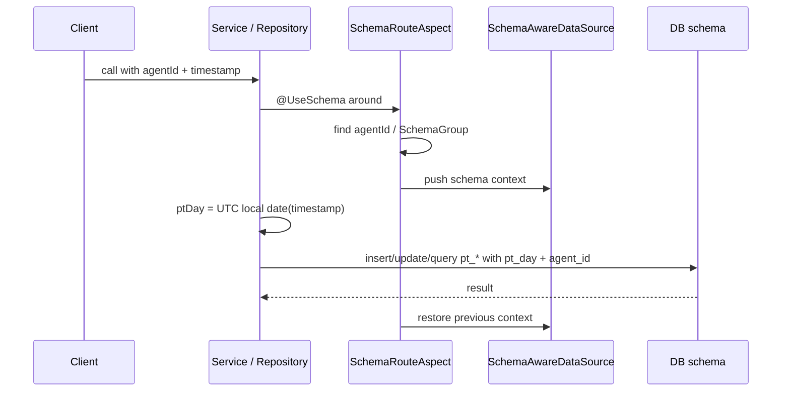

# bet-record-sharding-schema-route Step 3

## 1. 閱讀定位

- 日期: 2026-05-21
- 專案: `antplay-slot-game-api`
- source repo: `/Users/nick/Git/antplay/antplay-slot-game-api`
- Flow Track: Step 5 已完成；本檔保留 Step 3 主報告，正式面試稿見 `career-interview.md` 與 `materials/interview.md`，claim gate 見 `materials/claim-boundary.md`
- 掃描深度: Level 2 flow deep scan
- 證據層級: 真實開發過 + code-backed；Nick / `10gt12nc` 在 #167 分表、db partition v2、`@UseSchema`、table creator、bet record 查詢修正有 direct commits
- 履歷狀態: 可回填 project-level consolidation；不直接更新 `05 / 08`

本 flow 的核心不是「單一 API」，而是 `antplay-slot-game-api` 對高流量資料表做分流治理的共同機制：用 `@UseSchema` 依 `agentId` 切 schema / datasource，再讓 bet record、request log、transfer wallet transaction 這類大表用 `pt_day`、`agent_id`、`time`、`id` 這些 key 收斂查寫範圍。

本輪有一個重要邊界：程式碼內能確認 schema route、partition key、table creator service 與 `tool_create_table` registry；但 current code 沒掃到 ShardingSphere 或等價 middleware config。也就是說，`pt_bet_record` 等 logical table 到實體 `bet_record_yyyy_m_d_agent_id` 的 live routing / DB rule 仍待確認，不能講成完整已驗證的分表架構。

## 2. Source 狀態

| repo | branch | local HEAD | remote ref | ahead / behind | working tree | 遠端狀態 |
| --- | --- | --- | --- | --- | --- | --- |
| `antplay-slot-game-api` | `develop` | `079aa66` | `origin/develop` = `079aa66` | `0 / 0` | clean | 本輪嘗試 fetch 一次失敗，依本地 refs / 本地工作樹保守分析 |

## 3. 白話導讀

這條 flow 要解決的是「高流量明細表不能無限制長大，也不能所有 agent 都壓在同一個 schema」。Slot runtime 會產生下注紀錄、request log、轉帳錢包 transaction、transfer request log。這些資料有幾個共同特性：

- 寫入頻率高。
- 查詢大多會帶 `agentId` 與時間範圍。
- 一旦查詢沒帶 partition key，很容易變成大表掃描。
- 一旦 schema / table route 錯，可能讀不到資料、寫錯 schema、或造成補償查單失敗。

程式把這件事拆成兩層：

1. Schema route: `@UseSchema` + AOP 從 method args 找 `agentId`，決定要切到哪個 schema group / datasource。
2. Partition key: SQL 寫入與查詢都顯式帶 `pt_day`、`agent_id`、`time`、`id`，把資料範圍壓在日期與 agent。

## 4. Code 分層對照

| 層次 | 代表 code | 本 flow 角色 |
| --- | --- | --- |
| Route annotation | `UseSchema` | 標記 method 需要依 `agentId` 切 schema，可設定 `detectAgentId` 與 `readOnly` |
| AOP route | `SchemaRouteAspect` | 從 args / object / tableName 擷取 `agentId`，決定 `SchemaGroup`，push 到 `SchemaContextHolder` |
| Datasource / schema switch | `DataSourceConfig`、`SchemaAwareDataSource`、`SchemaContextHolder`、`SchemaContextUtils` | 根據 schema group 與 read-only 決定 master / slave datasource，借 connection 時設定 catalog / schema |
| Logical table constants | `ShardingTableName` | 集中 `pt_bet_record`、`pt_request_log`、`pt_transfer_request_log`、`pt_transfer_player_wallet_transaction` |
| Bet record write / update | `BetRecordManageService`、`BetRecordRepositoryImpl` | 寫入 / 更新 bet record 時帶 `pt_day`、`agent_id`、`time`、`id` |
| Bet record query | `BetRecordService`、`BetRecordProcess`、`BetRecordRepositoryImpl` | 查詢限制 `pt_day` range、`agent_id`、`time BETWEEN`；管理查詢有七天上限 |
| Transfer wallet transaction | `TransferBalanceService`、`TransferBalanceFacade` | 寫入 / 查詢 `pt_transfer_player_wallet_transaction`，並用 transfer order lookup 記錄實際 table / id |
| Transfer request log | `TransferRequestLogService` | 以 `pt_day`、`agent_id`、`trace_id` 查寫 transfer request log |
| Table creator service | `BetRecordTableCreator`、`RequestLogTableCreator`、`TransferPlayerWalletTxnTableCreator`、`TransferRequestLogTableCreator` | 依日期 + agent 建立實體表，並寫入 `tool_create_table` |
| Scheduled jobs | `CreateBetRecordNineDayTable` 等 | job entry 存在，但 current code 內實際 agent loop 已被註解停用 |

## 5. 最小架構圖



這張圖只畫 current code 能確認的邊界。`pt_*` logical table 是否由 DB rule、middleware、view、trigger 或 migration 對應到實體日表，這輪沒有在 repo 內找到可確認 config。

## 6. 正常流程



逐步看：

1. Runtime method 收到 `agentId` 與 timestamp。
2. `@UseSchema` 讓 `SchemaRouteAspect` 先跑，從 method parameter、object field / getter、或帶 agent suffix 的 tableName 裡找 `agentId`。
3. `SchemaContextUtils#getDatabaseGroup(agentId)` 決定 schema group，`readOnly=true` 時走 read-only datasource。
4. `SchemaAwareDataSource` 借 connection 時根據 `SchemaContextHolder` 設定 catalog / schema。
5. Business code 用 `DateTimeUtil.getLocalDate(timestamp)` 產生 UTC `pt_day`。
6. Bet record / transfer transaction / request log SQL 顯式帶 `pt_day`、`agent_id`、`time`、`id`。
7. Table creator service 預期為 agent + 日期建立實體表並記錄 `tool_create_table`；但 current scheduled jobs 已停用實際 agent loop，不能講成目前自動建表正在跑。

## 7. 已確認行為

### 7.1 Schema route

`UseSchema` 預設 `detectAgentId=true`。`SchemaRouteAspect` 會在 annotated method 前後包一層 route scope：

- 從 parameter name `agentId`、`agentIds`、`tableName*` 找 agent。
- 從 `AuthUserVO`、`Agent`、`BetRecord` 或一般 object getter / field 找 `agentId`。
- 負數 agentId 有特別 mapping 到不同 group。
- 一般 agentId 交給 `SchemaContextUtils#getDatabaseGroup(agentId)`。
- `readOnly=true` 會切 read-only datasource。
- finally 會 restore schema context。

這裡的 owner concern 是：route 放在 AOP，method 必須真的被 Spring proxy 攔到。`BetRecordRepositoryImpl` 裡多處使用 `proxy().method(...)`，就是為了避開 self-call bypass AOP 的風險。

### 7.2 Bet record partition key

Bet record write / update 會把資料定位在 `pt_bet_record`，並帶：

- `pt_day`
- `agent_id`
- `time`
- `id`
- state / step 條件，例如 CREATE -> DEAL -> RESULT、CANCEL、FAIL

查詢側也用 `pt_day >= start`、`pt_day <= end`、`agent_id`、`time BETWEEN`，管理查詢側有七天範圍限制。這代表系統設計上不是靠全表掃描找 bet record，而是要求 caller 具備 agent + 日期範圍。

### 7.3 Transfer wallet transaction partition key

`TransferBalanceService` 在 transaction 防重、寫入與查單 path 使用 `pt_transfer_player_wallet_transaction`，同樣帶：

- `pt_day`
- `agent_id`
- `account`
- `transfer_reference_id`
- `transaction_id`

另外 `transfer_order_lookup` 會保存 `data_day`、`data_day_table`、`transaction_table_id` 之類 lookup 欄位。這是查單 / 補償時避免只靠全域掃描的輔助索引。

### 7.4 Request log / transfer request log

`TransferRequestLogService` 使用 `pt_transfer_request_log`，以 `pt_day`、`agent_id`、`trace_id` 判斷 insert / update。一般 request log 在前一條 `request-log-rabbitmq-async` 已追到 game-api producer 與 admin-api consumer；本 flow 只把 request log 放在 high-traffic table governance 的共同視角，不重寫 async audit 結論。

### 7.5 Table creator 與 current caveat

Table creator service 可以依 agent + 日期建立類似以下的實體表：

- `bet_record_yyyy_m_d_agent_id`
- `request_log_yyyy_m_d_agent_id`
- `transfer_player_wallet_transaction_yyyy_m_d_agent_id`
- `transfer_request_log_yyyy_m_d_agent_id`

並用 `tool_create_table` 記錄 table type、日期、agent。可是 current job implementation 的 agent loop 已被註解停用，只留下 log。這表示目前 repo 內看到的是「建表能力存在、scheduler entry 存在、但 current automatic execution disabled」。面試可以把它講成一個風險點：分表架構最怕建表 job 與實際寫入需求不同步。

## 8. 待確認 / 不可腦補

- 未在 current repo 找到 ShardingSphere 或等價 actual-data-nodes config。
- 未確認 live DB 如何把 `pt_bet_record` logical table route 到 `bet_record_yyyy_m_d_agent_id` 實體表。
- 未確認 table creator job 停用後，production 是由 migration、DBA job、其他 repo、或手動流程建表。
- 未確認 `tool_create_table` registry 與 live physical tables 是否永遠一致。
- 未確認 request log 一般表與 admin-api consumer 的最終 schema / partition mapping，這點已放在 request-log flow 的後續邊界。

## 9. Failure Window

| 風險 | 可能結果 | Senior / Owner 觀察點 |
| --- | --- | --- |
| method 少了 `@UseSchema` | 寫到 default schema 或讀不到資料 | high-traffic table access 應有測試 / lint / code review checklist |
| self-call bypass AOP | schema context 不生效 | 需要 proxy call 或拆 service boundary；current bet record repo 已有 proxy pattern |
| `agentId` 找不到 | route 到錯 schema，甚至發生 NPE 風險 | annotated method 必須明確帶 `agentId`，不要依賴猜測 |
| `pt_day` 用 UTC，業務查詢用本地日 | 跨日資料漏查或重複查 | query UI / API 要明確使用 UTC day boundary 或統一轉換 |
| 查詢不帶 `pt_day` / `agent_id` | 大表掃描或跨 partition 掃描 | query builder 要強制 partition key |
| 建表 job 停用 / 漏建 | 寫入或查詢 physical table 失敗 | 建表流程要有監控、預建窗口與 missing-table alert |
| `tool_create_table` 與實體表不同步 | lookup 誤判 table 已存在或不存在 | registry 只能是輔助，最終要對 DB metadata / migration 結果驗證 |
| read-only datasource lag | 管理查詢或查單看到舊資料 | money / compensation query 要小心 read replica lag |
| dynamic table name 來自 lookup | lookup 被污染時查錯表 | tableName 來源要受控，最好有 whitelist / pattern validation |

## 10. Owner Decision

這條 flow 的 owner 重點不是背 class，而是能說清楚這些 decision：

- 高流量交易明細表要把 route key 顯式化：`agentId`、`pt_day`、`time`、`id`。
- Schema route 與 table partition 是兩件事。前者決定 DB/schema，後者決定查寫範圍與實體表治理。
- AOP route 的最大風險是看起來有 annotation，但實際沒有被 proxy 攔到。
- `pt_day` 用 UTC 是可行 decision，但 UI / API / report 需要一致的 day boundary。
- 建表要 idempotent，也要可觀測；current code 的 disabled job 是必須在面試裡保守講清楚的 caveat。
- 履歷不能寫「主導完整分表平台」；比較準確的是「參與 bet record / request log / transfer transaction 的分表、schema routing 與高流量資料表治理維護」。

## 11. 面試 / 履歷邊界摘要

可面試講：

- 我有參與 / 研究過 AntPlay game-api 的高流量表治理，包含 bet record、request log、transfer wallet transaction。
- 這套 code 不是只做 CRUD，而是用 `@UseSchema` + AOP 依 agent 切 schema，再要求 SQL 顯式帶 `pt_day`、`agent_id`、`time`、`id` 限制查寫範圍。
- 我看過它的風險：AOP self-call、缺 agentId、UTC day boundary、建表 job disabled、logical table 到 physical table mapping 未確認。

暫時不要寫進正式履歷：

- 不得寫成主導完整 sharding architecture。
- 完整設計 / 落地所有分表規則。
- 已確認 production automatic table creation。
- ShardingSphere / middleware owner。

## 12. 本輪掃描範圍

- KB: `AGENTS.md`、`00-operating-rules.md`、`03-flow-learning-package-template.md`、`09-ai-prompt-manual.md`
- Project docs: `README.md`、`step1-candidate-flows.md`、`step2-flow-comparison.md`、`contribution-claim-consolidation.md`
- Source current code: `UseSchema`、`SchemaRouteAspect`、`SchemaAwareDataSource`、`SchemaContextHolder`、`SchemaContextUtils`、`DataSourceConfig`、`ShardingTableName`、`BetRecordManageService`、`BetRecordRepositoryImpl`、`BetRecordService`、`BetRecordProcess`、`TransferBalanceService`、`TransferBalanceFacade`、`TransferRequestLogService`、table creators、create-table jobs、`CreateTableRepository`
- Source history: #167 分表 commits、db partition v2、`@UseSchema` / schema route commits、table creator commits、current job disabled commit、`ShardingTableName` centralization commit、`pt_bet_record` query fix commits

## 13. 下一步

Step 5 已完成。本 flow 已回填 `antplay-slot-game-api` project-level contribution consolidation，作 high-traffic data governance / schema route / partition key evidence；不單獨寫完整 sharding owner，也不直接更新 `05 / 08`。後續 Rank 5 `runtime-rtp-darkpool-player-control Step 5` 與 project-level contribution claim consolidation refresh 已完成；後續 rolling resume package 已完成。

```text
rolling resume package
```
