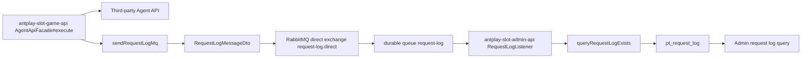
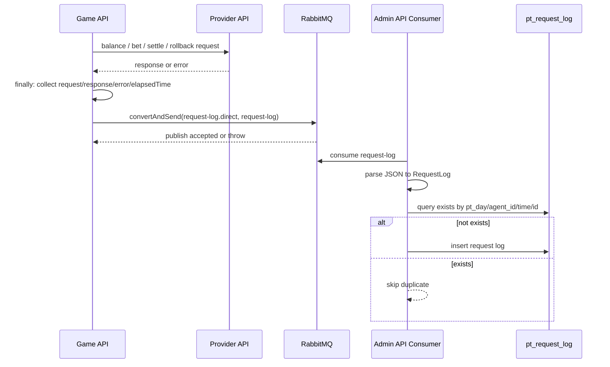

# request-log-rabbitmq-async Flow

日期: 2026-05-21

## 0. 閱讀定位

- Flow 中文名稱: Request log RabbitMQ 非同步化
- Flow slug: `request-log-rabbitmq-async`
- 完成狀態: Step 5 / Level 2 Flow 深掃 + claim gate 已完成
- 證據層級: 真實開發過 + code-backed；Nick / `10gt12nc` 有 #774 request log RabbitMQ producer 與 admin-api consumer direct commits；但不寫完整 RabbitMQ / event platform owner，後續 routing key 格式修正屬他人 context evidence
- 本 flow 類型: async audit / observability flow
- 是否只確認到入口: 否，已確認 game-api producer、RabbitMQ exchange / queue / routing key、message DTO、admin-api consumer、dedupe check 與 insert path

遠端最新性:

- game-api source repo: `/Users/nick/Git/antplay/antplay-slot-game-api`
- game-api local branch: `develop`
- game-api local HEAD: `079aa66`
- game-api local `origin/develop`: `079aa66`
- game-api ahead / behind: `0 / 0`
- admin-api downstream repo: `/Users/nick/Git/antplay/antplay-slot-admin-api`
- admin-api local branch: `main`
- admin-api local HEAD: `2e15503`
- admin-api local `origin/main`: `2e15503`
- admin-api ahead / behind: `0 / 0`
- fetch 狀態: 本輪兩個 repo 都嘗試 fetch，但內網不可達；依 KB 不反覆重試
- 判斷: 未確認最新遠端；本 Step 依本地 refs / 本地 working tree 保守分析

## 1. 白話導讀

這條 flow 是把「打第三方 agent API 的 request / response log」從主交易流程裡拆出去。

以前主流程可能在 `AgentApiFacade#execute` 裡同步寫 request log DB。#774 之後，game-api 在呼叫第三方 provider 後，把 request、response、錯誤訊息與 elapsed time 包成 `RequestLogMessageDto`，送到 RabbitMQ 的 `request-log` queue。admin-api 端再消費 message，轉成 `RequestLog` 寫入 `pt_request_log`。

它不是交易 source of truth。下注、結算、rollback 是否成功，仍看 bet record、provider response、wallet state。request log 的價值是 audit / observability：事故排查、後台查詢、錯誤追蹤。

最直覺會壞的地方:

- provider API 成功，但 MQ send 失敗，主流程仍成功但 audit log 缺失。
- message 重送或 consumer retry，可能重複寫 log。
- consumer 延遲，後台查詢短時間看不到 log。
- queue name / routing key 不一致，producer 送出但 consumer 收不到。
- message schema 改了，consumer parse 或 insert 失敗。

## 2. 初中階 Code 分層對照

| Layer | Code path | 本 flow 責任 |
| --- | --- | --- |
| Entry | `AgentApiFacade#execute` | 所有 single-wallet provider API call 共用入口；finally 送 request log MQ |
| Producer | `AgentApiFacade#sendRequestLogMq` | 組 `RequestLogMessageDto`、轉 AMQP message、`convertAndSend` |
| Message DTO | `RequestLogMessageDto` | 承載 id、time、agentId、type、step、target、uri、request / response / error / elapsedTime |
| MQ config | `RabbitMQConfig#requestLogExchange / requestLogQueue / requestLogBinding` | 宣告 direct exchange、durable queue、routing key binding |
| MQ constants | `RabbitMq.REQUEST_LOG_*` | exchange / routing key / queue key |
| Message serializer | `RabbitMqService#convertToQueueMessage` | 用 ObjectMapper 轉 JSON，content type 設為 `application/json` |
| Consumer | `antplay-slot-admin-api RequestLogListener#receive` | 監聽 `request-log` queue，parse JSON |
| Consumer service | `RequestLogListenerProcessor` | 查重、insert request log |
| SQL / Table | admin-api `RequestLogMapper.xml` -> `pt_request_log` | `(pt_day, agent_id, time, id)` 查重後寫入 |
| Admin query | `RequestLogController` / `RequestLogsService` / `RequestLogMapper` | 後台查 request log；本輪只作下游 context |

## 3. 最小架構圖



## 4. 正常流程圖



## 5. 正常流程逐步說明

1. `AgentApiFacade#execute` 建立 URL request，塞 header、簽名 request body。
2. 呼叫第三方 provider API，例如 balance、bet、settle、rollback。
3. 成功時 parse response，失敗時記錄 `errorMsg` 與 throw type。
4. `finally` 裡停止 stopwatch，計算 elapsed time。
5. 呼叫 `sendRequestLogMq(...)`，先依 `reqData.getRequestLogDTO()` 判斷是否只在 exception 時記錄。
6. 產生 request log id，組 `RequestLogMessageDto`。
7. `RabbitMqService#convertToQueueMessage` 把 DTO 轉 JSON AMQP message。
8. `RabbitTemplate#convertAndSend` 發到 `REQUEST_LOG_EXCHANGE` + `REQUEST_LOG_ROUTING_KEY`.
9. 若 MQ 送出失敗，producer catch exception 只 log error，不阻斷主流程。
10. admin-api `RequestLogListener` 消費 `request-log` queue，parse JSON。
11. consumer 依 message time 算 `ptDay`，組成 `RequestLog`。
12. `RequestLogListenerProcessor` 先查重，再 insert `pt_request_log`。

## 6. 業務問題

這條 flow 解決的是「交易 API 不應被 audit log 寫庫拖慢或拖垮」。

對 game runtime 來說，provider API call 是主流程；request log 是排查與觀測資料。如果同步寫 DB，DB 慢、分表問題、連線問題都可能拖慢下注 / 結算。改成 MQ 後，主流程只要盡力把 log 投遞出去，落庫交給 consumer。

但代價是 consistency 從同步變成 eventual:

- 主流程成功不代表 log 一定已落庫。
- 後台查詢可能延遲。
- message 可能重送，需要 consumer 去重。
- 沒有看到 DLQ / retry policy 時，不能宣稱完整可靠 audit pipeline。

## 7. 系統位置

- 產品: AntPlay slot game runtime / admin audit
- Producer 專案: `antplay-slot-game-api`
- Consumer 專案: `antplay-slot-admin-api`
- 上游: `/game/bet`、settle、rollback、balance 等 provider API call
- 下游: RabbitMQ、`pt_request_log`、admin request log 查詢

## 8. DB / Redis / MQ / 外部 API

| 類型 | 名稱 | 說明 |
| --- | --- | --- |
| External API | provider balance / bet / settle / rollback URL | `AgentApiFacade#execute` 實際呼叫對象 |
| MQ exchange | `request-log.direct` | durable direct exchange |
| MQ queue | `request-log` | durable queue，admin-api listener 消費 |
| MQ routing key | `request-log` | producer / binding 使用同一 key；曾由 Arnold commit 調整命名 |
| Message | `RequestLogMessageDto` | request / response / error / elapsedTime audit payload |
| DB | `pt_request_log` | admin-api consumer 寫入；後台查詢也讀這張表 |
| Redis | 不適用 | 本 flow 不用 Redis |

## 9. 資料狀態與 State Transition

Request log 沒有複雜狀態機，核心是 message lifecycle:

```text
provider call finished
  -> DTO created
  -> AMQP message published
  -> consumer received
  -> dedupe checked
  -> pt_request_log inserted
```

已確認:

- producer 不等待 DB insert。
- producer catch MQ / serialization exception 後只 log，不反向讓 provider API flow 失敗。
- consumer 以 `(pt_day, agent_id, time, id)` 查重，避免同一 request log 重複 insert。

待確認:

- Rabbit listener ack mode、retry、DLQ、parking queue 設定。
- consumer parse / insert 失敗後是否會重送。
- queue 堆積與告警。

## 10. Failure Window

| 位置 | 已確認行為 | 風險 / Senior 觀察 |
| --- | --- | --- |
| provider API 成功後 MQ send 前 | `finally` 才送 log | JVM crash / process kill 會讓主流程已完成但 log 沒送出 |
| DTO serialization | `convertToQueueMessage` 可能 throw | producer catch 後只 log error；audit loss 不影響主流程 |
| RabbitMQ publish | `convertAndSend` 失敗只 log | main flow 不 rollback，符合 audit 非 source-of-truth，但要有告警 |
| routing key / queue key | 2026-01-21 Arnold 修正 key 命名 | producer / consumer key 不一致會造成 message 不被正確消費 |
| consumer parse | `JSONObject.parseObject(message)` | schema 變更或資料格式錯誤可能導致消費失敗 |
| consumer insert | 先查重再 insert | 查重和 insert 不是天然 atomic；若併發重送仍需 DB unique key 才保險，本輪未確認 |
| 後台查詢 | 讀 `pt_request_log` | MQ 延遲期間後台會短暫查不到 |

## 11. Senior / Owner 設計取捨

已確認設計:

- 把 request log 從同步 DB write 改成 RabbitMQ async publish。
- Producer 放在 `finally`，成功 / 失敗 provider response 都盡量送 audit。
- `onlyLogWhenException` 可以降低非必要 log 量。
- request / response body 有 `TEXT_SAVE_MAX_LENGTH` 截斷，避免 log payload 過大。
- consumer 以 message id / time / agent / pt_day 做落庫去重。

Owner 取捨:

- request log 是 observability，不是交易 source of truth；因此 MQ 失敗不應 rollback 下注 / 結算。
- 但 audit loss 仍是營運與事故排查風險，需要 metrics / alert / retry / DLQ。
- Direct exchange + durable queue 能固定 routing，但不能自動保證 exactly-once。
- consumer 層查重是 at-least-once 模式常見做法，但最好配 DB unique constraint。

## 12. 面試 / 履歷邊界摘要

可面試講:

- 我能說明為什麼 provider API request log 要從同步 DB 寫入改成 RabbitMQ async。
- 我能拆 producer / exchange / queue / consumer / DB insert 的責任。
- 我能指出 request log 不是交易 source of truth，MQ 失敗不應 rollback money flow。
- 我能討論 message duplication、consumer delay、DLQ、retry、告警與 DB unique key。

可回填 project-level 履歷:

- 參與 AntPlay slot game API request log RabbitMQ 非同步化，將 provider API audit log 從主流程同步 DB 寫入改成 MQ 投遞與下游 consumer 落庫，降低主交易流程與 audit DB 的耦合。

不可誇大:

- 不說完整 RabbitMQ / event-driven platform owner。
- 不說 exactly-once / outbox 已落地。
- 不說全鏈路可靠投遞已完整保證；本輪未確認 publisher confirm、DLQ、retry policy。
- 不把 request log 說成交易 source of truth。

## 13. 本次實際掃描範圍

Vault:

- `AGENTS.md`
- `senior-owner-playbook/00-operating-rules.md`
- `senior-owner-playbook/03-flow-learning-package-template.md`
- `senior-owner-playbook/09-ai-prompt-manual.md`
- `projects/antplay/antplay-slot-game-api/README.md`
- `step1-candidate-flows.md`
- `step2-flow-comparison.md`
- `contribution-claim-consolidation.md`
- 已完成的 `slot-bet-settle-rollback` / `transfer-wallet-money-in-out` flow package 關聯狀態

Source:

- `antplay-slot-game-api`
  - `AgentApiFacade#execute`
  - `AgentApiFacade#sendRequestLogMq`
  - `RabbitMQConfig`
  - `RabbitMq`
  - `RabbitMqService`
  - `RequestLogMessageDto`
  - path-specific git log / selected commit diff
- `antplay-slot-admin-api`
  - `RequestLogListener`
  - `RequestLogListenerProcessor`
  - `RequestLogMapper`
  - `RequestLogMapper.xml`
  - `RabbitMq`
  - path-specific git log

重要 commits:

- game-api `d3e0002` / `71fff7b`: `10gt12nc` direct，#774 將 RequestLog 改丟 RabbitMQ 非同步執行，新增 producer、DTO、service、exchange / queue config，移除同步 `RequestLogService` path。
- game-api `7c9d0f6`: Arnold context，調整 request-log exchange / routing / queue key 命名。
- admin-api `a66007d` / `814b024` / `f3a9d72` / `5f838f8` / `fa86544`: `10gt12nc` direct，admin-api request log RabbitMQ consumer / UAT / G2 修正脈絡。
- admin-api `0f72b92`: Arnold context，修正 rabbitmq request-log key 格式。

未掃 / 待確認:

- 未確認 RabbitMQ broker 實際設定、publisher confirm、ack mode、retry、DLQ。
- 未確認 DB unique constraint；只看到 consumer 查重 SQL。
- 未掃 production metrics / dashboard / alert。
- 未掃完整 admin-api request log 查詢 UI，只確認後台查詢 service / mapper 存在。
- 未更新 `05-resume-master-zh.md` / `08-application-autobiography-zh.md`；本輪只把單條 flow claim gate 回填 project-level consolidation。

## 14. Step 4 補充

Step 4 已完成正式面試 case，主入口是 `career-interview.md`，詳細追問在 `materials/interview.md`。

Step 4 的面試主軸:

- request log MQ 化是 audit side effect 解耦，不是 money correctness 主線。
- request log 不是交易 source of truth；MQ failure 不應 rollback bet / settle。
- async 後必須治理 eventual consistency、duplicate message、consumer failure、queue lag 與 schema compatibility。
- 不誇大 exactly-once、outbox、完整 DLQ / retry / alert；Step 5 已確認這些仍只能作 owner 改善方向。

## 15. Step 5 Claim Gate

Step 5 已完成。本輪重讀 Step 3 / Step 4 文件、project contribution consolidation、source current code、path-specific log、#774 重要 diff 與 current blame。

可升級為 flow-level claim:

- 參與 AntPlay slot game API request log RabbitMQ 非同步化，把 provider API request / response / error / elapsed time audit 從 game-api 主流程同步落庫，改為 producer 投遞 MQ、admin-api consumer 查重後寫入 `pt_request_log`。
- 可講 producer / DTO / direct exchange / durable queue / routing key / consumer / dedupe insert 的責任分層。
- 可講 request log 是 audit / observability，不是 money source of truth；MQ 失敗不應 rollback bet / settle，但 audit loss 要被觀測與修補。

Evidence:

- game-api `d3e0002` / `71fff7b`: `10gt12nc` direct，#774 新增 producer、DTO、RabbitMQ config、message serialization，並移除同步 request log service path。
- admin-api `814b024` / `a66007d` / `f3a9d72` / `5f838f8` / `fa86544`: `10gt12nc` direct，建立 / 修正 request log consumer、processor、查重與落庫 path。
- current code 仍保留 `AgentApiFacade#sendRequestLogMq` publish、admin-api `RequestLogListener` consume 與 `(pt_day, agent_id, time, id)` 查重後 insert 的設計。

不可誇大:

- 不寫 Nick 主導完整 RabbitMQ architecture 或 event-driven platform。
- 不寫 exactly-once、outbox、publisher confirm、DLQ / retry / queue lag alert 已完整落地。
- 不把 routing key / queue key 最終修正寫成 Nick 完成；game-api `7c9d0f6` 與 admin-api `0f72b92` 是 Arnold context evidence。
- 不把 request log 說成交易一致性保證。

## 16. 下一步

本 flow 已完成 Step 5。後續 Rank 4 `bet-record-sharding-schema-route Step 5`、Rank 5 `runtime-rtp-darkpool-player-control Step 5` 與 project-level contribution claim consolidation refresh 也已完成；後續 rolling resume package 已完成。

後續 rolling resume package 已完成；目前沒有預設下一步。
