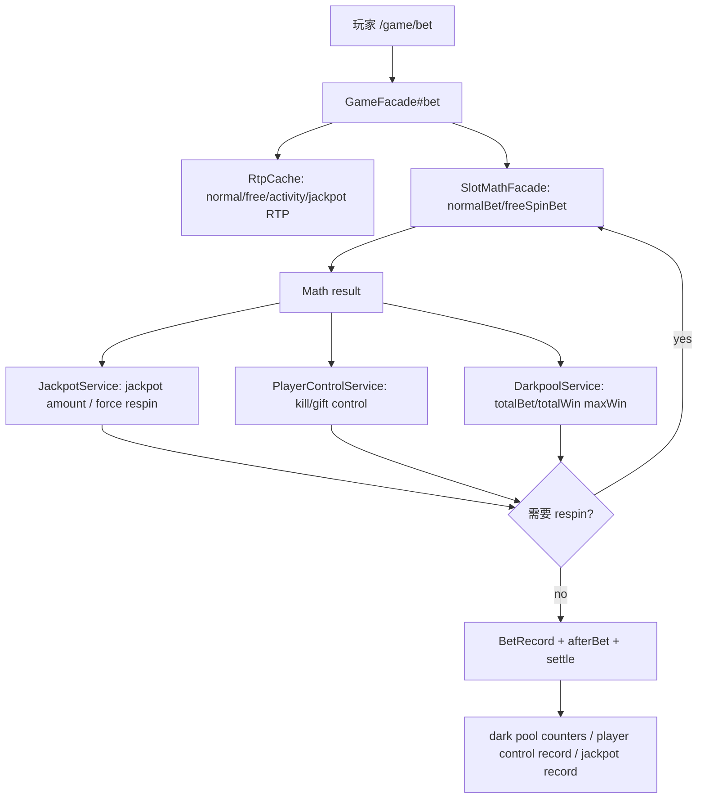
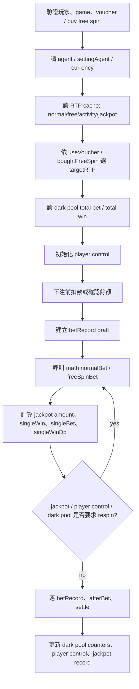

# runtime-rtp-darkpool-player-control

## 0. 閱讀定位

### Flow 類型與閱讀定位

- Flow 類型: Runtime Decision Flow
- 所屬大系統: AntPlay slot runtime RTP / dark pool / player control
- 面試用途: 輔助差異化 case / runtime risk decision
- 閱讀方式: 先看 bet runtime 如何組合 RTP、dark pool、player control 與 math result，再看 owner decision。
- 不要期待: 這不是完整 RTP 策略 owner，也不是 jackpot pool / wallet settlement owner。

| 項目 | 內容 |
| --- | --- |
| Flow 中文名稱 | RTP / dark pool / player control runtime decision |
| Flow slug | `runtime-rtp-darkpool-player-control` |
| 完成狀態 | Step 5 / 單條 flow claim gate 已完成 |
| 證據層級 | 真實開發過 + code-backed；可回填 project-level runtime decision claim，但不單獨寫完整 RTP / math / jackpot owner |
| Flow 類型 | 遊戲 runtime decision / money-risk-adjacent flow |
| 是否只確認到入口 | 否；已讀 `/game/bet` runtime path、RTP cache、dark pool service、player control、jackpot service、math facade |

本 flow 不是完整遊戲數學模型，也不是完整 RTP 策略 owner。它整理的是 `antplay-slot-game-api` 在每一局 bet 時，如何把 agent / game / activity RTP、dark pool 累積值、jackpot 控制、player control 與 math result contract 串成 runtime decision。

## 1. 白話導讀

玩家按下一局 slot bet 後，後端不是只單純呼叫 math library 算結果。它會先確認玩家、遊戲、錢包、活動與 voucher，再決定這局要用哪一組 RTP。若 agent 開啟 dark pool，系統會把目前累積投注、累積派彩、這局下注與這局開獎結果拿來算 `maxWin`，如果結果會讓池子超出可承受範圍，就重轉一局。

同一段流程還會處理 jackpot 與 player control。Jackpot 有自己的 RTP 與池餘額限制；player control 則針對特定玩家設定控制目標，可能在結果不符合控制方向時要求 respin。最後只有通過這些 runtime decision 的結果才會進入 bet record、settle、dark pool 統計更新、player control 記錄與 jackpot 記錄。

直覺上，這條 flow 壞掉會有幾種風險：

- RTP cache 缺資料或讀錯，導致用 default RTP 或錯誤 RTP。
- dark pool total bet / total win 單位錯誤，讓 `maxWin` 判斷失真。
- respin loop 沒有上限，造成請求卡住或錢包扣款後長時間不回應。
- player control / jackpot / voucher 的互斥條件不清楚，導致同一局被多套控制邏輯同時干擾。
- math result 已產生，但後續 bet record / wallet / jackpot / dark pool 統計落地失敗，造成結果與記錄不一致。

## 2. 初中階 Code 分層對照

```text
Route / API:
  GameController#/game/bet

Controller:
  src/main/java/com/ps/domain/game/slot/controller/GameController.java

Service / Business:
  GameFacade#bet
  GameFacade#getBetResult
  PlayerControlService#initPlayerControl
  PlayerControlService#processPlayerControl
  JackpotService#getJackpotRtp
  JackpotService#isForceRespin
  DarkpoolService#getAgentTotalBet / getAgentTotalWin / setAgentTotalBet / setAgentTotalWin

Model / DAO / Repository:
  AgentGameRtpRepository
  PlayerControlCacheService
  JackpotBalanceRepository
  JackpotRecordRepository

SQL / Table:
  agent_game_rtp
  ag_player_control
  ag_jackpot_balance
  ag_jackpot_record
  pt_bet_record

Redis:
  RtpCache static maps from agent_game_rtp
  Agent:{agentId}:Game:{game}:{currency}:TotalBet
  Agent:{agentId}:Game:{game}:{currency}:TotalWin
  Agent:{agentId}:Game:{game}:{currency}:FreeSpinTotalBet
  antplay:PlayerControl:Agent:{agentId}:Currency:{currency}:Account:{account}:ConfigId:{id}:diffAmount

MQ:
  PlayerControlService publishes player control record to RabbitMQ

External API:
  Math layer through SlotMathFacade -> SlotMathOperatorService
  Wallet / provider callback is downstream of the same bet flow, but not the main subject of this flow

Log / Audit:
  bet complete log
  dark pool decision log
  player control forced respin log
  jackpot force respin log

Config:
  Agent wallet / dark pool / player control settings
  agent_game_rtp normal / free / activity / jackpot RTP
  math config override from darkpool settings during init
```

## 3. 最小架構圖



## 4. 正常流程圖



## 5. 正常流程逐步說明

1. `GameController#/game/bet` 進入 `GameFacade#bet`。
2. `GameFacade#bet` 驗證玩家 session、遊戲啟用、voucher / buy free spin 參數與玩家封鎖狀態。
3. 取得 `agentId`、`account`、`currency`、`settingAgent` 與 `replaceAgentId`。
4. 從 `RtpCache` 讀出 normal RTP、free RTP、activity normal RTP、activity free RTP；jackpot game 另外從 `JackpotService#getJackpotRtp` 讀 jackpot RTP。
5. 依 `useVoucher`、`boughtFreeSpin`、voucher type 選出本局 `targetRTP`。
6. 從 `DarkpoolService` 讀目前 agent / game / currency 的 total bet、total win。voucher 與 buy free spin 使用不同 key。
7. `PlayerControlService#initPlayerControl` 判斷 agent 是否允許 player control，並讀取有效控制設定。
8. `gameFlowFacade#getBeforeBetMoney` 先處理下注前餘額 / 扣款。
9. 進入 respin loop，先建立 bet record draft，再透過 `SlotMathFacade` 呼叫 math layer 產生結果。
10. 對結果計算 jackpot amount、single win、single bet、dark pool 用的 win / bet。
11. 若 jackpot force respin、player control respin 或 dark pool `maxWin` 判斷不通過，重新呼叫 math layer。
12. 若通過，落 `betRecord`、執行 `afterBet` / settle，最後更新 dark pool counters、player control record 與 jackpot record。

## 6. 業務問題

這條 flow 解決的是「每一局 slot 結果要怎麼在營運策略、玩家控制、jackpot 池與 math result 之間取得一個可接受結果」。

它不是單純風控，也不是單純數學；它更像 runtime policy coordinator：

- Math layer 負責依 RTP / input 產生結果。
- Game API 負責決定本局用哪個 RTP、要不要接受這個結果、何時重轉、何時落庫。
- Dark pool / jackpot / player control 是 runtime guardrails，避免結果超出當前池或控制設定。
- Bet / wallet / record 是 money correctness 底座，不能因 runtime decision 失敗而留下不一致資料。

## 7. 系統位置

| 項目 | 內容 |
| --- | --- |
| 產品 | AntPlay slot |
| 專案 | `antplay-slot-game-api` |
| 模組 | game runtime / slot facade / player control / jackpot / RTP cache |
| 上游 | player client、auth token、agent config、agent_game_rtp、player control config |
| 下游 | math-core / `*-math` modules、bet record、wallet / provider settle、jackpot record、RabbitMQ player control record |

## 8. DB / Redis / MQ / 外部 API

DB:

- `agent_game_rtp`: `RtpCache` 每 30 分鐘讀取，包含 normal、free、activity、activity free、jackpot RTP。
- `ag_player_control`: player control config 與 status，透過 `@UseSchema` 查詢 / 更新。
- `ag_jackpot_balance`: jackpot 餘額與扣減。
- `ag_jackpot_record`: jackpot reward record。
- `pt_bet_record`: 本局 bet record 與 `additional_info`。

Redis:

- RTP 是 JVM static cache，不是 Redis。
- Dark pool counters 使用 Redis key 記 total bet / total win。
- Player control diff amount 使用 Redis key 累積。
- Jackpot balance 也有 Redis cache / increment。

MQ:

- `PlayerControlService#publishPlayerControl` 會把 player control record 發到 RabbitMQ。Step 3 只確認 producer；consumer 未掃。

外部 / library:

- `SlotMathFacade` 透過 `SlotMathOperatorServiceManager` 找到對應 game math service。
- `normalBet` / `freeSpinBet` 呼叫 math module，game-api 不直接實作每個遊戲的數學機率。

## 9. 資料狀態與 state transition

本 flow 沒有單一「狀態機」，而是多組 runtime state 同時被讀寫：

| State | Source of truth | 在 flow 中的角色 |
| --- | --- | --- |
| RTP setting | `agent_game_rtp` -> `RtpCache` | 決定 normal / free / activity / jackpot RTP |
| Dark pool total bet / win | Redis | 決定本局結果是否超出 `maxWin` |
| Player control config | `ag_player_control` + cache | 決定是否對特定玩家啟用 kill / gift 控制 |
| Player control diff | Redis | 累積本玩家控制差額 |
| Jackpot balance / record | DB + Redis | 判斷 jackpot 是否可派、落 jackpot record |
| Bet record | `pt_bet_record` | 最終可追蹤的一局下注記錄 |
| Math result | in-memory object | 被 runtime decision 接受後才落入 bet record / settle |

## 10. Failure Window

| 失敗點 | 可能後果 | Step 3 判斷 |
| --- | --- | --- |
| RTP cache 未更新或缺 agent / game | 使用 default RTP | 已確認有 default，但未確認 cache staleness 監控 |
| Dark pool Redis counters 缺值 | total bet / win 以 0 計算 | 已確認 `DarkpoolService` 缺 key 回 0；是否合理需看營運規則 |
| respin loop 過久 | 玩家請求卡住，transfer wallet 可能已扣款 | 已確認 2 分鐘 timeout 與 transfer wallet refund 呼叫；但 refund path 要 Step 5 再驗證現行有效性 |
| `ranges` 為 null | 若執行到 range loop 可能 NPE | 現行 `forceRespin = useDP`，一般 dark pool 會在前面 continue；但這段是風險點 |
| player control RabbitMQ 發送失敗 | control record 可能缺 audit | producer catch 後回 false，但主流程看起來不會 rollback |
| jackpot record / balance 更新失敗 | jackpot result 與池記錄可能不一致 | `JackpotService#setData` catch error，只 log，不中斷 bet 回應 |
| `additional_info` 超過長度 | 被截斷 | 已確認超過 2048 會截斷，面試可講 audit payload trade-off |

## 11. Consistency / Idempotency

已確認:

- Math result 先在 memory 產生，通過 respin 判斷後才進 bet record / settle。
- Dark pool counters 是 bet 完成後更新，不是在每次 respin 嘗試時更新。
- Player control 的 diff amount 是 bet 完成後更新，且會送 MQ 記錄。
- Jackpot `setData` 用 betId 查重，避免同一 betId 重複落 jackpot record。

待確認:

- RTP cache 更新失敗是否有 alert。
- Dark pool Redis counters 與 DB / bet record 是否有 reconciliation。
- Player control MQ consumer 是否有去重與補償。
- Jackpot record 落庫失敗是否有補償 job。
- respin loop 途中多次 `beforeBet` 建 betRecord draft 的最終資料狀態，需要 Step 4 / Step 5 再追更細。

## 12. Owner Decision / Trade-off

可講的 owner decision:

- RTP setting 用 cache 讀取，降低每局 bet 的 DB 查詢成本，但要承擔 cache staleness 與 default fallback 的風險。
- Dark pool / player control / jackpot 都放在 `GameFacade#bet` 的 runtime loop 內，優點是主流程能即時決定是否接受結果；缺點是 `GameFacade` 變成高複雜度 orchestration。
- Jackpot / player control 的 side effect 多數在結果接受後才落地，可以避免 respin 嘗試污染統計，但也要求最終落地步驟有足夠 observability。
- Player control MQ 失敗不阻斷 bet，偏向保主交易可用性；代價是 audit / control record 可能缺失。
- `additional_info` 記錄 runtime decision snapshot，利於事後排查；代價是欄位長度、JSON schema 與查詢成本要控制。

## 13. 面試 / 履歷邊界摘要

可面試講:

- 我會把這條 flow 當成「game API runtime decision」題：每局 bet 不是直接吃 math result，而是先讀 RTP cache、dark pool counters、player control config、jackpot RTP / balance，再決定是否接受結果或 respin。
- 我會特別講 owner boundary：game-api 負責 runtime orchestration 與資料落點；math-core / game math module 負責 result contract；營運策略與 RTP 設定不是後端單方面決定。

履歷保守 bullet 可回填 project-level consolidation:

> 參與 AntPlay slot game API runtime decision flow 維護，處理 `/game/bet` 中 RTP / dark pool / player control / jackpot 與 math result contract 的整合邊界，協助釐清遊戲結果、池控與下注記錄間的一致性風險。

不能誇大:

- 不寫完整 RTP 策略 owner。
- 不寫完整遊戲數學 owner。
- 不寫完整風控平台 owner。
- 不寫已主導 dark pool / player control policy。
- 不寫量化改善。

## 14. 本輪實際掃描範圍

Vault:

- `AGENTS.md`
- `senior-owner-playbook/00-operating-rules.md`
- `senior-owner-playbook/03-flow-learning-package-template.md`
- `senior-owner-playbook/09-ai-prompt-manual.md`
- `projects/antplay/antplay-slot-game-api/README.md`
- `step1-candidate-flows.md`
- `step2-flow-comparison.md`
- `contribution-claim-consolidation.md`

Source repo:

- `/Users/nick/Git/antplay/antplay-slot-game-api`
- local branch: `develop`
- local HEAD: `079aa66`
- local `origin/develop`: `079aa66`
- ahead / behind: `0 / 0`
- source working tree: clean
- remote fetch: 失敗一次，依 KB 不反覆重試
- 最新性: 未確認最新遠端；依本地 refs / 本地 working tree 保守分析

Code paths:

- `GameFacade#bet`
- `GameFacade#getBetResult`
- `GameFacade#getSingleBetDarkPool`
- `GameFacade#getSingleWinDarkPool`
- `SlotMathFacade`
- `RtpCache`
- `DarkpoolService`
- `PlayerControlService`
- `PlayerControlCacheService`
- `PlayerControl`
- `JackpotService`
- `AgentGameFacade`
- `AgentGameRtp`
- `AgentGameRtpRepository`

Git / history:

- path-specific `git log` for runtime / RTP / dark pool / player control / jackpot paths
- Nick / `10gt12nc` author-filtered log for same paths
- blame for RTP selection, dark pool respin loop, player control decision, RTP cache fallback

## 15. 未掃 / 待確認

- 未做 Level 3 逐檔逐行。
- 未掃 `math-core` / `*-math` 具體 game module 的 result contract。
- 未掃 player control RabbitMQ consumer。
- 未掃 jackpot job / reconciliation job。
- 未確認最新遠端 refs。
- 未更新 `05 / 08`。
- Step 5 已完成單條 flow claim gate；正式履歷 / 自傳仍要由 project-level contribution consolidation 統一更新。

## 16. Step 5 Claim Gate

Step 5 補讀 path-specific log、重要 diff 與 current blame 後，結論如下。

可回填 project-level claim:

- Nick / `10gt12nc` 對 `GameFacade#bet` 的 respin loop、2 分鐘 timeout / transfer wallet refund branch、dark pool `maxWin` / `singleBetDp` / `singleWinDp`、player control result 接入與 bet / afterBet failure window 有 direct evidence，核心 commit 是 `a2b2af5`、`54078fe`、`31d7a46`。
- Nick / `10gt12nc` 對 target RTP / dark pool setting 取捨有歷史修正 evidence，包含 `e0921e7`、`168f951`、`f382d73`、`d2eff9f`、`def5073`、`3922cc0`。但這些多數已成為歷史 context 或被後續改寫，不能寫成現行 RTP cache owner。
- Nick / `10gt12nc` 對 player control table / schema path 有 direct evidence，包含 `2708045` 與 `718a207` 周邊。但 player control 初版與 MQ producer 主體主要是 Derek，不能寫成 Nick 主導完整 player control。
- 本 flow 可以保守支撐「game API runtime decision / result acceptance / dark pool failure window」面試與 project-level 履歷素材。

不可升級的 claim:

- 不寫完整 RTP 策略 owner；current `RtpCache` normal / activity / jackpot fallback 主要 blame 到 Arnold / Eliot。
- 不寫完整遊戲數學 owner；game-api 只透過 `SlotMathFacade` 呼叫 math module，實際 result contract 屬 `math-core` / `*-math` 邊界。
- 不寫完整 player control / jackpot / dark pool platform owner；player control 初版、jackpot service 主體、additional_info 與 jackpot policy 多數是他人後續 context。
- 不寫完整補償 / reconciliation 已落地；current develop 中 deadlock compensation 的實際 refund / fail 標記呼叫被後續註解，player control MQ consumer、jackpot / dark pool reconciliation job 也未掃。

本 flow 已完成 Step 5；`antplay-slot-game-api` Step 2 本批代表 flows 全部 Step 5，project-level contribution claim consolidation refresh 也已完成。後續 rolling resume package 已完成，已將 refreshed project-level claims 回填 `05 / 08`。

後續 rolling resume package 已完成；目前沒有預設下一步。
