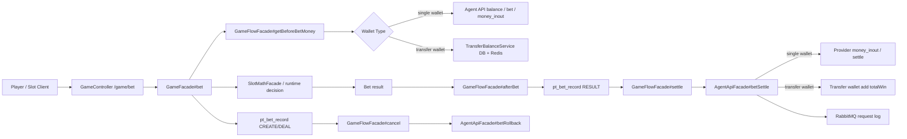
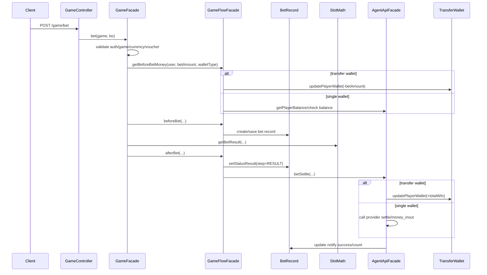

# slot-bet-settle-rollback Flow

日期: 2026-05-21

## 0. 閱讀定位

### Flow 類型與閱讀定位

- Flow 類型: System Flow
- 所屬大系統: AntPlay wallet / bet-settle / rollback
- 面試用途: 主力 case
- 閱讀方式: 先讀正常下注與結算閉環，再看 rollback、idempotency、failure window。
- 不要期待: 這不是完整遊戲平台，只是 slot bet-settle 這條核心 production flow。

- Flow 中文名稱: Slot 下注 / 開獎 / 結算 / rollback
- Flow slug: `slot-bet-settle-rollback`
- 完成狀態: Step 5 / 單條 flow claim gate 已完成
- 證據層級: 真實開發過 + code-backed；Nick / `10gt12nc` 有本 flow path-specific commits，可作 `antplay-slot-game-api` project-level 履歷 claim 的強化 evidence
- 本 flow 類型: production money flow / game runtime flow
- 是否只確認到入口: 否，已追到 `GameController`、`GameFacade`、`GameFlowFacade`、`AgentApiFacade`、`BetRecordManageService`、transfer wallet service 與補通知 job

遠端最新性:

- source repo: `/Users/nick/Git/antplay/antplay-slot-game-api`
- local branch: `develop`
- local HEAD: `079aa66`
- local `origin/develop`: `079aa66`
- ahead / behind: `0 / 0`
- source working tree: clean
- remote refs: 前一輪已嘗試 fetch 並失敗；依 KB 不反覆重試
- 判斷: 未確認最新遠端；本 Step 依本地 refs / 本地 working tree 保守分析

## 1. 白話導讀

這條 flow 是玩家在 slot 遊戲按下注後，Game API 如何完成一局遊戲的主線。

一局正常下注會做幾件事:

1. 驗證玩家、game、currency、voucher / buy free 等參數。
2. 算出這一局要扣多少錢。
3. 依 wallet 類型決定扣款方式：single wallet 走代理 API，transfer wallet 先改本地 DB / Redis wallet。
4. 建立 bet record，先標成下注成立。
5. 呼叫 math / runtime decision 得到開獎結果。
6. 把結果寫回 bet record。
7. 結算派彩：single wallet call provider，transfer wallet 本地加回 `totalWin`。
8. 如果下注成立後要取消，會把 bet record 標成 cancel，再 call rollback。

最直覺會壞的地方:

- 扣款成功但 bet record 沒寫好。
- bet record 寫成 RESULT，但 provider settle 沒成功。
- transfer wallet 已扣款 / 已加錢，但 deadlock 後補償沒有真的落地。
- request log MQ 失敗不該影響主交易，但會影響 audit。
- 補通知 job 可能補 settle / rollback，但需要依 `notify` / `notify_count` / `step` 判斷，不能當成完整 reconciliation。

## 2. 初中階 Code 分層對照

| Layer | Code path | 本 flow 責任 |
| --- | --- | --- |
| Route / API | `GameController#bet` / `POST /game/bet` | 接收 bet request，轉交 `GameFacade#bet` |
| Controller | `GameController` | API wrapper、exception encryption wrapper |
| Service / Business | `GameFacade#bet` | 主 orchestration：驗證、RTP / dark pool / player control、bet amount、bet record、afterBet |
| Service / Business | `GameFlowFacade#getBeforeBetMoney` | 下注前查餘額 / 扣 transfer wallet |
| Service / Business | `GameFlowFacade#beforeBet` | 建立 bet record object / debug path 可直接 DEAL |
| Service / Business | `GameFlowFacade#afterBet` | 寫 RESULT、呼叫 settle |
| Service / Business | `GameFlowFacade#settle` | 取 RESULT bet record，呼叫 `AgentApiFacade#betSettle` |
| Service / Business | `GameFlowFacade#cancel` | 標 CANCEL，呼叫 `AgentApiFacade#betRollback` |
| External API | `AgentApiFacade#bet` | single wallet 舊 bet callback；money_inout 存在時會跳過 |
| External API / Wallet | `AgentApiFacade#betSettle` | single wallet call provider；transfer wallet 本地加 `totalWin` |
| External API | `AgentApiFacade#betRollback` | provider rollback callback |
| Model / Repository | `BetRecordManageService`、`BetRecordRepositoryNewProcess` | bet record save / DEAL / RESULT / CANCEL / FAIL |
| DB / Table | `pt_bet_record` | 一局 bet 的主要交易狀態紀錄 |
| DB / Table | `ag_transfer_player_wallet` | transfer wallet balance |
| Redis | `TransferRedis` hash | transfer wallet hot balance |
| Redis | `Agent:{agentId}:SettledBets:{day}` | settle 後推入 settled bet id list |
| MQ / Log | `AgentApiFacade#sendRequestLogMq` | provider request log 非同步送 RabbitMQ |
| Job | `BetRecordNotifyMoneyInOutService`、`BetRecordNotifyRollbackService` | 補 call settle / rollback，屬補通知，不等於完整對帳 |

## 3. 最小架構圖



## 4. 正常流程圖



## 5. 正常流程逐步說明

1. `GameController#bet` 接 `/game/bet`，把 `game` header 與 `BetBO` 交給 `GameFacade#bet`。
2. `GameFacade#bet` 驗證玩家、game、currency、voucher / buy free、player banned 等條件。
3. `GameFacade#bet` 取得 agent / wallet type、RTP、jackpot RTP、dark pool、player control 等 runtime decision 參數。
4. `SlotMathFacade#getTotalBet` 算出本局 bet amount；buy free 會乘上 free spin odds。
5. `GameFlowFacade#getBeforeBetMoney` 依 wallet type 檢查餘額；transfer wallet 會先 `updatePlayerWallet(-betAmount * 100)`。
6. `GameFlowFacade#beforeBet` 建立 bet record object；一般流程後面由 `GameFacade#bet` save，debug path 會直接 `setStatusDeal`。
7. `GameFacade#bet` 呼叫 `getBetResult` 取得 math 結果，並處理 jackpot / dark pool / player control 的 forced respin。
8. `GameFacade#bet` save bet record，若 single wallet 且沒有 money_inout endpoint，會先 call `AgentApiFacade#bet`；失敗則 cancel。
9. `GameFlowFacade#afterBet` 計算 detail，把 bet record 更新成 `RESULT`，再呼叫 `settle`。
10. `GameFlowFacade#settle` 找出 `RESULT` bet record，呼叫 `AgentApiFacade#betSettle`。
11. `AgentApiFacade#betSettle` 若是 transfer wallet，直接本地加回 `totalWin`；若是 single wallet，call provider settle / money_inout。
12. provider request / response 透過 `sendRequestLogMq` 非同步送 RabbitMQ；settle 成功後更新 notify success / count。

## 6. 業務問題

這條 flow 要確保「一局 slot 下注」對玩家、代理商、遊戲紀錄三邊一致。

錯了會造成:

- 玩家被扣款但沒有結果。
- 玩家中獎但派彩沒有回到 wallet。
- provider 收到重複 settle / rollback。
- bet record step 和實際 wallet 狀態不一致。
- 補通知 job 找不到該補哪種狀態。
- 面試時最重要的 owner 問題：哪個資料是 source of truth？何時算扣款成功？何時算結算成功？失敗後補償誰負責？

## 7. 系統位置

- 產品: AntPlay slot game runtime
- 專案: `antplay-slot-game-api`
- 模組: `domain/game/slot`、`domain/api/agent`、`domain/manage/service`
- 上游: slot client / game frontend
- 下游: provider / agent API、transfer wallet DB + Redis、RabbitMQ request log、Quartz notify jobs

## 8. 資料狀態與 State Transition

### BetRecordStep

| Step | 常數 | 意義 |
| --- | --- | --- |
| `0` | `CANCEL` | 注單取消 / rollback path |
| `1` | `CREATE` | 初始建立 |
| `2` | `DEAL` | 扣款成功 / 注單成立 |
| `4` | `RESULT` | 開獎結果已寫入 |
| `6` | `FAIL` | 失敗；目前 deadlock catch 中的 `setStatusFail` 呼叫被註解 |

### 主狀態流

```text
CREATE
  -> DEAL
  -> RESULT
  -> notify success
```

取消 / rollback:

```text
CREATE / DEAL
  -> CANCEL
  -> betRollback
```

待確認 / 風險:

- 一般流程在 `GameFacade#bet` save bet record 前先以 object 形式建立，之後才 save 成 step DEAL；debug path 與一般 path 不完全一樣。
- `setStatusResult` SQL 條件要求 `step = 2`，所以 RESULT 更新依賴 DEAL 已經落地。
- deadlock catch 內 `refundTMOnDeadlock` 與 `setStatusFail` 目前被註解，只 log 計算出的 refund；這是很重要的 failure window，不可在面試中講成已完整補償。

## 9. DB / Redis / MQ / 外部 API

| 類型 | 名稱 | 在本 flow 的角色 |
| --- | --- | --- |
| DB | `pt_bet_record` | bet id、bet amount、detail、total win、step、status、notify count / success |
| DB | `ag_transfer_player_wallet` | transfer wallet balance source |
| Redis | transfer wallet hash | transfer wallet hot balance；`getBalanceFromRedis` 讀出後除以 100 |
| Redis | settled bet list | `settleRedis` 推入已 settle bet id |
| MQ | RabbitMQ request log exchange / routing key | provider request log audit；send failure 被 catch + log，不阻斷主流程 |
| External API | provider bet / settle / rollback | single wallet 或 provider callback |
| Job | notify money_inout / rollback | 補 call provider API；依 `notify = 0`、`step`、`notify_count` 查詢 |

## 10. Failure Window

| 位置 | 已確認行為 | 風險 / 待確認 |
| --- | --- | --- |
| transfer wallet 扣款後，bet record save 前 | `getBeforeBetMoney` 已先扣 transfer wallet | 後續 save / math / settle 失敗時，refund 是否一定落地需 Step 5 前再追 |
| single wallet bet callback 失敗 | `GameFacade#bet` catch 後 call `gameFlowFacade.cancel` | rollback callback 仍可能失敗；補通知 job 會找 cancel records |
| RESULT 寫入後 settle 失敗 | `settle` 例外往外拋；notify success 未更新 | 補通知 job 可補 call `betSettle(b, true)`，但不是完整對帳 |
| provider request log MQ 失敗 | `sendRequestLogMq` catch + log | audit 遺失風險，不阻斷交易 |
| deadlock / lock exception | 計算 transfer wallet refund；log compensation | 實際 `refundTMOnDeadlock` 與 `setStatusFail` 被註解，不能宣稱補償完整 |
| DataAccessException | 只 log checking deadlock | catch 後沒有明確 rethrow / recovery；需 Step 4/5 前再確認 final behavior 是否符合預期 |

## 11. Consistency / Idempotency / Retry

已確認:

- `pt_bet_record.id` 是 bet id，`setStatusResult` 以 `pt_day + agent_id + time + id + step=2` 更新，避免未 DEAL 的 record 直接變 RESULT。
- `AgentApiFacade#betSettle` finally 會 `plusNotifyCount`，成功後 `updateNotifySuccess`。
- 補通知 job 查 `notify = 0`、`step = 4` 補 settle，查 `step = 0` 補 rollback。
- transfer wallet 用 DB wallet + Redis wallet，下注前扣 bet，settle 時加 `totalWin`。

待確認 / 不誇大:

- 沒有看到完整 outbox / exactly-once。
- request log MQ 是 audit，不是交易一致性的 source of truth。
- transfer wallet 扣款與 bet record 寫入不是在本次可確認的一個完整 atomic transaction。
- provider callback 的 idempotency 要看 provider 端與 bet id 語意，本 Step 只確認本 repo 用 bet id 組 request。
- 補通知 job 是 retry / notification repair，不等於完整 ledger reconciliation。

## 12. Owner Decision

這條 flow 的設計取捨可以這樣理解:

- Game API 把一局下注的 runtime decision、bet record、wallet、provider callback 都放在同一條 orchestration 裡，讀起來直覺，但 failure window 多。
- Transfer wallet 下注前先扣本地 wallet，settle 再加 total win，可以讓遊戲 runtime 不必每局都 call provider，但 DB / Redis / bet record 的一致性壓力變高。
- Single wallet 依 provider callback 成敗決定 money state，Game API 本地主要記錄 bet record 與通知狀態。
- request log MQ 化降低主流程阻塞，但 log loss / delay 要由 observability 和補償策略承擔。
- Step 3 最該追的不是「有沒有很多 class」，而是「每個狀態變更後，失敗時誰補、怎麼知道補了沒」。

## 13. 面試 / 履歷邊界摘要

可面試講:

- 我深挖過 AntPlay slot game API 的下注結算主線，能說清 `/game/bet` 如何從 validation、扣款、bet record、math result、settle / rollback 走完。
- 我可以用 code-backed 方式說明 single wallet 和 transfer wallet 在同一條 bet flow 裡的差異。
- 我能指出 `RESULT` 後 provider settle 失敗、transfer wallet 扣款後 deadlock、request log MQ 失敗這幾個 failure windows。
- Step 4 已整理成正式面試 case：30 秒 / 90 秒 / 3 分鐘講法、STAR 版本、failure scenarios、Senior / Lead 追問與 owner 改善方向。
- Step 5 已完成 claim gate：本 flow 可作 `antplay-slot-game-api` project-level 履歷素材的強 evidence，也可作 Senior Backend 面試主案例。

可保守併入 project-level 履歷:

- 參與 AntPlay slot game API / runtime 開發維護，處理 `/game/bet` 下注、bet record state、single / transfer wallet 結算、provider settle / rollback、request log MQ 與補通知相關 failure window。

不可誇大:

- 不說主導完整 bet / settle / rollback。
- 不說完整 wallet / ledger / reconciliation owner。
- 不說已完成 exactly-once / outbox / full compensation。
- 不說 deadlock compensation 已完整落地；目前本地 `develop` 看到實際 refund / fail 標記呼叫被註解。

## 14. 本次未掃 / 待補

- 未做 Level 3 逐檔逐行與逐 commit diff。
- 未掃 provider 端 API 實作，只看到 Game API call provider。
- 未掃 live DB schema / migration 實際狀態。
- 未完整掃 `antplay-slot-game-job`，只確認本 repo 內 Quartz notify service 有補 settle / rollback。
- 未更新 `05` / `08`：單條 flow Step 5 只作 flow-level claim gate，正式履歷仍吃 project-level consolidation / rolling resume package。

## 15. 下一步

本 flow 已完成 Step 5。依 Step 2 ranking，後續同 project 第二條候選 flow `transfer-wallet-money-in-out`、第三條 `request-log-rabbitmq-async`、第四條 `bet-record-sharding-schema-route`、Rank 5 `runtime-rtp-darkpool-player-control` 與 project-level contribution claim consolidation refresh 都已完成；後續 rolling resume package 已完成。

後續 rolling resume package 已完成；目前沒有預設下一步。
