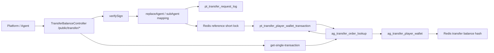
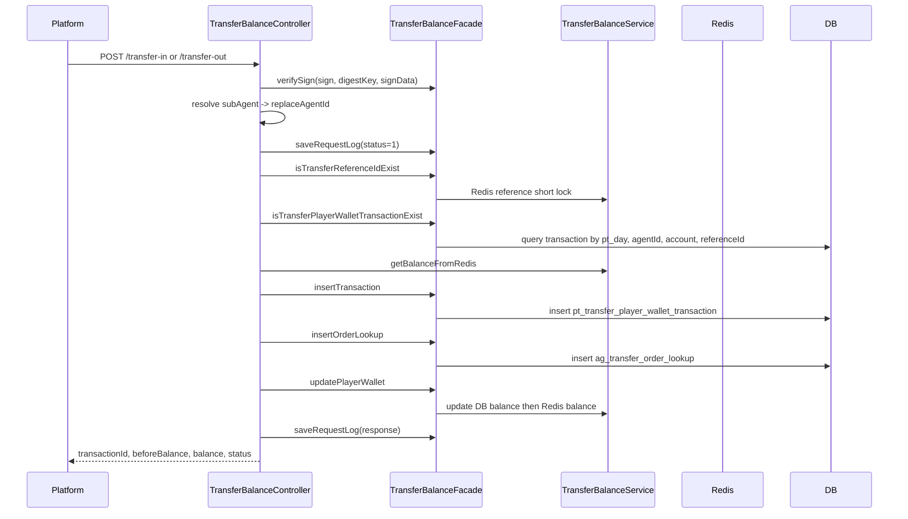

# transfer-wallet-money-in-out Flow

日期: 2026-05-21

## 0. 閱讀定位

- Flow 中文名稱: Transfer wallet 轉入 / 轉出 / 全額轉出 / 單筆查詢
- Flow slug: `transfer-wallet-money-in-out`
- 完成狀態: Step 3 / flow 學習包已建立，待 Step 4 轉面試 case
- 證據層級: 專案存在 / code-backed；Nick / `10gt12nc` 有 transfer wallet 分表、`@UseSchema` 與 `updatePlayerWallet` deadlock 補償相關 direct commits，但 transfer API 初始建立主要不是 Nick，履歷 claim 要等 Step 5 判斷
- 本 flow 類型: production money flow / wallet API flow
- 是否只確認到入口: 否，已追到 controller、facade、service、DB table、Redis balance、request log 與單筆交易查詢

遠端最新性:

- source repo: `/Users/nick/Git/antplay/antplay-slot-game-api`
- local branch: `develop`
- local HEAD: `079aa66`
- local `origin/develop`: `079aa66`
- ahead / behind: `0 / 0`
- source working tree: clean
- remote refs: 前一輪已嘗試 fetch 並失敗；依 KB 不反覆重試
- 判斷: 未確認最新遠端；本 Step 依本地 refs / 本地 working tree 保守分析

## 1. 白話導讀

這條 flow 是 transfer wallet 模式下，外部平台透過 Game API 管理玩家本地錢包。

它不是一局遊戲下注本身，而是錢包 API:

1. `/public/transfer/balance`: 查玩家 transfer wallet 餘額。
2. `/public/transfer/transfer-in`: 把錢轉進遊戲錢包。
3. `/public/transfer/transfer-out`: 從遊戲錢包轉出指定金額。
4. `/public/transfer/transfer-out-all`: 把遊戲錢包餘額全部轉出。
5. `/public/transfer/get-single-transaction`: 用 `transferReferenceId` 查單筆交易。

成功後，系統會留下三種資料:

- wallet balance: `ag_transfer_player_wallet` 與 Redis hash balance。
- transaction record: `pt_transfer_player_wallet_transaction`。
- lookup / audit: `ag_transfer_order_lookup` 與 `pt_transfer_request_log`。

最直覺會壞的地方:

- 重複請求造成重複加錢 / 扣錢。
- transaction 寫成功，但 wallet balance 更新失敗。
- DB balance 成功，Redis balance 不一致。
- transfer-out 併發檢查餘額時看到舊 balance。
- request log 或 lookup 寫入不完整，之後查單或排查事故會斷線。

## 2. 初中階 Code 分層對照

| Layer | Code path | 本 flow 責任 |
| --- | --- | --- |
| Route / API | `TransferBalanceController` / `/public/transfer/*` | balance、transfer-in、transfer-out、transfer-out-all、get-single-transaction |
| Controller | `TransferBalanceController#transferIn` | 驗簽、初始化玩家 wallet、Redis 短鎖防重、寫 transaction / lookup、加錢 |
| Controller | `TransferBalanceController#transferOut` | 驗簽、防重、查餘額、扣指定金額 |
| Controller | `TransferBalanceController#transferOutAll` | 驗簽、防重、查 DB 餘額、全額扣出 |
| Controller | `TransferBalanceController#transaction` | 依 `transferReferenceId` 查 lookup，再反查 transaction |
| Service / Business | `TransferBalanceFacade` | 簽名、request log、transaction object、order lookup、response 組裝 |
| Service / Repository | `TransferBalanceService` | JDBC 寫 wallet / transaction / lookup，讀 DB / Redis balance |
| DB / Table | `ag_transfer_player_wallet` | 玩家 transfer wallet balance |
| DB / Table | `pt_transfer_player_wallet_transaction` | transfer-in/out transaction record，含 before / after balance、status |
| DB / Table | `ag_transfer_order_lookup` | `transferReferenceId` 到 transaction table / row 的查詢索引 |
| DB / Table | `pt_transfer_request_log` | transfer API request / response audit |
| Redis | `antplay:transfer:Agent:{agentId}:balance` hash | hot balance cache，field 是 `{account}_{currency}` |
| Redis | `antplay:Transfer:ReferenceLock:{transferReferenceId}` | 3 秒短鎖，降低短時間重送 |
| External API | 無直接下游 provider call | 這條 flow 是公開 wallet API，主要改本地 DB / Redis |

## 3. 最小架構圖



## 4. 正常流程圖



## 5. 正常流程逐步說明

1. Controller 收到 transfer request 後，先做 bean validation。
2. 取出 `agentId`、`traceId`、`account`、`currency`、`amount`、`transferReferenceId`、`signTime`。
3. 用 agent digest key 對固定字串順序做 `verifySign`。
4. 依 `subAgentId` 換成實際寫資料的 `replaceAgentId`。
5. 寫一筆初始 `pt_transfer_request_log`，後續成功或失敗再補 response / error。
6. transfer-in 會確認 player wallet 是否存在，不存在就建立 DB wallet；Redis 沒有 hash field 時初始化為 `0`。
7. 用 Redis `ReferenceLock` 做 3 秒短鎖，擋短時間重複提交。
8. 再查今天的 `pt_transfer_player_wallet_transaction`，若同 reference 已 `SUCCESS`，直接回原本 before / after balance；若 `FAILED`，回交易失敗。
9. transfer-out / transfer-out-all 先檢查餘額是否足夠。
10. 產生 transaction id，寫 `pt_transfer_player_wallet_transaction`，記錄 before / after balance 與 status。
11. 寫 `ag_transfer_order_lookup`，讓單筆查詢可以從 `transferReferenceId` 找回 transaction table / id。
12. 更新 `ag_transfer_player_wallet`，再同步 Redis balance，最後更新 request log 並回 response。

## 6. 業務問題

這條 flow 解決的是「轉帳錢包模式下，外部平台與遊戲 runtime 之間的錢包餘額同步」。

對 Senior Backend 來說，它不是 CRUD，而是 money correctness 題:

- `transferReferenceId` 是否能支撐 idempotency。
- balance source of truth 是 DB 還是 Redis。
- DB wallet、Redis wallet、transaction record、request log 之間有沒有一致性保證。
- 扣款、加錢、全額轉出遇到併發或 deadlock 時怎麼處理。
- 查單時能不能從 lookup 找回正確交易。

## 7. 系統位置

- 產品: AntPlay slot transfer wallet
- 專案: `antplay-slot-game-api`
- 模組: `domain/api/game`、`domain/manage/service`、`domain/player/data/entity`
- 上游: platform / agent transfer wallet API caller
- 下游: 本地 DB、Redis、request log table

## 8. 資料狀態與 State Transition

### Transaction status

| Status | 已確認行為 |
| --- | --- |
| `SUCCESS` | `insertTransaction` 目前建立 transaction 時直接寫 `SUCCESS` |
| `FAILED` | controller 有處理既有 FAILED 的回應，但本輪未看到這條 transfer-in/out 主路徑先寫 PENDING 再改 FAILED |
| `PENDING` | entity enum 存在；本輪未確認主路徑會使用 |

### transfer-in

```text
validate/sign
  -> init wallet if needed
  -> Redis short lock
  -> duplicate transaction check
  -> insert SUCCESS transaction
  -> insert lookup
  -> update wallet + Redis
  -> update request log
```

### transfer-out / transfer-out-all

```text
validate/sign
  -> Redis short lock
  -> duplicate transaction check
  -> check balance
  -> insert SUCCESS transaction
  -> insert lookup
  -> update wallet - amount / - all
  -> update request log
```

## 9. DB / Redis / MQ / 外部 API

| 類型 | 名稱 | 說明 |
| --- | --- | --- |
| DB | `ag_transfer_player_wallet` | agent / account / currency 的 balance；`updatePlayerWallet` 先改 DB |
| DB | `pt_transfer_player_wallet_transaction` | 每筆 transfer-in/out 的 before / after / amount / status |
| DB | `ag_transfer_order_lookup` | reference id -> transaction table id / data day table |
| DB | `pt_transfer_request_log` | request / response / error audit |
| Redis | `antplay:transfer:Agent:{agentId}:balance` | hot balance，`getBalanceFromRedis` 讀取後除以 100 回應 |
| Redis | `antplay:Transfer:ReferenceLock:{transferReferenceId}` | 3 秒 short lock；不是長期 idempotency source |
| MQ | 不適用 | 本 flow 的 transfer request log 目前由 service 寫 table，不是 Step 3 主體 |
| External API | 不適用 | 這條 flow 不直接 call provider；它是 provider / platform call 進來 |

## 10. Failure Window

| 位置 | 已確認行為 | 風險 / 待確認 |
| --- | --- | --- |
| Redis short lock | `isTransferReferenceIdExist` 寫 Redis hash，3 秒 TTL | 只能擋短時間重送；真正 idempotency 還要靠 transaction 查詢 / DB 約束，但本輪未看到 unique constraint |
| transaction 先寫 SUCCESS | `insertTransaction` 直接寫 `SUCCESS` | 若後續 wallet update 失敗，transaction 可能已是 SUCCESS；Step 4/5 要追是否有補償或人工 repair |
| lookup 寫入後 wallet 更新前 | 先 insert transaction，再 insert lookup，再 update wallet | lookup 可查到交易，但 balance 可能還沒更新；是重要 failure window |
| DB wallet 更新與 Redis 同步 | `updatePlayerWallet` DB rows=1 後才 Redis increment | DB 成功 Redis 失敗會不一致；未看到同一 transaction boundary 包住 Redis |
| transfer-out 併發 | 先讀 Redis balance 再扣 DB | 若多請求穿過 short lock 或不同 reference 併發，需確認 DB 層是否防負數；目前 SQL 沒有 `balance >= ?` 條件 |
| request log | 先寫初始 log，再補 response | 主流程失敗時 catch 只回 error response，部分 exception path 未必補 log response |
| full transfer-out | `transferOutAll` 從 DB 讀全額再扣 | 讀與扣之間仍可能有併發變動，需 Step 4/5 再追是否有 lock / isolation |

## 11. Senior / Owner 設計取捨

已確認設計:

- 用 `transferReferenceId` 作為外部交易冪等 key。
- 用 Redis short lock 擋連續重送，並用 transaction table 做既有成功 / 失敗語意回應。
- `ag_transfer_order_lookup` 將 reference id 和分表 transaction row 串起來，避免查單要掃所有日表。
- `updatePlayerWallet` 先檢查 DB update rows，再同步 Redis；Nick / `10gt12nc` 的 `54078fe` 把它改成 boolean，支撐 bet flow 的 wallet changed flag。

Owner 要能追問:

- 短鎖 3 秒夠不夠？過 3 秒後重送靠什麼保證不重複入帳？
- transaction 先寫 `SUCCESS`，wallet update 失敗時如何修復？
- Redis balance 是快取還是 source of truth？若 Redis 與 DB 不一致，以誰為準？
- transfer-out 的 DB update 是否需要 `WHERE balance >= amount` 或 row lock？
- request log failure 能不能影響 money flow？

## 12. 面試 / 履歷邊界摘要

可面試講:

- transfer wallet API 如何做簽名驗證、防重、transaction record、lookup、DB / Redis balance 更新。
- 為什麼 `transferReferenceId` 和 `transactionId` 是兩種不同 id。
- Redis short lock 只能做頻率防護，不能當完整 idempotency source。
- DB + Redis dual-write 的 failure window 與 owner 改善方向。

履歷目前只可保守:

- 作為 `antplay-slot-game-api` project-level transfer wallet 素材的 code-backed flow。
- Nick / `10gt12nc` direct evidence 目前集中在後續分表 / schema route / deadlock 補償改造，不是 transfer API 原始完整 owner。

不能誇大:

- 不寫主導完整 transfer wallet。
- 不寫完整 wallet / ledger / reconciliation owner。
- 不寫 exactly-once 或完整分散式交易。
- 不寫 transaction failure / repair 已完整落地，除非 Step 5 補到更強 evidence。

## 13. 本次實際掃描範圍

Vault:

- `AGENTS.md`
- `senior-owner-playbook/00-operating-rules.md`
- `senior-owner-playbook/03-flow-learning-package-template.md`
- `senior-owner-playbook/09-ai-prompt-manual.md`
- `projects/antplay/antplay-slot-game-api/README.md`
- `projects/antplay/antplay-slot-game-api/step1-candidate-flows.md`
- `projects/antplay/antplay-slot-game-api/step2-flow-comparison.md`
- 既有 `slot-bet-settle-rollback` flow package

Source:

- `TransferBalanceController`
- `TransferBalanceFacade`
- `TransferBalanceService`
- `TransferRedis`
- `TransferPlayerWallet`
- `TransferPlayerWalletTransaction`
- `TransferOrderLookup`
- `AgentApiFacade` / `GameFlowFacade` / `GameFacade` transfer wallet 關聯片段
- path-specific git log / blame / selected commit diff

重要 commits:

- `67039e6`: 建立 transfer wallet API 初版，author Derek。
- `0733906`: DB 更新後同步 Redis，author Derek。
- `0781f68`: lookup 由 traceId 改存 `transferReferenceId`，author Derek。
- `54078fe`: `10gt12nc` direct，`updatePlayerWallet` 改回 boolean 並支撐 deadlock / wallet changed flag。
- `718a207`: `10gt12nc` direct，db partition v2，影響 transfer table / schema route。
- `99c63ff`、`aaddfdc`、`3531f42`、`eb2573a`: `10gt12nc` direct，transfer wallet / transaction / request log 分表 TODO / table path。
- `41cd5ae`: transfer-out 防負數補強，author eliot，作 context only。

未掃 / 待確認:

- 未做 Level 3 逐檔逐行 / 每個 commit diff。
- 未掃 live DB schema / unique index / transaction isolation。
- 未確認 `@Transactional` 或 DB constraint 是否在其他 config / migration 層補強。
- 未掃 external caller / platform side retry policy。
- 未更新 `05-resume-master-zh.md` / `08-application-autobiography-zh.md`；Step 3 只作 Flow Track。

## 14. 下一步

Step 3 已建立主學習包，下一步應轉成可面試案例，補 30 秒 / 90 秒 / 3 分鐘講法、STAR、failure scenario 與 owner 改善方向。

建議下一步:

```text
antplay antplay-slot-game-api transfer-wallet-money-in-out Step 4
```
