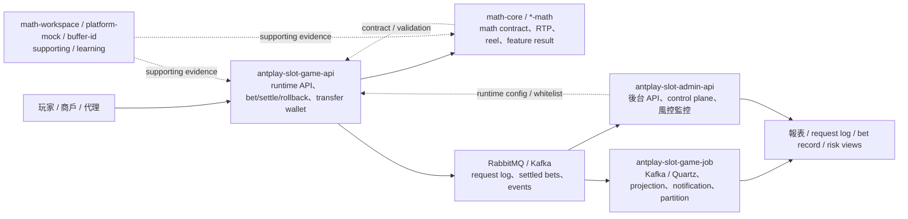
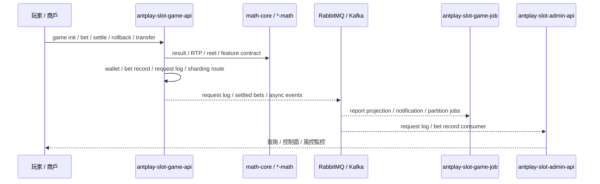
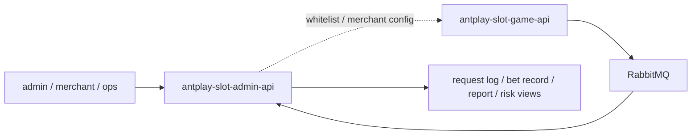
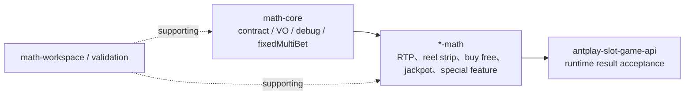

# AntPlay system map v1

更新日期：2026-05-28

本檔是 AntPlay domain-level 大地圖，用來把 `antplay-slot-game-api`、`antplay-slot-game-job`、`antplay-slot-admin-api`、`math-core`、`*-math` 與 supporting repos 的代表 flows / contribution consolidation 收成架構視角。它不是新的 Flow Step，也不是全量 code audit；不新增履歷 claim。

## 閱讀定位

| 項目 | 結論 |
| --- | --- |
| 掃描深度 | Domain map Level 1.5-2：重讀 KB、AntPlay README / project README / Step / flow inventory / contribution consolidation，並檢查主力來源 repo 本地 branch 狀態 |
| 證據來源 | 既有 `projects/antplay/**` flows / consolidation、2026-05-26 AntPlay re-audit、2026-05-28 admin-api refresh |
| 本輪未做 | 未重新逐檔逐行掃所有 source code；未重新 fetch 公司 repo remote refs；未改公司 repo |
| 用途 | 架構視角、面試系統圖、claim boundary 對齊 |
| 非用途 | 不代表全 AntPlay 全量掌握、不新增履歷 claim、不取代單條 flow 深掃 |

本輪來源 repo 本地狀態摘要：

| Repo | 本地狀態 |
| --- | --- |
| `antplay-slot-game-api` | `develop...origin/develop` |
| `antplay-slot-game-job` | `master...origin/master` |
| `antplay-slot-admin-api` | `main...origin/main` |
| `math-core` | `master...origin/master` |
| `platform-mock` | `deploy/dev...origin/deploy/dev` |

其他 `*-math` repo 以既有 grouped consolidation 與代表 flows 為準；本輪不平均展開 71 個 math repo。

## 一句話總覽

AntPlay 可以粗分成五層：`antplay-slot-game-api` 負責 slot game runtime API、bet / settle / rollback、transfer wallet、request log 與 runtime decision；`antplay-slot-game-job` 負責 Kafka / Quartz job、報表 projection、big-win notification、activity supporting flow 與分表 / report path；`antplay-slot-admin-api` 是後台 API / merchant control plane / 風控監控 / RabbitMQ consumer；`math-core` 與 `*-math` 是 slot math contract、RTP / reel strip、buy free、jackpot / symbol 與特殊 feature result contract；`platform-mock`、`math-workspace`、`buffer-id` 只作 supporting / learning。

## 最小架構圖

## 子系統定位

| Project | 系統責任 | 已完成代表素材 | Career claim 狀態 |
| --- | --- | --- | --- |
| `antplay-slot-game-api` | Slot runtime API、game init、bet / settle / rollback、transfer wallet、request log MQ、分表、RTP / dark pool / player control | 5 flows + refreshed consolidation | 可保守寫遊戲 API runtime / betting-settlement / transfer wallet / async log / high-traffic table governance / runtime decision |
| `antplay-slot-game-job` | Kafka / Quartz job、代理玩家報表、活動投注、big-win notification、settle pool monitor、partition / report path | 5 flows + refreshed consolidation | 可保守寫 job / event processing、report projection、notification 與分表 / job config |
| `antplay-slot-admin-api` | 後台 API、admin / merchant auth、白名單、風控監控、request log / bet record consumer、Quartz | 2 flows + refreshed consolidation | 可保守寫後台 API / 商戶控制面 / 風控監控 / 非同步資料處理 |
| `math-core` | slot math core contract、debugBet、fixedMultiBet、RTP type、symbol / jackpot contract | rolling consolidation | supporting 正式素材，可併入 math / runtime claim，不單獨作完整 framework owner |
| `*-math` | 多個 slot game math module、RTP / reel strip、buy free、jackpot、特殊 feature | 5 representative flows + grouped consolidation | 可保守寫多個 slot math module 維護與驗證；不可寫主導全部 math |
| `math-workspace` | cross-math KB / docs / validation workflow | rolling consolidation | supporting evidence |
| `platform-mock` | provider failure injection / rollback testing | rolling consolidation | supporting evidence，不作主成果 |
| `buffer-id` | ID generator learning-only | rolling consolidation | 不放履歷 |

## 三條主線

### 1. Slot runtime / wallet / settlement 主線

已可講：bet / settle / rollback、transfer wallet、request log async、bet record sharding、runtime RTP / dark pool / player control。

不可誇大：完整 slot platform、完整 wallet / ledger / reconciliation、完整 RTP strategy、exactly-once event platform。

### 2. Admin / risk / control plane 主線

已可講：request log RabbitMQ consumer、Game API whitelist sync、merchant / admin auth、風控監控。

不可誇大：後台控制面不等於完整 game runtime owner。

### 3. Math / feature contract 主線

已可講：math core / module contract、RTP / reel strip validation、buy free / scatter result、jackpot symbol scaling、special wild state transform。

不可誇大：完整遊戲數學模型、全部 math modules、完整 RTP 策略或 certification owner。

## 完整度判斷

| 層級 | 狀態 | 結論 |
| --- | --- | --- |
| Flow-level | AntPlay 主要 production flows 已有 17 條 `flow.md` | 足夠支撐 runtime / job / admin / math 多方向面試 |
| Project-level | game-api、game-job、admin-api、math grouped claims 已完成 refreshed / rolling consolidation | 足夠支撐通用 Senior Java Backend / Platform Backend 投遞包的 AntPlay 部分 |
| Domain-level | 本檔與 `integration-map.md` 已補 v1 | 架構視角已補齊；不是全 AntPlay 全量 owner |

## 後續維護規則

- 若新增 AntPlay flow Step 5，先更新該 project README / contribution consolidation，再判斷是否回填本檔。
- 若只是 JD 客製或面試口說，不一定改本檔。
- 若要升級為 Level 3 架構審計，需逐 repo fetch / module map / path-specific history；目前 v1 不宣稱全量最新 source code。
