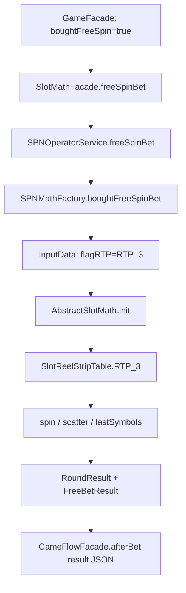
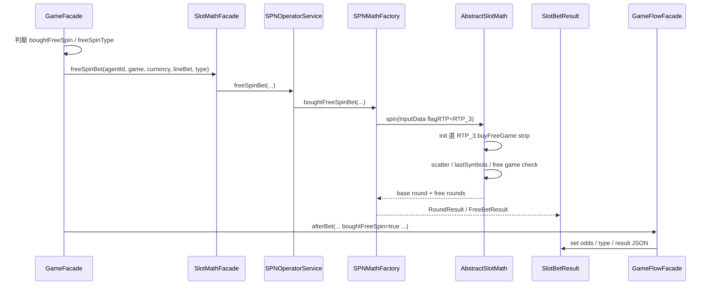

# Buy Free / Scatter / RTP_3 Result Contract Flow

## 0. 閱讀定位

- Domain / Project: `antplay *-math`
- Flow slug: `buy-free-scatter-rtp3-result-contract`
- 完成狀態: Step 5 / 單條 flow claim gate 已完成
- 證據層級: `真實開發過 + code-backed` / `專案存在 / code-backed`
- 主樣本 source repo: `/Users/nick/Git/antplay/spn-math`
- 對照 source repo: `/Users/nick/Git/antplay/sph-math`
- 補充 source repo: `/Users/nick/Git/antplay/sfm-math`
- 上游補讀: `/Users/nick/Git/antplay/antplay-slot-game-api`

這條 flow 不是單純「買免費局」。它把前台 / game-api 的 buy free bet、math module 的 `RTP_3` 輪帶、scatter 觸發、free game 展開、`RoundResult` / `FreeBetResult` 回傳契約串在一起。Senior 面試價值在於：一個 feature 不是只改輪帶或倍數，還會影響下注成本、RTP routing、free spin state、前端展示、後台紀錄與風控 / darkpool 統計。

## 1. 白話導讀

玩家可以用較高成本直接購買免費局。上游 `antplay-slot-game-api` 會判斷這筆 bet 是否 `buyFreeSpin`，如果是，就呼叫 math module 的 `freeSpinBet`。math module 會用 `RTP_3`，也就是買免費局專用輪帶，直到結果真的帶出免費局結果。

在 math module 裡，buy free flow 的重點是：

1. `GameSetting.FREE_SPIN_TYPE_LIST` 定義可購買免費局類型與 odds，例如 `HAVE_3_SCATTER_WIN`。
2. `SPNOperatorService#freeSpinBet` 接住上游呼叫。
3. `SPNMathFactory#boughtFreeSpinBet` 建立 `InputData`，把 `flagRTP` 設成 `RTP_3`。
4. `AbstractSlotMath#init` 依 `flagRTP=RTP_3` 選 `stripTableContainer_buyFreeGame`。
5. `SlotReelStripTable.RTP_3` 提供買免費局用的 Base / Free game 輪帶。
6. `AbstractSlotMath` 依 scatter / `lastSymbols` 決定是否進免費局、是否 re-spin、免費局符號是否要沿用。
7. `processGameSpinResult` 把 Base round、Free rounds、free total win、free scatter pay 組成 `RoundResult` / `FreeBetResult`。
8. 上游 `GameFlowFacade#afterBet` 會把 `isBoughtFreeSpin`、`boughtFreeSpinOdds`、`boughtFreeSpinType` 寫入 result JSON，並調整 totalBet。

直覺風險是：買免費局的 cost odds、RTP_3 輪帶、free game 結果與前端 / bet record result contract 任一層不一致，玩家看到的免費局、扣款、派彩或後台紀錄就可能對不上。

## 2. 初中階 Code 分層對照

```text
Route / API：
antplay-slot-game-api 本 Step 未追 Controller route；已補讀 GameFacade 的 bet flow。

Controller：
未掃 Controller。

Service / Business：
antplay-slot-game-api/src/main/java/com/ps/domain/game/slot/facade/GameFacade.java
antplay-slot-game-api/src/main/java/com/ps/domain/game/slot/facade/GameFlowFacade.java
antplay-slot-game-api/src/main/java/com/ps/domain/game/slot/facade/SlotMathFacade.java
spn-math/src/main/java/com/ps/math/spn/service/SPNOperatorService.java
spn-math/src/main/java/com/ps/math/spn/factory/SPNMathFactory.java

Domain Core：
spn-math/src/main/java/com/ps/math/spn/game/AbstractSlotMath.java
spn-math/src/main/java/com/ps/math/spn/game/P21008SlotMath.java

Model / Result Contract：
spn-math/src/main/java/com/ps/math/spn/vo/SlotBetResult.java
spn-math/src/main/java/com/ps/math/spn/vo/RoundResult.java
spn-math/src/main/java/com/ps/math/spn/vo/FreeBetResult.java
spn-math/src/main/java/com/ps/math/spn/bo/InputData.java
spn-math/src/main/java/com/ps/math/spn/bo/SlotSpinResultTemp.java
spn-math/src/main/java/com/ps/math/spn/bo/RoundResultTemp.java

Config / Table：
spn-math/src/main/java/com/ps/math/spn/constant/GameSetting.java
spn-math/src/main/java/com/ps/math/spn/constant/SlotReelStripTable.java
spn-math/src/main/java/com/ps/math/spn/config/SlotGameInitial.java

Simulation / Test：
spn-math/src/main/java/com/ps/math/spn/game/P21008SlotMathTestNew.java
spn-math/src/main/java/com/ps/math/spn/game/reelStripOptimizer/*

DB / Redis / MQ：
math module 本身不碰 DB / Redis / MQ。game-api 的 wallet / bet record 寫入只作上游補讀，未在本 Step 深掃完整交易邊界。

Log / Audit：
`buyFreeWinInfo`、`boughtFreeSpinBet`、`GameFlowFacade#afterBet` 有 log / result JSON evidence。
```

## 3. 最小架構圖



## 4. 正常流程圖



## 5. 正常流程逐步說明

1. `GameFacade` 從 `BetBO#getBuyFreeSpin()` 判斷是否買免費局，並取得 `freeSpinType`。
2. 若是 buy free，`GameFacade` 會用 math config 的 `BoughtFreeSpinTypeBO` 找 odds；找不到 type 會丟錯。
3. 上游 bet amount 會乘上 `freeSpinOdds`，代表買免費局成本不是一般 bet cost。
4. `GameFacade#getBetResult` 依 `boughtFreeSpin` 呼叫 `slotMathFacade.freeSpinBet(...)`，不是 `normalBet(...)`。
5. `SlotMathFacade` 委派到 game module 的 `SPNOperatorService#freeSpinBet`。
6. `SPNOperatorService` 設定 currency multiplier 後呼叫 `SPNMathFactory#boughtFreeSpinBet`。
7. `boughtFreeSpinBet` 建立 `InputData`：`gameState=EGS_BASE_GAME_1`、`expectRTP=10700`、`flagRTP=RTP_3`、`currency=...`。
8. `AbstractSlotMath#init` 看到 `RTP_3`，選 `config.getStripTableContainer_buyFreeGame()`。
9. `P21008SlotMath` 初始化時把 `stripTableContainer_buyFreeGame` 對到 `SlotReelStripTable.RTP_3`。
10. spin 過程會檢查 scatter，SPN 還有 `lastSymbols` 來保存 / 回寫 scatter、wild，影響 re-spin 與 free game state。
11. `processGameSpinResult` 若 Base round 觸發免費局，就逐次跑 free spin，累加 `freeTotalWin`，並建立 `FreeBetResult`。
12. `GameFlowFacade#afterBet` 把 `isBoughtFreeSpin`、`boughtFreeSpinOdds`、`boughtFreeSpinType` 放進 result JSON，並讓後續 bet record / settlement 使用。

## 6. 業務問題

Buy free 是玩家付更高成本，直接進入或追求免費局結果。它不是單一 math function，而是跨了三層契約：

- Pricing contract: 買免費局成本 odds，例如 `HAVE_3_SCATTER_WIN` 的 odds。
- Runtime contract: `RTP_3` 必須選到 buy free 專用輪帶，不能跑到一般局 `RTP_1` / `RTP_2`。
- Result contract: 回傳結果必須讓上游知道這是 buy free，且 `RoundResult.freeBetResults` 能描述免費局細節。

這條 flow 若出錯，不一定只是 RTP 偏差，也可能變成前端顯示有免費局但後台 cost / result JSON 不一致，或 darkpool / bet record 把 normal bet 與 buy free 統計混在一起。

## 7. 系統位置

- 上游 runtime: `antplay-slot-game-api`
- Math facade: `SlotMathFacade`
- Game module: `spn-math`
- 對照 module: `sph-math`
- 補充 module: `sfm-math`
- 下游: bet record result JSON、前端顯示、darkpool / RTP 統計、wallet settlement

本 Step 已補讀 game-api caller，但沒有完整深掃 wallet mutation、bet record table、前端展示與 darkpool 統計查詢。

## 8. 資料狀態與 State Transition

| 狀態 | 來源 | 說明 |
| --- | --- | --- |
| `boughtFreeSpin` | `BetBO` / voucher gift | 上游決定是否走 buy free |
| `freeSpinType` | request / voucher gift | 對應 `BoughtFreeSpinTypeBO.type` |
| `freeSpinOdds` | math config | 決定買免費局成本倍率 |
| `flagRTP=RTP_3` | math input | 決定使用 buy free reel strip |
| `RTP_3` strip | `SlotReelStripTable` | Base / Free game 專用輪帶 |
| `lastSymbols` | `SlotSpinResultTemp` / `InputData` | SPN 用來固定 / 回寫 scatter、wild state |
| `RoundResult` | math result | Base round 與 free trigger 摘要 |
| `FreeBetResult` | math result | 每次 free spin 的細節與 total win |
| result JSON | game-api afterBet | 寫入 `isBoughtFreeSpin`、odds、type，供後續紀錄與展示 |

## 9. Consistency / Contract

本 flow 的 consistency 不是 DB transaction，而是跨 module contract 一致：

- `GameFacade` 找到的 `freeSpinOdds` 必須和 math config 的 `BoughtFreeSpinTypeBO` 一致。
- 上游乘 odds 的 bet amount，必須和 result JSON / bet record 看到的 totalBet 語意一致。
- `freeSpinType` 必須存在於該 game 的 `boughtFreeSpinTypes`，不可跨 game 亂用。
- `freeSpinBet` 必須真的走 `RTP_3`，不可誤走 normal `RTP_1`。
- `RoundResult.freeTotalWin`、`freeScatterPay`、`freeBetResults` 必須讓前端 / 後台能還原免費局。
- `lastSymbols` 在 SPN 的 state reset 很重要，否則 debug / loop / haveFreeWin 可能被上一輪 state 污染。

## 10. Failure Window

| Failure | 影響 | Owner 觀點 |
| --- | --- | --- |
| odds 設錯 | 玩家買免費局成本錯，下注與 RTP 統計都偏 | odds 要能追到 math validation / GDD |
| `freeSpinType` 找不到 | buy free request 失敗 | 上游要先 validate type，錯誤訊息要可排查 |
| `flagRTP` 未設 `RTP_3` | 買免費局跑一般輪帶 | math factory 應有明確測試 |
| `RTP_3` Base / Free table 不一致 | free trigger 或 free result 不符合預期 | release 前需 simulation validation |
| `lastSymbols` 未 reset | scatter / wild state 被污染，結果不穩 | debug / loop helper 要重置 state |
| `freeBetResults` 組錯 | 前端顯示與後台 result 不一致 | result contract 要有 snapshot / schema check |
| 上游 totalBet odds 語意混亂 | bet record、darkpool、wallet settlement 可能不一致 | afterBet / beforeBet / wallet amount 要同源核對 |

## 11. Retry / Compensation / Reconciliation

math module 本身沒有 retry / compensation；它是同步計算結果。真正的補償在上游 game-api / wallet / bet record。

本 flow 可做的 reconciliation 是：

- 用 `buyFreeWinInfo` / simulation 檢查 buy free expected odds 與實際 free win ratio。
- 用 bet record result JSON 檢查 `isBoughtFreeSpin`、`boughtFreeSpinOdds`、`boughtFreeSpinType` 是否完整。
- 用 `RoundResult` / `FreeBetResult` 檢查 free round total 是否等於 `betTotalWin` 中的 free portion。
- 用 darkpool / RTP 報表分開 normal bet 與 buy free 統計，避免混算。

## 12. Senior / Owner Decision

- Buy free cost odds 要放在 math config、game-api config，還是營運配置？現在 evidence 顯示 runtime 讀 math config。
- `RTP_3` 是否應該只作 buy free，還是也可被 debug / simulation 共用？共用時要避免語意漂移。
- `lastSymbols` 這種 state 應該如何 reset，避免 debug helper 產出不穩定結果。
- result contract 是否需要 version / schema test，避免前端 / bet record 誤解 `freeBetResults`。
- 上游 totalBet 乘 odds 的位置，要和 wallet 扣款、bet record、darkpool 統計一致。

## 13. 面試 / 履歷邊界摘要

可面試講：

- 參與 / 維護 slot math module buy free / scatter / RTP_3 result contract 類調整。
- 能說明 buy free 從 game-api 到 math module 的 routing。
- 能說明 `RTP_3`、`HAVE_3_SCATTER_WIN` odds、scatter / `lastSymbols`、`RoundResult` / `FreeBetResult` 的關係。

可保守併入 `*-math` grouped bullet：

> 參與 AntPlay 多個 slot math module 維護與驗證，處理 RTP / reel strip、buy free / scatter、debug bet、fixedMultiBet、jackpot / symbol、currency 與 result contract 類調整。

不可寫：

- 主導完整 buy free 商業設計。
- 主導完整遊戲數學模型 / RTP 策略。
- 主導完整 wallet / settlement / darkpool。
- 保證所有前端 result contract 都已完整深掃。

## 14. Step 5 Claim Gate 結論

本 flow 已完成 Step 5。主樣本仍採 `spn-math`，因為 Nick / `10gt12nc` 在 RTP_3、buyFreeWinInfo、`HAVE_3_SCATTER_WIN`、`lastSymbols` reset 有集中 direct commits；`sph-math` 用來對照相同 buy free / `RTP_3` 模式；`sfm-math` 只作補充，確認相同 pattern 存在但未深挖。

Step 5 判定：這條 flow 可作為 `*-math` grouped 履歷 bullet 的強化 evidence，也可作為 Senior Backend 面試案例；但不單獨升級成「主導完整 buy free」、「主導完整遊戲數學模型」或「完整 wallet / settlement / darkpool owner」。

可放履歷的方式:

- 只併入 `*-math` grouped bullet：參與多個 slot math module 維護與驗證，處理 RTP / reel strip、buy free / scatter、debug bet、fixedMultiBet、jackpot / symbol、currency 與 result contract 類調整。
- 不獨立拆成一條「buy free owner」履歷成果。
- 不直接更新 05 / 08；後續 rolling resume package 或 `*-math` project-level consolidation 更新時，可引用本 flow 作為 evidence。

可面試講的方式:

- 買免費局不是單一 math function，而是 pricing contract、runtime routing contract、result contract 三層一致性問題。
- `GameFacade` 先 validate `freeSpinType`，從 math config 找 buy free odds，並在 beforeBet 前把 odds 乘進 bet amount。
- `SlotMathFacade#freeSpinBet` 把 runtime path 導到 math module；`SPNMathFactory#boughtFreeSpinBet` 以 `flagRTP=RTP_3` 進入 buy free 輪帶。
- `AbstractSlotMath` 用 `lastSymbols` 保存 / 回寫 scatter 與 wild state；若 debug / loop helper 不 reset，會污染後續結果。
- `processGameSpinResult` 把 Base round、free round、free total win、free scatter pay 組成 `RoundResult` / `FreeBetResult`。
- `GameFlowFacade#afterBet` 再把 `isBoughtFreeSpin`、`boughtFreeSpinOdds`、`boughtFreeSpinType` 與 result JSON / totalBet 語意補齊。

不能誇大的邊界:

- 不說主導完整 buy free 商業設計。
- 不說主導完整 RTP / 遊戲數學策略。
- 不說負責完整 wallet / settlement / darkpool。
- 不說所有 `*-math` repo 的 buy free flow 都完整深掃。
- 不說改善倍率、RTP 或 hit rate 數字，除非後續補正式 GDD / validation report / ticket / production issue。

完整 wallet mutation、bet record DB schema、前端展示與 darkpool 報表仍未深掃；因此本 Step 5 是單條 flow claim gate，不代表完整 `*-math` final consolidation。

## 15. 下一步

```text
antplay *-math jackpot-symbol-hit-and-prize-scaling Step 4
```
