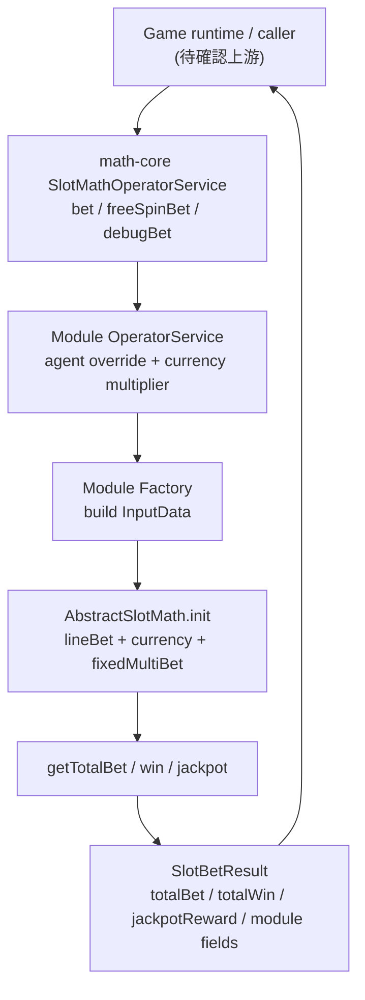
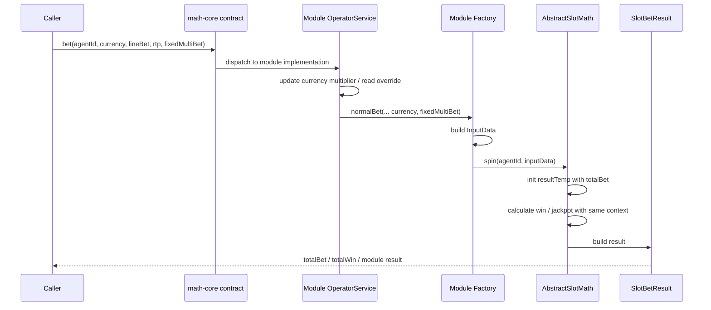

# fixedMultiBet / Currency / Math-Core Compatibility Flow

## 1. 閱讀定位

- Project: `antplay *-math`
- Flow: `fixed-multi-bet-currency-math-core-compatibility`
- Step: Step 5
- Evidence level: `真實開發過 + code-backed`
- 來源 repo: `math-core`、`sdt-math`、`sfm-math`、`slc-math`
- 本輪限制: 依本地 refs 與本地工作樹判斷；內網 GitLab 不可穩定 fetch 的 repo 不重複嘗試，標為「未確認最新遠端」。

這條 flow 不是一般玩家下注交易，也不是完整遊戲數學模型 owner。它比較像 slot math module 的「合約相容 flow」：runtime / game api 呼叫 math module 時，下注額不只是一個 `lineBet`，還可能帶 `currency` 與 `fixedMultiBet`；math-core 要讓舊 module 不壞，新 module 則要把這些欄位一致地帶入 `totalBet`、派彩、jackpot、debug bet 與前端結果。

## 2. 白話導讀

slot 遊戲裡，玩家看到的投注可能是「線注 x 幣別倍率 x 固定倍數」。如果只有 `lineBet`，不同幣別或固定倍數玩法會出現三種風險：

- 前端顯示的下注額與 math 實際計算不同。
- debug bet / 測試工具沒有帶到相同參數，測試結果和正式下注不同。
- jackpot 或派彩只乘到其中一邊，導致 total bet、total win、jackpot amount 不一致。

這條 flow 的價值在於：它把 `math-core` 的 interface、各遊戲 module 的 factory/input/result、operator service 的 currency multiplier、以及 `AbstractSlotMath` 的下注計算串起來，讓 fixedMultiBet / currency 能用同一套 contract 傳遞。

## 3. Code 分層對照

| 層級 | 代表 code | 角色 | 本輪觀察 |
| --- | --- | --- | --- |
| Core contract | `math-core/src/main/java/com/ps/math/core/SlotMath.java`、`SlotMathOperatorService.java` | 定義 `getTotalBet`、`bet`、`freeSpinBet` 對 currency / fixedMultiBet 的相容簽名 | 用 default fallback 保持舊 module 不壞；沒有 override 的 module 會退回舊算法 |
| Debug VO | `math-core/.../vo/DebugBetVO.java` | debug / 指定 RNG / 指定 bet 測試入口參數 | 已有 `fixedMultiBet` 與 `currency` default 值 |
| Result base | `math-core/.../vo/AbstractBetResult.java` | 共用結果基底 | 目前共用欄位有 bet / totalBet / totalWin / jackpot reward；currency / fixedMultiBet 不是共用基底欄位 |
| Module input | `sdt-math/.../bo/InputData.java`、`slc-math/.../bo/InputData.java` | 單次 spin 的 module input state | `sdt` / `slc` 有 `fixedMultiBet`、`currency`，且 currency 有 default fallback |
| Module factory | `sdt-math/.../factory/SDTMathFactory.java` | 把 caller 參數組成 inputData | normal/debug 類入口會 set currency multiplier、`fixedMultiBet`、`currency` |
| Operator service | `SDTOperatorService`、`SFMOperatorService` | 保存 agent override、currency multiplier、對外 bet/debug/freeSpin 入口 | currency multiplier 用 `ThreadLocal<Integer>`，是跨 method 的計算上下文 |
| Math engine | `AbstractSlotMath.java` | totalBet、win、jackpot 計算 | `sdt` / `slc` 在 way game totalBet 乘 fixedMultiBet；`sfm` 主要是 currency multiplier 相容 |
| Module result | `sdt-math/.../vo/SlotBetResult.java` | 回傳給 runtime / frontend 的 module result | `sdt` 有補 `fixedMultiBet`；`sfm` / `slc` result 欄位不完全一致 |

## 4. 最小架構圖



## 5. 正常流程圖



## 6. 正常流程逐步說明

1. Caller 透過 math-core 的 `SlotMathOperatorService` 入口呼叫下注或 free spin。新簽名可帶 `currency` 與 `fixedMultiBet`，舊 module 若未 override 仍會走 fallback。
2. Module service 取得 singleton instance，讀 agent override，並把 currency 轉成 module 內的 minBet multiplier。
3. Factory 建立 `InputData`，把 `lineBet`、`fixedMultiBet`、`currency`、RTP flag、debug RNG / jackpot reward list 等上下文放進一次 spin。
4. `AbstractSlotMath.init` 建立暫存結果，並用同一組 `lineBet + currency + fixedMultiBet` 計算 `totalBet`。
5. 派彩計算會讀 symbol odds、minBet override 與 currency multiplier；way game 的 totalBet 會依 module 實作乘上 fixedMultiBet。
6. jackpot 類 flow 會用 `nowBet = lineBet * fixedMultiBet` 與 `maxBet = maxLineBet * maxFixedMultiBet` 算 jackpot multiplier，再依幣別讀 jackpot balance payload。
7. Module result 回傳 `totalBet`、`totalWin`、round result、jackpot reward；部分 module 另補 `fixedMultiBet` 給前端。

## 7. Senior / Owner 深度

### State 與資料來源

| State | Source of truth | 風險 |
| --- | --- | --- |
| `lineBet` | caller / config line bet list | position 與 actual lineBet 混用時會錯 |
| `currency` | caller input，缺省回 module default currency | debug / normal / freeSpin 若 default 不一致，測試會失真 |
| `currencyMultiplier` | module `GameSetting.CURRENCY_MIN_BET_MULTIPLIER` + OperatorService ThreadLocal | ThreadLocal 必須在同一次計算前正確 set；async / reuse thread 要小心殘留 |
| `fixedMultiBet` | caller input 或 module default | 若 core fallback 被誤用，會看似支援但實際未乘 |
| agent override | OperatorService `agentOverrideMap` | minBet / lineMax override 必須和 currency multiplier 順序一致 |
| jackpot balance | module registered function / payload | payload 包 agentId、jackpotType、currency；缺 function 時 module 可能回本地 default |

### Consistency

這條 flow 的 consistency 不是 DB transaction，而是 math contract consistency。重點是同一次 spin 中，以下欄位要用同一組上下文：

- `totalBet`
- symbol win / line win / way win
- jackpot multiplier
- debug bet output
- front-end visible fixedMultiBet / currency result
- init config 的 minBet / lineBet list

只要其中一層漏帶 fixedMultiBet 或 currency，就會變成「結果能跑，但金額語意不一致」。

### Idempotency / Determinism

對指定 RNG / debug bet 來說，理想狀態是同一組 input 可以重現同一個結果。fixedMultiBet / currency 加入後，debug input 也必須完整帶這些欄位，否則測試只驗證了 reel / symbol，沒有驗證 money-like amount。

### Failure Window

| Failure window | 可能後果 | 本輪 evidence |
| --- | --- | --- |
| core default fallback 被舊 module 使用 | caller 以為 fixedMultiBet 生效，實際 totalBet 未乘 | `math-core` default method 會退回舊 `bet/getTotalBet` |
| module result 沒有回傳 fixedMultiBet | 前端 / debug output 難以核對本次倍數 | `sdt` 有補 `SlotBetResult.fixedMultiBet`；其他 module 不完全一致 |
| currency multiplier 只 set 在部分入口 | normal / debug / freeSpin 金額不一致 | `sdt` / `sfm` service 有多個入口各自處理 currency |
| jackpot amount 與 totalBet 使用不同倍數 | jackpot 派彩金額比例錯 | `sdt` / `slc` jackpot 用 `lineBet * fixedMultiBet` 算比例 |
| ThreadLocal context 殘留 | 同 thread 後續計算使用到前一筆 currency multiplier | `SDTOperatorService` / `SFMOperatorService` 使用 ThreadLocal |

### Transaction Boundary

math module 本身沒有 DB transaction；它是一個純計算 / 準純計算邊界。真正交易正確性在上游 wallet / bet record，但 math module 需要保證：

- 同一 input 產生語意一致的 amount。
- `totalBet` 是上游扣款 / 記錄可相信的結果。
- debug / simulation 能重現正式運算路徑。
- jackpot reward list 不和 total win 語意互相打架。

### Retry / Compensation

math module 不做補償；它提供可重算與可驗證的結果。若上游交易失敗，應由 game-api / wallet flow 做 retry / rollback。這條 flow 能支撐的 owner 能力是：知道 math result 是交易前置證據，不把補償責任錯放在 math module。

### Observability

目前 evidence 顯示 module 內有不少 log / debug path，但正式 owner 角度仍需要關注：

- debugBet 是否能印出 currency / fixedMultiBet / totalBet。
- simulation / test 是否覆蓋不同 currency multiplier。
- jackpot reward payload 是否能追到 agentId / jackpotType / currency。
- 對外 result 是否足夠讓前端與後端對帳。

## 8. Owner Decision

這條 flow 最重要的 owner decision 是「core 保持相容，module 漸進 override」。這比一次強迫所有 math module 改新介面安全，因為 `*-math` repo 很多；但代價是每個 module 的落地程度不同，必須靠 Step 2 ranking 與 Step 3 evidence 逐條確認，不能因為 core 有 default method 就宣稱全部 module 已完整支援 fixedMultiBet / currency。

## 9. 面試 / 履歷邊界

可面試講：

- 參與 slot math module 的 fixedMultiBet / currency 相容調整，重點是 core contract、module input、totalBet、jackpot scaling、debug bet 與前端結果欄位一致。
- 能說清楚為什麼這類 flow 雖然不是 DB transaction，仍屬於 money-like correctness。
- 能指出 default fallback 的 trade-off：相容性高，但需要 module-by-module 驗證。

可放履歷但要保守：

- 「參與 AntPlay slot math core / 多個 math module 維護，處理 fixedMultiBet、currency、debug bet 與 total bet 相容性調整。」

不可誇大：

- 不寫主導完整遊戲數學模型。
- 不寫完整 RTP / simulator / certification owner。
- 不寫全部 `*-math` module 都已完整支援 fixedMultiBet / currency。

## 10. Step 5 Claim Gate

Step 5 判定：這條 flow 可作為 `*-math` grouped 履歷 bullet 的強化 evidence，也可作為 Senior Backend 面試主案例；但不單獨升級成「主導完整 slot math 平台」或「完整 RTP / 遊戲數學 owner」。

可放履歷的保守句：

> 參與 AntPlay slot math core 與多個 slot math module 維護，處理 fixedMultiBet、currency、debug bet、totalBet / jackpot scaling 等相容性與驗證問題，確保遊戲數學輸出與上游下注金額語意一致。

可面試講：

- core contract default fallback 如何降低多 module rollout 風險。
- `sdt` / `slc` 如何把 fixedMultiBet 帶進 totalBet 與 jackpot scaling。
- `sfm` 如何呈現各 module 落地程度不同，因此不能只看 interface 宣稱全部支援。
- math module 雖不做 DB transaction，但輸出是上游扣款 / 派彩 / 對帳的前置依據，因此要用 money-like correctness 檢查。

不可誇大：

- 不說主導完整 slot math 平台。
- 不說負責全部 `*-math` repo。
- 不說設計完整 RTP 策略 / simulator / certification。
- 不說這條 flow 已確認 production incident / ticket。
- 不說 math module 負責 wallet rollback / reconciliation。

後續 Flow Track 已回到 Step 2 ranking，且 `rtp-reel-strip-simulation-validation Step 5` 已完成。當時下一步建議做 Rank 3 的 buy free / scatter / RTP_3 result contract。

```text
antplay *-math jackpot-symbol-hit-and-prize-scaling Step 4
```
