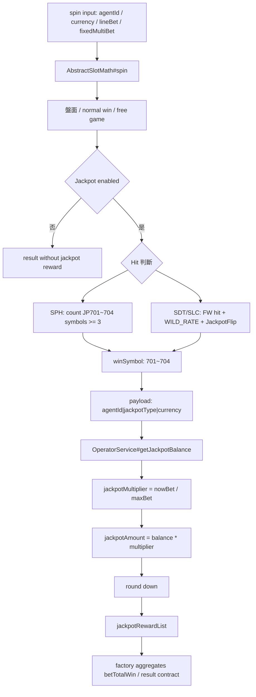
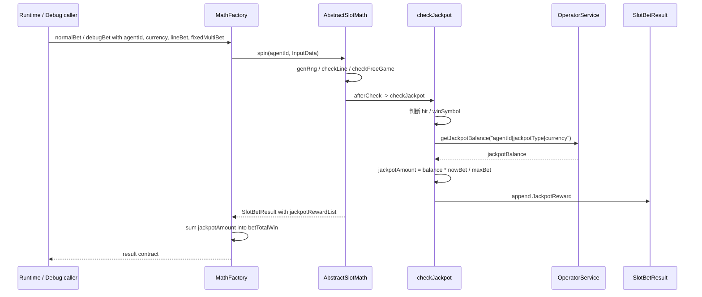

# Jackpot Symbol Hit / Prize Scaling Flow

## 0. 閱讀定位

- Domain / Project: `antplay *-math`
- Flow slug: `jackpot-symbol-hit-and-prize-scaling`
- 完成狀態: Step 3 / Level 2 Flow 深掃初版
- 掃描深度: Level 2 Flow 深掃
- 證據層級: `真實開發過 + code-backed` / `專案存在 / code-backed`
- 主要 source repo: `/Users/nick/Git/antplay/sph-math`
- 對照 source repo: `/Users/nick/Git/antplay/sdt-math`
- 補充 source repo: `/Users/nick/Git/antplay/slc-math`、`/Users/nick/Git/antplay/math-core`
- 本 flow 類型: slot math module 內的 jackpot hit 判斷、獎池金額縮放與 result contract，不是完整 jackpot pool / wallet / settlement 系統。

這條 flow 的價值在於：Jackpot 在玩家體感上像「大獎」，在工程風險上像 money correctness。即使 math module 不負責真正扣款、派彩入帳或 jackpot pool 累積，它仍負責把盤面 / 觸發條件、獎池 balance、下注倍率與回傳結果組成一致的 prize contract。

## 1. 白話導讀

Slot math module 每次 spin 會先產生盤面、判一般線獎、判 free game，再依遊戲特色判 Jackpot。這條 flow 主要有兩種型態：

1. `sph-math`：盤面上出現至少三個指定 JP symbol，例如 701 / 702 / 703 / 704，就視為對應獎種 hit。
2. `sdt-math` / `slc-math`：盤面先出現 wild / FW，再用 `WILD_RATE` 機率進 jackpot，接著用 `JackpotFlip` 決定 Min / Minor / Major / Grand 與前端翻牌表演 deck。

hit 之後，math module 不是自己算 jackpot pool，而是用 `agentId|jackpotType|currency` 組 payload，透過 `OperatorService#getJackpotBalance` 拿獎池 balance。最後依目前下注與最大下注的比例做縮放：

```text
jackpotAmount = jackpotBalance * (nowBet / maxBet)
```

`sph-math` 的 `nowBet` 主要看 `lineBet`；`sdt-math` / `slc-math` 則把 `lineBet * fixedMultiBet` 視為目前下注，最大下注也要乘上最大 `fixedMultiBet`。算出來的金額會無條件捨去小數，放入 `jackpotRewardList`，再由 factory 彙總到 `betTotalWin` 與回傳結果。

## 2. 初中階 Code 分層對照

```text
Route / API:
本 Step 未深掃 game-api / runtime caller。math module 對外由 OperatorService / factory method 被呼叫。

Contract / Core:
math-core/src/main/java/com/ps/math/core/vo/AbstractBetResult.java
math-core/src/main/java/com/ps/math/core/constant/Symbol.java

Operator Service:
sph-math/src/main/java/com/ps/math/sph/service/SPHOperatorService.java
sdt-math/src/main/java/com/ps/math/sdt/service/SDTOperatorService.java
slc-math/src/main/java/com/ps/math/slc/service/SLCOperatorService.java

Factory / Result Assembly:
sph-math/src/main/java/com/ps/math/sph/factory/SPHMathFactory.java
sdt-math/src/main/java/com/ps/math/sdt/factory/SDTMathFactory.java
slc-math/src/main/java/com/ps/math/slc/factory/SLCMathFactory.java

Domain Core:
sph-math/src/main/java/com/ps/math/sph/game/AbstractSlotMath.java
sph-math/src/main/java/com/ps/math/sph/game/P21008SlotMath.java
sdt-math/src/main/java/com/ps/math/sdt/game/AbstractSlotMath.java
sdt-math/src/main/java/com/ps/math/sdt/game/JackpotFlip.java
slc-math/src/main/java/com/ps/math/slc/game/AbstractSlotMath.java

Config / Symbol:
sph-math/src/main/java/com/ps/math/sph/constant/SlotSymbolTable.java
sdt-math/src/main/java/com/ps/math/sdt/constant/GameSetting.java
slc-math/src/main/java/com/ps/math/slc/constant/GameSetting.java

Debug / Simulation:
sph-math/src/main/java/com/ps/math/sph/game/P21008SlotMathTestNew.java
sdt-math/src/main/java/com/ps/math/sdt/game/P21014SlotMathTestNew.java
sdt-math/src/main/java/com/ps/math/sdt/factory/SDTMathFactory.java
```

DB / Redis / MQ 不在本 flow 範圍內；本 Step 未看到 math module 直接操作 DB / Redis / MQ。

## 3. 最小架構圖



## 4. 正常流程圖



## 5. 正常流程逐步說明

1. runtime 或 debug tool 呼叫 `MathFactory`，帶入 `agentId`、`currency`、`lineBet`，`sdt` / `slc` 額外帶 `fixedMultiBet`。
2. factory 建 `InputData`，初始化 `jackpotRewardList`，再呼叫 `math.spin(agentId, inputData)`。
3. `AbstractSlotMath#init` 將下注、幣別、RTP flag、game state、jackpot list 與 total bet 放進 `SlotSpinResultTemp`。
4. game-specific `P21008SlotMath#afterCheck` 或 `P21014SlotMath#afterCheck` 在 free game 判斷後，如果 `GameFeature.jackpotGame == 1` 就呼叫 `checkJackpot`。
5. `sph-math` 盤面逐格掃 symbol，計算 701 / 702 / 703 / 704 對應 symbol 數量，任一類型達 3 顆就命中。
6. `sdt-math` / `slc-math` 先看盤面是否有 `FW`，再用 `WILD_RATE` 決定是否進 jackpot；若進入，`JackpotFlip.plan()` 產生中獎獎種與前端翻牌 deck。
7. hit 後組出 payload：`agentId|winSymbol|currency`，交給對應 `OperatorService#getJackpotBalance`。
8. `OperatorService` 透過已註冊的 `jackpotBalanceFn` 取 balance；若本地 test 未註冊，回傳 0。
9. `sph-math` 用 `lineBet / maxLineBet` 當 jackpot multiplier；`sdt-math` / `slc-math` 用 `(lineBet * fixedMultiBet) / (maxLineBet * maxFixedMultiBet)`。
10. jackpot 金額以 `RoundingMode.DOWN` 取整數後放入 `AbstractBetResult.JackpotReward`。
11. factory 從 `spinResult.getJackpotRewardList()` 彙總 jackpot amount，加入 `betTotalWin`，並把 `jackpotRewardList` 放回 `SlotBetResult`。

## 6. 業務問題

這條 flow 解決的是「Jackpot 命中後，玩家拿到的獎池金額是否和下注倍率、幣別與獎種一致」。

它的風險不只在有沒有中獎，而是在這些地方：

- hit 條件是否對應該遊戲規格。
- jackpot type 是否和前端 / jackpot pool 使用同一組 701~704 語意。
- 取得的 balance 是否是正確 agent、獎種、幣別。
- `nowBet / maxBet` 是否跟該遊戲下注模型一致。
- 小數取整規則是否和 settlement / 前端顯示一致。
- `jackpotRewardList` 是否跟 `betTotalWin` 一起回傳，避免前端有獎池列表但總贏分漏加。

## 7. 系統位置

- 產品: AntPlay slot game math module
- Project: `*-math` grouped project
- 主樣本 module: `sph-math`
- 對照 module: `sdt-math`
- 補充 module: `slc-math`
- shared contract: `math-core` 的 `AbstractBetResult.JackpotReward` 與 `Symbol.JP_1~JP_4`
- 上游: game-api / runtime caller、jackpot balance provider，本 Step 未深掃
- 下游: front-end result display、bet record / settlement，本 Step 未深掃

## 8. 資料狀態與 State Transition

| 狀態 | 來源 | 說明 |
| --- | --- | --- |
| `gameState` / `flagRTP` | `InputData` | 決定使用哪組輪帶 / RTP |
| symbols | `RoundResultTemp.symbols` | jackpot hit 的直接依據 |
| `winSymbol` | `checkJackpot` / `JackpotFlip` | 701~704 對應 jackpot type |
| payload | `agentId|winSymbol|currency` | 查 jackpot balance 的 contract |
| `jackpotBalance` | registered function | math module 外部提供，未註冊時本地 test 回 0 |
| `fixedMultiBet` | `InputData` | SDT / SLC jackpot scaling 的必要因素 |
| `jackpotRewardList` | `SlotSpinResultTemp` / `AbstractBetResult` | 回傳給 caller 的 jackpot reward contract |
| `betTotalWin` | factory aggregate | 一般 win / free win / jackpot amount 的合計 |

狀態轉移可以簡化成：

```text
spin input -> symbols -> hit decision -> jackpot type -> balance payload -> scaled jackpot amount -> reward list -> result total win
```

## 9. Transaction Boundary / Consistency

本 flow 在 math module 內沒有 DB transaction；它的 consistency 是 contract consistency：

- symbol table / jackpot type / `math-core` symbol 常數要一致。
- `OperatorService#getJackpotBalance` payload 格式要和外部 provider 一致。
- `jackpotRewardList` 裡的 `jackpotType` / `jackpotAmount` 要和 `RoundResult` 的 jackpot display 欄位一致。
- `betTotalWin` 要包含 jackpot amount，否則前端看到 reward list，但總贏分不含 jackpot。
- `fixedMultiBet` 必須同時影響 total bet、game state / reel strip、jackpot scaling 與 debug tool。

本 Step 已確認 `sdt-math` / `slc-math` 在 jackpot scaling 使用 `lineBet * fixedMultiBet`，並以 `maxLineBet * maxFixedMultiBet` 作最大下注基準；這和先前 `fixed-multi-bet-currency-math-core-compatibility` flow 可互相補強。

## 10. Idempotency / Retry / Reconciliation

這條 flow 不處理 production retry；下注重送、入帳補償與 jackpot pool 對帳應在 runtime / wallet / settlement 層處理。

math side 能做到的是：

- 同一組 debug RNG / input 下，盤面與 hit 結果應可重現。
- Jackpot balance unavailable 時，不能默默產生錯誤大獎；本地 test path 回 0，production callback 失敗會回 null 再轉 0。
- `jackpotRewardList` 可作 result-level reconciliation，讓 caller 對照 `betTotalWin` 是否已包含 jackpot。
- debug helper 可強制 Min / Minor / Major / Grand，用來驗證 result contract，而不是只靠隨機命中。

## 11. Failure Window

| Failure | 影響 | Owner 觀點 |
| --- | --- | --- |
| jackpot symbol mapping 錯 | 命中錯獎種或前端顯示錯 | 701~704 要跨 math-core、module、provider 對齊 |
| hit 條件和 GDD 不一致 | hit rate / 體感錯 | SPH 的三顆 symbol 與 SDT/SLC 的 FW + 機率不能混成同一套規格 |
| balance callback 未註冊或失敗 | jackpot amount 變 0 | runtime 要有告警與 fallback 決策，不能只靠 math log |
| payload 格式錯 | 查錯 agent / 獎種 / 幣別 | payload contract 應由 provider / caller 做 integration test |
| maxBet / nowBet 算錯 | 下注倍率越高越容易錯付 | fixedMultiBet / lineBet / minBet 的語意要和 total bet 一致 |
| 小數處理不一致 | 前端 / settle / math 金額差一點 | `RoundingMode.DOWN` 要和 settlement 契約一致 |
| reward list 和 total win 不一致 | 前端有 jackpot，但總贏分漏加或重複加 | factory aggregate 必須明確測試 |
| free game jackpot list 傳遞錯 | BG / FG jackpot reward 漏接 | free spin input 應傳同一份 jackpot list 或明確合併 |

## 12. Senior / Owner Decision

可以拿這條 flow 講的 owner decision：

- Jackpot balance 的 source of truth 應由哪一層提供：math 只算命中與縮放，pool balance / 入帳不是 math owner。
- scaling 應以 line bet、total bet 還是 fixedMultiBet 後的 nowBet 為基準：不同遊戲不能硬套。
- 何時把 unavailable balance 視為 0，何時應 fail fast：本地 test 可以 0，production 需要觀測與告警。
- result contract 應該把 jackpot reward list 和 total win 都帶出，讓上游能核對。
- debug helper 應能強制各獎種，否則 jackpot case 很難靠隨機重現。

## 13. 面試 / 履歷邊界摘要

可面試講：

- 參與 slot math module 的 jackpot hit / prize scaling / result contract 維護。
- 能說清楚 jackpot symbol / FW trigger、jackpot type、balance callback、下注比例縮放、取整與 `jackpotRewardList` 如何串成完整 result。
- 能把 slot math 的 jackpot 問題翻成 backend 熟悉的 money correctness、contract consistency、observability 與 failure window。

履歷仍只保守併入 `*-math` grouped bullet：

> 參與 AntPlay 多個 slot math module 維護與驗證，處理 RTP / reel strip、debug bet、fixedMultiBet、buy free / purchasable free spin、jackpot / symbol、currency 與模擬驗證調整。

不可寫：

- 主導完整 jackpot platform / jackpot pool。
- 負責錢包入帳、settlement、provider pool 對帳。
- 保證所有 `*-math` jackpot module 都完整深掃。
- 設計完整遊戲數學模型或 jackpot 機率策略。

## 14. Step 3 結論

本 Step 3 已建立 `jackpot-symbol-hit-and-prize-scaling` 的 code-backed 初版 flow：

- `sph-math` 提供三顆 JP symbol hit 與 jackpot reward list 的主樣本。
- `sdt-math` 提供 `fixedMultiBet` jackpot scaling、`JackpotFlip`、debug helper 與 result contract 的主對照。
- `slc-math` 顯示同型 jackpot scaling pattern，可作補充 evidence。
- `math-core` 提供 shared `JackpotReward` contract 與 jackpot symbol 常數。

下一步 Step 4 應補強 failure / consistency / interview case，尤其是：

- runtime caller 是否註冊 jackpot balance function。
- free game / BG jackpot reward list 是否有漏加或重複加風險。
- debug helper 是否足以覆蓋 Min / Minor / Major / Grand。
- `jackpotRewardList` 與 `betTotalWin` 的 contract 是否能被面試講成完整 case。
