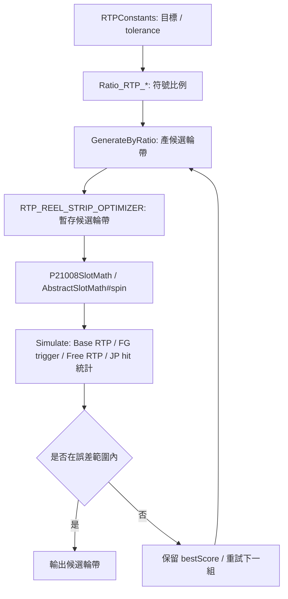
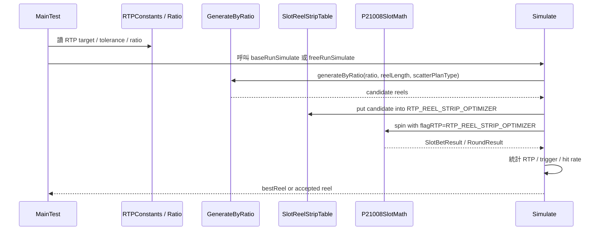

# RTP / 輪帶模擬與驗證 Flow

## 0. 閱讀定位

- Domain / Project: `antplay *-math`
- Flow slug: `rtp-reel-strip-simulation-validation`
- 完成狀態: Step 5 / 單條 flow claim gate 已完成
- 掃描深度: Level 2 Flow 深掃
- 證據層級: `真實開發過 + code-backed` / `專案存在 / code-backed`
- 主要 source repo: `/Users/nick/Git/antplay/sph-math`
- 對照 source repo: `/Users/nick/Git/antplay/spn-math`
- 補充 source repo: `/Users/nick/Git/antplay/sfm-math` 只確認 branch / HEAD，未深挖本 flow code path
- 本 flow 類型: slot math module 的離線 / 開發期 validation flow，不是線上 HTTP API / DB transaction

這條 flow 不是一般後端 CRUD，也不是錢包交易。它的核心價值在於：輪帶與 RTP 模擬雖然不是 production transaction，但它會決定遊戲上線後的長期派彩正確性。Senior / Owner 面試時，這條可以拿來講「高風險 domain logic 如何用模擬、target、tolerance、runtime path 對齊來降低上線風險」。

## 1. 白話導讀

Slot 遊戲的每一輪會從五條輪帶取符號。輪帶上每個符號出現的位置與次數，會影響一般局中獎、免費局觸發、免費局倍率、Jackpot hit rate，最後影響長期期望 RTP。

這條 flow 做的事情是：

1. 先用 `RTPConstants` 定義目標 RTP、Base RTP、免費局觸發率、Free RTP、Jackpot hit rate 與可接受誤差。
2. 用 `Ratio_RTP_*` 定義每條輪帶各符號比例。
3. `GenerateByRatio` 依比例產生候選輪帶，並控制 scatter / special symbol 的最小間距。
4. `Simulate` 把候選輪帶塞進 `SlotReelStripTable.RTP_REEL_STRIP_OPTIMIZER`。
5. 用真實 `P21008SlotMath` / `AbstractSlotMath#spin` 跑大量模擬。
6. 統計 Base RTP、Free trigger、Free RTP、Jackpot hit rate。
7. 若結果在 tolerance 內，留下候選輪帶；否則保留目前最接近目標的輪帶，繼續嘗試。

成功後不是寫 DB，而是產出可人工檢查、可放回 `SlotReelStripTable` 的候選輪帶與模擬結果。失敗最直覺會壞在：RTP 偏離、free trigger 太高 / 太低、buy free 體感不對、Jackpot hit rate 偏離、或模擬用的輪帶和 runtime 實際使用輪帶不一致。

## 2. 初中階 Code 分層對照

```text
Route / API：
不適用。這是 math module 內的離線 / 開發期模擬工具，不是 HTTP API。

Controller：
不適用。起點是 reelStripOptimizer/MainTest.java。

Service / Business：
sph-math/src/main/java/com/ps/math/sph/game/reelStripOptimizer/MainTest.java
sph-math/src/main/java/com/ps/math/sph/game/reelStripOptimizer/Simulate.java
sph-math/src/main/java/com/ps/math/sph/game/reelStripOptimizer/GenerateByRatio.java
sph-math/src/main/java/com/ps/math/sph/game/reelStripOptimizer/ProcessGameSpin.java

Domain Core：
sph-math/src/main/java/com/ps/math/sph/game/AbstractSlotMath.java
sph-math/src/main/java/com/ps/math/sph/game/P21008SlotMath.java
spn-math/src/main/java/com/ps/math/spn/game/AbstractSlotMath.java

Config / Table：
sph-math/src/main/java/com/ps/math/sph/game/reelStripOptimizer/RTPConstants.java
sph-math/src/main/java/com/ps/math/sph/game/reelStripOptimizer/Ratio_RTP_1.java
sph-math/src/main/java/com/ps/math/sph/game/reelStripOptimizer/Ratio_RTP_2.java
sph-math/src/main/java/com/ps/math/sph/game/reelStripOptimizer/Ratio_RTP_3.java
sph-math/src/main/java/com/ps/math/sph/constant/SlotReelStripTable.java

DB / Redis / MQ：
不適用。本 flow 未看到 DB / Redis / MQ。

External API：
不適用。未看到外部 API。

Log / Audit：
Simulate / MainTest 使用 log 輸出 Base RTP、Free RTP、FG trigger、Jackpot hit rate、候選輪帶與是否在誤差範圍內。
```

## 3. 最小架構圖



## 4. 正常流程圖



## 5. 正常流程逐步說明

1. `MainTest` 選定要跑 `RTP_1_Run`、`RTP_2_Run` 或 `RTP_3_Run`。
2. `RTPConstants` 提供 target，例如總 RTP、Base RTP、Base FG trigger、Free RTP、Jackpot rate 與 lower / upper bound。
3. `Ratio_RTP_*` 提供每條輪帶的符號比例與 scatter plan。
4. `baseRunSimulate` / `freeRunSimulate` 以 `attempts` 跑多組候選輪帶。
5. `GenerateByRatio` 依比例配置符號，並用最小間距規則避免 scatter / special symbol 過度集中。
6. `Simulate` 將候選輪帶放進 `SlotReelStripTable.RTP_REEL_STRIP_OPTIMIZER`。
7. `Simulate` 建立 `P21008SlotMath`，並用 `flagRTP="RTP_REEL_STRIP_OPTIMIZER"` 讓 `AbstractSlotMath#init` 選用 optimizer 輪帶。
8. Base 模擬統計一般局投注、贏分、Base RTP、FG trigger、SPH 另統計 Jackpot hit rate。
9. Free 模擬統計免費局總贏分、Free RTP，buy free path 以 100% 進免費局思路處理。
10. 若 base / trigger / free / jackpot 指標落在 tolerance 內，接受候選輪帶；否則用 `bestScore` 留下目前最接近的結果。

## 6. 業務問題

這條 flow 解決的是「輪帶調整是否真的符合預期派彩與遊戲體感」。

在 slot math 裡，改一個符號比例或 scatter 數量，可能同時影響：

- 一般局 RTP。
- 免費局觸發率。
- 免費局倍率。
- Buy Free 的結果分布。
- Jackpot hit rate。
- 前端看到的 result 與玩家體感。

如果只看單次 debug result，很容易看不到長期偏差；如果只看理論比例，又可能沒走到真實 `spin` 裡的 free game / jackpot / lastSymbols / feature state。這就是為什麼這條 flow 要用 simulation loop 跑真實 math engine。

## 7. 系統位置

- 產品: AntPlay slot game math module
- Project: `*-math` grouped project
- 主樣本 module: `sph-math`
- 對照 module: `spn-math`
- 上游: GDD / RTP target / 遊戲規格 / 人工調整 ratio，未掃正式 GDD 文件
- 下游: `SlotReelStripTable` production 輪帶、runtime `AbstractSlotMath#spin`、遊戲 API 使用 math result 的路徑，game-api / frontend 未在本 Step 深掃

## 8. 資料狀態與 State Transition

本 flow 沒有 DB transaction，但有幾種很重要的狀態：

| 狀態 | 來源 | 風險 |
| --- | --- | --- |
| target / tolerance | `RTPConstants` | 目標寫錯會讓 simulation 導向錯誤結果 |
| ratio / scatter plan | `Ratio_RTP_*` | 符號比例、scatter plan 會直接影響 trigger 與 RTP |
| candidate reel strip | `GenerateByRatio` | 隨機生成，需靠大量 rounds 與 attempts 過濾 |
| optimizer strip table | `SlotReelStripTable.RTP_REEL_STRIP_OPTIMIZER` | 模擬用 table 必須和 `AbstractSlotMath#init` 的 `flagRTP` 對得上 |
| runtime spin state | `AbstractSlotMath#spin` | free game、lastSymbols、jackpot、extraData 會影響結果 |
| metrics counters | `Simulate` local counters | counter 沒 reset 或 sample size 不夠會誤判 |

## 9. Transaction Boundary / Consistency

這條 flow 沒有資料庫 transaction boundary；它的 consistency 是「模擬環境與 production math runtime 是否一致」。

最重要的 consistency checks：

- `flagRTP="RTP_REEL_STRIP_OPTIMIZER"` 必須真的讓 `AbstractSlotMath#init` 選到 `getStripTableContainer_ReelStripOptimizer()`。
- `Simulate` 放進 `RTP_REEL_STRIP_OPTIMIZER` 的 game state 必須對應 Base / Free game。
- `ProcessGameSpin` 與 simulation path 要走真實 `math.spin`，不是重新手寫一套派彩邏輯。
- `spn-math` 的 `lastSymbols` 會跨 BG / FG 影響盤面 state；commit 也明確出現「重置 lastSymbols」，表示這是驗證時的風險點。
- SPH 額外統計 Jackpot hit rate，代表 RTP 之外還要看特殊派彩事件，不只看總贏分。

## 10. Idempotency / Retry / Reconciliation

這裡的 idempotency 不是 API 重送冪等，而是 simulation 可重跑、可比較、可追溯。

- Retry: 候選輪帶不在 tolerance 內，就重試下一組 attempts。
- Compensation: 沒有 production 補償；錯誤輪帶在上線前要回到 ratio / target / generator 調整。
- Reconciliation: 用模擬輸出的 Base RTP、FG trigger、Free RTP、JP hit rate 和 target / tolerance 對帳。
- 待改善點: 目前讀到 `GenerateByRatio` 使用 `new Random()`，沒有看到固定 seed；若要更強的 QA / certification evidence，應補 seed / output snapshot / run config 記錄，否則每次重跑結果會有統計波動。

## 11. Failure Window

| Failure | 影響 | Owner 觀點 |
| --- | --- | --- |
| target / tolerance 設錯 | 模擬結果看似通過，但實際 business target 錯 | target 必須可追 GDD / math spec |
| sample size 不夠 | RTP / hit rate 因隨機波動誤判 | rounds / attempts 要和風險等級對齊 |
| `flagRTP` 指錯 | 模擬跑到 production RTP_1 / RTP_2 / RTP_3，而不是候選 optimizer table | 必須確認 `AbstractSlotMath#init` 的 routing |
| Base / Free game state 對錯 table | Free RTP 或 trigger 失真 | table key 要用正確 `SlotGameState` |
| feature state 未 reset | SPN `lastSymbols` 可能污染下一次驗證 | debug / haveWin / haveFreeWin 類 helper 要重置 state |
| 只看總 RTP | Free trigger / JP hit rate 偏離仍可能上線 | RTP 要拆 base / free / special event |
| 模擬用 code path 不同於 runtime | validation 沒有代表性 | simulation 應走 `math.spin` 而非重寫派彩 |

## 12. Senior / Owner Decision

這條 flow 可拿來展示的不是「我會調數字」，而是這些 owner decision：

- 如何決定 target / tolerance：嚴格到什麼程度才接受輪帶。
- 如何拆指標：總 RTP 之外，要不要拆 Base RTP、Free trigger、Free RTP、Jackpot hit rate。
- 如何避免 overfit：一組 simulation pass 不代表永遠穩，要看 sample size、seed、重跑穩定性。
- 如何保證 runtime 一致：simulation 必須走 `AbstractSlotMath#spin` 的同一路徑。
- 如何定 release gate：輪帶進 production table 前，哪些 log / histogram / validation output 必須留存。
- 如何表達 claim boundary：可以說參與 slot math module 維護與驗證，不說完整 RTP 策略 owner。

## 13. 面試 / 履歷邊界摘要

可面試講：

- 參與多個 slot math module 的 RTP / reel strip / simulation validation 維護。
- 能把 RTP target、reel strip、symbol ratio、free trigger、free RTP、Jackpot hit rate 和 runtime `spin` path 串起來。
- 理解 validation flow 的風險：sample size、flag routing、state reset、target / tolerance、simulation / production path drift。

履歷可保守併入 `*-math` grouped bullet：

> 參與 AntPlay 多個 slot math module 維護與驗證，處理 RTP / reel strip、debug bet、fixedMultiBet、buy free / purchasable free spin、jackpot / symbol、currency 與模擬驗證調整。

不可寫：

- 不得寫成主導完整 RTP 策略。
- 設計完整遊戲數學模型。
- 負責 certification / full simulator platform。
- 保證所有 `*-math` repo 都完整深掃或都由 Nick 主導。

## 14. Step 5 Claim Gate 結論

`rtp-reel-strip-simulation-validation` 已完成 Step 5。正式面試稿位於 `materials/interview.md`，單條 flow 的 claim gate 位於 `career-interview.md` 與 `materials/claim-boundary.md`。

本 flow 的履歷判斷是「強化 `*-math` grouped bullet」，不是獨立新增一條完整 RTP / 遊戲數學 owner 經歷。05 / 08 本輪不直接更新，因為 `*-math` project-level rolling consolidation 已有保守 grouped bullet；若後續重整履歷版本，可把本 flow 作為支撐 evidence。

可安全使用的結論：

- 可放履歷：併入 `*-math` grouped bullet，寫參與 slot math module RTP / reel strip / simulation validation 維護。
- 可面試講：用 high-risk domain validation case 展開 target / tolerance、runtime path、state reset、sample size 與 release gate。
- 不可誇大：不寫主導完整 RTP 策略、完整遊戲數學模型、certification 或 full simulator platform。

## 15. 後續狀態

後續 Rank 3 到 Rank 5、`*-math` contribution claim consolidation refresh 與 rolling resume package 都已完成；目前沒有預設下一步。
