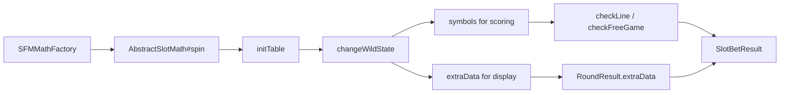
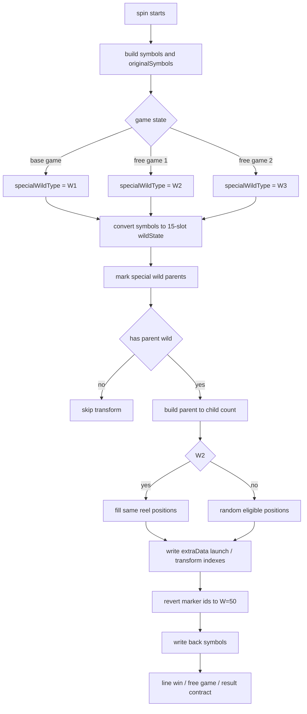

# Special Wild Feature State Transform Flow

## 0. 閱讀定位

- Domain / Project: `antplay *-math`
- Flow: `special-wild-feature-state-transform`
- 中文名稱: Special Wild / symbol state transform
- 狀態: Step 5 / 單條 flow claim gate 已完成 / 2026-05-21
- 主樣本: `sfm-math`
- 對照樣本: `slc-math`
- Shared contract: `math-core`
- 證據層級:
  - `sfm-math`: `真實開發過 + code-backed`。Nick / `10gt12nc` 在相關 path 有 direct commits，且有特殊 wild bugfix / spacing / originalSymbols 類 evidence。
  - `slc-math`: `專案存在 / code-backed` 補充。可作同類 feature state transform 對照，但目前不寫成 Nick 主開發 LuckyClover。

本 flow 不是 RTP 策略、完整遊戲數學模型或完整前端動畫 owner 的 claim。它用來理解 slot math 裡「特殊符號先用 feature 狀態運算，再收斂成 scoring symbol 與前端 extraData contract」的流程。

## 1. 白話導讀

`sfm-math` 的 Special Wild 不是單純把盤面某格改成 wild。它會先在 math module 內把盤面轉成一個 15 格的 `wildState`，標出觸發特殊 wild 的 parent，再依不同 free game / base game 狀態產生 child wild，最後把結果寫回 `symbols` 給算分，同時把 parent / child 的動畫資訊放進 `extraData` 給前端。

也就是說，這條 flow 有兩份結果要同時正確:

- 算分用盤面: 最後要回到一般 wild `W=50`，讓 payline / win calculation 可以穩定處理。
- 展示用契約: `extraData.launchIndex` 與 `extraData.transformIndex` 要告訴前端哪顆特殊 wild 觸發、哪些位置被轉換。

這也是為什麼 `找不到父 wild 前端卡` 這類 bug 很關鍵：算分可能還能跑，但動畫契約若找不到 parent，前端就可能卡在錯誤狀態。

## 2. Code 分層對照

| 後端概念 | `sfm-math` 對應 | 作用 |
| --- | --- | --- |
| Entrypoint | `AbstractSlotMath#spin` | 單局 spin orchestration，初始化、取盤面、算線、整理回傳 |
| 盤面初始化 | `AbstractSlotMath#initTable` | 建 `symbols` / `originalSymbols` / `allSymbolCount`，並進入 wild transform |
| Feature transform | `changeWildState` | 特殊 wild parent / child 轉換主流程 |
| 狀態標記 | `markSpecialWilds` | 把特殊 wild parent 改成 family marker，並記錄 parent ids |
| 子 wild 生成 | `buildWildFamilyMap` | 依 W1 / W2 / W3 規則決定每個 parent 的 child 數 |
| 位置選擇 | `handleSpecialWildType` | W2 走同 reel 規則；W1 / W3 走隨機位置規則 |
| 前端契約 | `addExtraDataForWilds` | 產出 launch / transform indexes |
| 算分收斂 | `revertSpecialWildsToNormal` / `writeBackWildState` | 把特殊 family marker 還原成一般 W，再寫回盤面 |
| Free game state | `P21008SlotMath#checkFreeGame` / `SFMMathFactory#processGameSpinResult` | base game 觸發 FG 後，依 `extraData.gameType` 決定 free game type |

## 3. 最小架構圖



## 4. 正常流程圖



## 5. 正常流程逐步說明

1. `AbstractSlotMath#spin` 建立本局 `RoundResultTemp`，依 RNG 與 reel strip 取出盤面。
2. `initTable` 產生 `symbols`，並保留 `originalSymbols`。`originalSymbols` 是「轉換前盤面」的 debug / contract 參考，不能被後續 wild transform 淹掉。
3. `initTable` 依 `inputData.gameState` 選 special wild type：
   - base game: `W1`，彩色雲。
   - `EGS_FREE_GAME_1`: `W2`，金箍棒。
   - `EGS_FREE_GAME_2`: `W3`，牛魔王。
4. `changeWildState` 把 3x5 盤面轉成 15 格 `wildState`。它使用 `2 - i + 3 * j` 的 index mapping，讓同一 reel 的三格可以被連續處理。
5. `markSpecialWilds` 找到特殊 wild parent，將 parent 標成 `specialWildType * 10 + sequence`。這個 marker 不是給算分用，而是暫時表示「這是某個 wild family 的 parent」。
6. `buildWildFamilyMap` 決定 child 數量：
   - `W1`: 每個 parent 隨機 1 到 3 個 child。
   - `W2`: 每個 parent 固定 2 個 child。
   - `W3`: 每個 parent 隨機 1 到 2 個 child。
7. `W2` 走 reel-based transform：找到 parent 所在 reel，將同 reel 其他位置轉成同 family id。這符合「同一軸展開」的遊戲效果。
8. `W1` / `W3` 走 random transform：從可用位置挑 child，避開第一 reel、既有 special family、一般 wild、以及特定 excluded symbol。
9. `addExtraDataForWilds` 把 parent 的 launch index 與被 transform 的 indexes 記錄到 `ExtraData`，讓前端知道動畫從哪裡發動、轉到哪些格子。
10. `revertSpecialWildsToNormal` 把所有特殊 family marker 還原成一般 wild `W=50`，再寫回 `symbols`。後續判線只看穩定的 wild，不需要理解 family marker。
11. `P21008SlotMath#checkFreeGame` 若 scatter 觸發 free game，會確保 `extraData[0]` 存在，並用 `gameType` 記錄 free game type。
12. `SFMMathFactory#processGameSpinResult` 讀取 base round 的 `extraData[0].gameType`，再帶入下一段 free game spin，並把每個 round 的 `extraData` 一起帶回 result。

## 6. 狀態與契約

| 狀態 / 欄位 | 角色 | 風險 |
| --- | --- | --- |
| `originalSymbols` | 原始盤面快照 | 若缺失，debug / 前端對照會看不出 transform 前後差異 |
| `symbols` | 最終算分盤面 | 必須收斂成一般 symbol，否則 payline / wild 判斷可能失真 |
| `wildState` | transform 中間狀態 | index mapping 必須和寫回盤面一致 |
| family marker | parent / child 暫時 id | 只能存在 transform 階段，不能流到算分 contract |
| `ExtraData.launchIndex` | 前端動畫起點 | 找不到 parent 時不可亂填 default reel |
| `ExtraData.transformIndex` | 前端動畫目標 | 必須和實際轉換後盤面一致 |
| `ExtraData.gameType` | free game type | factory 依它選下一段 gameState |

## 7. Failure Window

### 7.1 Parent wild 找不到

已看到 direct commit `acac921 找不到父 wild 前端卡`：`findReelOfParent` 的 fallback 從預設 reel 改為 `-1`，呼叫端遇到 `-1` 直接 skip。這個修正保護的是前端動畫 / transform contract，不讓「找不到 parent」被誤當成 reel 0。

Owner 解讀:

- 錯誤 default 值在 feature state transform 內很危險，因為它會把不存在的 parent 映射成有效位置。
- 這類 bug 不一定是金額錯，但會造成前端顯示、動畫、debug replay 與玩家體感不一致。

### 7.2 Marker 沒有還原成一般 W

`W1 / W2 / W3` 與 family marker 是 feature state，不是算分 symbol。若 marker 流進 line check，wild type / paytable / symbol count 都可能出錯。

Owner 解讀:

- Feature transform 應有明確 boundary：中間狀態可以豐富，對外 scoring contract 要穩定。
- 這就是 `revertSpecialWildsToNormal` 的價值。

### 7.3 `extraData` 與 `symbols` 不一致

`extraData` 是前端動畫契約，`symbols` 是算分結果。兩者若不同步，玩家看到的盤面與實際結算可能不一致。

Owner 解讀:

- `extraData` 不是 optional log，它是 result contract 的一部分。
- Step 4 面試時可把這點翻成「domain state / display contract / settlement result 一致性」。

### 7.4 Random transform 的 replay 風險

W1 / W3 child 位置使用 `rand.nextInt` 選 eligible position。若 debug / replay 沒有保存足夠 RNG 或 final result contract，後續重現問題會變難。

Owner 解讀:

- 對 slot math 來說，randomness 本身不是問題；問題是 debug / simulation / customer support 能否重建當局。
- `originalSymbols`、`symbols`、`extraData`、RNG sequence 是排查所需的核心材料。

### 7.5 Free game type 依 `extraData[0]`

`P21008SlotMath#checkFreeGame` 在觸發 free game 時確保 `extraData` 有第一筆，再寫入 `gameType`。`SFMMathFactory` 後續依 `extraData[0].gameType` 選 free game state。

Owner 解讀:

- 這是一個隱性 contract：`extraData[0]` 同時承載 display 與 free game routing。
- 之後 Step 4 要把它講清楚，避免面試時只講「加欄位」而沒講 state transition。

## 8. `slc-math` LuckyClover 對照

`slc-math` 的 `LuckyCloverTracker` 是另一種 feature state transform：它不是 Special Wild family，而是 free game 期間的 sticky board tracker。

已確認 code-backed 行為:

- green coin / gold coin / blue coin 會改變 board state。
- locked position 不再被一般盤面覆蓋。
- `SPIN_PLUS_ONE` 會增加剩餘 free spin。
- tracker 產生 snapshot，透過 `flagWins` / result 欄位回傳。

和 `sfm-math` 的共同點:

- 都不是單局 payline 的純函式。
- 都有「盤面狀態變化 + 對外 result contract」。
- 都需要讓 math result、前端顯示與後續 spin 狀態一致。

差異:

- `sfm` Special Wild 是單局內的 parent / child transform，最後收斂成 `W=50`。
- `slc` LuckyClover 是跨 free spin 的 sticky state tracker，狀態會延續到下一轉。

履歷邊界:

- `sfm` 可作 Nick direct evidence 的主要例子。
- `slc` 目前只作 code-backed 對照，不寫 Nick 主導 LuckyClover。

## 9. Step 5 Claim Gate 結論

這條 flow 已能作為 `*-math` 的補充面試案例：它不是最高價值的 money correctness 題，但很適合展示 Nick 能讀懂 slot math feature state、result contract、front-end display data 與 bugfix boundary。

可面試主軸:

- Special Wild transform 先建立 parent / child family state，再收斂為 scoring symbol。
- `extraData` 是前端動畫與 free game routing 的 result contract，不只是附加欄位。
- `acac921` 類 bug 顯示 feature state 的 fallback 值不能亂給，否則會造成前端卡住或顯示與實際盤面不一致。

本 flow 不直接更新 `05` / `08`。它只強化 `*-math` grouped bullet 與面試 case。

Step 5 claim gate 結論:

- 可放履歷: 只併入 `*-math` grouped bullet，不新增獨立 Special Wild / feature owner bullet。
- 可面試講: 可以作 slot math feature state transform / result contract consistency 補充案例，主 evidence 是 `sfm-math` direct commits。
- 不可誇大: 不說主導完整 Special Wild feature、不說主導完整 slot math model、不說 Nick 主開發 LuckyClover、不說修復 production incident 或改善比例。
- 05 / 08: 本輪不直接更新；後續若做 `*-math` project-level final consolidation 或 rolling resume package，可引用本 flow 作 grouped evidence。

## 10. 下一步

```text
antplay antplay-slot-game-api Step 1
```

`*-math` Step 2 本批五條代表 flow 已全部完成到 Step 5，且 project-level rolling contribution consolidation 已完成。若要繼續 antplay，下一步建議切到交易主線 `antplay-slot-game-api Step 1`；若 Nick 要先做 `*-math final contribution consolidation`，也可以另行指定。
