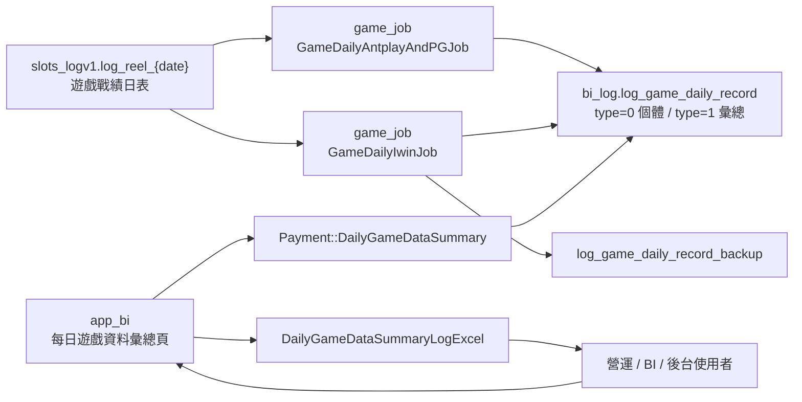
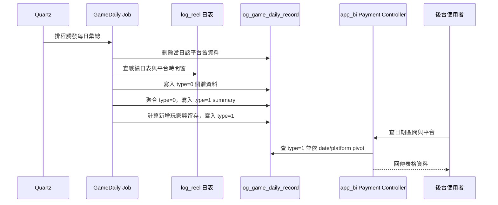

# app_bi - daily-game-record-summary

更新時間：2026-05-15
完成狀態：Step 5 已完成
文件角色：`flow.md` 主研究報告
掃描等級：Level 2 Flow 深掃
證據層級：專案存在 / code-backed；Nick 貢獻待確認

## 0. 閱讀定位

- Flow 中文名稱：每日遊戲資料彙總 / 報表查詢
- Flow slug：`daily-game-record-summary`
- 完成狀態：Step 5 已完成
- 證據層級：`專案存在 / code-backed`；Nick 個人貢獻 `待確認`
- 本 flow 類型：BI 報表查詢 / 每日批次彙總 projection / 後台查詢入口
- 是否只確認到入口：不只入口；已確認 `app_bi` 查詢端，也補讀 `game_job` producer，但未確認 Nick 本人開發痕跡

## 1. 白話導讀

這條 flow 是「每日遊戲資料彙總」報表。後台使用者打開 app_bi 頁面，選日期與平台後，可以看到每天各平台的玩家數、新增人數、投注數、投注金額、盈虧、殺率與留存數據。

白話講，它不是即時交易系統，而是：

```text
遊戲戰績 log
-> 每日批次 job 先整理成彙總表
-> app_bi 後台再查這張彙總表
-> 營運 / BI 用它看每日平台表現
```

所以這條 flow 的核心不是「查表」而已，而是「報表數字是否可信」。如果 job 沒跑、時區切錯、跨日區間錯、金額倍率錯、同一天重跑沒有先清乾淨，後台看起來仍然有資料，但數字可能不是真實狀態。

這份報表可以幫助理解 production reporting / reconciliation 的思維，但目前沒有 Nick 本人 MR / ticket / commit evidence，不能寫成 Nick 主導每日遊戲報表或資料平台。

## 2. 初中階 Code 分層對照

| 分層 | 本 flow 對應 | 狀態 |
| --- | --- | --- |
| Route / API | `/admin.php/Payment/DailyGameDataSummary`、`/admin.php/Payment/DailyGameDataSummaryLogExcel` | 已確認 |
| Controller | `app_bi/app/admin/controller/Payment.php` | 已確認 |
| Service / Business | app_bi 主要邏輯在 controller；producer 在 `game_job` 的 `GameDaily*Job` | 已確認 |
| Model / DAO / Repository | `game_job` 的 `GameDailyService` / `GameDailyDao.xml` / `LogReelDao.xml` | 已確認 |
| SQL / Table | `log_game_daily_record`、`log_game_daily_record_backup`、`log_game_daily_record_new_players`、`slots_logv1.log_reel_{date}` | 已確認 |
| Redis | 本 flow 查詢端無 Redis evidence；不是快取同步 flow | 已確認無直接使用 |
| MQ / Kafka / 下游通知 | 無 MQ / Kafka evidence | 已確認無直接使用 |
| External API | 無外部 API evidence | 已確認無直接使用 |
| Log / Audit | `game_job` 使用 `LogUtils.GAME_DAILY` 記錄各階段耗時；app_bi catch exception 後 logRecord | 已確認 |
| Config | `application-quartz.yml` 有 GameDaily job cron 與 enable flag | 已確認 |

用 Java 後端語言理解：

```text
Quartz Job
-> 查 daily log_reel 分表
-> 先 delete 當日該平台舊資料
-> insert type=0 個體資料
-> aggregate type=0 成 type=1 summary
-> insert retention summary
-> app_bi controller pivot 查詢 type=1 summary
-> 後台表格 / Excel 顯示
```

## 3. 最小架構圖



## 4. 正常流程圖



## 5. 正常流程逐步說明

1. `game_job` 的 Quartz 依設定時間觸發每日資料彙總 job。
2. Antplay / PG 與 Iwin 分開跑：Antplay / PG 是一組 job，Iwin 是另一組 job。
3. Job 先刪除同一天同平台的舊 `log_game_daily_record`，避免重跑時直接疊加。
4. Job 從 `slots_logv1.log_reel_{date}` 查詢戰績資料，依平台切 game id 與時間範圍。
5. 個體資料先以 `type = 0` 寫進 `log_game_daily_record`，欄位代表玩家、投注數、投注金額與 win currency。
6. Job 再從 `type = 0` 聚合出 `summary_user_counts`、`summary_spin_counts`、`summary_spin_amount`、`summary_profit_loss`、`summary_kill_rate` 等 `type = 1` 彙總列。
7. Job 讀近 7 日玩家集合，計算新增玩家、次日 / 2 日 / 3 日 / 7 日留存與留存率。
8. 後台頁面呼叫 `Payment::DailyGameDataSummary()`，查 `type = 1`。
9. Controller 用 `SUM(CASE WHEN sub_type = ... THEN value1 ELSE 0 END)` 把多列 summary pivot 成一列報表。
10. 金額欄位會依 `Base::getCurrencyUnit()` / `Base::divideUnit()` 做單位換算。
11. 後台表格顯示，使用者也能下載 Excel。

## 6. 系統位置

已確認：

- `app_bi` 是後台查詢端。
- `game_job` 是本 flow 的 producer。
- `log_game_daily_record` 同時存個體資料與彙總資料，用 `type` 與 `sub_type` 區分。
- app_bi 查的是 `type = 1` 彙總資料，不直接查原始遊戲戰績。

待確認：

- 這些 job 在實際環境的 enable flag 是否由部署設定覆蓋。
- 是否有正式補跑工具、補跑審核、補跑後對帳流程。
- Nick 是否實際維護過這條 flow。

## 7. Source of Truth 與 Projection

這條 flow 有三層資料：

| 層級 | 資料 | 角色 |
| --- | --- | --- |
| Source log | `slots_logv1.log_reel_{date}` | 遊戲戰績來源 |
| Projection | `log_game_daily_record type=0` | 每日玩家層級中間資料 |
| Report summary | `log_game_daily_record type=1` | 後台查詢的彙總資料 |

Owner 要注意：後台報表不是 source of truth。報表錯不一定代表遊戲交易錯，但報表會影響營運判斷、平台分析與對帳追查。

## 8. State / Transaction Boundary

這條 flow 不是一筆交易的狀態機，而是批次 projection state：

```text
未產生
-> 產生 type=0 個體資料
-> 產生 type=1 彙總資料
-> 後台可查
-> 老資料備份 / 清除
```

transaction boundary 目前看起來分散在多次 delete / insert / select / insert。若 job 中途失敗，可能出現：

- 舊資料已刪，個體資料未完整寫入。
- type=0 寫入成功，type=1 summary 未寫入。
- summary 寫入成功，留存尚未寫入。
- app_bi 查詢時看到部分欄位為 0 或缺漏。

這就是它的 Senior / Owner 價值：不是功能能不能查，而是批次資料是否完整、可重跑、可觀測、可對帳。

## 9. Consistency / Idempotency

已確認的 idempotency 線索：

- producer job 開始時會對當日平台刪除 `log_game_daily_record`。
- Antplay / PG 刪 `platform = PG or Antplay`；Iwin 刪 `platform = Iwin`。
- 這讓「同一天重跑」理論上不會直接重複疊加。

風險：

- delete 與後續 insert 不是明確單一 transaction evidence。
- 如果 delete 後 job fail，報表會短時間或長時間空掉。
- retention 與 summary 分階段寫入，部分成功時 app_bi 仍會查到不完整資料。
- app_bi 查詢端用 SUM pivot，若 producer 寫出重複 type=1 列，報表會疊加。

## 10. Failure Window

| 失敗情境 | 可能結果 | Owner 要追什麼 |
| --- | --- | --- |
| Quartz 沒啟用或沒觸發 | 當天報表沒資料 | job enable、trigger、last run、alert |
| producer delete 後失敗 | 舊資料被清掉，新資料沒補上 | 是否有 transaction / retry / 補跑 |
| 時區切錯 | Antplay / PG / Iwin 日界線資料錯位 | 平台時間窗與報表提示是否一致 |
| 原始 log 分表缺資料 | 報表數字偏低 | source log 是否完整、分表是否存在 |
| 金額倍率錯 | 投注金額 / 盈虧錯 | currency unit、divideUnit、平台單位 |
| summary pivot 用 SUM | 重複 summary 會被加總 | producer 是否保證不重複 |
| 留存計算缺後續日 | 1/2/3/7 日留存偏低 | 是否等足資料窗口再計算 |
| 查詢日期包含今天 | 報表可能看起來像未完成 | UI 提示、生成時間、查詢限制 |
| Excel 只匯出目前頁面資料 | 使用者以為是全量 | 前端 data 來源與分頁邊界 |

## 11. Observability / Auditability

已確認：

- `game_job` 在各階段寫 `GAME_DAILY` log，包含清除、匯入、彙總、留存與耗時。
- app_bi controller catch exception 後會 `logRecord()`。
- UI 上有提示資料生成時間：PG / Antplay 9 點、Iwin 13 點。

缺口：

- 未看到 app_bi 顯示「資料最後生成時間」的 DB 欄位，只看到靜態提示。
- 未看到報表端顯示 job success / fail 狀態。
- 未看到自動對帳或 row count 檢查。
- 未看到補跑後的審計紀錄。

## 12. Owner Decision / Trade-off

這條 flow 值得練的不是語法，而是 owner 判斷：

1. 報表可以接受 eventual consistency，但要明確顯示生成時間與資料窗口。
2. 重跑要安全：delete + insert 要能保證不會留下半成品，至少要有補跑與檢查。
3. source log、type=0、type=1 三層資料要能對得上，否則營運看到數字卻不知道信不信。
4. 留存資料天生有延遲，不應和即時交易數字混為一談。
5. 後台 UI 要提醒使用者：這是報表 projection，不是交易 truth source。

## 13. 面試 / 履歷邊界摘要

目前可說：

- 「我用每日遊戲資料彙總 flow 練習從後台報表入口往 producer job 追，拆出 source log、projection、summary、查詢端的邊界。」
- 「這條 flow 可以討論批次資料重跑、時區切分、報表一致性與補跑風險。」

目前不能說：

- Nick 主導每日遊戲資料彙總。
- Nick 負責 game_job。
- Nick 改善報表效能或資料準確率。
- Nick 是這條報表的 owner。

Step 4 已整理成保守面試 case；Step 5 已判定不更新正式履歷 / 自傳。

## 14. 下一步建議

只推薦一件事：

```text
app_bi game-round-record-query Step 3
```

原因：

- `daily-game-record-summary` 已完成 Step 5，且不更新正式履歷 / 自傳。
- 同 project 還有未完成且有面試價值的候選 flow。
- `game-round-record-query` 可練 production troubleshooting，但要先承認目前只看到查詢端，Step 3 需補 log writer / 下游 evidence。
