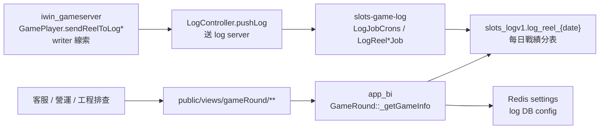
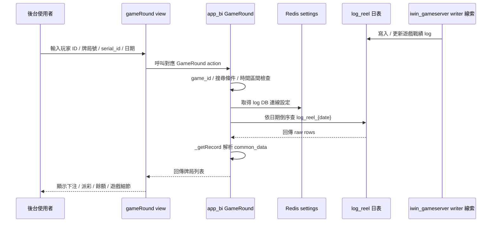

# app_bi - game-round-record-query

更新時間：2026-05-15
完成狀態：Step 5 已完成
文件角色：`flow.md` 主研究報告
掃描等級：Level 2 Flow 深掃
證據層級：app_bi 查詢端為專案存在 / code-backed；iwin_gameserver writer 有 Nick commit 線索；正式履歷不更新

## 0. 閱讀定位

- Flow 中文名稱：遊戲局紀錄查詢 / 玩家申訴排查入口
- Flow slug：`game-round-record-query`
- 完成狀態：Step 5 已完成
- 證據層級：
  - `app_bi` 查詢端：`專案存在 / code-backed`；Nick 個人貢獻 `待確認`
  - `iwin_gameserver` log writer / Antplay-GSC 戰績相關 path：有 `10gt12nc` commit 線索
  - 本 flow 正式履歷結論：不更新 `05-resume-master-zh.md` / `08-application-autobiography-zh.md`
- 本 flow 類型：後台查詢入口 / troubleshooting flow / 遊戲戰績 log 查詢
- 是否只確認到入口：不是只看入口；已確認 `app_bi` 查詢端，並追到 `iwin_gameserver` 的戰績 log 寫入線索，但 writer 尚未做 Level 3 逐檔逐 commit 深掃

## 1. 白話導讀

這條 flow 是「後台查某一局遊戲紀錄」。營運、客服或工程排查玩家申訴時，會用玩家 ID、牌局號、第三方交易單號、日期區間去找該玩家那一局的下注、派彩、餘額、局號、遊戲內容與特殊狀態。

白話講，它不是「遊戲結算本身」，而是：

```text
遊戲服務產生戰績 log
-> log service 寫進每日分表 log_reel_{date}
-> app_bi 後台依玩家 / 局號 / 單號查 log_reel_{date}
-> 把 common_data 轉成每個遊戲看得懂的顯示格式
-> 給客服 / 營運 / 工程排查
```

它的價值在 production troubleshooting：玩家說「這局不對」、「派彩不對」、「回合查不到」時，工程師要知道查詢頁看到的是哪一層資料、是不是 source of truth、可能漏在哪裡。

目前不能把「app_bi 遊戲局查詢頁」寫成 Nick 真實開發成果；`app_bi` path-specific log 未看到 Nick author。雖然 `iwin_gameserver` 的 log writer / Antplay-GSC 戰績相關 path 有 `10gt12nc` commit 線索，但那應該另開後端 flow 深挖，不混在 app_bi 查詢頁裡寫正式履歷。

## 2. 初中階 Code 分層對照

| 分層 | 本 flow 對應 | 狀態 |
| --- | --- | --- |
| Route / API | ThinkPHP 依 controller action 暴露，例如 `GameRound::*GameRound()` | 已確認 |
| Controller | `app_bi/app/admin/controller/GameRound.php` | 已確認 |
| Service / Business | app_bi 主要邏輯在 controller；`GameRoundService.php` 只補部分遊戲解析 helper | 已確認 |
| Model / DAO / Repository | app_bi 用 ThinkPHP DB query builder 直接查 `log_reel_{date}`；後端 writer 有 `iwin_gameserver` mapper 線索 | 已確認 |
| SQL / Table | `slots_logv1.log_reel_{Y_n_j}`、`log_reel_point_{Y_n_j}` 線索 | 已確認 |
| Redis | `Base::slotsLogDBV()` 從 Redis settings 取 log DB 設定 | 已確認 |
| MQ / Log pipeline | `iwin_gameserver` 的 `LogController.pushLog()`、`LogJobCrons`、`LogReel*Job` | 已確認線索 |
| External API | Antplay / PG / GSC 交易單號會進 `serial_id`，但本 flow 不是 provider API 本體 | 已確認線索 |
| Log / Audit | app_bi catch exception 後 `logRecord()`；iwin_gameserver log pipeline 有 batch insert / update log | 已確認 |
| Config | `app/common/GameRound.php` 管 game id 與顯示字典；Redis settings 管 log DB 連線 | 已確認 |

用 Java 後端語言理解：

```text
Admin Controller
-> validate query params
-> choose log DB shard / channel
-> loop daily partition tables
-> query log_reel_{date}
-> parse common_data by game_id
-> return troubleshooting view
```

後端 writer 線索：

```text
GamePlayer.sendReelToLog*
-> LogController.pushLog
-> LogJobCrons / LogReel*Job
-> Mapper.batchInsertLogReel / batchUpdateLogReel
-> log_reel_{date}
```

## 3. 最小架構圖



待確認：

- 是否所有 game / provider 都只走同一條 writer pipeline。
- Antplay / PG / GSC 的 bet / settle / refund 對 `log_reel` 是 insert 還是 update 的完整狀態機。
- 查詢端看到的 `log_reel` 是否足以判斷 wallet truth；目前只能當戰績 log / troubleshooting projection。

## 4. 正常流程圖



## 5. 正常流程逐步說明

1. 後台使用者打開某個遊戲的牌局查詢頁，或 Antplay / PG 類第三方遊戲查詢頁。
2. 使用者至少輸入玩家 ID、牌局號或 `serial_id` 其中之一；全部空白會被拒絕。
3. `GameRound::*GameRound()` 依 action 對應固定 game id；Antplay / PG 類頁面會依平台載入 `third_game` 名稱與 game id。
4. `_getGameInfo()` 組查詢條件：`game_id`、`uid`、`serial_no`、`serial_id`、時間區間與可選的派彩金額下限。
5. 如果有玩家 ID，會檢查登入者 channel cookie 與玩家 channel，並用玩家 channel 決定 log DB index。
6. 如果沒給時間，預設查今天；如果只給開始或結束時間會拒絕。
7. `Base::slotsLogDBV($logIndex)` 從 Redis settings 取 log DB 設定並連線。
8. 程式用日期區間倒序組出 `log_reel_{Y_n_j}`，逐日表查詢、計數與收集資料。
9. 非操作紀錄會先收 raw rows，再用 PHP 做跨表分頁切片。
10. `_getRecord()` 依 `game_id` 解析 `common_data`，把下注、派彩、牌面、免費局、特殊局型等轉成後台顯示欄位。
11. API 回傳列表給後台頁面。

## 6. 業務問題

這條 flow 解決的是「局號與玩家申訴排查」：

- 玩家說某局沒有派彩，要查 `spin_currency`、`win_currency`、`curr_currency`、`last_user_currency`。
- 玩家說回合不存在，要用 `uid`、`serial_no`、`serial_id`、日期區間查是否有戰績。
- 第三方遊戲說某筆交易異常，要用 `serial_id` 對應 provider transaction / bet id。
- 營運想看某局內容，要把 `common_data` 轉成遊戲可讀紀錄。

如果這條 flow 錯了，最直覺的問題不是「交易直接錯」，而是「排查會誤判」：

- 查不到其實存在的局。
- 把跨日 / 跨 channel 的資料漏掉。
- 把下注、派彩、餘額解讀錯。
- 把 report log 誤當完整 wallet truth。

## 7. 系統位置

已確認：

- `app_bi` 是後台查詢端。
- `log_reel_{date}` 是本查詢的主要資料來源。
- `iwin_gameserver` 有 `sendReelToLog* -> LogController -> LogJobCrons -> batchInsertLogReel / batchUpdateLogReel` 寫入線索。
- `game_api` / `third_games_api` 也有 `LogReelYmdDao.xml` 查詢 `log_reel` 的讀取線索。

待確認：

- 每個 provider / game 的完整 writer 狀態機。
- `log_reel` 與 wallet / currency ledger / provider record 的一致性邊界。
- `serial_id` 是否在所有 provider 都唯一、是否可能重複 update。
- Nick 是否實際維護過這條 flow。

## 8. Code 路徑

已確認路徑：

- `/Users/nick/Git/iwin/app_bi/app/admin/controller/GameRound.php`
- `/Users/nick/Git/iwin/app_bi/app/business/GameRoundService.php`
- `/Users/nick/Git/iwin/app_bi/app/common/GameRound.php`
- `/Users/nick/Git/iwin/app_bi/app/common/controller/Base.php`
- `/Users/nick/Git/iwin/app_bi/public/views/gameRound/**`
- `/Users/nick/Git/iwin/iwin_gameserver/slots-games/slots-game-common/src/main/java/com/slots/game/common/data/GamePlayer.java`
- `/Users/nick/Git/iwin/iwin_gameserver/slots-common/src/main/java/com/slots/common/controller/LogController.java`
- `/Users/nick/Git/iwin/iwin_gameserver/slots-game-log/src/main/java/com/slots/game/LogJobCrons.java`
- `/Users/nick/Git/iwin/iwin_gameserver/slots-game-log/src/main/java/com/slots/game/sql/mapper/Mapper.java`
- `/Users/nick/Git/iwin/game_job/src/main/resources/initGameTable/log_reel-day.sql`
- `/Users/nick/Git/iwin/third_games_api/src/main/resources/mapper/logone/LogReelYmdDao.xml`
- `/Users/nick/Git/iwin/game_api/src/main/resources/mapper/logone/LogReelYmdDao.xml`

## 8.1 掃描範圍

已看 repo：

- `/Users/nick/Git/nick/nick-vault`
- `/Users/nick/Git/iwin/app_bi`
- `/Users/nick/Git/iwin/iwin_gameserver`
- `/Users/nick/Git/iwin/game_job`
- `/Users/nick/Git/iwin/game_api`
- `/Users/nick/Git/iwin/third_games_api`

已看分支：

- `app_bi`：本地 `main`，已 fetch；本地 `4a206a2`，`origin/main` `fd9881f`，本地落後 4 commit，未 pull / 未 checkout
- `iwin_gameserver`：`main`，已 fetch；本地與 `origin/main` 同步在 `30a9fcb`
- `game_job`：`main`，已 fetch；本地與 `origin/main` 同步在 `23908f4`
- `game_api`：`main`，已 fetch；本地與 `origin/main` 同步在 `39bb6e3`
- `third_games_api`：`beta`，已 fetch；本地與 `origin/beta` 同步

已看 git log：

- `app_bi`：`GameRound.php` / `GameRoundService.php` / `app/common/GameRound.php` / `public/views/gameRound` path-specific history。
- `iwin_gameserver`：`GamePlayer.java`、`LogReel*Job`、`LogJobCrons` 相關 path-specific history。

未掃 / 待確認：

- 未 checkout 每個近期遠端分支逐一比較。
- 未逐 commit diff 追每筆修改原因。
- 未做 Level 3 逐檔逐行。
- 未確認 Nick 本人 MR / ticket / commit / production issue。
- 未完整追 wallet / currency ledger / provider callback 對帳。

## 8.2 Step 5 履歷判定

結論：本 flow 不更新正式履歷 / 自傳。

判定理由：

1. `app_bi` 查詢端 path-specific log 主要 author 是 `gill` / `arnold`，未看到 Nick / `10gt12nc`。
2. 本地 `app_bi main` fetch 後落後 `origin/main` 4 commit，未 pull；因此不能宣稱已看最新本機 code 工作樹。
3. `iwin_gameserver` 的 log writer、Antplay / GSC 戰績相關 path 有大量 `10gt12nc` commit，代表 Nick evidence 更適合放到 `iwin_gameserver` 的後端 log writer / provider integration flow 裡深挖。
4. 這條 `app_bi game-round-record-query` 的主角是後台 troubleshooting 查詢入口，不是遊戲結算、wallet correctness 或 log pipeline owner。
5. 目前沒有把「玩家申訴排查、遊戲局查詢、log writer 修復」與 Nick production issue / ticket / MR review 做完整對齊。

可保留用途：

- 面試時用作「我如何從後台查詢入口追到後端 log writer，並辨識 troubleshooting log 與交易 truth 邊界」的分析 case。
- 未來做 `iwin_gameserver` 或 Antplay / GSC provider flow 時，作為查詢端 / 下游排查視角。

不可更新：

- 不新增正式履歷 bullet。
- 不改投遞用自傳。
- 不說 Nick 主導 `app_bi` 遊戲局查詢。
- 不說 Nick 負責玩家申訴系統或 wallet correctness。

## 9. Source of Truth 與 Projection

本 flow 要分兩層看：

| 層級 | 說明 | 判定 |
| --- | --- | --- |
| 查詢 source | app_bi 查詢時以 `log_reel_{date}` 為主要來源 | 已確認 |
| 交易 truth | 玩家餘額、下注、派彩、provider result 的最終正確性 | 待確認 |

`log_reel` 對後台查詢來說是主要資料源，但它不等於完整交易 truth。原因：

- `log_reel` 是遊戲戰績 log / projection。
- 第三方遊戲有 bet / settle / refund，可能先 insert 再 update。
- wallet 變動可能還要對照 currency log、provider record、center / game server 狀態。
- app_bi 只讀 log，不負責重算或修復交易。

Senior / Owner 讀這條 flow 的重點是：不要看到後台有一筆 `log_reel` 就直接判定交易正確，要知道它是排查入口之一。

## 10. State / Consistency 分析

已確認狀態：

- app_bi 查詢端是 read-only，不改 `log_reel`。
- `log_reel` 以每日分表保存戰績。
- 一般 iwin 遊戲 writer 線索是 `REEL_NORMAL` batch insert。
- Antplay / GSC 類 writer 線索包含 bet insert 與 settle update。
- `Mapper.batchUpdateLogReel()` 以 `serial_id` 更新下注後的結算資料。

待確認狀態：

- 同一 `serial_id` 是否可能跨 game / channel / date 重複。
- refund log type 是否在目前查詢結果中完整可見。
- app_bi 對 Antplay / PG 的 `game_id` range 與 `third_game` 資料是否完全一致。
- `game_start_time` 與 `time` 差異在跨日查詢時是否會造成漏查。

Consistency 風險：

- Bet insert 成功，但 settle update 失敗時，後台會看到未結算或不完整戰績。
- Writer 寫入 `game_start_time` 所在日表，查詢端也依 `game_start_time` 查；若時間欄位與 table date 不一致，可能漏查。
- 如果只用 `roundid` 或 `serial_id` 不帶玩家 ID，查詢端預設 `logIndex = 1`，可能漏掉其他 channel / log DB。
- `date_format(game_start_time, ...)` 包住欄位可能讓索引使用變差，長區間查詢風險較高。

## 11. Failure Window

| 位置 | 可能失敗 | 影響 | 目前 evidence |
| --- | --- | --- | --- |
| writer -> log service | `pushLog()` 送出後 log server 不可用 | 該局戰績可能延遲或缺失 | `LogController` 有 log server null error |
| log service batch insert | 分日期寫入 `log_reel_{date}` 失敗 | app_bi 查不到該局 | `LogJobCrons` batch insert / update |
| third-party settle update | bet insert 後 settle update 失敗 | 下注有資料，派彩 / common_data 可能不完整 | Antplay / GSC 有 insert / update split |
| app_bi channel index | 沒玩家 ID 時預設 log index | 只用 round id / serial id 可能查錯 DB | `_getGameInfo()` default `logIndex = 1` |
| app_bi date partition | 跨日 / 時區 / table date 不一致 | 漏查或查錯日期表 | 查 `log_reel_{Y_n_j}` + `game_start_time` |
| app_bi query performance | 長區間逐日掃表與 PHP 分頁 | 查詢慢、超時、客服體驗差 | `_getGameInfo()` 每日 loop + `limit(page*limit)` |
| common_data parse | 不同 game schema 變更 | 顯示錯誤或欄位空白 | `_getRecord()` per-game switch 很大 |

## 12. Retry / Compensation / Reconciliation

已確認：

- app_bi 本身沒有 retry / compensation；它只是查詢。
- `iwin_gameserver` log pipeline 有 batch insert / update，但本次未確認失敗重送策略。
- Antplay / GSC settle 用 update by `serial_id`，代表存在「先下注、後結算」的更新模型。

待確認：

- log server 寫入失敗是否有 queue / retry / dead letter。
- batch update 找不到 `serial_id` 時是否有補償。
- `log_reel` 與 wallet / currency log 是否有對帳工具。
- 玩家申訴時是否有標準排查 SOP。

Owner 角度應該追問：

1. 查不到局時，是玩家真的沒玩，還是 log pipeline 延遲 / 分表 / channel 選錯？
2. 查到局但金額看起來錯時，要對哪幾張表？
3. `serial_id` update 失敗時，系統怎麼發現？
4. 後台查詢是否應限制日期區間、強制 player id、或提供跨 channel search？

## 13. Observability / Auditability

已確認：

- app_bi catch throwable 後會 `logRecord(Base::transException($th), 'error')`。
- `iwin_gameserver` 的 GSC / Antplay log job 會記錄 batch insert / update、cmd、單號與 table key。
- `LogController` 在 log server null 時有 error log。

不足 / 待確認：

- app_bi 查詢是否有操作 audit log，未確認。
- 查詢慢 query / query range 是否有監控，未確認。
- log writer 失敗是否有告警，未確認。
- `serial_id` update miss 是否有告警，未確認。

## 14. Senior / Owner 設計取捨

### 14.1 每日分表 vs 單一大表

每日分表讓寫入與清理比較可控，也方便依日期查詢；但後台跨日查詢要自己 loop 多張表，分頁與排序就容易變複雜。

本 flow 的查詢端目前是「逐日查、收集、再切片」，這能快速做出功能，但長區間 / 高頁數查詢會放大成本。

### 14.2 `serial_id` 作第三方交易線索

對 Antplay / GSC / PG 類 provider，`serial_id` 是很重要的排查 key。好處是可以對 provider transaction；風險是如果它不全域唯一，update by `serial_id` 就需要更多限定條件，例如 game id / date / channel。

目前 `batchUpdateLogReel()` evidence 只看到 `WHERE serial_id = ...`，沒有在 update 條件裡看到 game id / channel。這是需要 Step 4/後續追問的重點，不直接判定 bug。

### 14.3 後台查詢不是交易修復

這條 flow 很容易被誤解成「可以證明交易對錯」。比較保守的理解是：它提供戰績 log 視角，幫助定位玩家申訴；真正交易正確性仍要對照 wallet / currency / provider / settlement flow。

## 15. 面試 / 履歷邊界摘要

可以說：

- 我深讀過遊戲局紀錄查詢 flow，知道後台如何從玩家 ID / 局號 / serial_id 查每日戰績分表。
- 我能說明 app_bi 查詢端與 iwin_gameserver log writer 的關聯，並指出它只是 troubleshooting projection，不是完整交易 source of truth。
- 我能分析這類查詢的 failure window：分表、跨日、channel shard、bet/settle update、common_data schema、查詢效能。

不能說：

- 我主導開發遊戲局查詢。
- 我負責遊戲結算或 wallet correctness。
- 我是 log pipeline owner。
- 我改善查詢效能或修過 production issue。

Step 5 已判定：不更新正式履歷與自傳。`iwin_gameserver` 的 Nick commit 線索另開後端 flow 深挖後，才可評估是否轉成正式履歷 claim。

Step 4 已整理完整面試稿：

- `career-interview.md`
- `materials/interview.md`

## 16. 下一步建議

這條 flow 已完成 Step 5。下一步應回到更高價值的後端 source of truth，而不是繼續在 `app_bi` 查詢頁硬挖。

下一步只推薦一件事：

```text
payment Step 1
```

原因：

- `app_bi` 已完成四條主要分析 flow 的 Step 5 判定。
- `payment-order-status-repair` 在 app_bi 只看到人工修正入口，真正 money correctness 要回到 `/Users/nick/Git/iwin/payment`。
- 下一步做 `payment Step 1` 會先找金流 repo 的 candidate flows，不會直接把 app_bi 人工入口寫成完整 payment owner。
