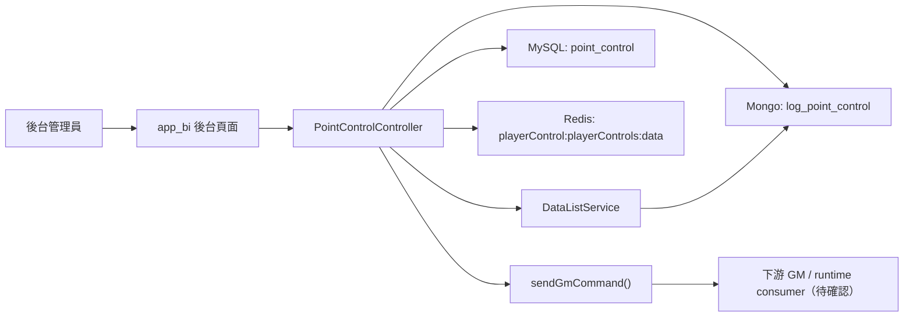
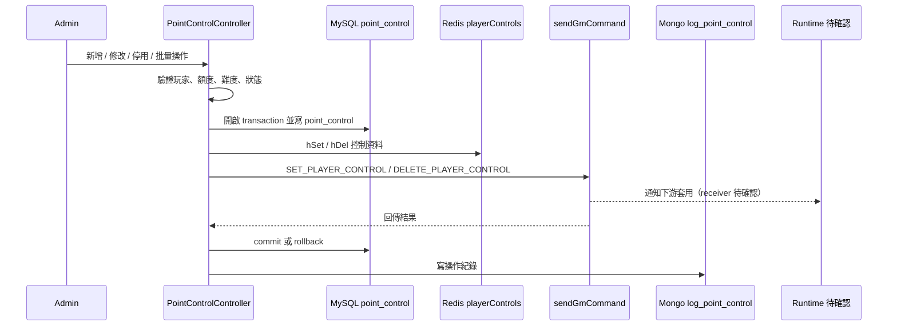

# app_bi - point-control-admin-operation

更新時間：2026-05-14
完成狀態：Step 5 已完成
文件角色：`flow.md` 主研究報告
掃描等級：Level 2 Flow 深掃
證據層級：專案存在 / code-backed；Nick 貢獻待確認
格式狀態：已遷移為新版結構；`flow.md` 為唯一主研究報告

## 0. 閱讀定位

- Flow 中文名稱：單點控制 / 營運控制操作
- Flow slug：`point-control-admin-operation`
- 完成狀態：Step 5 已完成
- 證據層級：`專案存在 / code-backed`；Nick 個人貢獻 `待確認`
- 本 flow 類型：後台 control plane / 營運操作入口
- 是否只確認到入口：不是只有 UI；已確認 `app_bi` 寫 MySQL、Redis、Mongo 並送 GM command，但下游 GM receiver / runtime consumer 未掃

## 1. 白話導讀

這條 flow 是後台給營運或管理員使用的「玩家單點控制」功能。白話說，就是把某些玩家放進控制名單，設定控制類型、額度、難度或狀態，讓後端 runtime 之後能依這份名單做對應控制。

它不只是後台新增一筆資料。一次操作至少會碰到四件事：

1. 後台把控制設定寫進 MySQL。
2. 同步一份 runtime 可能會讀的 Redis projection。
3. 透過 `sendGmCommand()` 通知下游服務套用或取消控制。
4. 寫 Mongo 操作紀錄，讓之後能查誰操作過。

最直覺的風險是：MySQL 成功、Redis 成功、GM command 成功、Mongo log 成功，這幾件事不是同一個 transaction。只要其中一段失敗，就可能出現「後台看起來成功，但 runtime 沒套用」或「DB rollback 了，但 Redis 已經被改過」這類中間狀態。

## 2. 初中階 Code 分層對照

| 分層 | 本 flow 對應 | 狀態 |
| --- | --- | --- |
| Route / API | `app/route.php` 的 `point-control` routes | 已確認 |
| Controller | `app/admin/controller/PointControlController.php` | 已確認 |
| Service / Business | `app/business/DataListService.php`，負責批量校驗、匯出、Mongo log 組裝 | 已確認 |
| Model / DAO | `PointControl`、`PointControlSwitch`、`PointControlAllowlist`、`PointControlAllowlistLog` | 已確認 |
| SQL / Table | `point_control` 為主；周邊有 switch / allowlist tables | 已確認 |
| Redis | `playerControl:playerControls:data`、`settings.center_http` | 已確認 |
| MQ / Kafka / 下游通知 | 無 MQ evidence；用 `sendGmCommand()` HTTP 通知下游 | 已確認 sender，receiver 待確認 |
| External API | `sendGmCommand()` 送 GM command | 已確認 sender |
| Log / Audit | Mongo `log_point_control`、`opLog` | 已確認 |
| Config | Redis DB / channel / center 相關設定 | 部分確認 |

如果用 Java 後端的語言理解，可以把它想成：

```text
Controller 接後台請求
-> Service 做校驗與批量處理
-> Repository / Model 寫 MySQL
-> RedisTemplate 更新 projection
-> HTTP client 通知下游
-> Audit repository 寫操作紀錄
```

## 3. 最小架構圖



## 4. 正常流程圖



## 5. 正常流程逐步說明

1. 管理員從後台進入 point-control 頁面。
2. 後台打到 `PointControlController` 對應 action。
3. Controller 驗證玩家是否存在、額度與難度是否合法。
4. 單筆操作直接處理；批量操作先交給 `DataListService` 做 xlsx 檢查與資料整理。
5. 開啟 MySQL transaction，寫入或更新 `point_control`。
6. 同步 Redis `playerControl:playerControls:data`。
7. 組 `SET_PLAYER_CONTROL` 或 `DELETE_PLAYER_CONTROL` GM command。
8. 呼叫 `sendGmCommand()` 通知下游。
9. 單筆流程 GM 成功才 commit DB；失敗則 rollback DB。
10. commit 後寫 Mongo `log_point_control` 與部分 `opLog`。
11. 列表查詢時會再讀 Redis remain，並可能反寫 MySQL status。

## 本次重整結論

`point-control-admin-operation` 是 `app_bi` 後台對玩家單點控制名單做新增、修改、停用、批量操作、查詢與操作紀錄的 control plane flow。

它不是單純 CRUD，因為一次後台操作會跨到：

```text
後台 point-control route
-> PointControlController
-> MySQL point_control
-> Redis playerControl:playerControls:data
-> sendGmCommand() 通知下游
-> Mongo log_point_control 操作紀錄
```

這條 flow 的 Senior / Owner 價值在於：

- MySQL transaction 管不到 Redis / HTTP GM command / Mongo audit log。
- Redis 寫入和 GM command 成功之間可能出現中間狀態。
- 批量操作會依 center 分組送 GM command，容易有 partial success。
- 查詢列表會依 Redis remain 反寫 DB status，狀態責任分散。
- 權限邊界不能只看前端 menu；`PointControlController::_initialize()` 沒呼叫 `parent::_initialize()`，需要確認是否有其他保護。

但邊界要講清楚：本次只確認到 `app_bi` 後台操作端、Redis projection、GM command sender 與 Mongo 操作紀錄。尚未掃下游 GM receiver / runtime Redis consumer，也沒有 Nick 本人 MR / ticket / commit / production issue evidence。因此不能寫成 Nick 主導、完整 runtime owner，或已完成一致性方案。

## 本次自動重讀與掃描範圍

已重讀 KB：

- `AGENTS.md`
- `senior-owner-playbook/00-operating-rules.md`
- `senior-owner-playbook/09-ai-prompt-manual.md`
- `senior-owner-playbook/03-flow-learning-package-template.md`

已重讀 vault：

- `projects/iwin/app_bi/README.md`
- `projects/iwin/app_bi/step1-candidate-flows.md`
- `projects/iwin/app_bi/step2-flow-comparison.md`
- 本 flow 既有 `flow.md`
- 本 flow `career-interview.md`
- 本 flow `materials/evidence.md`
- 本 flow `materials/decision-notes.md`
- 本 flow `materials/interview.md`
- 本 flow `materials/claim-boundary.md`

已看 source repo：

- `/Users/nick/Git/iwin/app_bi`
- 目前分支：`main`
- 遠端分支清單：已列出，但未 checkout 逐一比對。
- path-specific log：已看 `PointControlController.php`、`DataListService.php`、`app/common.php`、`app/route.php`、point-control models、`public/admin/gm/dandian/**`、`db/migrations/menuAdd0800.sql`。

已看重要 history：

- `e83c729 feat(#first commit): first commit`：point-control 主要 code 來自初始 commit，無法拆出 Nick 個人貢獻。
- `0ad2f51 控制管理汇出功能 新增判断找不到log_user就跳过`：匯出補玩家資料防呆，但後續被 revert。
- `0b57858 Revert "控制管理汇出功能 新增判断找不到log_user就跳过"`：回復上述防呆。
- `98e89fb feat(#RD-146): app bi新增antplay`：只影響 `sendGmCommand()` 的 channel / agentId 相關通用邏輯，不能直接說是 point-control 實作。

未掃 / 待確認：

- 未 checkout 每個遠端分支逐一比對。
- 未逐檔逐行掃完整 `app_bi`。
- 未掃下游 GM receiver。
- 未掃 runtime Redis consumer。
- 未掃 `game_api`、`game_job`、`iwin_gameserver`。
- 未確認 Nick 本人 MR / ticket / commit / production issue。
- 未做 Level 3 每個相關 commit diff 的完整時間線。

## 文件狀態判斷

| 文件 | 狀態 | 判斷 |
| --- | --- | --- |
| `flow.md` | Step 5 已完成 | 本文件是主研究報告，不代表停在 Step 3 |
| `career-interview.md` | 已建立 | Nick 看面試 / 履歷素材時讀這份 |
| `materials/evidence.md` | 已遷移 | 掃描範圍、commit / path evidence 與已確認 / 待確認 |
| `materials/decision-notes.md` | 已遷移 | 技術硬底子與 owner decision 附錄 |
| `materials/interview.md` | 已遷移 | 詳細面試稿附錄 |
| `materials/claim-boundary.md` | 已遷移 | Step 5 履歷 / 自傳邊界，已判定不更新正式履歷 / 自傳 |

## 系統位置

已確認：

- 產品：iwin
- 專案：`app_bi`
- 類型：PHP / ThinkPHP 後台與 BI / control plane
- 主 route：`app/route.php` 的 `point-control` 系列 route
- 主 controller：`app/admin/controller/PointControlController.php`
- 批量校驗 / 匯出 / Mongo log 組裝：`app/business/DataListService.php`
- GM command sender：`app/common.php` 的 `sendGmCommand()`
- Redis key：`playerControl:playerControls:data`
- Mongo collection：`log_point_control`

推測：

- `app_bi` 是控制面，runtime 生效邏輯應在下游遊戲 / GM / Java service。
- Redis 可能是 runtime 控制狀態 projection，GM command 可能是通知 runtime reload / apply。

待確認：

- GM command handler 所在 repo。
- runtime 是否直接讀 Redis。
- 下游是否有自己的狀態機、ack、retry、idempotency。
- Nick 是否實際維護過此 flow。

## Code 路徑

已確認主線：

- `/Users/nick/Git/iwin/app_bi/app/route.php`
- `/Users/nick/Git/iwin/app_bi/app/admin/controller/PointControlController.php`
- `/Users/nick/Git/iwin/app_bi/app/business/DataListService.php`
- `/Users/nick/Git/iwin/app_bi/app/common.php`

相關 model / UI / migration：

- `/Users/nick/Git/iwin/app_bi/app/admin/model/PointControl.php`
- `/Users/nick/Git/iwin/app_bi/app/admin/model/PointControlSwitch.php`
- `/Users/nick/Git/iwin/app_bi/app/admin/model/PointControlAllowlist.php`
- `/Users/nick/Git/iwin/app_bi/app/admin/model/PointControlAllowlistLog.php`
- `/Users/nick/Git/iwin/app_bi/public/admin/gm/dandian/**`
- `/Users/nick/Git/iwin/app_bi/db/migrations/menuAdd0800.sql`

本次主線不展開：

- `PointControlAllowlistController`
- `PointControlSwitchController`
- login IP 查詢相關 method

原因：它們是 point-control 周邊功能，不是本次「控制名單新增 / 修改 / 停用 / 批量操作」主 flow。

## 正常 Flow：列表查詢

已確認：

1. Admin 呼叫 `GET point-control`。
2. `PointControlController::index()` 取得 channel list。
3. 逐 channel select Redis DB。
4. 讀 Redis hash `playerControl:playerControls:data`。
5. 若某玩家 `controlLimitRemain <= 0`，把 MySQL `point_control.status` 更新為 `2`。
6. 依查詢條件查 MySQL `point_control`。
7. 到 `log_user` 補玩家暱稱。
8. 再讀 Redis 補 `remaining_quota`。
9. 回傳列表。

Owner 風險：

- 查詢 API 有寫入副作用。
- status completion 不是由明確 completion event 觸發，而是查詢時從 Redis remain 反推。
- 如果 Redis remain 不準，DB status 也可能被更新成錯誤狀態。

## 正常 Flow：單筆新增 / 修改

已確認：

1. Admin 呼叫 `POST point-control` 或 `POST point-control/:pointControlId`。
2. `storeOrUpdate()` 驗證玩家存在。
3. 由 `player_id` 推導 channel / center。
4. 讀 admin cookie：`mid`、`uname` / `nickname`。
5. 讀控制參數：`type`、`coin_type`、`quota`、`difficulty`。
6. 檢查 quota 不小於 0 且不超過上限。
7. 若是新增且玩家已存在 `point_control`，直接回傳已被控制。
8. 開啟 MySQL transaction。
9. 新增或更新 `point_control`，狀態設為 `1`。
10. 寫 Redis hash `playerControl:playerControls:data`。
11. 組 `SET_PLAYER_CONTROL` GM command。
12. 呼叫 `sendGmCommand($gmData, $center)`。
13. GM 成功後 commit DB。
14. commit 後寫 Mongo `log_point_control`。
15. GM 失敗時 rollback DB。

已確認風險：

- Redis hSet 發生在 GM command 前。
- GM 失敗時只看到 DB rollback，未看到 Redis rollback。
- Mongo log 在 DB commit 後才寫，log 失敗可能造成 audit 不完整。

## 正常 Flow：狀態切換

已確認：

1. Admin 呼叫 `POST point-control/status`。
2. `updateStatus()` 驗證玩家存在。
3. 開啟 MySQL transaction。
4. 更新 `point_control.status`。
5. 若 status 為 `0`，Redis hDel，並送 `DELETE_PLAYER_CONTROL`。
6. 若 status 非 `0`，Redis hSet，並送 `SET_PLAYER_CONTROL`。
7. GM 成功後 commit DB。
8. commit 後寫 Mongo `log_point_control`。
9. GM 失敗時 rollback DB。

推測：

- status `0` = 控制取消。
- status `1` = 控制中。
- status `2` = 控制完成。

待確認：

- status `2` 是否只由列表查詢依 Redis remain 補同步。
- 下游是否也會回報控制完成。

## 正常 Flow：批量新增

已確認：

1. Admin 上傳 xlsx。
2. 檢查檔案大小與副檔名。
3. `DataListService::checkBatchAddControl()` 校驗資料。
4. 批量最多 20 筆。
5. 檢查玩家存在、欄位格式、額度、難度、狀態與重複玩家。
6. `insertAllPointData()` 組 MySQL insert、Mongo log 與 center group。
7. 開啟 MySQL transaction。
8. `point_control` 批量 insert。
9. 寫 Redis hash。
10. 依 center 分組送 `SET_PLAYER_CONTROL` GM command。
11. 第一次 GM 失敗會再送一次。
12. 寫 Mongo `log_point_control`。
13. 寫 opLog。
14. commit DB。

已確認風險：

- 第二次 GM command 結果沒有被拿來中止流程。
- center 之間可能 partial success。
- Redis 與 Mongo 可能已寫，但下游未套用。

## 正常 Flow：批量修改

已確認：

1. Admin 上傳 xlsx。
2. 檢查檔案大小與副檔名。
3. `DataListService::checkBatchEditControl()` 校驗資料。
4. 若玩家不存在於 `point_control`，會回錯。
5. 如果欄位完全沒變，會從更新資料移除。
6. 開啟 MySQL transaction。
7. `DataListService::batchUpdatePoint()` 逐筆 update MySQL。
8. 依 status hDel / hSet Redis。
9. 依 center 分組送 `DELETE_PLAYER_CONTROL` / `SET_PLAYER_CONTROL`。
10. 第一次 GM 失敗會再送一次。
11. 寫 Mongo `log_point_control`。
12. 寫 opLog。
13. commit DB。

已確認風險：

- 和批量新增一樣，第二次 GM 失敗沒有明確 partial failure state。
- 取消與啟用分兩批 command，ordering 與 partial success 都需要確認。

## 正常 Flow：操作紀錄 / 匯出

已確認：

- `operationLogs()` 查 Mongo `log_point_control`。
- `operationLogs()` 中 `quota` 被連續指定兩次，第二次使用 `remaining_quota`，可能覆蓋原 quota 欄位。
- `pointControlDown()` 透過 `DataListService::exportPointData()` 匯出。
- `exportPointData()` 會查 `point_control`、讀 Redis remain、補 `log_user` 暱稱。
- commit history 顯示曾經新增「找不到 log_user 就跳過」防呆，後來被 revert。

待確認：

- `operationLogs()` 欄位覆蓋是否實際造成 UI 顯示問題。
- 匯出遇到玩家暱稱缺失時，目前 production 行為是否會 notice / error。

## 資料與狀態

### MySQL

已確認：

- `point_control`
- `point_control_switch`
- `point_control_allowlist`
- `point_control_allowlist_logs`

本次主 flow 主要使用：

- `point_control`

### Redis

已確認：

- `playerControl:playerControls:data`
- `settings.center_http`

相關但本次不展開：

- `playerControl:freeRechargeBtns:data:`
- `playerControl:whiteListPlayers:data`

### Mongo

已確認：

- `log_point_control`

### 外部 side effect

已確認：

- `sendGmCommand()` 透過 HTTP 通知下游。
- command 包含 `SET_PLAYER_CONTROL` / `DELETE_PLAYER_CONTROL`。

未確認：

- 下游 handler。
- ack 語意。
- request id / operation id。
- command 是否 idempotent。

## State Transition

這條 flow 不是單一 DB state，而是多層狀態：

```text
後台請求已送出
-> MySQL point_control 已更新
-> Redis playerControls 已更新
-> GM command 已送出
-> 下游 runtime 已套用
-> Mongo audit log 已寫入
```

已確認：

- MySQL transaction 只保護 MySQL。
- Redis、HTTP GM command、Mongo log 都在 transaction 邊界外。
- 單筆 GM command 成功才 commit DB。
- 批量 GM command 第二次失敗沒有明確中止邏輯。

推測：

- 下游 runtime 可能收到 GM command 後讀 Redis。
- Redis 可能是 runtime 生效資料，而 MySQL 是後台管理資料。

待確認：

- runtime source of truth。
- 下游套用後是否有 ack / applied state。
- 下游重啟後從 Redis、DB 或自身 cache 還原。

## Failure Window

### 1. Redis 成功，GM command 失敗

已確認：

- 單筆流程中 Redis hSet / hDel 在 GM command 前。
- GM command 回 false 時 DB rollback。
- 未看到 Redis rollback。

風險：

- DB 未 commit，但 Redis 已變更。
- 如果 runtime 直接讀 Redis，可能短暫或持續生效髒狀態。

### 2. DB commit 成功，Mongo log 失敗

已確認：

- 單筆流程 DB commit 後才寫 Mongo log。
- Mongo log 不在 MySQL transaction 內。

風險：

- 後台操作成功，但 audit log 不完整。

### 3. 批量 GM command partial success

已確認：

- 批量新增 / 修改會依 center 分組送 GM command。
- 第一次失敗會重送一次。
- 未看到第二次失敗後中止、rollback 或標記 partial failure。

風險：

- 部分 center 已套用，部分 center 未套用。
- DB / Redis / Mongo 仍可能 commit。

### 4. 查詢同步 status=2

已確認：

- `index()` 讀 Redis `controlLimitRemain <= 0` 後更新 DB status=2。

風險：

- 查詢造成寫入副作用。
- completion state 責任分散。

### 5. 權限邊界不明

已確認：

- `Base::_initialize()` 有權限檢查邏輯。
- `PointControlController::_initialize()` 中 `parent::_initialize()` 被註解。

待確認：

- `point-control` 是否由其他入口、middleware 或 session guard 保護。
- 批量 / 狀態切換是否一定有後端權限 enforcement。

### 6. 操作紀錄欄位覆蓋

已確認：

- `operationLogs()` 中 `quota` 被指定為 `quota` 後，又被 `remaining_quota` 覆蓋。

風險：

- UI 可能顯示錯誤欄位，影響營運追查。

待確認：

- 前端是否實際用 `quota` / `remaining_quota` 分欄顯示。

## Owner Decision

如果我是 owner，本 flow 會先做小步收斂，而不是直接大重構：

1. 先定位 GM command receiver 與 runtime Redis consumer。
   - 原因：目前只看到 sender，不能判斷 Redis / GM 的契約。
   - 驗證：掃 `game_api`、`game_job`、`iwin_gameserver` 是否有 `SET_PLAYER_CONTROL` / `DELETE_PLAYER_CONTROL` / `playerControl:playerControls:data`。

2. 補 GM command 結果紀錄。
   - 原因：批量 partial success 是最大風險。
   - 驗證：每次 command 記錄 operation id、center、cmd、player count、第一次 / 第二次結果。

3. 補 Redis / DB reconcile。
   - 原因：Redis 不在 MySQL transaction 裡。
   - 驗證：掃出 DB active 但 Redis 缺失、DB inactive 但 Redis 還存在、Redis remain 已 0 但 DB 未完成。

4. 補批量操作 partial failure state。
   - 原因：多 center 操作不能只回單一成功。
   - 驗證：失敗 center 可查、可重送、可人工處理。

5. 確認權限與 audit 邊界。
   - 原因：這是高風險後台操作。
   - 驗證：確認後端 action 是否一定經過 permission check，Mongo / opLog 是否足夠追查。

暫時不做：

- 不直接說要改 event-driven。
- 不直接導入 distributed transaction。
- 不在未確認下游前改 Redis / GM command 契約。
- 不把本 flow 寫成履歷成果。

## 面試與履歷邊界

目前可以作為面試素材的基礎：

- 我如何從後台 route 追到 MySQL / Redis / GM command / Mongo log。
- 我如何辨識 DB transaction 之外的 side effect。
- 我如何看批量操作 partial success。
- 我如何把後台 control plane 降級為「入口 evidence」，不硬包裝成 runtime owner。

目前不可寫進履歷：

- 主導單點控制系統設計。
- 設計 runtime 控制架構。
- 負責完整 DB / Redis / GM command 一致性方案。
- 修復 production incident。
- 改善效能或事故率。

證據層級：

- 本 flow 分析：`分析素材 / learning-only`
- code 功能存在：`專案存在 / code-backed`
- Nick 個人貢獻：`待確認`

## Step 5 結論與下一步

只推薦一件事：

```text
app_bi game-round-record-query Step 4
```

原因：

- 本 flow 已完成 Step 1-5。
- Step 5 判定不更新正式履歷 / 自傳。
- `admin-config-redis-sync` 也已完成 Step 5。
- `daily-game-record-summary` Step 5 已完成，且不更新正式履歷 / 自傳。
- 依 KB 回到同 project candidate ranking，下一步做 `game-round-record-query Step 4`。
- 若本次有改檔，完成自查後 commit；若需要 push，直接觸發 `git push` approval 視窗。
