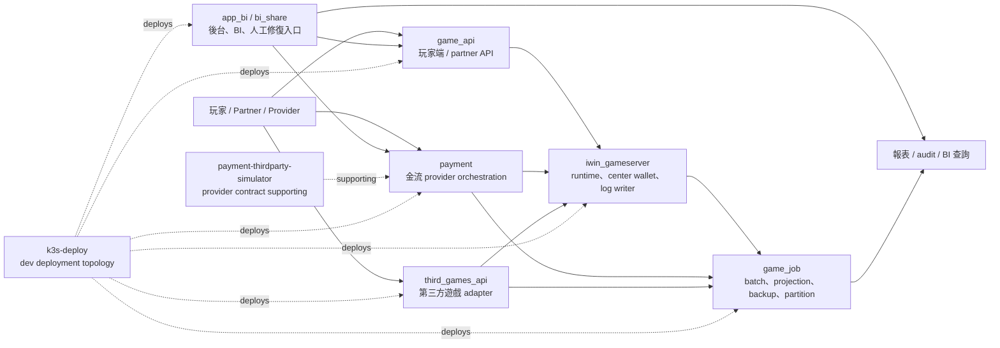
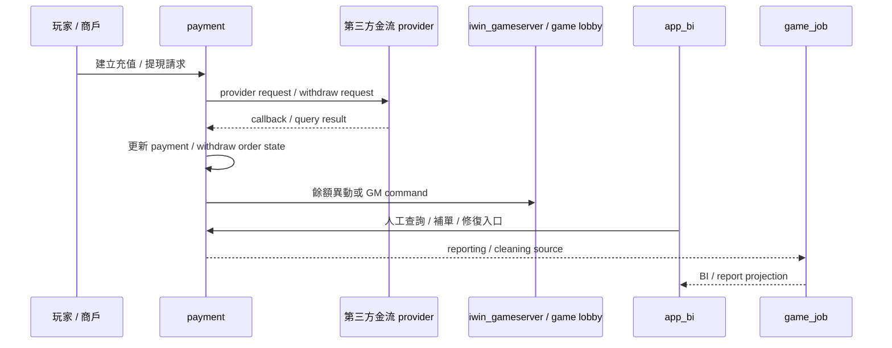
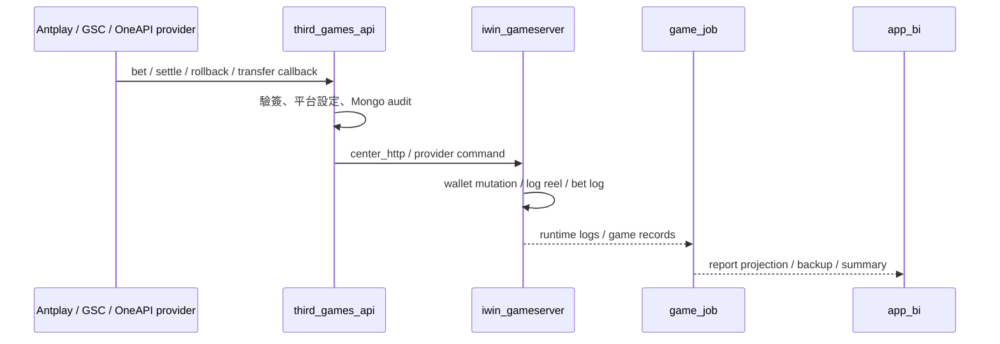
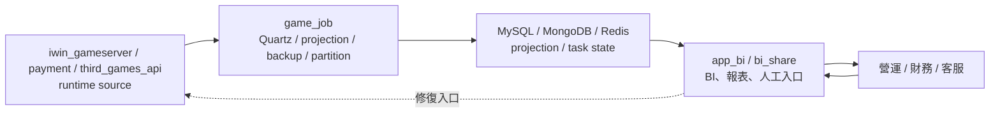

# iwin system map v1

更新日期：2026-05-28

本檔是 iwin domain-level 大地圖，用來把已完成的 project-level claims、代表 flows 與跨 repo 協作關係收成一張可讀架構圖。它不是新的 Flow Step，也不是全量 code audit；目前目的只是補足架構視角，讓 Nick 面試時能說清楚「各子系統怎麼協作」與「哪些 claim 可以講、哪些不能誇大」。

## 閱讀定位

| 項目 | 結論 |
| --- | --- |
| 掃描深度 | Domain map Level 1.5-2：重讀 KB、iwin project README / Step / consolidation / flow inventory，並檢查來源 repo 本地 branch 狀態 |
| 證據來源 | 既有 `projects/iwin/**` flow / contribution consolidation、2026-05-26 iwin re-audit、來源 repo 本地 refs |
| 本輪未做 | 未重新逐檔逐行掃所有 source code；未重新 fetch 公司 repo remote refs；未改公司 repo |
| 用途 | 架構視角、面試系統圖、claim boundary 對齊 |
| 非用途 | 不代表全 iwin 全量掌握、不新增履歷 claim、不取代單條 flow 深掃 |

本輪來源 repo 本地狀態摘要：

| Repo | 本地狀態 |
| --- | --- |
| `payment` | `main...origin/main`，有既有 `.DS_Store` untracked |
| `game_api` | `main...origin/main` |
| `game_job` | `main...origin/main` |
| `iwin_gameserver` | `main...origin/main` |
| `third_games_api` | `beta...origin/beta` |
| `app_bi` | `main...origin/main [behind 4]` |
| `k3s-deploy` | `main...origin/main [behind 37]`，有既有 `.idea/` untracked |
| `bi_share` | `main...origin/main` |
| `iwin-workspace` | `arnold...origin/arnold [behind 1]` |
| `payment-thirdparty-simulator` | `feature/goldenpay-dev...origin/feature/goldenpay-dev` |

以上只作 map 校準。若未來要把某條新 flow 升級成履歷 claim，仍要回到該 repo 做對應 Step / flow 深掃與 evidence。

## 一句話總覽

iwin 的核心後端可以粗分成四層：`game_api` 負責玩家 / partner API orchestration，`payment` 負責第三方金流 provider 與 payment / withdraw order 狀態，`third_games_api` 負責第三方遊戲 provider adapter，`iwin_gameserver` 負責遊戲 runtime / center wallet / log writer；`game_job` 把 runtime 與 payment 資料投影成報表 / BI，`app_bi` 與 `bi_share` 是後台 / BI / control plane 入口，`k3s-deploy` 是 dev-k3s 部署拓撲與 rollout 參考。

## 最小架構圖

## 子系統定位

| Project | 系統責任 | 已完成代表素材 | Career claim 狀態 |
| --- | --- | --- | --- |
| `payment` | 金流 provider request / callback / query / withdraw、payment / withdraw order 狀態、MQ / 人工修復邊界 | Top 5 flows + contribution consolidation | 可保守寫第三方金流 provider 對接與維護；不可寫完整金流 / wallet / ledger owner |
| `game_api` | 玩家端 / partner API orchestration、coupon、partner 上下分、代理佣金入口 | 3 flows + contribution consolidation | 只採 coupon 保守 claim；partner / agent bonus 是 code-backed 面試素材 |
| `game_job` | Quartz batch、BI projection、第三方紀錄備份、資料清洗、分表 | Top 5 flows + contribution consolidation | daily summary 與 GSC backup 可保守寫；其他作面試素材 |
| `iwin_gameserver` | 遊戲 runtime、center_http、錢包 mutation hook、投注 / 派彩 / 退款、log writer | 4 flows + contribution consolidation | 可保守寫第三方 provider 投派整合與 gameserver 錢包 / 投注流水串接 |
| `third_games_api` | 第三方遊戲 provider callback / seamless wallet adapter、Mongo audit、呼叫 gameserver | 4 flows + rolling consolidation | 不新增 standalone 履歷主成果；作 third-party adapter 面試素材 |
| `app_bi` | PHP 後台 / BI / control plane、人工修復入口、報表查詢 | 4 flows + negative consolidation | 不放正式履歷主成果；作後台入口與追 flow 素材 |
| `bi_share` | Legacy 分享 / 推廣 / 佣金 / BI 報表 | contribution consolidation only | 不放正式履歷主成果；若提到只說分析過 legacy BI / 佣金 |
| `k3s-deploy` | dev-k3s topology、Kustomize、gameserver phased rollout、observability reference | 1 deploy flow | interview-only，不寫 K3s owner |
| `iwin-workspace` | workspace / KB / docs / environment index | contribution consolidation only | supporting evidence，不放 standalone 主成果 |
| `payment-thirdparty-simulator` | provider contract / callback 測試支撐 | source repo re-audit supporting | payment supporting evidence，不升級主履歷 flow |

## 三條主線

### 1. 金流 / payment provider 主線

已可講：provider request / callback / query / withdraw、order state、人工修復、config selection、MQ / retry / compensation 邊界。

不可誇大：完整錢包、完整 ledger、完整 reconciliation、所有 provider owner。

### 2. 遊戲 / third-party provider 主線

已可講：third-party adapter、seamless wallet callback、gameserver command boundary、Mongo audit vs wallet source of truth、log reel / projection。

不可誇大：Nick 主導 `third_games_api`、完整第三方遊戲錢包 owner、完整 provider integration owner。

### 3. 報表 / batch / control plane 主線

已可講：daily summary、third-party record backup、coin / payment projection、partition rollover、後台如何只是入口而非 source of truth。

不可誇大：完整 BI pipeline owner、完整 schema migration owner、完整 app_bi owner。

## Senior / Owner 觀察點

| 主題 | iwin 代表位置 | 面試講法 |
| --- | --- | --- |
| Source of truth | payment order、gameserver wallet / log、game_job projection | 先分清 runtime state 與 reporting projection，不把後台查詢當帳本 |
| Idempotency | provider callback、partner 上下分、third-party rollback | 要追 provider order id、billNo、Mongo transaction、gameserver command 是否可重放 |
| Failure window | provider callback 成功但下游失敗、gameserver 成功但 Mongo audit 失敗、game_job delete-insert 重跑 | 不假設全成功；要講補償、人工修復、對帳與 replay |
| Observability | callback log、Mongo third log、log reel、game_job task state、k3s logs | 能說明哪裡可以查、哪裡只是輔助 evidence |
| Claim boundary | payment / game_job / gameserver 有部分 direct evidence；app_bi / third_games_api 多為 code-backed | 履歷只寫可證實參與，不把分析素材寫成主導 |

## 完整度判斷

| 層級 | 狀態 | 結論 |
| --- | --- | --- |
| Flow-level | 主要 iwin production flows 已有 26 條 `flow.md` | 足夠支撐 8-10 條可切換面試 case |
| Project-level | `payment`、`game_api`、`game_job`、`iwin_gameserver` 已有可放履歷或 supporting claim；`app_bi`、`third_games_api`、`bi_share`、`k3s-deploy` 邊界清楚 | 足夠支撐通用 Senior Java Backend / Platform Backend 投遞包 |
| Domain-level | 本檔與 `integration-map.md` 已補 v1 | 架構視角已補齊，但不是全量公司系統 owner |

## 後續維護規則

- 若新做 iwin flow Step 5，先更新該 flow / project README，再判斷是否需要回填本檔。
- 若新做 project contribution consolidation，必須回填本檔的 claim boundary 與 `integration-map.md`。
- 若只是練口說或 JD 客製，不一定改本檔。
- 若要把本檔升級成 Level 3 架構審計，需另行逐 repo fetch / diff / module map；目前 v1 不宣稱全量最新 source code。
