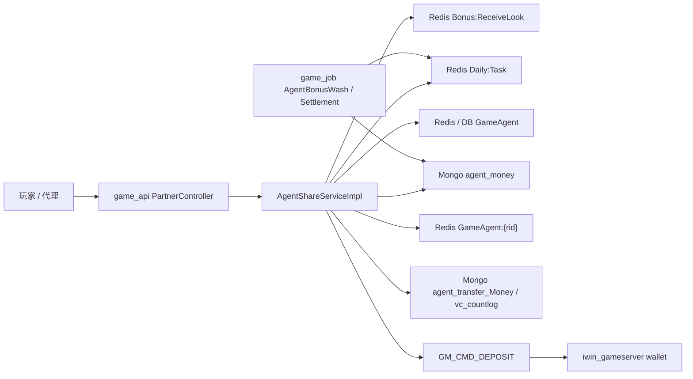
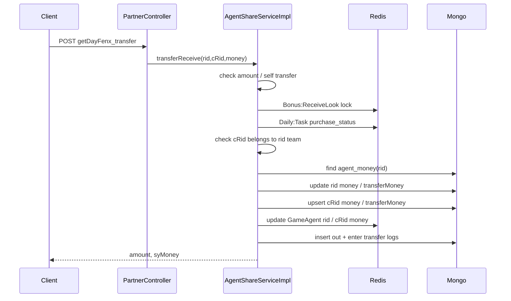
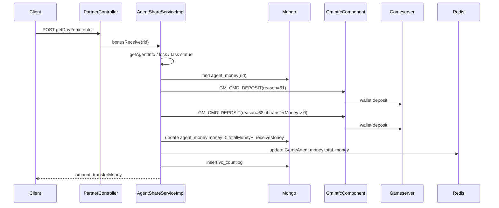

# agent-bonus-receive-transfer

中文名稱：代理佣金領取 / 轉帳
更新時間：2026-05-19
Step：4
掃描等級：Level 2 Flow 深掃
證據層級：專案存在 / code-backed；Nick 貢獻待確認

## 閱讀定位

這條 flow 是 `game_api` 的代理佣金操作入口：玩家成為代理後，可以查可領佣金、把佣金轉給下級，或把可領佣金領到遊戲錢包。

它不是單純查詢頁。它跨了 `game_api` API、Mongo `agent_money`、Mongo 轉帳 / 領取紀錄、Redis `GameAgent:{rid}` projection、`game_job` 佣金計算 / 結算 job，以及 gameserver GM 上分。Step 4 已把 code path、資料狀態與 failure window 收斂成面試案例；目前不更新正式履歷 / 自傳。

## 已確認與待確認

已確認：

- `PartnerController` 提供 `getDayFenx_transfer` 佣金轉帳與 `getDayFenx_enter` 佣金領取。
- `AgentShareServiceImpl#transferReceive` 會檢查金額、不能轉給自己、防短時間重複提交、收益計算 job 狀態與代理上下級關係，然後更新 Mongo / Redis 並插入兩筆轉帳紀錄。
- `AgentShareServiceImpl#bonusReceive` 會查代理與可領佣金，必要時送一到兩次 `GM_CMD_DEPOSIT`，再清 Mongo `agent_money.money`、更新 Redis，最後插入 `vc_countlog` 領取紀錄。
- `ShareCommonService#checkBonusReceiveLook` 用 Redis `Bonus:ReceiveLook:{rid}` 做短時間防重複提交。
- `ShareCommonService#receiveMoney` 讀 Redis `Daily:Task:{date}` 的 `purchase_status`，避免收益計算 job 執行中同時領取 / 轉帳。
- `game_job` 有 `AgentBonusWashJob` 與 `AgentBonusSettlementJob` 產生佣金資料，`AgentBonusSettlementJob` 會把每日 `agent_day_money.bonus` 累加到 Mongo `agent_money.money`。

待確認：

- gameserver `GM_CMD_DEPOSIT` handler 是否對 `billNos` 做 idempotent replay。
- `agent_money` 是否有 `rid` unique index。
- `transferReceive` 的 `@Transactional` 是否能覆蓋 MongoDynamicTemplate、Redis 與 GM command；目前 code-backed 判斷是不能把它視為跨資源 transaction。
- Redis `setIfAbsent` 的 TTL 單位與 lock 是否可能被 finally / timeout 邊界影響；本 flow 目前沒有 compare-and-delete。
- Nick 是否參與此 flow 的需求、實作、維護、排障或 production issue。

## 白話導讀

代理佣金有兩個主要動作：

1. 轉帳：代理把自己可領佣金的一部分轉給下級玩家。系統會先扣自己的 `agent_money.money`，加到對方的 `agent_money.money`，再更新 Redis 顯示用金額，最後寫兩筆轉帳紀錄。
2. 領取：代理把可領佣金領到自己的遊戲錢包。系統會先送 GM 上分，成功後把 Mongo 的可領金額清成 0，更新 Redis，再寫領取紀錄。

這裡最重要的不是 Controller，而是「錢在哪裡是真的」。`agent_money` 是佣金可領餘額，Redis `GameAgent:{rid}` 是顯示 / 快取 projection，真正遊戲錢包異動在 gameserver。任何一段成功、另一段失敗，都可能造成玩家看到的佣金、Mongo 可領餘額與錢包餘額不一致。

## Code 分層對照

| 層次 | Code | 責任 |
| --- | --- | --- |
| HTTP 入口 | `PartnerController#getDayFenx_transfer` | 代理佣金轉帳 API |
| HTTP 入口 | `PartnerController#getDayFenx_enter` | 代理佣金領取 API |
| Service | `AgentShareServiceImpl#transferReceive` | 轉帳編排：扣自己、加對方、更新 Redis、寫轉帳紀錄 |
| Service | `AgentShareServiceImpl#bonusReceive` | 領取編排：查可領金額、GM 上分、清可領、寫領取紀錄 |
| 共用檢查 | `ShareCommonService#checkBonusReceiveLook` | Redis 短時間防重複提交 |
| 共用檢查 | `ShareCommonService#receiveMoney` | 檢查收益計算 job 是否執行中 |
| 代理資料 | `ShareCommonService#getAgentInfo`、`GameAgentDao#queryGameAgentByRid` | 從 Redis / DB 取代理上下級資料 |
| Mongo | `AgentMoneyModel` | `agent_money`：可領佣金、轉帳佣金、已領總額 |
| Mongo | `AgentTransferMoney` | `agent_transfer_Money`：轉出 / 轉入紀錄 |
| Mongo | `BonusReceiveLogModel` | `vc_countlog`：佣金領取紀錄 |
| Redis | `GameAgent:{rid}` | 顯示用 money / total_money projection |
| Redis | `Daily:Task:{date}` | game_job 執行狀態，避免計算中領取 |
| 下游 | `GmIntfcComponent.send(GM_CMD_DEPOSIT)` | 把佣金上分到 gameserver wallet |
| 上游 job | `game_job/AgentBonusWashJob`、`AgentBonusSettlementJob` | 產生每日佣金並累加到 `agent_money` |

## 最小架構圖



## 正常流程：佣金轉帳



逐步說明：

1. `PartnerController#getDayFenx_transfer` 收到 `rid`、`cRid`、`money`。
2. `transferReceive` 檢查轉帳金額至少 100，且不能轉給自己。
3. `checkBonusReceiveLook(rid)` 檢查短時間重複提交。
4. `receiveMoney(today)` 檢查收益計算 job 是否執行中。
5. 查 `cRid` 的代理資料，確認 `cRid` 的 link 包含 `rid`，也就是只能轉給自己團隊成員。
6. 查轉出者 Mongo `agent_money`。
7. 用 `moneyModel.money - money` 算剩餘可領佣金；不足就拒絕。
8. 更新轉出者 `agent_money.money` 與 `transferMoney`。
9. upsert 轉入者 `agent_money.money` 與 `transferMoney`。
10. 更新 Redis `GameAgent:{rid}` 與 `GameAgent:{cRid}` 的 `money`。
11. 插入一筆轉出紀錄與一筆轉入紀錄到 `agent_transfer_Money`。

## 正常流程：佣金領取



逐步說明：

1. `PartnerController#getDayFenx_enter` 收到 `rid`。
2. `bonusReceive` 先查代理資料；沒有代理資料就回傳。
3. 檢查短時間重複提交與收益計算 job 狀態。
4. 查 Mongo `agent_money`，取 `money` 作可領餘額、`transferMoney` 作轉帳佣金。
5. 如果可領餘額小於等於 0，拒絕領取。
6. 如果 `receiveMoney < transferMoney`，視為資料錯誤。
7. 查玩家 openId / centerId，依 channel money ratio 組 GM 上分參數。
8. 若 `receiveMoney - transferMoney > 0`，用 reason 61 送一次 GM 上分。
9. 若 `transferMoney > 0`，用 reason 62 再送一次 GM 上分。
10. GM 成功後，更新 Mongo `agent_money.money=0`、`totalMoney += receiveMoney`、保留 `transferMoney`。
11. 更新 Redis `GameAgent:{rid}` 的 `money=0` 與 `total_money`。
12. 插入 Mongo `vc_countlog` 領取紀錄。

## 資料狀態

| 資料 | 意義 | 來源 / 使用者 |
| --- | --- | --- |
| `agent_money.money` | 目前可領佣金 | `game_job` 累加；`game_api` 轉帳 / 領取扣減 |
| `agent_money.transferMoney` | 轉帳佣金累計 | `transferReceive` 轉出 / 轉入時更新；`bonusReceive` 依它拆 GM 上分 reason |
| `agent_money.totalMoney` | 已領總額 | `bonusReceive` 領取成功後累加 |
| `GameAgent:{rid}.money` | Redis 顯示用可領佣金 projection | `transferReceive` / `bonusReceive` 更新 |
| `GameAgent:{rid}.total_money` | Redis 顯示用累計領取 projection | `bonusReceive` 更新 |
| `agent_transfer_Money` | 轉帳 audit log | 轉出與轉入各寫一筆 |
| `vc_countlog` | 領取 audit log | 領取成功後寫一筆 |
| `Daily:Task:{date}.purchase_status` | 收益計算 job 是否執行中 | `game_api` 用來擋領取 / 轉帳 |

## Transaction Boundary

本 flow 沒有單一 transaction boundary。

- `transferReceive` 雖然標了 `@Transactional`，但實際操作包含 MongoDynamicTemplate、Redis QMD、兩筆 Mongo insert。不能把它視為跨 Mongo / Redis 的原子交易。
- `bonusReceive` 更明顯跨了 GM command、Mongo update、Redis update、Mongo insert log。GM 上分成功後，後續任何一段失敗都會留下不一致。
- `game_job` 產生 / 結算佣金與 `game_api` 領取 / 轉帳靠 Redis task status 做粗粒度互斥，不是同一個 transaction。

## Idempotency / 防重複提交

已確認：

- `ShareCommonService#checkBonusReceiveLook` 用 `Bonus:ReceiveLook:{rid}` 檢查是否已有 lock。
- 沒有 lock 時，會 `setIfAbsent(key, rid, 5)`。
- 註解寫 20 秒，但實作傳入 5；TTL 單位需看 RedisQmdService 實作，這裡不能推定是秒或毫秒。
- `bonusReceive` 的 GM 上分 `billNos` 每次用新的 UUID。

風險：

- 如果第一次請求 GM 上分成功，但 Mongo / Redis / log 後續失敗，短 lock 過期後重送會產生新 billNos，可能再次 GM 上分。
- `transferReceive` 沒有外部 request id 或 idempotency key；重送可能再次扣減 / 轉入。
- Redis lock 只能節流短時間重複提交，不能代表 money flow idempotency。

## Failure Window

| 位置 | 可能結果 | 風險 |
| --- | --- | --- |
| `checkBonusReceiveLook` 後服務 crash | lock 留到 TTL | 玩家短時間不能重送 |
| 轉帳扣自己成功、加對方失敗 | 自己少錢，對方未加 | Mongo balance 不一致 |
| 轉帳 Mongo 成功、Redis 更新失敗 | DB 正確，前端 projection 舊 | 玩家看到錯誤可領佣金 |
| 轉帳 Redis 成功、log insert 失敗 | balance 改了但 audit 缺失 | 客服 / 對帳難查 |
| 領取 GM reason 61 成功、reason 62 失敗 | 部分佣金進錢包 | 轉帳佣金與一般佣金拆分不一致 |
| GM 成功、Mongo 清零失敗 | 玩家錢包已加，`agent_money.money` 仍可領 | 可能重複領取 |
| Mongo 清零成功、Redis 更新失敗 | 後端餘額清了，前端仍顯示可領 | projection mismatch |
| Mongo / Redis 成功、`vc_countlog` insert 失敗 | 錢包與餘額已變，但領取紀錄缺失 | audit / 客服查帳困難 |
| game_job 正在結算但 task status 沒擋住 | 同時加佣金與扣佣金 | 可領餘額 race condition |

## Observability

目前可觀測性不足以支撐完整 owner claim。

已看到：

- `bonusReceive` GM catch 只回 `20069`，沒有看到以 rid / billNos 串起的完整 structured log。
- `transferReceive` 沒有明確 transaction id。
- 轉帳與領取紀錄可以作 audit，但它們是在後段 insert，不能保證記錄一定存在。

建議觀測點：

- 為每次領取 / 轉帳建立 operation id。
- GM 上分、Mongo update、Redis update、log insert 都帶同一個 operation id。
- 監控 `agent_money.money > 0` 且最近已出現 GM deposit 的可疑重領窗口。
- 監控 Redis `GameAgent:{rid}.money` 與 Mongo `agent_money.money` 差異。

## Owner Decision

如果要把這條 flow 拉到 production owner 標準，優先不是多補 try-catch，而是重新定義 source of truth 與補償責任：

1. 佣金可領餘額以 Mongo `agent_money` 為 source of truth，Redis 只當 projection。
2. 轉帳與領取都要有 operation id / idempotency key。
3. GM 上分應該用 deterministic billNos，讓同一 operation 重試不會重複上分。
4. `bonusReceive` 應先建立 pending operation，再送 GM；GM 成功後再把 operation 收斂成 success。
5. Mongo / Redis / log 任一步失敗時，要能重放或 reconciliation，而不是只靠玩家重送。
6. game_job 結算與 game_api 領取 / 轉帳需要明確互斥契約，Redis task status 只是一層 guard。

## 面試 / 履歷邊界

可面試講：

- code-backed 分析過代理佣金領取 / 轉帳 flow。
- 能說明 Mongo `agent_money`、Redis `GameAgent` projection、GM 上分、game_job 佣金結算與 failure window。
- 能提出 idempotency key、pending operation、reconciliation 與 observability 改造方向。

目前不可寫正式履歷：

- Nick 開發代理佣金領取 / 轉帳。
- Nick 主導代理分潤、佣金結算或 wallet reconciliation。
- Nick 修復過佣金重領 / 錯帳 production issue。

原因是本輪 path-specific history 未看到 Nick / `10gt12nc` direct path evidence，也尚未有 Nick 本人確認此 flow 是他做過或維護過。

## Step 4 結論

`agent-bonus-receive-transfer` 已完成 Step 4 面試收斂。這條 flow 的價值在於它把「佣金計算結果」轉成「可領餘額、轉帳、錢包上分」，很適合談 Mongo / Redis / GM command 的一致性與重領風險。

下一步應做 Step 5 單條 flow claim gate；仍不更新正式履歷 / 自傳，也不做完整 `game_api contribution claim consolidation`。

## 下一步建議

只推薦一件事：

```text
iwin game_api agent-bonus-receive-transfer Step 5
```

原因：

- Step 4 已整理成 30 秒 / 3 分鐘 / STAR / Lead 追問。
- Step 5 要確認此單條 flow 是否有 Nick / `10gt12nc` evidence 或本人確認可支撐更高 claim。
- 這輪不更新正式履歷；完整 `game_api contribution claim consolidation` 仍要等本批代表 flows 都完成 Step 5。
