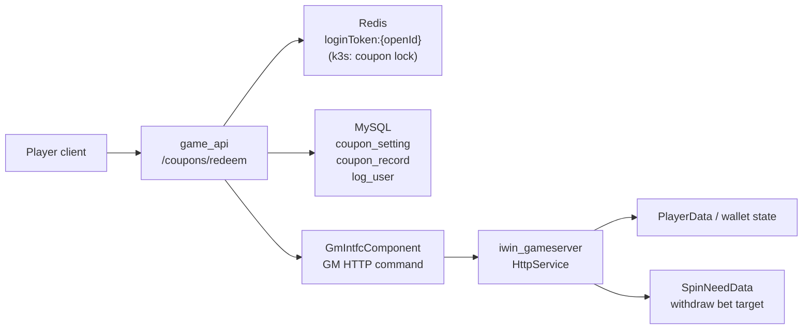
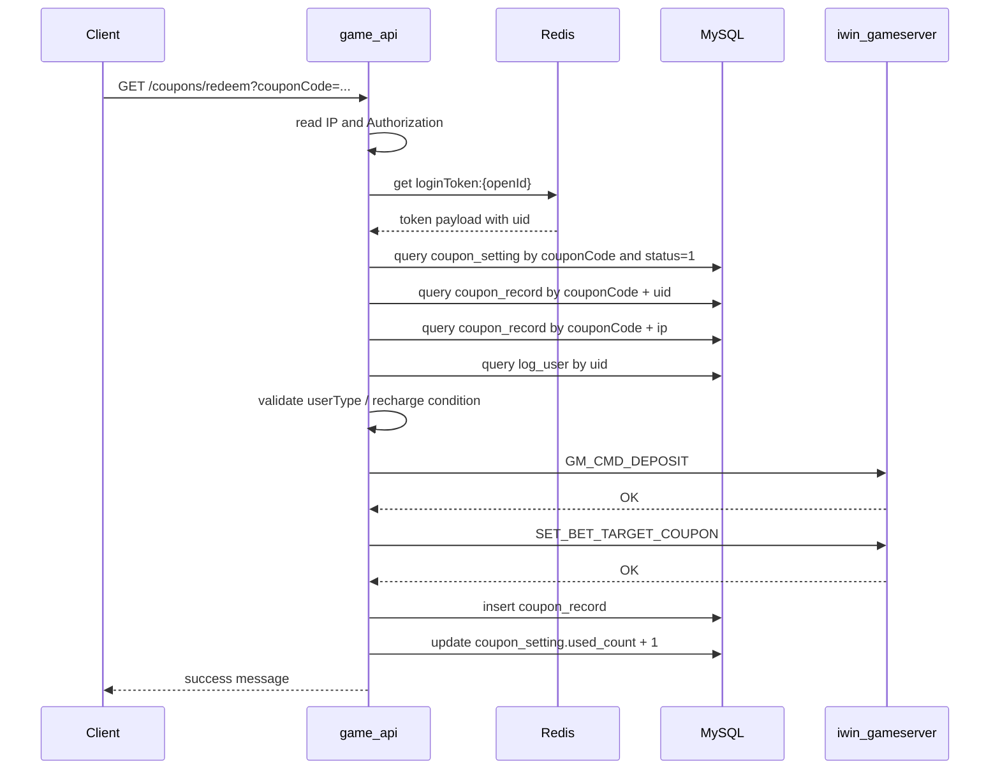

# coupon-redeem-credit-grant flow

更新時間：2026-05-15
Step：3
完成狀態：Step 4 已補面試案例
掃描等級：Level 2 Flow 深掃
證據層級：專案存在 / code-backed；Nick 貢獻待確認

## 閱讀定位

這條 flow 是玩家使用優惠券兌換碼後，由 `game_api` 驗證登入與資格，再呼叫遊戲中心 GM command 幫玩家上分，並設定對應打碼要求。

本文件只把它當成 code-backed flow analysis。沒有 Nick 本人 MR / ticket / commit / production issue / 本人確認前，不可寫成 Nick 真實開發或主導成果。

2026-05-15 KB 更新後已重新覆核：本 flow 仍屬 Level 2 Flow 深掃完成狀態，可沿用。暫不升 Level 3，原因是目前尚未補到 Nick 本人 evidence 與 production deploy evidence；若未來要轉正式履歷 claim，再追逐 commit diff、下游 bill no 去重語意與 production branch 證據。

已確認：

- API 入口在 `CouponRedeemController#redeem`，路由是 `GET /coupons/redeem`。
- 主流程在 `CouponRedeemServiceImpl#redeemCoupon`。
- 本地 MySQL 會讀 `coupon_setting`、`coupon_record`、`log_user`。
- 上分與打碼都透過 `GmIntfcComponent.send(...)` 送到 `iwin_gameserver`。
- `iwin_gameserver` 已找到 `DEPOSIT` 與 `SET_BET_TARGET_COUPON` handler。
- `origin/k3s` branch 已新增 coupon Redis lock 防重複提交，但尚未進 `origin/main`。

待確認：

- Nick 是否實際參與 coupon flow。
- production 實際跑 `main` 還是 `k3s` branch。
- GM command 成功回應是否代表下游帳本與玩家狀態已 durable。
- 是否有人工補單、對帳 dashboard 或 production runbook。

## 白話導讀

玩家在前端輸入兌換碼，打到 `game_api`。`game_api` 先確認這個人真的登入、兌換碼存在且未過期、這個 uid 沒領過、同 IP 沒超過限制，並依活動設定判斷是否符合充值用戶、當日充值用戶、三日內充值用戶或指定用戶。

檢查通過後，`game_api` 不是自己直接改玩家錢包，而是送兩個 GM command 給遊戲中心：

1. `DEPOSIT`：把 coupon 金額加到玩家大廳餘額。
2. `SET_BET_TARGET_COUPON`：增加玩家提款前需要完成的打碼量。

兩個下游動作成功後，`game_api` 才寫入 `coupon_record`，最後把 `coupon_setting.used_count` 加一。

這條 flow 的 Senior 重點不是「怎麼 CRUD」，而是「錢已經發出去了，但本地 record 或 count 失敗時怎麼辦」、「兩個 GM command 只成功一個時怎麼辦」、「同一個玩家連點兩次會不會雙領」。

## Code 分層對照

| 層級 | Code / 資料 | 責任 |
| --- | --- | --- |
| Route / API | `GET /coupons/redeem?couponCode=...` | 玩家兌換入口 |
| Controller | `CouponRedeemController#redeem` | 取 IP、組 req DTO、包 response |
| Service | `CouponRedeemServiceImpl#redeemCoupon` | token、資格、GM command、本地紀錄 orchestration |
| Token / Redis | `RedisKeyEnums.LOGIN_TOKEN`、`RedisService#get` | 驗證 `Authorization` 是否仍是登入 token |
| Coupon setting | `CouponSettingDao.xml#getCouponSettingByCouponCode` | 讀活動設定、金額、打碼量、有效期、使用對象 |
| Coupon record | `CouponRecordDao.xml` | 查同 uid / 同 IP 是否已用過，成功後寫兌換紀錄 |
| Player data | `LogUserDao#getLogUserByUid` | 取得 `accountId`、`centerId`、充值條件、渠道 |
| GM client | `GmIntfcComponent#send` | 透過 ZK center map 找遊戲中心，HTTP POST GM command |
| Downstream deposit | `iwin_gameserver` `HttpService#onDeposit` | 建立 `HttpNewBill` / `NewBillJob`，修改玩家金額 |
| Downstream bet target | `HttpService#setPlayerBetTargetCoupon` | 呼叫 `PlayerData#addWithDrawSpinNeeds` 增加打碼要求 |
| Branch fix | `origin/k3s` `CouponRedeemServiceImpl` | 新增 `coupon:lock:{uid}:{couponCode}` 防短時間重複提交 |

## 最小架構圖



## 正常流程圖



## 正常流程逐步說明

1. Controller 從 request query 讀 `couponCode`，從 request 解析 IP。
2. Service 讀 `Authorization` header，缺少就回 invalid token。
3. `checkToken` 用 app key decode token，取得 `openId`。
4. Service 從 Redis 讀 `loginToken:{openId}`，確認 token 一致並取得 `UId`。
5. 查 `coupon_setting`，條件是 `coupon_code = ? and status = 1`。
6. `isValid` 檢查設定存在且 `valid_time` 不為空、不早於現在。
7. 查 `coupon_record`，用 `coupon_code + log_user_id` 檢查同一帳號是否已兌換。
8. 查 `coupon_record`，用 `coupon_code + ip` 檢查同 IP 是否已達 3 個帳號。
9. 查 `log_user`，取得 `accountId`、`userLayer`、`centerId`、`rechargeCount`、`lastRechargeTime`、`cps`、`channel`。
10. 依 `coupon_setting.user_type` 判斷全體用戶、充值用戶、當天充值用戶、三天內充值用戶或指定用戶。
11. 組 `GM_CMD_DEPOSIT` 參數，包含 `accountId`、`userLayer`、`value`、`type=0`、`billNos`、`reason=124`、`centerId`，送到 `iwin_gameserver`。
12. 組 `SET_BET_TARGET_COUPON` 參數，包含 `accountId`、`targetCnt`、`centerId`，送到 `iwin_gameserver`。
13. 插入 `coupon_record`，保存 uid、coupon code、IP、金額、cps、channel、created_at。
14. 更新 `coupon_setting.used_count = IFNULL(used_count, 0) + 1`。
15. 回傳兌換成功。

## 狀態與 Source Of Truth

| 狀態 | Source of truth | 說明 |
| --- | --- | --- |
| coupon 是否有效 | `coupon_setting` | `coupon_code` unique；但沒有看到總量上限欄位 |
| 玩家是否已兌換 | `coupon_record` | dump schema 顯示是普通 index，不是 unique constraint |
| 同 IP 使用限制 | `coupon_record` | 用查詢筆數限制同 coupon 同 IP 最多 3 個帳號 |
| 玩家充值資格 | `log_user` | 讀 `recharge_count` 與 `last_recharge_time` |
| 玩家錢包餘額 | `iwin_gameserver` / `PlayerData` | `game_api` 只發 GM command，不是錢包最終 source of truth |
| 打碼要求 | `PlayerData` common ext `spinNeeds` | `SET_BET_TARGET_COUPON` 會呼叫 `addWithDrawSpinNeeds` |
| 登入狀態 | Redis `loginToken:{openId}` | token 與 Redis 中保存的 token 必須一致 |
| 防短時間重複提交 | `origin/k3s` Redis lock | `main` 尚未有；且 lock semantics 仍需評估 |

## Transaction Boundary

這條 flow 沒有單一 transaction 包住所有 side effect。

`game_api` local DB 操作、Redis token / lock、GM HTTP command、`iwin_gameserver` 玩家錢包和打碼狀態，分別在不同系統邊界。即使 `game_api` 加上 `@Transactional`，也只能涵蓋本地 DB，不能讓 GM command 一起 rollback。

目前順序是「先發錢、再設定打碼、最後寫本地 record」。這讓使用者體驗直接，但失敗窗口比較大：只要本地 record 或 count 寫失敗，就可能出現玩家已拿到錢但 `game_api` 仍無完整兌換紀錄。

## Idempotency 與併發

`origin/main` 的保護：

- 同 uid 同 coupon：先查 `coupon_record`，查到就拒絕。
- 同 IP 同 coupon：先查 `coupon_record`，達 3 筆就拒絕。
- `billNos` 每次用 UUID 產生，沒有從 coupon + uid 建 deterministic idempotency key。
- DB dump 顯示 `coupon_record` 只有普通 index `idx_coupon_record_coupon_code_user`，不是 unique key。

因此 `main` 上的主要風險是 check-then-insert race：同一 uid 同時送兩個 request，兩邊可能都在 insert 前查不到 record，接著都送 GM 上分。

`origin/k3s` 的保護：

- 新增 `coupon:lock:{uid}:{couponCode}`。
- 用 `RedisService#setIfAbsent(lockKey, "1", 10_000L)` 搶 lock。
- 搶不到就回「請稍候，正在處理」。
- 在 `finally` delete lock。

這是正確方向，但仍有待確認：

- `RedisService#setIfAbsent` 使用 Redis `SET key value NX EX expire`，`EX` 是秒；`10_000L` 可能代表 10000 秒，不是 10 秒。
- `finally delete` 沒有比對 lock value。如果 lock 過期後另一 request 拿到新 lock，舊 request 的 finally 可能刪掉新 lock。
- lock 只防短時間重複提交，不能替代 DB unique constraint 或下游 idempotency。

## Failure Window

| 位置 | 可能狀態 | 影響 |
| --- | --- | --- |
| token / coupon 檢查失敗 | 無 side effect | 低風險 |
| `GM_CMD_DEPOSIT` 失敗 | 無本地 record | 玩家未上分，使用者可重試 |
| `GM_CMD_DEPOSIT` 成功、`SET_BET_TARGET_COUPON` 失敗 | 已上分，未加打碼要求 | 玩家 bonus 與 wagering requirement 不一致 |
| 兩個 GM command 成功、`coupon_record` insert 失敗 | 已上分與打碼，但本地沒有已兌換紀錄 | 玩家可能重試；客服 / 對帳難度高 |
| `coupon_record` 成功、`used_count` 更新失敗 | 已上分、已記錄，但設定統計不準 | 報表或營運判斷失真 |
| main 併發雙送 | 兩次都通過先查後寫 | 可能雙上分、雙加打碼、雙 record |
| k3s lock 參數或 delete semantics 不準 | lock 太久或誤刪 | 可能誤阻擋、或仍有併發窗口 |

## Retry / Compensation / Reconciliation

目前 code 裡沒有看到 coupon 專用補償流程。可行的 owner 對帳方向：

- 以 `coupon_record` 為本地兌換紀錄。
- 以 `billNos` / reason `124` 對下游玩家金額異動 log。
- 以 `SpinBetTargetConst.COUPON` 對下游打碼 log / `spinNeeds`。
- 檢查 `coupon_setting.used_count` 是否等於對應 `coupon_record` 筆數。
- 對「GM 有錢包異動但沒有 coupon_record」列人工核查。
- 對「coupon_record 有紀錄但沒有下游金額或打碼」列補單或 rollback 判斷。

## Owner Decision

若要把這條 flow 做到更穩，建議順序是：

1. DB 層加 `coupon_record(coupon_code, log_user_id)` unique constraint，讓同 uid 同 coupon 的 idempotency 不只靠先查。
2. `billNos` 改成可重試的 deterministic idempotency key，例如由 coupon code + uid + purpose 派生，並確認下游 `DEPOSIT` 是否以 bill no 去重。
3. 改成 state machine：先寫 `PENDING` 兌換紀錄，再執行 deposit、bet target，最後轉 `SUCCESS`；失敗則保留 `FAILED_*` 狀態供補償。
4. 若維持 Redis lock，使用短 TTL、唯一 lock value 與 compare-and-delete，避免誤刪新 lock。
5. `used_count` 使用條件式 update 或從 `coupon_record` 聚合，避免統計與真實兌換紀錄漂移。
6. 建 coupon reconciliation job / report，固定比對 `coupon_record`、wallet log、bet target log、`used_count`。

## 面試 / 履歷邊界

可用於面試學習：

- 如何分析一條跨 Redis、MySQL、HTTP GM command、玩家錢包與打碼狀態的 money-related flow。
- 如何指出 check-then-insert race、外部 side effect 與本地紀錄不一致、partial success window。
- 如何設計 DB unique constraint、idempotency key、state machine、outbox / reconciliation。

目前不可寫進正式履歷：

- 不可寫「主導 coupon 兌換系統」。
- 不可寫「設計分散式鎖防雙領」。
- 不可寫「改善雙領問題」或任何百分比成果。

詳細面試素材見 [career-interview.md](career-interview.md)。

## Step 4 狀態與下一步

Step 4 已完成：已把這條 flow 轉成保守面試案例，重點放在「跨系統 side effect 的一致性與 idempotency 設計」。本輪不更新正式履歷。

下一步最值得做 Step 5：檢查是否能形成履歷 / 自傳安全 claim。以目前 evidence 來看，預期仍會判定不更新正式履歷，除非 Nick 補本人 MR / ticket / commit / production issue / 本人確認。

```text
iwin game_api coupon-redeem-credit-grant Step 5
```
