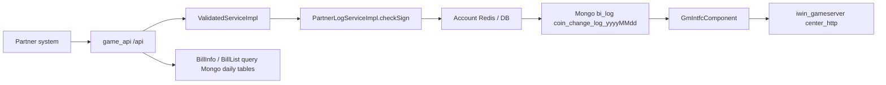
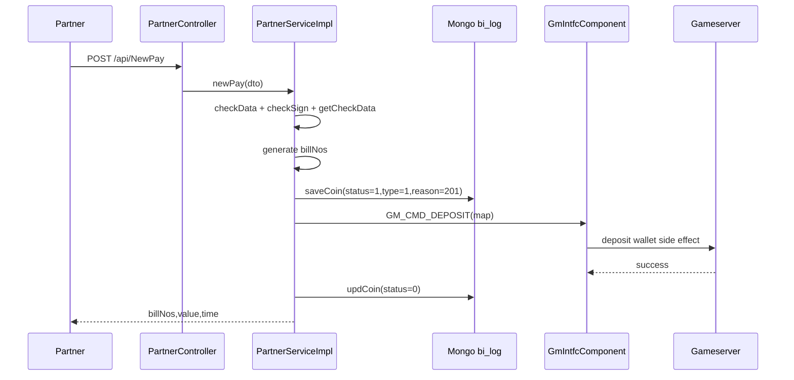
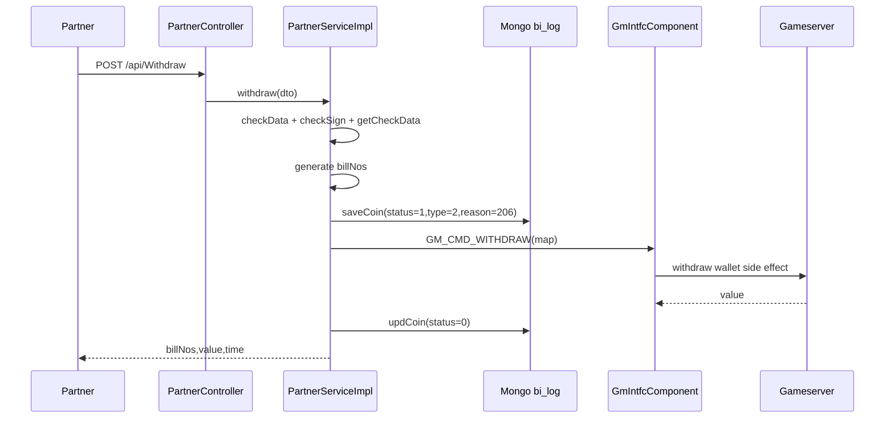

# partner-deposit-withdraw-bill

中文名稱：Partner API 上分 / 下分 / 查單
更新時間：2026-05-19
Step：5
掃描等級：Level 2 Flow 深掃 + Step 5 單條 flow claim gate
證據層級：專案存在 / code-backed；Nick 貢獻待確認

## 閱讀定位

這條 flow 是 `game_api` 對 partner 暴露的 money API：partner 可以呼叫 `NewPay` 幫玩家上分、呼叫 `Withdraw` 從玩家帳上扣分，並用 `BillInfo` / `BillList` 查詢訂單狀態。

它不是一般查詢 API。它同時碰到 partner 簽章、玩家帳號定位、金額倍率換算、Mongo 訂單分日表、GM command、玩家錢包副作用與查單 reconciliation。

Step 5 判定：這條 flow 可作 code-backed 面試素材，不更新正式履歷 / 自傳。2026-05-19 重新 fetch `game_api` 後，partner 相關 path 仍未看到 Nick / `10gt12nc` direct path commit；也未有 Nick 本人確認此 flow 是他做過或維護過。

## 已確認與待確認

已確認：

- `PartnerController` 在 `/api` 下暴露 `NewPay`、`Withdraw`、`BillInfo`、`BillList`。
- `ValidatedServiceImpl` 先檢查 `agentId`、`accountId`、`time`，再依 API 檢查 `value`、`withdrawType`、`billNos`、`start` / `end`。
- `PartnerLogServiceImpl#checkSign` 會用 Redis 內的 API secret 計算 MD5 sign，比對 request sign。
- `newPay` / `withdraw` 會先寫 Mongo `bi_log.coin_change_log_{yyyyMMdd}`，再呼叫 GM command，成功後把訂單狀態改成 `0`。
- `BillInfo` / `BillList` 會依 bill number 日期或查詢時間區間，跨每日 collection 查 `coin_change_log_{date}`。
- `origin/k3s` 對同一簽章流程有安全性強化：啟用 30 秒時窗檢查、加 nonce key 防重放、移除 API secret info log。

待確認：

- GM command 下游 handler 是否以 `billNos` 做去重。
- `coin_change_log_{date}` 是否有 `billNos` unique index。
- partner 是否另有外部 merchant order id；目前 code 看到的 `billNos` 是系統端產生 UUID。
- `origin/k3s` 是否已部署到 production。
- Nick 是否參與過此 partner flow 的實作、修補、排障或需求調整。

## 白話導讀

Partner 呼叫 `NewPay` 時，`game_api` 會把 partner 的 `agentId + accountId` 轉成內部玩家 openId，抓玩家所在 center，將 partner 傳入金額依 channel money ratio 放大成遊戲內分值，產生一筆 `billNos`。接著先把訂單寫進 Mongo，狀態是新建，再送 `GM_CMD_DEPOSIT` 到 gameserver。GM 回成功後，`game_api` 把 Mongo 訂單狀態改成成功，回傳 `billNos`、金額與時間。

`Withdraw` 類似，只是送的是 `GM_CMD_WITHDRAW`。如果是固定金額下分，`withdrawType=1` 必須帶 `value`；如果是其他下分類型，value 可能由下游回傳。

查單則不是查關聯式資料庫，而是查 Mongo 每日分表。`BillInfo` 用 `billNos` 前綴的日期決定要查哪些 collection；`BillList` 用 `start` / `end` 日期區間推導每日 collection，然後回傳 count 與 list。

## Code 分層對照

| 層次 | Code | 責任 |
| --- | --- | --- |
| HTTP 入口 | `PartnerController#newPay/#withdraw/#billInfo/#billList` | 對 partner 暴露 API，轉交 service |
| 參數檢查 | `ValidatedServiceImpl#checkData`、`#vNewPay`、`#vBillInfo`、`#vBillList` | 檢查必要欄位與 withdraw 類型 |
| 簽章 | `PartnerLogServiceImpl#checkSign` | Redis 取 API secret，MD5 sign 比對 |
| 玩家定位 | `PartnerServiceImpl#getCheckData`、`#checkCps` | `agentId:accountId` 找內部帳號與 center |
| 上下分編排 | `PartnerServiceImpl#newPay/#withdraw/#getMap` | 產生 `billNos`，換算金額，組 GM command |
| 訂單記錄 | `PartnerServiceImpl#saveCoin/#updCoin` | 寫 Mongo 分日 collection，更新 status |
| 下游副作用 | `GmIntfcComponent.send(GM_CMD_DEPOSIT/WITHDRAW)` | 呼叫 gameserver 進行實際錢包異動 |
| 查單 | `PartnerServiceImpl#getBillInfos1/#getBillInfos/#queryBillInfos` | 依 billNos 或日期區間查 Mongo 分日表 |
| 回傳模型 | `BillInfo` | `billNos`、`value`、`time`、`type`、`status` |

## 最小架構圖



## 正常流程：NewPay 上分



逐步說明：

1. `PartnerController#newPay` 收到 `/api/NewPay`。
2. `ValidatedServiceImpl#vNewPay` 檢查共用欄位與 `value`。
3. `PartnerServiceImpl#newPay` 產生 `yyyyMMdd-UUID` 形式的 `billNos`。
4. `getMap` 會呼叫 `getCheckData`，內部先驗簽，再以 `agentId:accountId` 找玩家。
5. 金額用 `channel.getMoneyRatio()` 轉成遊戲內分值。
6. `saveCoin` 寫入 Mongo `coin_change_log_{today}`，`status=1`，`type=1`，`reason=201`。
7. 呼叫 `GM_CMD_DEPOSIT`。
8. GM 呼叫成功後，`updCoin(billNos, 0)` 把狀態改成功。
9. 回傳 `billNos`、換算後 value 與時間。

## 正常流程：Withdraw 下分



逐步說明：

1. `PartnerController#withdraw` 收到 `/api/Withdraw`。
2. `ValidatedServiceImpl#vNewPay` 在 withdraw 模式會要求 `withdrawType`；若 `withdrawType=1`，還要求 `value`。
3. `PartnerServiceImpl#withdraw` 產生 `billNos`，組出 `withdrawType`、`type`、`value`、`reason=206` 等 GM 參數。
4. `saveCoin` 寫入 `type=2` 的下分訂單。
5. 呼叫 `GM_CMD_WITHDRAW`。
6. GM 回傳 value 後，service 依 money ratio 換回對 partner 的金額。
7. `updCoin(status=0)` 後回傳結果。

## 正常流程：BillInfo / BillList 查單

`BillInfo` 走 `getBillInfos1`：

1. 驗 `agentId`、`accountId`、`time`、`billNos`。
2. 驗 sign。
3. 用 `billNos.split("_")` 拆多筆單號。
4. 用每筆 `billNos` 前綴日期決定要查哪些 `coin_change_log_{date}`。
5. 查出 `BillInfo` list。

`BillList` 走 `getBillInfos`：

1. 驗 `agentId`、`accountId`、`time`、`start`、`end`。
2. 驗 sign。
3. query 條件包含 `agentId`、`accountId`、可選 `billNos`、`time` range。
4. 用 `DateUtils.findDates(start,end)` 產生每日 collection。
5. `queryBillInfos` 逐日 count 與 find，回傳 `count` 與 `list`。

## 資料狀態

| 狀態 | 意義 | 來源 |
| --- | --- | --- |
| `status=1` | 新建訂單 / pending | `saveCoin` 寫入 |
| `status=0` | 成功 | GM command success 後 `updCoin` |
| `status=4` | 異常 | `FmsServiceException` catch 後 `updCoin` |

`saveCoin` 會寫：

- `accountId`
- `agentId`
- `value`
- `cps`
- `billNos`
- `reason`
- `time`
- `status`
- `type`

## Transaction Boundary

本 flow 的 transaction boundary 不在單一 DB transaction 內。

- Mongo `saveCoin` 是本地訂單紀錄。
- GM command 是下游 wallet side effect。
- `updCoin` 是另一個 Mongo update / upsert。
- 查單只看 Mongo 訂單狀態，不直接查 gameserver wallet。

這代表 `status=0` 只能說明 `game_api` 認為 GM 呼叫成功並更新 Mongo 成功；如果 GM side effect 與 Mongo update 任一邊失敗，就需要 reconciliation。

## Idempotency

目前 Step 3 看到的 idempotency evidence 不足。

已確認：

- `billNos` 由 `game_api` 產生，格式為 `yyyyMMdd-UUID`。
- `NewPay` / `Withdraw` 每次呼叫都會產生新 `billNos`。
- 目前未看到 partner 外部單號欄位參與去重。
- 目前未看到 `saveCoin` insert duplicate handling 或 `billNos` unique index evidence。

Owner 判斷：

- 若 partner timeout 後重送同一 business request，但 `game_api` 產生新 `billNos`，下游可能被視為兩筆不同上下分。
- 正式 money API 通常需要 partner order id 或 deterministic idempotency key，並由本地訂單與下游 wallet log 雙層去重。

## Failure Window

| 位置 | 可能狀態 | 風險 |
| --- | --- | --- |
| 簽章前參數錯誤 | 無訂單 | partner 得到參數錯誤 |
| `saveCoin` 失敗 | 無訂單、無 GM | partner 得到 error；可重試 |
| `saveCoin` 成功、GM 失敗且丟 `FmsServiceException` | Mongo `status=4` | 可查到異常單 |
| `saveCoin` 成功、GM 成功、`updCoin` 失敗 | wallet 已異動，Mongo 仍可能 `status=1` | 查單看 pending，但玩家錢包已變 |
| `saveCoin` 成功、GM timeout 但其實下游成功 | Mongo 可能 `status=4` 或 `status=1` | 需要查 gameserver / wallet log reconciliation |
| generic `Exception` after `saveCoin` | code 未在 generic catch 呼叫 `updCoin` | 可能留下 `status=1` pending |
| 跨日後 `updCoin` | `updCoin` 用當日 collection | 若原單日期與更新日期不同，可能更新錯 collection 或 upsert status-only doc |
| 查單 collection query 出錯 | catch 後只 log | partner 可能拿到部分結果或 count 不完整 |

## Observability

已看到：

- `newPay` / `withdraw` 有整體耗時 log。
- GM command 呼叫有耗時 log。
- 查單異常會 log error。
- main 的 `checkSign` 會 info log API secret 物件內容，這是敏感資訊風險；`origin/k3s` 已移除並改成 debug sign 驗證訊息。

建議觀測點：

- 以 `billNos` 串起 request log、Mongo 訂單、GM request / response、gameserver wallet log。
- 監控 `status=1` aging orders。
- 監控 `status=4` 與 GM timeout / exception 類型。
- 查單若跨多日 collection，應記錄實際掃了哪些 collection 與是否有 partial failure。

## Owner Decision

若要把這條 partner money API 拉到 production owner 標準，優先決策不是多補幾個 try-catch，而是把 contract 定清楚：

1. partner 端必須有外部 request id / merchant order id，並由 `game_api` 用它做 idempotency。
2. `billNos` 應該能支撐 retry，不應每次 timeout 重送都產生全新 money side effect。
3. Mongo order status 要變成明確狀態機，例如 pending、gm_sent、success、failed、unknown、reconciled。
4. generic exception 後不能默默留下 pending；至少要能標 unknown 並進 reconciliation queue。
5. `updCoin` 應依 `billNos` 日期定位原 collection，不能只用當日日期。
6. `origin/k3s` 的 sign replay 防護值得納入主線，但要確認部署狀態與 Redis nonce 語意。

## 面試 / 履歷邊界

可面試講：

- code-backed 分析過 partner 上分 / 下分 / 查單 flow。
- 能說明 partner sign、Mongo order、GM wallet side effect、查單分日表與 failure window。
- 能提出 idempotency、reconciliation、observability 改造方向。

目前不可寫履歷：

- Nick 參與 partner 上下分 flow 開發。
- Nick 主導 partner API / wallet / reconciliation。
- Nick 修復 partner 重複上下分或 production 錯帳。

原因是本輪 path-specific history 沒看到 Nick / `10gt12nc` 直接修改此 flow；這條目前只能作 code-backed 面試素材，不能升正式履歷 claim。

## Step 5 claim gate

結論：不更新正式履歷 / 自傳。

已確認：

- Flow 本身是高價值 partner money API，可用來講 sign、idempotency、Mongo order、GM command、wallet side effect、查單與 reconciliation。
- `game_api` source repo 已重新 fetch；local `main` 與 `origin/main` 同步。
- path-specific history 目前只看到 Arnold 的 first commit、k3s migration、login null guard 與 security update。
- Nick / `10gt12nc` author filter 在 partner 相關 path 沒有命中。

保守使用方式：

- 可以說「我分析過一條 partner 上下分 / 查單 flow，能指出 consistency / idempotency / reconciliation 風險」。
- 不說「我開發 partner 上下分 flow」。
- 不說「我主導 partner API、wallet、查單或 reconciliation」。
- 不把 `origin/k3s` 的 nonce / replay prevention 寫成 Nick 的成果。

## Step 5 結論

`partner-deposit-withdraw-bill` 是 `game_api` 第二條值得深挖的 money flow。它比 coupon 更接近正式 partner money API：有外部系統呼叫、有訂單、有上下分、有查單、有下游 wallet side effect。

目前 Step 5 已完成單條 flow claim gate；仍不做 `game_api contribution claim consolidation`，因為 Step 2 本批代表 flows 尚未都完成 Step 5。第三順位 `agent-bonus-receive-transfer` 已完成 Step 4，下一步做 Step 5。

## 下一步建議

只推薦一件事：

```text
iwin game_api agent-bonus-receive-transfer Step 5
```

原因：

- coupon 與 partner 兩條代表 flow 已完成 Step 5。
- `game_api` Step 2 ranking 的第三順位是 `agent-bonus-receive-transfer`，仍屬 money-like balance / GM 上分 / Redis projection 題材。
- 這輪不更新正式履歷；完整 `game_api contribution claim consolidation` 要等本批代表 flows 都完成 Step 5。
