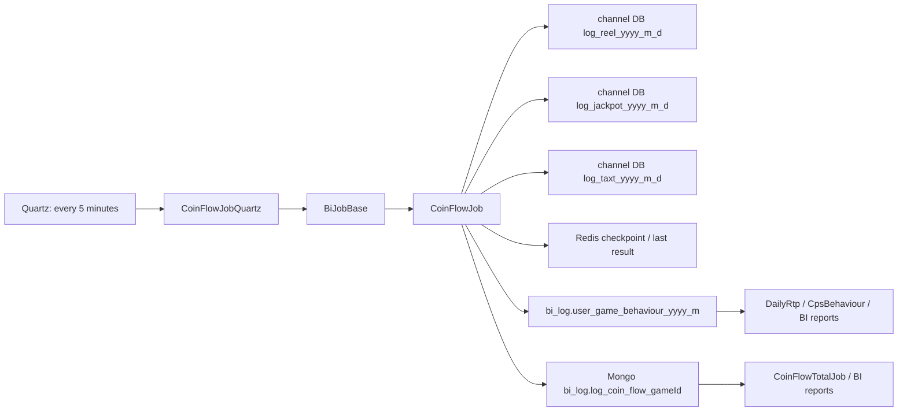
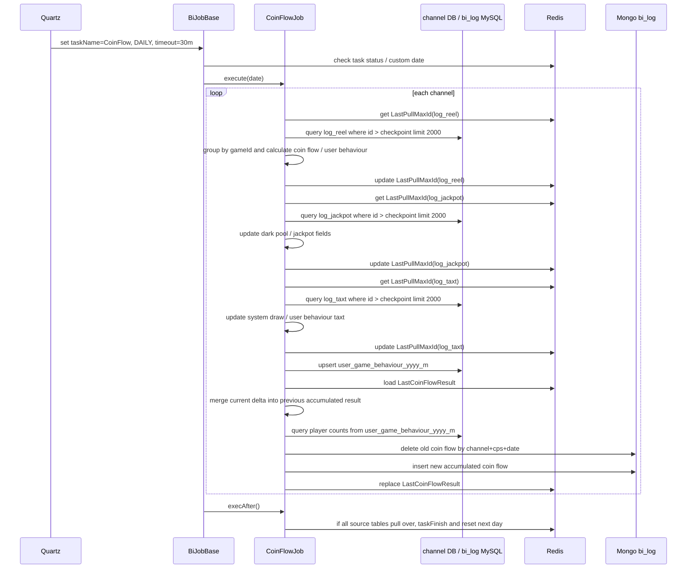

# coin-flow-batch-projection

## 閱讀定位

本文件是 `iwin game_job coin-flow-batch-projection Step 3` 主報告。

中文名稱：金幣流水清算 / 遊戲行為投影。

掃描深度：Level 2。已讀 `game_job` 的 Quartz 入口、`CoinFlowJob` 核心 handle path、`BiJobBase` checkpoint / task state、log mapper、`user_game_behaviour` mapper、coin flow model / utils 與 path-specific history。這不是 Level 3 逐 commit diff 全量鑑識，也不是 production issue 復盤。

證據層級：專案存在 / code-backed。這條 flow 目前沒有足夠 Nick / `10gt12nc` direct path evidence 可以寫成真實開發過；可先作 batch projection、checkpoint consistency、idempotency 的面試分析素材。正式履歷要等 Step 5 claim gate。

## 白話導讀

`CoinFlowJob` 是一條把遊戲原始 log 轉成報表 projection 的 batch flow。

它每次針對所有 channel 跑三種來源：

1. `log_reel_{yyyy_m_d}`：戰績 / 下注 / 派彩資料。
2. `log_jackpot_{yyyy_m_d}`：Jackpot / 暗池變化。
3. `log_taxt_{yyyy_m_d}`：服務費 / 稅費資料。

job 不直接改玩家錢包，也不是 wallet source of truth。它比較像「錢包與遊戲局紀錄的影子報表」：把已經產生的 log 讀出來，累加成玩家行為表 `user_game_behaviour_{yyyy_m}`，再產生 Mongo `bi_log.log_coin_flow_{gameId}` 給 BI / 後續統計使用。

這條 flow 的 Senior 價值在於它不是單次全量重算，而是靠 Redis checkpoint 逐批增量處理。只要 checkpoint、Mongo delete+insert、MySQL upsert 或跨日 finish 的順序出錯，就可能造成漏算、重複累加、報表短暫空窗或當日卡住。

## Code 分層對照

| 層級 | game_job path | 作用 |
| --- | --- | --- |
| Quartz config | `config/application-quartz.yml`、`src/main/resources/application-quartz.yml` | `coinFlow: 0 */5 * * * ?`，目前 main config `coinFlowEnable: false` |
| Quartz registry | `com.quartz.QuartzService` | enable 時註冊 `CoinFlowJobQuartz`，服務啟動會把今日日期寫入 `JobServerCustomDate` 要求重洗 |
| Quartz wrapper | `com.quartz.CoinFlowJobQuartz` | `@DisallowConcurrentExecution`，設定 `BiTaskEnums.COIN_FLOW`、`DAILY`、`taskOverTime=30m` |
| 共用 job framework | `com.common.job.BiJobBase` | 決定執行日期、Redis task status、custom date、checkpoint key、pull over status、task finish |
| flow job | `com.job.biTask.CoinFlowJob` | 讀三種 log、產生 user behaviour、合併 Redis last result、寫 Mongo coin flow |
| source mapper | `LogReelDao.xml`、`LogJackpotDao.xml`、`LogTaxtDao.xml` | 用 `id > lastPullMaxId order by id asc limit pageLimit` 從每日分表增量拉資料 |
| user behaviour projection | `UserGameBehaviourDao.xml` | `insert ... on duplicate key update` 累加 bet / win / taxt / betTimes / upBankerTimes |
| coin flow model | `com.pojo.entity.job.coinFlow.*` | 依 gameId / room 數處理 bet、profit、system income、system draw、dark pool、player num |
| Mongo projection | `bi_log.log_coin_flow_{gameId}` | 每個 gameId 一個 collection；同 channel / cps / date 先刪再 insert |

## 最小架構圖

## 正常流程圖

## 正常流程逐步說明

1. `QuartzService` 只有在 `coinFlowEnable=true` 時註冊 `CoinFlowJobQuartz`。目前 main config 是 false，所以 production 是否啟用待部署設定確認。
2. `CoinFlowJobQuartz` 設定 task name 為 `BiTaskStatus:CoinFlow`，task type 為 daily，timeout 為 30 分鐘。
3. `BiJobBase.runTask()` 先讀 custom date，再用 Redis task status 判斷要跑昨天、今天或停止。
4. `CoinFlowJob.execute()` 查所有 channel，逐 channel 處理；每個 channel 共用同一輪 `coinFlowList` 與 `userGameBehaviourList`。
5. `handleLogReelData()` 從 `log_reel_{yyyy_m_d}` 依 `id > LastPullMaxId`、`limit 2000` 拉戰績，轉成：
   - coin flow 的 bet / profit / system income / played times。
   - user behaviour 的 bet / win / betTimes / upBankerTimes。
6. 每批 `log_reel` 處理成功後更新 Redis `LastPullMaxId`；目前 reel 使用 batch 內 max id，jackpot / taxt 使用 list 最後一筆 id。
7. `handleLogJackpotData()` 從 `log_jackpot_{yyyy_m_d}` 拉 jackpot / dark pool 變化。job 會把 jackpot 的 cps 固定成 `0`，再透過 `unifyCpsPools()` 把所有 cps 的暗池 / 獎池欄位補齊到同一基準。
8. `handleTaxtData()` 從 `log_taxt_{yyyy_m_d}` 拉服務費 / 稅費，coin flow 只把 `taxt_type=0` 當 system draw；user behaviour 也只統計服務費。
9. `saveUserGameBehaviour()` 寫 `user_game_behaviour_{yyyy_m}`，SQL 用 duplicate key 做累加。
10. `updateRedisCoinFlowData()` 讀 Redis `LastCoinFlowResult`，把本輪 delta 疊回先前累計結果，並從 `user_game_behaviour_{yyyy_m}` 反查去重玩家數、房間玩家數、上庄人數。
11. `saveCoinFlowData()` 對 Mongo `bi_log.log_coin_flow_{gameId}` 做每筆 projection 保存：先用 `channel + cps + dateYmd` 刪除舊資料，再 insert 新資料，最後把完整 coin flow list 寫回 Redis `LastCoinFlowResult`。
12. `execAfter()` 檢查所有 channel 的 `log_reel`、`log_jackpot`、`log_taxt` pull over status 是否都為 1；全數完成才 `taskFinish()`。
13. `afterTaskFinish()` 將下一日的三種 source checkpoint 重設為 0、pull status 重設為 0，並清掉當日 `LastCoinFlowResult` / `LastPullMaxId` / `PullOverStatus`。

## 已確認資料與 projection

| 類型 | 來源 / 目標 | 寫入方式 | 一致性重點 |
| --- | --- | --- | --- |
| 戰績 source | `${channelDb}.log_reel_{yyyy_m_d}` | 只讀，`id > checkpoint` | checkpoint 推進後若下游寫失敗，可能漏投影 |
| Jackpot source | `${channelDb}.log_jackpot_{yyyy_m_d}` | 只讀，`id > checkpoint` | 以 cps 0 作 Jackpot 基準，再補到其他 cps |
| Tax source | `${channelDb}.log_taxt_{yyyy_m_d}` | 只讀，`id > checkpoint` | 只統計 `taxt_type=0` 服務費 |
| User behaviour | `bi_log.user_game_behaviour_{yyyy_m}` | `insert ... on duplicate key update` 累加 | 重跑若未先清理，會重複累加 |
| Coin flow | Mongo `bi_log.log_coin_flow_{gameId}` | 先 remove `channel+cps+dateYmd`，再 insert | delete+insert 中間有短暫空窗，失敗時可能缺資料 |
| Redis checkpoint | `Job:daily:BiTaskStatus:CoinFlow:{date}:{chan}:LastPullMaxId` | hash by table name | Redis 遺失或 TTL 不合理會影響 replay 範圍 |
| Redis last result | `...:{chan}:LastCoinFlowResult` | list JSON | 是本日累積 coin flow 的暫存狀態，不是持久 truth |

## Senior / Owner 深度區

### 1. Source of truth 邊界

已確認：`CoinFlowJob` 讀的是遊戲 log 與 jackpot / taxt log，輸出報表 projection。

不可誇大：它不是錢包扣款 / 派彩的交易核心，不可把這條寫成 wallet correctness owner。

可面試講：這條適合講「從 immutable-ish source log 增量生成 BI projection 時，怎麼設 checkpoint、怎麼重跑、怎麼避免報表累加錯」。

### 2. Checkpoint consistency

每張 source table 各有 `LastPullMaxId`。正常情況下，每批資料處理完成才更新 checkpoint。

主要 failure window：

- 已寫 `user_game_behaviour`，但還沒寫 Mongo / Redis last result 就掛掉：下次 checkpoint 已推進，user behaviour 已累加，coin flow 可能缺該批。
- Mongo delete 成功、insert 前掛掉：該 channel / cps / date 的 coin flow projection 會短暫或持續缺資料。
- Redis `LastCoinFlowResult` 寫入失敗：下次增量可能失去先前累計基準。
- Redis checkpoint 遺失：會從 0 重拉 source；`user_game_behaviour` 因累加 upsert 可能重複，Mongo coin flow 則可能被重算覆蓋但基準不一定一致。

### 3. Replay / custom date

`BiJobBase.execBefore()` 在 custom date 變更時會呼叫 `clearLastData(date)`，`CoinFlowJob.clearLastData()` 會：

- 刪除 `user_game_behaviour_{yyyy_m}` 中該 `date_ymd`。
- 刪除 Mongo `log_coin_flow_{gameId}` 中該 `dateYmd`。
- 刪除該 custom date task key 下的 Redis 狀態。

所以 custom date 是比較安全的重洗入口。相對地，非 custom date 的 incremental run 主要靠 checkpoint，不會每輪清 user behaviour。

### 4. 跨日 finish

這條 job 特別設了 `PULL_ONE_MORE_TIME_AFTER_CROSS_DAY = 11 minutes`。當今天零點已過，且當前時間超過零點 11 分鐘，三種 source 拉不到資料時才標記 pull over。

Owner 決策點：

- 這是用時間窗口保護「跨日瞬間 source writer 還在補昨天資料」。
- 如果 writer 延遲超過 11 分鐘，昨天資料可能沒被拉進 projection。
- 如果 channel 很多，其中一個 channel / table pull over status 沒到 1，整個 task date 不會 finish。

### 5. Idempotency 與 duplicate risk

`user_game_behaviour` 是累加式 upsert，不是 replace。它依賴「同一批 source 不會被重拉」來避免重複累加。

Mongo coin flow 是 replace-like：先刪同 channel / cps / date 再 insert。它較接近覆蓋 projection，但沒有跨 Redis / MySQL / Mongo transaction。

因此這條 flow 的實際 idempotency 是混合型：

- MySQL user behaviour：checkpoint-idempotent，重拉會重複累加。
- Mongo coin flow：delete+insert replace-ish，但中間有空窗。
- Redis last result：本日累計狀態，若遺失會影響下一輪。

### 6. Observability

已確認：

- `LogUtils.JOB_COIN_FLOW` 有大量 channel / table / date / last id / data count log。
- `BiJobBase` 會寫 task log success / running / error。
- path 內有不少 `TODO` 測試 log，會輸出 coin flow JSON；production 是否保留需確認。

待補：

- 每張 source 的 lag、last id、processed count 是否有 metrics。
- Mongo delete/insert count 是否被記錄並告警。
- pull over status 卡住時是否有告警。

## 面試 / 履歷邊界摘要

目前可以說：

- 已 code-backed 分析 `game_job` 金幣流水清算 / 玩家遊戲行為 batch projection。
- 可用來面試說明 incremental batch、Redis checkpoint、多來源 log projection、跨日 catch-up、custom date replay、Mongo delete+insert 與 MySQL upsert 的一致性取捨。

目前不能說：

- Nick 真實開發過這條 flow。
- Nick 主導金幣流水清算。
- Nick 負責 wallet / 遊戲派彩 source of truth。
- Nick 改善報表正確率或效能 X%。

Step 4 已把本 flow 轉成「報表 projection 不是交易 truth，但仍需要 money correctness 思維」的面試 case。下一步做 Step 5 claim gate，確認是否更新履歷；目前未補 direct evidence 前預期不更新。
