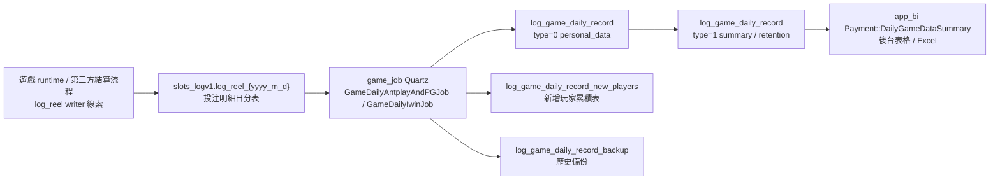
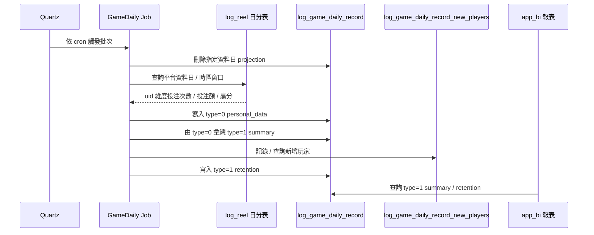

# daily-game-data-summary Flow

更新時間：2026-05-15（Step 4 面試 case 更新）
Step：3
掃描等級：Level 2 單條 flow 深挖
證據層級：專案存在 / code-backed；Nick 貢獻待確認

## 閱讀定位

這條 flow 是 `game_job` 的「每日遊戲資料彙總」批次：從遊戲投注 log 的日分表讀取玩家每日下注 / 贏分資料，整理成 BI 查詢用的 `log_game_daily_record` projection，並補上新增玩家、留存、歷史資料備份與清理。

本文件先讓初階 / 中階讀者看懂「它在做什麼、資料怎麼走、code 在哪裡」，後半才進入 Senior / Owner 角度的 consistency、重跑、failure window、observability 與面試邊界。

本輪沒有 Nick 本人 MR / ticket / commit / production issue / 本人確認，所以不得把這條 flow 寫成 Nick 真實開發過；只能作為 code-backed 分析素材。

## KB 更新後深度檢查結論

2026-05-15 依最新 KB 重新檢查後，判斷本 Step 3 主報告可沿用。本 flow 已補齊 remote refs、branch / log 掃描範圍、未掃邊界與既有文件狀態；Step 4 則在此基礎上把 flow 轉成面試 case study。

重要邊界不變：`app_bi` 本機 `main` 落後 `origin/main` 4 commit，只能當 local snapshot；upstream writer 只做線索掃描；目前仍沒有 Nick 本人 evidence。

## 白話導讀

後台報表要看每天各平台的遊戲概況，例如：

- 有多少玩家有投注。
- 投注次數是多少。
- 投注金額與輸贏是多少。
- 新玩家有多少。
- 新玩家隔日、二日、三日、七日留存如何。

原始投注資料在 `slots_logv1.log_reel_{yyyy_m_d}` 這類日分表。報表不適合每次都直接掃原始 log，所以 `game_job` 每天跑批次，把原始 log 彙總成 `log_game_daily_record`。`app_bi` 再查這張 projection 表，提供每日遊戲資料彙總頁面與 Excel 匯出。

這條 flow 的核心不是即時交易扣款，而是「報表 projection 是否正確」。Senior 角度要看的不是 Controller 有幾個方法，而是：

- 不同平台的資料日與時區窗口是否一致。
- 批次重跑會不會重複、漏算或刪錯。
- 新增玩家與留存是否和主彙總同一個重跑邊界。
- 歷史資料備份 / 刪除如果半途失敗，是否能被發現與修復。

## Code 分層對照

| 層級 | 主要檔案 | 角色 |
| --- | --- | --- |
| Quartz 入口 | `/Users/nick/Git/iwin/game_job/src/main/java/com/quartz/GameDailyAntplayAndPGJobQuartz.java` | PG / Antplay 排程入口，設定 task name / type / overtime 後進 `BiJobBase.runTask()` |
| Quartz 入口 | `/Users/nick/Git/iwin/game_job/src/main/java/com/quartz/GameDailyIwinJobQuartz.java` | Iwin 排程入口，使用同一批次框架 |
| Job orchestration | `/Users/nick/Git/iwin/game_job/src/main/java/com/job/biTask/GameDailyAntplayAndPGJob.java` | PG / Antplay：刪除當日 projection、匯入個人資料、彙總 summary、計算留存 |
| Job orchestration | `/Users/nick/Git/iwin/game_job/src/main/java/com/job/biTask/GameDailyIwinJob.java` | Iwin：同樣產生 projection，另外做 14 天 personal / 180 天 summary 備份清理 |
| 手動觸發 | `/Users/nick/Git/iwin/game_job/src/main/java/com/conllor/TestController.java` | `gameDailyJob(date)` 可手動對指定日期跑 PG / Antplay 與 Iwin |
| Service | `/Users/nick/Git/iwin/game_job/src/main/java/com/service/impl/GameDailyServiceImpl.java` | 包裝 DAO 呼叫與 `log_reel_{date}` 分表日期轉換 |
| 彙總 SQL | `/Users/nick/Git/iwin/game_job/src/main/resources/mapper/logone/LogReelDao.xml` | 從 `slots_logv1.log_reel_{yyyy_m_d}` 彙總 uid、下注次數、投注額、贏分 |
| Projection SQL | `/Users/nick/Git/iwin/game_job/src/main/resources/mapper/bilog/GameDailyDao.xml` | 寫入 / 刪除 / 彙總 `log_game_daily_record`，處理新增玩家、留存與備份 |
| DTO | `/Users/nick/Git/iwin/game_job/src/main/java/com/pojo/vo/DailySummaryVo.java` | 定義 date、platform、value1~value4、type、sub_type 的資料意義 |
| 下游查詢 | `/Users/nick/Git/iwin/app_bi/app/admin/controller/Payment.php` | `DailyGameDataSummary()` 查 `log_game_daily_record` type=1，轉成後台表格 / Excel |
| 下游 UI | `/Users/nick/Git/iwin/app_bi/public/views/jjsj/mrucsjhz/index.js` | 每日遊戲資料彙總頁面欄位與查詢參數 |

依 Nick 熟悉的後端分層轉譯：

```text
Route / API：Quartz cron；另有 TestController.gameDailyJob(date) 手動入口
Controller：TestController 只作補跑入口，非主要 production 入口
Service / Business：GameDailyAntplayAndPGJob、GameDailyIwinJob、GameDailyServiceImpl
Model / DAO / Repository：GameDailyDao、LogReelDao
SQL / Table：log_reel_{yyyy_m_d}、log_game_daily_record、log_game_daily_record_new_players、log_game_daily_record_backup
Redis：本 flow 未確認直接使用；BiJobBase task state 可能使用 Redis，待後續補讀
MQ / Kafka / 下游通知：未確認 / 不適用
External API：未確認；upstream 第三方 settlement 只作線索
Log / Audit：LogUtils.GAME_DAILY；缺 rows count / completion marker evidence
Config：config/application-quartz.yml
```

## 最小架構圖



邊界說明：

- `game_job` 是 projection producer，不是投注交易 source of truth。
- `app_bi` 是 projection consumer；本機 `app_bi` 已 fetch 但 local `main` 落後 `origin/main` 4 個 commit，因此下游只作目前 local snapshot 線索。
- `iwin_gameserver` 只做 upstream writer 線索掃描，未完整深掃所有投注寫入流程。

## 正常流程圖



## 正常流程逐步說明

### 1. 排程觸發

`config/application-quartz.yml` 有兩個排程設定：

- `gameDailyAntplayAndPGJob`：PG / Antplay。
- `gameDailyIwinJob`：Iwin。

兩個 Quartz wrapper 都有 `@DisallowConcurrentExecution`，可避免同一個 Quartz job instance 重疊執行。實際 production enable flag 可能由部署環境覆蓋；本輪只看到 local config，不能推定正式環境啟用狀態。

### 2. 決定資料日

PG / Antplay job 在排程模式使用當天日期作為 `oneDay`，但查詢窗口會往前跨一段時間：

- Antplay：`twoDay 21:00:00.000` 到 `oneDay 20:59:59.999`，commit 註記為 GMT+0 修正。
- PG：`twoDay 13:00:00.000` 到 `oneDay 12:59:59.999`，commit 註記為 GMT+8 修正。

Iwin job 在排程模式使用 `today.minusDays(1)` 作為資料日，並查該日對應的 `log_reel` 日分表。

### 3. 刪除舊 projection

批次先呼叫 `deleteGameDailyRecords(date, platformGroup)`：

- Iwin job 刪 `platform='Iwin'`。
- PG / Antplay job 刪 `platform in ('PG', 'Antplay')`。

這讓 `log_game_daily_record` 的 type=0 / type=1 可以用「刪除後重建」方式重跑。

重要邊界：刪除的是主 projection 表，並不等於所有輔助狀態都同步清掉。`log_game_daily_record_new_players` 的重跑一致性要在 Step 4 再細查。

### 4. 產生個人日資料

`LogReelDao.getPersonalData` 從 `slots_logv1.log_reel_{yyyy_m_d}` 聚合：

- `value1`：uid。
- `value2`：投注筆數。
- `value3`：投注額 `spin_currency`。
- `value4`：贏分 `win_currency`。
- `type=0`。
- `sub_type='personal_data'`。

PG / Antplay 因為時區窗口可能跨兩張日分表，所以 job 會查當日與前一日分表後在 Java 端用 `platform:uid` 合併。

### 5. 產生 summary

`GameDailyDao.getSummaryData` 從當日 type=0 personal data 彙總出 type=1 summary：

- `summary_user_counts`：玩家數。
- `summary_spin_counts`：投注筆數。
- `summary_spin_amount`：投注額。
- `summary_profit_loss`：輸贏。
- `summary_kill_rate`：殺數 / RTP 類比率，使用放大倍率儲存。

`app_bi` 查詢時再用 `SUM(CASE WHEN sub_type=... THEN value1 ELSE 0 END)` pivot 成欄位，金額與百分比由 UI / controller 做縮放顯示。

### 6. 計算新增玩家與留存

Job 會取指定平台在 `oneDay` 往前 7 天的 type=0 uid 資料，整理成每天 uid set，並計算：

- 當日新增玩家。
- 隔日、二日、三日、七日留存人數。
- 對應留存率。

新增玩家判斷依賴 `log_game_daily_record_new_players`：若 uid 過去沒有在該 platform 出現過，才插入為新玩家。這表示該輔助表是跨資料日累積狀態，不只是單日 projection。

### 7. 歷史備份與清理

Iwin job 在正常彙總後，會把：

- 14 天前的 type=0 personal data 備份到 `log_game_daily_record_backup`，再從主表刪除。
- 180 天前的 type=1 summary data 備份到 backup，再從主表刪除。

這是報表表容量與保存政策的工程取捨，但 backup insert 與 delete 不是明確同一 transaction 的證據，本輪先標 partial failure 待確認。

## Senior / Owner 深度區

### 資料狀態

| 狀態 | 表 / 資料 | 說明 |
| --- | --- | --- |
| 原始事實 | `slots_logv1.log_reel_{yyyy_m_d}` | 投注 / 贏分明細，應視為本 flow 的主要輸入 |
| 單日個人 projection | `log_game_daily_record`, `type=0`, `sub_type=personal_data` | uid 維度聚合結果 |
| 報表 summary projection | `log_game_daily_record`, `type=1` | BI 查詢的主要資料 |
| 新增玩家累積狀態 | `log_game_daily_record_new_players` | 跨日判斷「是否第一次出現」 |
| 歷史保存 | `log_game_daily_record_backup` | Iwin job 的老資料備份 |

### Transaction Boundary

已確認：

- 主表 `log_game_daily_record` 採刪除指定日 / 平台後重建。
- 個人資料、summary、retention 是多個 DAO 呼叫串起來。
- 新增玩家表與主 projection 表不是同一個簡單「刪掉重建」邊界。
- backup insert 與 delete 是連續操作，但本輪未看到能保證跨步驟 atomic 的明確 transaction evidence。

推測：

- 若其中任一步失敗，可能留下「主表部分重建」、「新增玩家表已寫但 retention 未完成」、「backup 已寫但主表未刪」或「backup 未完整但主表刪除」等狀態。

待確認：

- Service / mapper 呼叫是否有外層 transaction 管控。
- `BiJobBase` 是否有任務失敗狀態、重跑保護與告警接線。
- DB constraint 是否能防止 duplicate backup 或 duplicate new player rows。

### Consistency

這條 flow 的 consistency 核心是「同一資料日的 type=0 與 type=1 是否對齊」。

目前設計的優點：

- summary 由剛寫入的 type=0 personal data 彙總，降低 summary 和 personal 使用不同 query 條件造成的不一致。
- PG / Antplay 用 `platform:uid` 合併跨日分表，能處理時區窗口跨分表的情境。
- Quartz wrapper 加 `@DisallowConcurrentExecution`，降低同 job 重疊執行風險。

主要風險：

- PG / Antplay 與 Iwin 是兩個 job，平台間不保證同一時間完成。
- 時區窗口由程式字串組合，任何平台定義改變都可能造成前後日歸屬偏移。
- `app_bi` 查 type=1；如果 type=0 已重建但 type=1 還沒完成，下游可能看到空值或舊 / 新混合狀態。
- local `app_bi` 落後 remote 4 commit，下游最新查詢行為需另行用 remote HEAD 補讀。

### Idempotency

較安全的部分：

- 主 projection 表用 delete + insert，對同一日期 / 平台重跑通常可回到相同結果。
- 手動 endpoint 可指定日期重跑，利於修復特定資料日。

不完整的部分：

- `log_game_daily_record_new_players` 是累積狀態；重跑舊日期時，如果新增玩家表已包含該 uid，新增玩家與留存可能不等同於第一次跑該日的結果。
- backup insert + delete 若沒有 unique / transaction / job marker，重跑舊資料可能有 duplicate backup 或刪除後無資料可補的風險。
- `deleteGameDailyRecords` 依 date + platform group 刪主表，但沒有看到對下游查詢使用 snapshot / publish marker。

### Failure Window

| 失敗點 | 可能結果 | Owner 需要追問 |
| --- | --- | --- |
| 刪除主 projection 後，查 `log_reel` 失敗 | BI 當日資料消失或不完整 | 是否有 job failure alert？是否能安全重跑？ |
| type=0 寫完，summary 失敗 | personal 與 summary 不一致，BI 查不到完整 type=1 | 下游是否只看完成標記？ |
| 新增玩家表寫入後，retention 寫主表失敗 | 輔助狀態前進，但 projection 未完成 | 重跑是否會改變新增玩家判斷？ |
| backup insert 成功、delete 失敗 | 主表與 backup 同時有舊資料 | 是否允許 duplicate 保存？ |
| backup insert 失敗、delete 仍執行 | 歷史資料可能遺失 | 是否有 transaction 或 rows affected 檢查？ |
| 時區窗口錯誤 | PG / Antplay 跨日資料歸屬錯誤 | 是否有 reconciliation 對帳指標？ |

### Retry / Compensation

已確認：

- 有手動日期入口 `TestController.gameDailyJob(date)`，可對指定日期觸發 PG / Antplay 與 Iwin job。
- 主 projection 表重跑前會先刪除指定日期資料。

待補：

- 手動入口是否只限內部環境、是否有權限控管。
- 補跑是否應先檢查 `log_game_daily_record_new_players`。
- 備份 / 清除是否需要 rows count reconciliation。
- 是否有 run id、job version 或完成狀態供 BI 避免讀半成品。

### Observability

已確認：

- Job 以 `LogUtils.GAME_DAILY.info(...)` 記錄開始、結束與耗時。
- Quartz / `BiJobBase` 有 task name、task type、timeout 等任務框架欄位。

目前不足或待確認：

- 缺少每一步的 input rows、insert rows、summary rows、new player rows、retention rows。
- 缺少平台 / 日期維度的 success marker。
- 缺少與下游 BI 查詢結果的對帳 log。
- 缺少時區窗口實際查詢範圍的 structured log。

### Owner Decision

如果要把這條 flow 提升成更穩的 production projection，Owner 最該決策的是：

1. 是否接受 delete + insert 的短暫空窗，或改成 staging table / publish marker。
2. `log_game_daily_record_new_players` 是否要納入同一資料日重跑策略。
3. backup insert + delete 是否需要 transaction、unique key 或 reconciliation report。
4. PG / Antplay / Iwin 的資料日定義是否要集中配置與測試，而不是散在 job 字串邏輯。
5. BI 是否應只讀「已完成資料日」，避免讀到半成品。

## Evidence 與掃描邊界

本輪已 fetch 並記錄：

- `game_job`：`main` 與 `origin/main` 相同，HEAD `23908f474efb5cfe5a3ce2bc780fb67a0860c4c2`。
- `app_bi`：本機 `main` 落後 `origin/main` 4 commit；只作下游 local snapshot 線索。
- `iwin_gameserver`：`main` 與 `origin/main` 相同；只掃 upstream writer 線索。
- `game_api`：`main` 與 `origin/main` 相同；只掃 log_reel 查詢線索。
- `third_games_api`：`beta` 與 `origin/beta` 相同；只掃 log_reel 查詢線索。

詳細掃描範圍、commit evidence 與待確認項目放在 `materials/evidence.md`。

既有文件狀態：

- `README.md`：可沿用；本次同步標示 Step 4 已完成。
- `step1-candidate-flows.md`：可沿用；Level 1 候選 flow 與 Step 2 前置關係完整。
- `step2-flow-comparison.md`：可沿用；已符合「不可跳 Step 2」的 KB 要求。
- `flows/daily-game-data-summary/flow.md`：可沿用；已補 evidence 並同步 Step 4 狀態。
- `materials/evidence.md`：可沿用；已補 remote refs、分支 / log 範圍與未掃邊界。

## 面試 / 履歷邊界摘要

可以作為面試分析素材：

- 如何檢查一條 batch projection 的資料正確性。
- 如何分析跨時區資料窗口。
- 如何討論 delete + insert 重跑策略的優缺點。
- 如何辨識新增玩家 / 留存這類累積狀態與主 projection 的一致性風險。

目前不能寫入正式履歷：

- Nick 主導每日遊戲資料彙總。
- Nick 負責 game_job 或 app_bi 完整資料管線。
- Nick 修正 PG / Antplay 時區問題。
- Nick 設計 BI projection 架構。

詳細面試素材見 `career-interview.md`；claim 邊界見 `materials/claim-boundary.md`。

## Step 4 面試 Case 狀態

已完成 Step 4：

- `career-interview.md`：30 秒摘要、3 分鐘版本、面試官追問、保守回答、Senior 能力與履歷候選句。
- `materials/interview.md`：更細的追問 drill、白板口述、面試紅線與可展示能力。

重要邊界不變：目前仍沒有 Nick 本人 evidence，所以 Step 4 只產出面試分析素材，不更新正式履歷。

## 下一步建議

只推薦一件事：

```text
game_job daily-game-data-summary Step 5
```

原因：Step 3 / Step 4 已完成；下一步只能檢查是否值得進 Step 5 更新履歷 / 自傳。若仍沒有 Nick 本人 MR / ticket / commit / production issue / 本人確認，Step 5 應明確結論為「不更新正式履歷，只保留為分析素材」。
