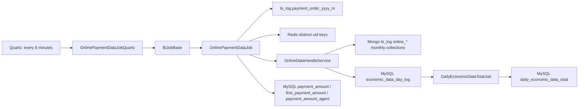
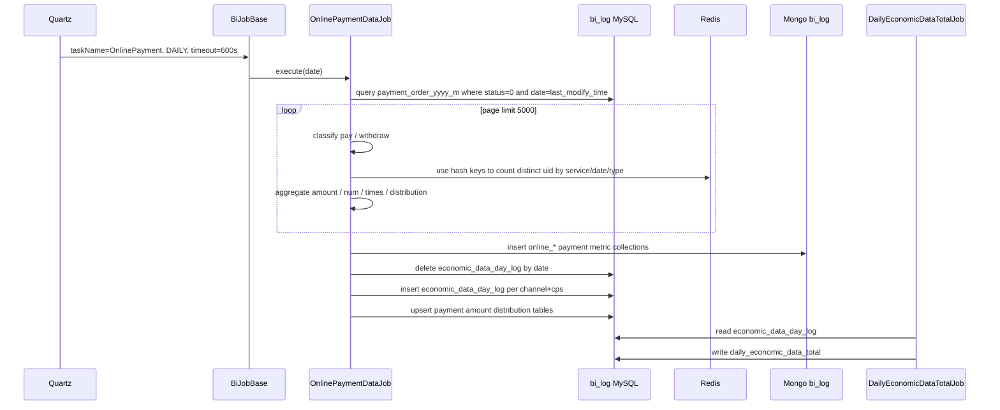

# online-payment-data-cleaning

## 閱讀定位

本文件是 `iwin game_job online-payment-data-cleaning Step 3` 主報告；Step 4 已完成正式面試 case，Step 5 已完成 claim gate。

中文名稱：充值 / 提現資料清洗與每日經濟資料。

掃描深度：Level 2。已讀 `game_job` 的 Quartz 入口、`OnlinePaymentDataJob`、`OnlineDataHandleService`、`OnlineHandlerServerBase`、payment order mapper、economic day log mapper、`DailyEconomicDataTotalJob` 下游讀取與 path-specific history。這不是 Level 3 逐 commit diff 全量鑑識，也不是 production incident 復盤。

證據層級：專案存在 / code-backed。這條 flow 目前沒有足夠 Nick / `10gt12nc` direct path evidence 可寫成真實開發過；Step 5 判定正式履歷 / 自傳不更新，保留為 payment reporting projection、replay safety、Redis 去重與下游 daily economic summary 的面試分析素材。

## 白話導讀

`OnlinePaymentDataJob` 是一條把 payment order 轉成 BI / 報表資料的 batch flow。

它不是充值建單、provider callback、錢包上分或提款出款的 source of truth。真正訂單狀態由 `payment_order_{yyyy_m}` 這張月表承載，這條 job 只讀成功訂單，把它們整理成營運看得懂的統計：

1. 每日充值金額、充值人數、充值次數。
2. 線上 / 線下 / 快捷 / 代理充值分類。
3. 首充、新註冊充值、新註冊受邀充值。
4. 提現金額、提現人數、首次提現、新註冊提現。
5. 充值金額區間分布、首充區間分布、銀商充值區間分布。
6. `economic_data_day_log`，再提供給 `DailyEconomicDataTotalJob` 組成 `daily_economic_data_total`。

這條 flow 的 Senior 價值在於它看起來是報表清洗，但它接近 money reporting。若重跑、Mongo insert、MySQL delete+insert、Redis 人數去重或資料日判斷出錯，營運看到的充值、提現、首充、付費率、ARPU、profit 都可能錯。

## Code 分層對照

| 層級 | game_job path | 作用 |
| --- | --- | --- |
| Quartz config | `config/application-quartz.yml`、`src/main/resources/application-quartz.yml` | `onlinePaymentData: 0 */8 * * * ?`，目前 main config `onlinePaymentDataEnable: false` |
| Quartz registry | `com.quartz.QuartzService` | enable 時註冊 `OnlinePaymentDataJobQuartz` |
| Quartz wrapper | `com.quartz.biQuartz.OnlinePaymentDataJobQuartz` | `@DisallowConcurrentExecution`，設定 `BiTaskEnums.ONLINE_PAYMENT`、`DAILY`、`taskOverTime=600s` |
| 共用 job framework | `com.common.job.BiJobBase` | 決定昨天 / 今天 / custom date、Redis task state、task log、跨日 finish |
| flow job | `com.job.biTask.OnlinePaymentDataJob` | 讀 `payment_order_{yyyy_m}` 成功訂單，分類充值 / 提現，保存 Mongo / MySQL projection |
| handler service | `com.job.biTask.onlineDataService.OnlineDataHandleService` | 依 service name 累加金額、人數、次數、trade type / online type 統計與 economic data |
| Mongo writer base | `OnlineHandlerServerBase` | 將統計 DTO insert 到 `bi_log` Mongo 月 collection |
| source mapper | `PaymentOrderDao.xml.queryPaymentOrders` | `id > lastId`、`status=0`、`DATE_FORMAT(last_modify_time)=date`、`limit 5000` |
| MySQL projection | `EconomicDataDayLogDao.xml`、`PaymentOrderDao.xml` | 保存 `economic_data_day_log`、`payment_amount`、`first_payment_amount`、`payment_amount_agent` |
| downstream | `DailyEconomicDataTotalJob` | 讀 `economic_data_day_log`，計算 pay / withdraw / profit / kill rate / ARPU / ARPPU 到 `daily_economic_data_total` |

## 最小架構圖



## 正常流程圖



## 正常流程逐步說明

1. `QuartzService` 只有在 `onlinePaymentDataEnable=true` 時註冊 `OnlinePaymentDataJobQuartz`。目前 main config 是 false，所以 production 是否啟用待部署設定確認。
2. `OnlinePaymentDataJobQuartz` 設定 `BiTaskEnums.ONLINE_PAYMENT`、daily task、timeout 600 秒後呼叫 `runTask()`。
3. `BiJobBase.runTask()` 先處理 custom date，再用 Redis task status 決定跑昨天或今天，並寫 task log。
4. `OnlinePaymentDataJob.execute()` 先查所有 channel 設定，取得 `commonRatio` 供金額區間換算。
5. job 清空本輪 in-memory distribution map，初始化多組 handler：每日支付、新註冊支付、線下支付、代理充值、首充、新註冊提現、每日提現、首次提現。
6. job 以 `payment_order_{yyyy_m}` 為 source，從 `lastOrderId=0` 開始，每頁查 `status=0` 且 `last_modify_time` 屬於當前資料日的成功訂單，最多 `1000 * 5000` 筆。
7. 充值訂單只處理 `reason` 在 `51 / 52 / 203 / 54` 的資料；其中 `reason=54` 只接受 `trade_type=210 / 209`。
8. 充值訂單依條件進入每日支付、線下支付、代理充值、新註冊支付、受邀新註冊支付、首充與金額區間分布。
9. 提現訂單會先把 `money` 改成 `actual_out_money`，再進入每日提現、新註冊提現、首次提現統計。
10. `OnlineDataHandleService` 用 Redis hash 依 service / channel / cps / date / tradeType / onlineType 記錄 uid，避免人數重複計算；金額與次數保存在 in-memory map。
11. 保存階段會把多組 `online_*` 指標 insert 到 Mongo `bi_log` 月 collection；`economic_data_day_log` 則先按 date 全刪再逐 channel+cps insert。
12. 金額區間表 `payment_amount`、`first_payment_amount`、`payment_amount_agent` 使用 MySQL `insert ... on duplicate key update` 覆蓋當日分布。
13. 下游 `DailyEconomicDataTotalJob` 讀 `economic_data_day_log`，再結合活躍、註冊、押注、抽水、邀請等資料寫 `daily_economic_data_total`。

## 已確認資料與 projection

| 類型 | 來源 / 目標 | 寫入方式 | 一致性重點 |
| --- | --- | --- | --- |
| Source order | `payment_order_{yyyy_m}` | 只讀，依 `id > lastId` 分頁 | source 是 payment reporting snapshot，不是 provider callback 本身 |
| 資料日 | `DATE_FORMAT(last_modify_time,'%Y-%m-%d') = date` | 依最後修改時間分類 | callback / 補單修改時間會影響資料日 |
| 支付 / 提現成功條件 | `status=0` | 只讀成功訂單 | status 定義來自 payment source，這裡不驗證 provider truth |
| Mongo payment metrics | `online_*_{yyyy_m}` | 每次 insert 新文件 | 未見同 date / channel / cps 先刪或 upsert，重跑可能重複 |
| Economic day log | `economic_data_day_log` | 先 delete by date，再 insert | delete 和 insert 之間有空窗；只按 date 刪會影響整日所有 channel+cps |
| Amount distribution | `payment_amount`、`first_payment_amount`、`payment_amount_agent` | duplicate key update | 依 table unique key 覆蓋，較接近 replace |
| Redis distinct uid | `Online:{service...}:Person:{date}` | hash uid，TTL 2 天 | 用來去重人數；Redis 遺失或 TTL 到期會影響重跑人數 |
| Downstream daily total | `daily_economic_data_total` | downstream 讀 economic day log 後重建 | 若 upstream 未完成或重複，profit / ARPU / pay rate 會錯 |

## Senior / Owner 深度區

### 1. Source of truth 邊界

已確認：這條 job 讀 `payment_order_{yyyy_m}`，不呼叫 provider、不改訂單狀態、不改玩家錢包。

不可誇大：它不是 payment provider callback、order state machine、提款出款或 wallet source of truth。

可面試講：它適合講「payment source order 進入 BI / economic reporting projection 時，如何處理資料日、重跑、去重與下游指標一致性」。

### 2. 資料日與 late update

`queryPaymentOrders()` 用 `DATE_FORMAT(last_modify_time,'%Y-%m-%d') = date` 選資料。這代表報表資料日是「訂單最後修改日」，不是 `create_time`，也不是 provider event time。

Owner 要追問：

- callback 成功較晚、人工補單、修單是否會把昨天的充值算到今天。
- payment repo 的「訂單成功時間」是否就是 `last_modify_time`。
- `DailyEconomicDataTotalJob` 是否預期吃同一個資料日定義。

### 3. 重跑與 idempotency

這條 flow 的 idempotency 是混合型：

- `economic_data_day_log`：先刪 date 再 insert，重跑會重建，但 delete / insert 中間有空窗。
- `payment_amount*`：MySQL duplicate key update，若 unique key 正確，重跑會覆蓋。
- Mongo `online_*`：目前看到的是 insert，不是 delete+insert 或 upsert。若同一天多次跑同一 date，可能留下多筆相同 channel / cps / minute 的 metric。
- Redis distinct uid：hash key 有 2 天 TTL，重跑時若 Redis key 還在，會沿用去重結果；若 Redis key 已失效，會重新計算。

### 4. Failure window

主要 failure window：

- Mongo insert 完成，但 `economic_data_day_log` delete 前掛掉：Mongo 有本輪資料，MySQL economic 沒更新。
- `economic_data_day_log` delete 成功、insert 前掛掉：下游 `daily_economic_data_total` 讀不到 payment / withdraw economic summary。
- 部分 Mongo collection insert 成功、後面保存失敗：不同指標的時間點不一致。
- Redis 去重 key 已寫入但 DB 保存失敗：重跑時人數可能仍看起來已去重，但 projection 不完整。
- `lastOrderId` 只存在本輪記憶體，不是持久 checkpoint；每輪都查全日成功訂單，資料量大時會重複掃整天。

### 5. 下游一致性

`DailyEconomicDataTotalJob` 讀 `economic_data_day_log`，再產生：

- `payTotalMoney`
- `withdrawTotalMoney`
- `profit = payTotalMoney - withdrawTotalMoney`
- `payRate`
- `ARPU`
- `ARPPU`
- `killRate`

所以這條 flow 若晚到、失敗或重複，影響的不只是支付分布圖，也會影響每日經濟總表。

### 6. Observability

已確認：

- `LogUtils.JOB_ONLINE_PAYMENT_DATA` 會記錄 job 開始 / 結束、查不到訂單、訂單 billNo 分類、channel map。
- `BiJobBase` 會寫 task log 成功 / 執行中 / 失敗。

待補：

- 每輪 source query count、processed count、pay / withdraw count。
- 每個 projection 保存筆數、失敗筆數。
- Mongo duplicate / 重跑筆數。
- `economic_data_day_log` delete count / insert count。
- 下游 `DailyEconomicDataTotalJob` 是否等 upstream 完成再跑。

## 面試 / 履歷邊界摘要

目前可以說：

- 已 code-backed 分析 `game_job` 的充值 / 提現資料清洗與每日經濟資料 projection。
- 可用來面試說明 payment order reporting projection、資料日、Redis 去重、Mongo insert projection、MySQL delete+insert 重跑與 downstream economic summary 的一致性風險。

目前不能說：

- Nick 真實開發過這條 flow。
- Nick 主導 payment reporting / reconciliation。
- Nick 負責 payment provider callback 或提款出款 source of truth。
- Nick 改善支付報表正確率或效能 X%。

## 下一步建議

只推薦一件事：

```text
iwin game_job contribution claim consolidation
```

原因：本 flow Step 5 已完成 claim gate；正式履歷 / 自傳不更新，面試 case 保留為 code-backed。`partition-table-creation` 也已完成 Step 5，`game_job` Top 5 flow 已收斂；下一步做 `game_job contribution claim consolidation`。
