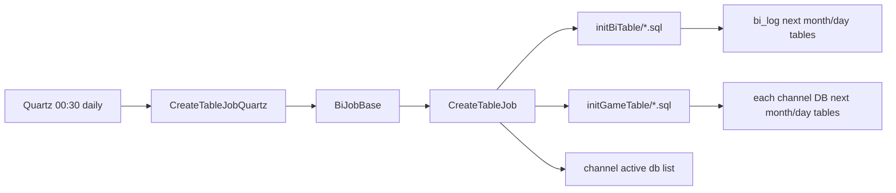
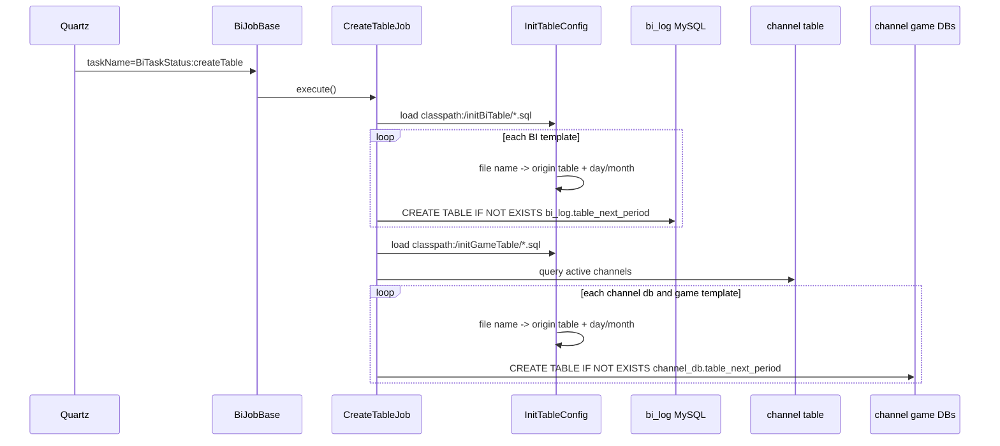

# partition-table-creation

## 閱讀定位

本文件是 `iwin game_job partition-table-creation Step 3` 主報告；Step 4 已把本 flow 轉成正式面試 case，Step 5 已完成 claim gate。

中文名稱：每日 / 每月分表建立。

掃描深度：Level 2。已讀 `CreateTableJob`、Quartz wrapper / registry、`InitTableConfig`、MyBatis create table mapper、BI / game SQL template、path-specific history 與 main / `origin/k3s` config。這不是 Level 3 逐檔逐行全 repo 鑑識。

證據層級：專案存在 / code-backed。這條 flow 目前沒有 Nick / `10gt12nc` direct path evidence；Step 5 判定不更新正式履歷 / 自傳，只作 table rollover / schema rollout / batch 前置依賴的可靠性面試素材。

## 白話導讀

`CreateTableJob` 是一條「先把明天或下個月需要的分表建好」的批次任務。

`game_job` 很多 flow 都依賴日期或月份分表，例如：

1. 遊戲局紀錄：`log_reel_{yyyy_m_d}`。
2. 金幣流水：`log_currency_{yyyy_m_d}`、`log_jackpot_{yyyy_m_d}`、`log_taxt_{yyyy_m_d}`。
3. payment reporting：`payment_order_{yyyy_m}`。
4. 玩家行為 / 下注 / VIP 類報表：`user_game_behaviour_{yyyy_m}`、`player_bet_{yyyy_m}`、`vip_bet_{yyyy_m}`。

如果明天的日表或下個月的月表沒有先建立，上游 writer、batch projection 或報表查詢可能在跨日 / 跨月時直接失敗。這條 job 的價值不是業務邏輯，而是 rollover reliability：讓表在真正被寫入前就存在。

## Code 分層對照

| 層級 | game_job path | 作用 |
| --- | --- | --- |
| Quartz config | `config/application-quartz.yml`、`src/main/resources/application-quartz.yml` | `createTable: 0 30 0 * * ?`，main 目前 `createTableEnable=false` |
| Quartz registry | `com.quartz.QuartzService` | enable 時註冊 `CreateTableJobQuartz` |
| Quartz wrapper | `com.quartz.CreateTableJobQuartz` | `@DisallowConcurrentExecution`，設定 `BiTaskEnums.CREATE_TABLE`、`DAILY`、`taskOverTime=300s` |
| 共用 job framework | `com.common.job.BiJobBase` | 管 task status、task log、timeout、finish 語意 |
| flow job | `com.job.system.CreateTableJob` | 載入 SQL template，對 BI / game DB 建下一期分表 |
| table config parser | `com.common.config.InitTableConfig` | 從檔名解析原始表名與 `day` / `month` 分表格式，計算下一天 / 下一月表名 |
| BI DAO | `ChannelDao.createBiTable`、`Channel.xml` | 對 `bi_log` 執行 classpath SQL template |
| Game DAO | `LogLoginDao.createGameTable`、`LogLoginDao.xml` | 對每個 channel DB 執行 classpath SQL template |
| SQL templates | `src/main/resources/initBiTable/*.sql`、`src/main/resources/initGameTable/*.sql` | 分表 schema 來源，使用 `${tableName}` placeholder |

## 最小架構圖



## 正常流程圖



## 正常流程逐步說明

1. `QuartzService.prepareJob()` 檢查 `jobProperties.getCreateTableEnable()`；enable 時註冊 `CreateTableJobQuartz`。
2. `CreateTableJobQuartz` 使用 `@DisallowConcurrentExecution`，避免同一 Quartz job 重疊執行。
3. wrapper 設定 task name 為 `BiTaskStatus:createTable`、task type 為 daily、timeout 為 5 分鐘，然後呼叫 `runTask()`。
4. `CreateTableJob.execute()` 先載入 `classpath:/initBiTable/*.sql`。
5. `InitTableConfig` 從檔名解析原始表名與分表格式，例如 `payment_order-month.sql` 代表 `payment_order_{nextYear}_{nextMonth}`，`log_reel-day.sql` 代表 `log_reel_{nextYear}_{nextMonth}_{nextDay}`。
6. BI template 固定對 `bi_log` DB 執行 `CREATE TABLE IF NOT EXISTS bi_log.{table}`。
7. job 再載入 `classpath:/initGameTable/*.sql`。
8. job 查 active channel list，取每個 channel 的 `db_name`。
9. 對每個 channel DB 執行 game table template，建立下一天或下一月分表。
10. 每張表的 create error 只記 log，不會中斷整個 job。

## 已確認分表範圍

BI 分表 template：

- 月表：`collect_mail`、`gold_daily_rank`、`ip_login_rank`、`partner_transid`、`payment_diamond`、`payment_order`、`player_bet`、`user_behaviour`、`user_game_behaviour`、`vip_bet`。
- 例外：`player_bet_demo-mouth.sql` 檔名是 `mouth`，不是 `month`；依目前 `InitTableConfig` 邏輯不會加月 suffix，會建立 `bi_log.player_bet_demo`。

Game 分表 template：

- 日表：`log_currency`、`log_jackpot`、`log_player_control_game`、`log_reel`、`log_rp_control_game`、`log_spin_bet`、`log_taxt`。
- 月表：`log_credit_card`、`log_daily_recharge`、`log_daletou_detail`、`log_day_task_detail`、`log_enter_x_game`、`log_event`、`log_every_recharge`、`log_first_recharge`、`log_gold_cow_detail`、`log_login`、`log_logout`、`log_quit_x_game`、`log_recharge_toplist`、`log_red_rain`、`log_share_money`、`log_validbet_toplist`、`log_vip_award`。

## Senior / Owner 深度區

### 1. Source of truth 邊界

這條 flow 的 source of truth 不是 DB 裡既有表，而是 classpath SQL template。它把 repo 內的 schema template 套到下一個日期 / 月份的實體表。

可面試講：分表建立不是業務功能，但它是 log writer、batch projection、報表查詢的前置依賴。

不可誇大：它不是 migration system，也不是 schema versioning platform。它只是以 SQL template 建下期表。

### 2. Date / month rollover

`InitTableConfig` 固定建立「下一天」或「下一月」：

- `day`：`origin_yyyy_m_d`
- `month`：`origin_yyyy_m`

這代表 job 若在 00:30 跑，會補明天的日表與下個月月表。日表每天建一次合理；月表每天重複執行，靠 `CREATE TABLE IF NOT EXISTS` 保持 idempotent。

### 3. Idempotency

這條 flow 的主要 idempotency 來自 SQL template 的 `CREATE TABLE IF NOT EXISTS`。

優點：

- 重跑通常不會因表已存在而失敗。
- 每天重跑月表 create 不會重建表。

限制：

- 如果 template schema 改了，已存在表不會自動 migrate。
- 如果昨天 job 沒跑，今天 job 只建下一期，不會自動補「昨天應該建立但沒建立」的表。
- `player_bet_demo-mouth.sql` 這種檔名錯誤不會被 job 發現，只會建立錯期望的表名。

### 4. Failure window

主要 failure window：

- SQL template 載入失敗：該類分表不會建，job 只記 log。
- 某張表 create 失敗：`checkAndCreateTable()` catch exception 後記 log，job 會繼續下一張表；最後 task 可能仍被視為完成。
- 某個 channel DB 建表失敗：其他 channel 可能成功，形成 partial success。
- channel list 查詢不完整或 channel `db_name` 錯誤：對應 game DB 不會有新分表。
- schema template 更新後，既有分表不會跟著更新，跨月可能出現新舊表 schema 不一致。
- job timeout 5 分鐘，若 channel 很多、template 很多或 DB 慢，可能在還沒完整建完所有 channel 前超時。

### 5. Observability

已確認：

- job 會記錄開始 / 結束。
- `CreateTableJob` 會記錄載入 SQL template 數量、每張表名與 create failure。
- `BiJobBase` 會處理 task log。

不足：

- 沒看到 per DB / per table 的成功失敗 summary。
- 沒看到 expected table count vs created / existed / failed count。
- 沒看到 failure 會讓整個 task fail 的強制語意。
- 沒看到 schema drift / missing table check。

### 6. Owner decision

如果我 owner 這條 flow，會先補三件事：

1. 啟動前檢查：掃 template 檔名，只允許 `day` / `month`，把 `mouth` 這類錯字 fail fast。
2. 結果彙總：每輪輸出 expected / created / existed / failed 表數，並依 DB / channel 維度列出失敗表。
3. 補建能力：允許指定日期 / 月份補建，而不是只能建下一天 / 下一月。

更進一步才考慮用 Flyway / Liquibase 之類 schema migration，但要先釐清這裡是「大量日期分表 rollover」，不是一般單表 migration。

## 面試 / 履歷邊界摘要

目前可以說：

- 已 code-backed 分析 `game_job` 的每日 / 每月分表建立 flow。
- 可用來面試說明 table rollover、schema template、`CREATE TABLE IF NOT EXISTS` idempotency、partial success 與 observability。
- 可串到 daily summary、coin flow、online payment data cleaning，說明為什麼 batch / writer 依賴分表先存在。

目前不能說：

- Nick 真實開發這條 flow。
- Nick 主導 schema migration / table rollover platform。
- production 實際啟用已驗證。
- 這條 flow 有完整 migration / rollback / schema drift 管理。

## 下一步建議

只推薦一件事：

```text
iwin iwin_gameserver center-http-deposit-withdraw Step 4
```

原因：本 flow Step 5 已完成 claim gate，正式履歷 / 自傳不更新，面試 case 保留為 code-backed；`game_job contribution claim consolidation` 已完成，下一步回到 `iwin_gameserver center-http-deposit-withdraw Step 4`。
