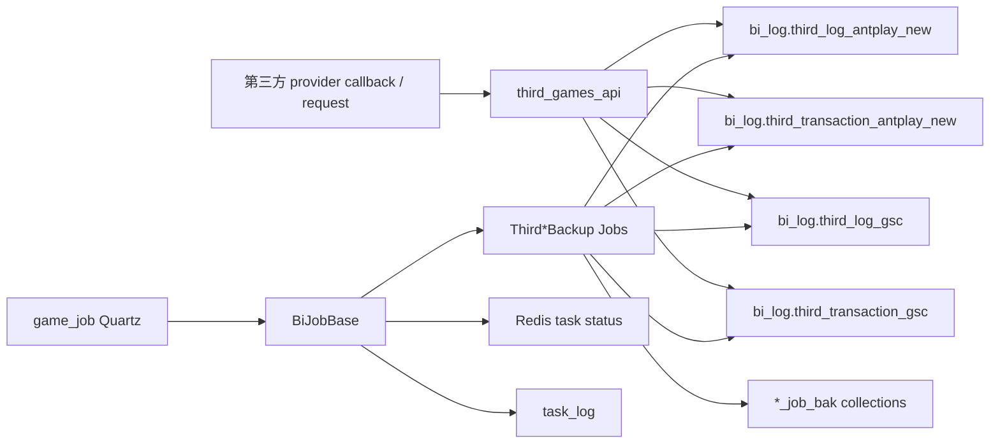
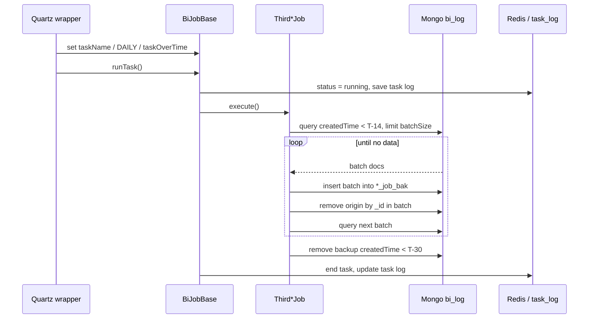

# third-party-record-mongo-backup

## 閱讀定位

本文件是 `iwin game_job third-party-record-mongo-backup Step 3` 主報告；Step 4 面試 case 與 Step 5 claim gate 已整理於 `career-interview.md` 與 `materials/claim-boundary.md`。

中文名稱：第三方遊戲紀錄 Mongo 備份與清理。

掃描深度：Level 2。已讀 `game_job` 的 Quartz 入口、backup job、VO mapping、共用 `BiJobBase`、Quartz config、path-specific commit history，並對照 `third_games_api` 的 Antplay / GSC Mongo writer。這不是 Level 3 逐 commit diff 全量鑑識，也不是 production issue 復盤。

證據層級：局部真實開發過 + code-backed；Nick / `10gt12nc` 有 GSC 分批查詢與 batch size 調整 commit，可保守寫成局部參與，不可擴大成完整 backup owner。

本 flow 不是 wallet source of truth。它比較像第三方遊戲 provider log / transaction 的 audit retention job：把超過保留門檻的 Mongo 文件從 active collection 搬到 backup collection，再清掉更舊的 backup。

## 白話導讀

第三方遊戲 provider 會在 `third_games_api` 寫入 Mongo `bi_log`：

- Antplay new：`third_log_antplay_new`、`third_transaction_antplay_new`。
- GSC：`third_log_gsc`、`third_transaction_gsc`。

`game_job` 每 5 秒可排程跑備份 job。job 會找出 `createdTime` 早於 14 天前零點的資料，分批 insert 到 `{collection}_job_bak`，再用 `_id` 從原 collection 刪除。最後再刪掉 backup collection 裡 `createdTime` 早於 30 天前零點的資料。

換句話說，它的正常意圖是：

```text
active Mongo collection 保留近 14 天
舊資料搬到 backup collection
backup collection 只保留近 30 天
```

這條 flow 的 Senior 價值不在演算法，而在「copy 後 delete」不是一個跨 collection transaction。只要中間某一步失敗，就會出現 active / backup 重複、backup 可能重複 insert、delete count 不一致、retention 被錯誤日期欄位影響等風險。

## Code 分層對照

| 層級 | game_job path | 作用 |
| --- | --- | --- |
| Quartz config | `config/application-quartz.yml` | 設定 Antplay new / GSC backup cron 與 enable flag |
| Quartz wrapper | `com.quartz.ThirdLogAntplayNewJobQuartz` 等 4 支 | 設定 task name / task type / timeout，呼叫 `runTask()` |
| 共用 job framework | `com.common.job.BiJobBase` | 檢查 job 是否可跑、寫 Redis task state、寫 task log、捕捉 exception |
| flow job | `com.job.biTask.ThirdLogAntplayNewJob` 等 4 支 | 查 old docs、insert backup、delete origin、delete old backup |
| Mongo dynamic db | `com.common.database.MongoDynamicTemplate` | 切到 `bi_log` 後操作 Mongo |
| 文件 mapping | `ThirdLogAntplayNewVO`、`ThirdTransactionAntplayNewVO`、`ThirdLogGscVO`、`ThirdTransactionGscVO` | 用 `@Id String id` 對應 Mongo `_id`，用 `createdTime` 判斷保留門檻 |
| upstream writer | `third_games_api` 的 `AntplayController`、`GscController` | 寫入 active collection，並帶 `createdTime` |

## 最小架構圖



## 正常流程圖



## 正常流程逐步說明

1. `QuartzService` 依 enable flag 註冊對應 job。`main` 目前 Antplay new 兩支 job enable 為 true，GSC 兩支 job enable 為 false；production 實際狀態待部署設定確認。
2. Quartz wrapper 使用 `@DisallowConcurrentExecution`，設定 `BiTaskEnums` task name、`BITaskTypeEnums.DAILY`、`taskOverTime=600`，再呼叫 `runTask()`。
3. `BiJobBase.runTask()` 先執行 `execBefore()` 與 `checkStart()`，接著把 Redis task status 設為 running，寫入 task log。
4. job 的 `execute()` 進入 `handleBackup()`，固定做兩段：`backup(14, origin, backup)` 與 `removeBackupOldData(30, backup)`。
5. `backup()` 用 `LocalDate.now().minusDays(14).atStartOfDay()` 算出門檻，查 `createdTime < targetDate`。
6. 每次查一批：
   - Antplay new log / transaction：`BATCH_SIZE = 1000`。
   - GSC log：`BATCH_SIZE = 10000`。
   - GSC transaction：`BATCH_SIZE = 2500`。
7. job 將整批文件 insert 到 `{origin}_job_bak`。
8. job 從 batch 文件取出 `id`，用 `_id in idList` 從 origin collection 刪除。
9. 重複查下一批，直到沒有符合門檻的文件。
10. `removeBackupOldData(30)` 再刪除 backup collection 中 `createdTime < today - 30 days startOfDay` 的文件。
11. 若流程沒有 exception，`BiJobBase` 更新 task log 為成功；若有 exception，task log 會被標成失敗。

## 已確認 collection 與保留策略

| Provider | Active collection | Backup collection | active 搬移門檻 | backup 清理門檻 | main config |
| --- | --- | --- | --- | --- | --- |
| Antplay new log | `third_log_antplay_new` | `third_log_antplay_new_job_bak` | `createdTime < T-14` | `createdTime < T-30` | enable true |
| Antplay new transaction | `third_transaction_antplay_new` | `third_transaction_antplay_new_job_bak` | `createdTime < T-14` | `createdTime < T-30` | enable true |
| GSC log | `third_log_gsc` | `third_log_gsc_job_bak` | `createdTime < T-14` | `createdTime < T-30` | enable false |
| GSC transaction | `third_transaction_gsc` | `third_transaction_gsc_job_bak` | `createdTime < T-14` | `createdTime < T-30` | enable false |

## 已確認 upstream writer

`third_games_api` 會寫入本 flow 清理的 active collections：

- `AntplayController` 寫 `third_log_antplay_new`，包含 type、game、account、betId、bet、win 類欄位與 `createdTime`。
- `AntplayController` 寫 `third_transaction_antplay_new`，包含 account、game、betId、bet、step、win 類欄位與 `createdTime`。
- `GscController` 寫 `third_log_gsc`，包含 type、member account、transactions、betId、bet / prize amount 與 `createdTime`。
- `GscController` 寫 `third_transaction_gsc`，包含 step、operator / product、member account、transactions、betId、bet / prize amount、balance 類欄位與 `createdTime`。

本次只確認 writer 與 collection 關係，沒有深挖 provider 投注 / 派彩 / rollback 的完整交易語意。

## Senior / Owner 分析

### State 與資料責任

| State | 說明 | Owner 問題 |
| --- | --- | --- |
| active collection | provider log / transaction 近期資料 | 是否作為客服查詢、audit、provider dispute 的主要入口 |
| backup collection | active 舊資料搬移後的保留 copy | 是否允許 duplicate，是否需要查詢入口與索引 |
| deleted from active | 已搬進 backup 後從 active 刪除 | delete count 是否必須等於 copied count |
| deleted from backup | 超過 30 天後 hard delete | 是否符合 audit / compliance / dispute 保留期 |
| Redis task status / task log | job 執行狀態 | 只能表示 job execution，不等於資料已完全一致 |

### Transaction boundary

目前 code 看不到跨 collection transaction：

```text
find active batch
insert backup batch
delete active by _id
```

這代表「備份成功」與「原資料刪除成功」不是同一個 atomic unit。對 retention job 來說，這不一定錯，但要有明確 owner decision：寧可 duplicate，不可丟資料；若 duplicate 會影響查詢或稽核，就要做 idempotent key 或 reconciliation。

### Idempotency

目前 flow 的 idempotency 依賴幾個未完全確認的前提：

- backup insert 是否保留原 Mongo `_id`。
- backup collection 是否用同一 `_id` 建唯一約束。
- `mongo.insert(batch, backupCollection)` 遇到部分已存在時是整批失敗、部分成功，還是丟 duplicate key exception。
- origin delete count 是否等於 batch size。

若 insert backup 成功但 delete origin 失敗，下次重跑會再讀到同一批 active docs，可能再次 insert backup。若 backup collection 用相同 `_id`，可能丟 duplicate key；若沒有唯一性，可能出現 backup duplicate。

### Failure windows

| 失敗點 | 可能結果 | 目前觀測 | 建議 owner decision |
| --- | --- | --- | --- |
| query active 失敗 | 本輪不搬資料 | task log failure | 告警，保留 active，風險較低 |
| insert backup 失敗 | origin 通常不會 delete | task log failure | 保持先 copy 後 delete；確認 partial insert 行為 |
| insert backup 部分成功後 exception | origin 不 delete，但 backup 可能有部分資料 | 未見 run id / copied count reconciliation | backup 要 idempotent，或補 reconciliation |
| delete origin 失敗 | active + backup 同時存在 | log delete count / task failure 視 exception 而定 | 寧可 duplicate；下輪需可重跑 |
| delete count 小於 batch size | 部分 active 仍在，下輪可能重複備份 | 目前只 log deleted count | 若 count 不一致應標失敗或告警 |
| remove old backup 失敗 | backup 保留較久，storage 增長 | task log failure | Storage monitor / retention alert |
| remove old backup 誤刪 | audit copy 遺失 | 無 restore / quarantine evidence | retention policy 需由業務 / audit 確認 |

### Consistency 與查詢邊界

這條 flow 會把 14 天以前的 active 資料搬走。因此查詢端如果只查 active collection，就只看得到近 14 天；如果要查舊資料，必須知道要查 `_job_bak`。本次未掃 app_bi 或客服後台是否查 backup collection，因此不能宣稱查詢鏈路完整。

### Retention policy

目前 code 的 retention 是 hard-coded：

- active：14 天。
- backup：30 天。

注意這裡都是用文件的 `createdTime`，不是 backup insert time。若 upstream 寫入延遲、補寫舊單、或 `createdTime` 語意不是 provider event time，就會影響保留窗口。`a6268cb` 曾把 VO 的時間欄位改成 ISODate，代表日期型別曾經是實際 correctness 風險。

### Concurrency

`@DisallowConcurrentExecution` 可以避免同一 scheduler instance 上同一 Quartz job 重疊執行。但本次未確認：

- Quartz 是否 cluster mode。
- 多個 `game_job` instance 是否共用鎖。
- `TestController` 的 GSC 手動 endpoint 是否會與 Quartz 同時跑。

因此只能保守寫：單 instance 同 job 有防重疊；distributed / manual overlap 待確認。

### Observability

已確認：

- 每批 backup count 會寫 log。
- delete count 會寫 log。
- `BiJobBase` 會寫 task log status。
- Redis task status 會標 running / end。

缺口：

- 沒有看到 copied count、deleted count、remaining count 的持久 reconciliation 表。
- 沒有看到 delete count != batch size 的錯誤升級。
- 沒有看到 backup duplicate / duplicate key 的專用處理。
- 沒有看到 storage threshold 或 retention alert。

## Owner decision 建議

1. 明確定義資料責任：active collection 是近 14 天查詢入口，backup collection 是 30 天內 audit copy，還是只作 storage relief。
2. 把 backup 設計成 idempotent：保留原 `_id`，backup collection 以 `_id` unique，使用 bulk upsert / duplicate-safe write，讓重跑不怕重複。
3. 每批檢查 `inserted/copied count` 與 `deleted count`。若 delete count 小於 batch size，應告警或標失敗。
4. 加入 job run id / copiedAt / source collection / threshold date，讓事後查帳能知道某批資料是哪次 job 搬的。
5. production 若多 instance，補 distributed lock 或確認 Quartz cluster locking。
6. retention policy 不應只由 code hard-code；應對齊客服查詢、provider dispute、audit / compliance。

## 面試 / 履歷邊界摘要

可面試講：

- 我讀過並能分析第三方遊戲 provider log / transaction Mongo retention job。
- 這類 job 的核心風險不是 CRUD，而是 copy-then-delete 的 partial failure、idempotency、duplicate backup、retention policy 與 observability。
- 如果由我 owner，我會先定義保留策略，再把 backup 寫成 duplicate-safe，並補 copied / deleted reconciliation。

目前不可寫正式履歷：

- 不可說 Nick 主導第三方遊戲紀錄備份。
- 不可說 Nick owner 完整 Antplay / GSC audit retention。
- 不可說這條 flow 已改善查帳效率或 storage 成本。

Step 5 已完成，`10gt12nc` 的 GSC 分批查詢 / batch size 調整 commit 可保守升級成「局部真實開發過」；仍不可擴大成完整第三方紀錄備份 owner。

## 下一步建議

只推薦一件事：

```text
iwin game_job partition-table-creation Step 5
```

原因：

- 本 flow Step 5 已完成，claim 已收斂為局部真實開發過。
- `coin-flow-batch-projection` Step 5 已完成，正式履歷 / 自傳不更新。
- `partition-table-creation` Step 4 已完成，下一步做 Step 5 claim gate。
