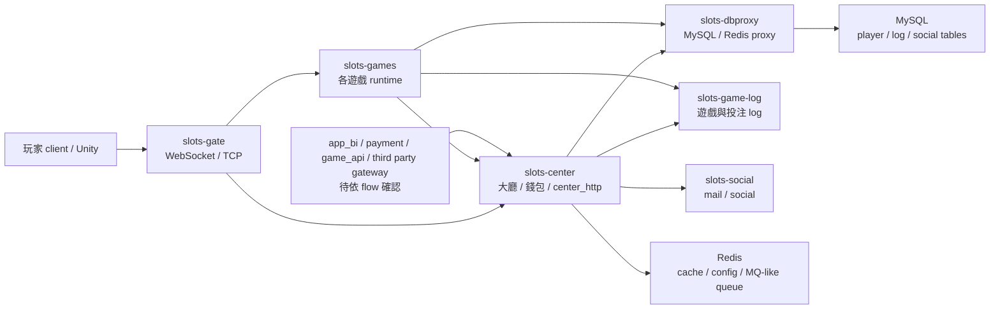

# iwin_gameserver Architecture Map

更新時間：2026-05-15
掃描等級：Level 1 Flow 掃描
狀態：初版最小架構地圖
證據層級：專案存在 / code-backed；Nick 貢獻待確認

## 閱讀定位

本文件只用來定位 repo、module、入口、上下游與候選 flow。它不是單條 flow 報告，也不取代 `flow.md`。

## 最小架構圖

## Module 定位

| Module | 角色 | Senior / Owner 關注 |
| --- | --- | --- |
| `slots-gate` | 玩家連線入口、WebSocket / TCP codec、轉發到 center / game | connection state、routing、封包序號、防攻擊、backpressure |
| `slots-center` | 大廳、玩家 cache、center_http、錢包與活動 / 打碼 / 第三方整合入口 | money correctness、state transition、transaction boundary、idempotency |
| `slots-games` | 各遊戲 runtime 與共同遊戲抽象 | spin / bet / settle、RTP、機率、玩家狀態、投注流水 |
| `slots-dbproxy` | MySQL / Redis 查寫代理 | cache-aside、write path、dynamic SQL、partial failure |
| `slots-game-log` | log writer / cron 類工作 | betting log、reconciliation、reporting source |
| `slots-social` | 郵件 / social 類服務 | 輔助功能，暫非高優先 |
| `slots-common` | network、Protobuf、Redis、Zookeeper、controller、dao annotation | common infrastructure、服務發現、RPC callback |

## 已確認入口

HTTP / center command：

- `slots-center/src/main/java/com/slots/center/service/HttpService.java`
- 指令包含 `DEPOSIT`、`WITHDRAW`、`SET_BET_TARGET`、`QUERY_BET_TARGET`、`NOTICE`、`ANTPLAY_BET`、`ANTPLAY_SETTLE`、`ANTPLAY_REFUND`、`ANTPLAYTRANSFERINOUT`、`PGTRANSFERINOUT`、`GSC_BET`、`GSC_SETTLE`、`GSC_REFUND`、`GSC_OTHER`。

DB proxy：

- `slots-common/src/main/java/com/slots/common/controller/DbproxyController.java`
- `slots-dbproxy/src/main/java/com/slots/dbproxy/controller/DbController.java`
- `slots-dbproxy/src/main/java/com/slots/dbproxy/database/mapper/DbproxyMapper.java`

第三方遊戲 / 投派整合：

- `slots-center/src/main/java/com/slots/sql/job/HttpAntplayTransferInOut.java`
- `slots-center/src/main/java/com/slots/sql/job/HttpPGTransferInOut.java`
- `slots-center/src/main/java/com/slots/sql/job/HttpGSCTransferInOut.java`
- `slots-center/src/main/java/com/slots/center/job/http/AntplayTransferInOutJob.java`
- `slots-center/src/main/java/com/slots/center/job/http/PGTransferInOutJob.java`
- `slots-center/src/main/java/com/slots/center/job/http/GSCTransferInOutJob.java`
- `slots-games/slots-game-common/src/main/java/com/slots/game/common/data/AddCenterCoinAP.java`
- `slots-games/slots-game-common/src/main/java/com/slots/game/common/data/AddCenterCoinPG.java`
- `slots-games/slots-game-common/src/main/java/com/slots/game/common/data/AddCenterCoinGSC.java`

遊戲 runtime / spin 共同層：

- `slots-games/slots-game-common/src/main/java/com/slots/game/common/data/GamePlayer.java`
- `slots-games/slots-game-common/src/main/java/com/slots/game/common/data/AddCenterCoin.java`
- `slots-games/slots-game-common/src/main/java/com/slots/game/common/job/c2s/**`
- `slots-games/slots-game-common/src/main/java/com/slots/game/common/ruler/**`
- `slots-games/slots-game-common/src/main/java/com/slots/game/common/def/**`

## 跨專案關聯

已確認：

- `payment` 會透過 center_http 呼叫 `DEPOSIT`、`WITHDRAW`、`SET_BET_TARGET`、`QUERY_BET_TARGET`、`NOTICE`。
- `game_api` 會透過 center_http 查玩家、上分、下分，且不一定經過 `payment`。
- `app_bi` 可透過 center_http / Redis / GM command 影響 runtime 設定或查詢。

待確認：

- 第三方遊戲整合上游實際 repo 與 callback / request adapter。
- 每條 flow 的唯一請求 ID / transaction ID / bet ID 是否有全鏈路 idempotency。
- gameserver log 與 payment / game_api / third_games_api 對帳欄位如何對齊。

## 不可誇大的地方

- 本地 code 確認功能存在，不等於 Nick 真實開發過。
- workspace 舊分析只作參考，不當成履歷 evidence。
- 本文件不含 production URL、內網 IP、token、客戶資料。
