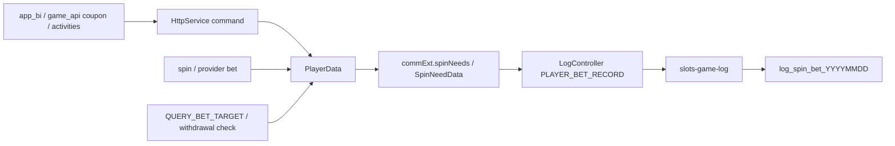
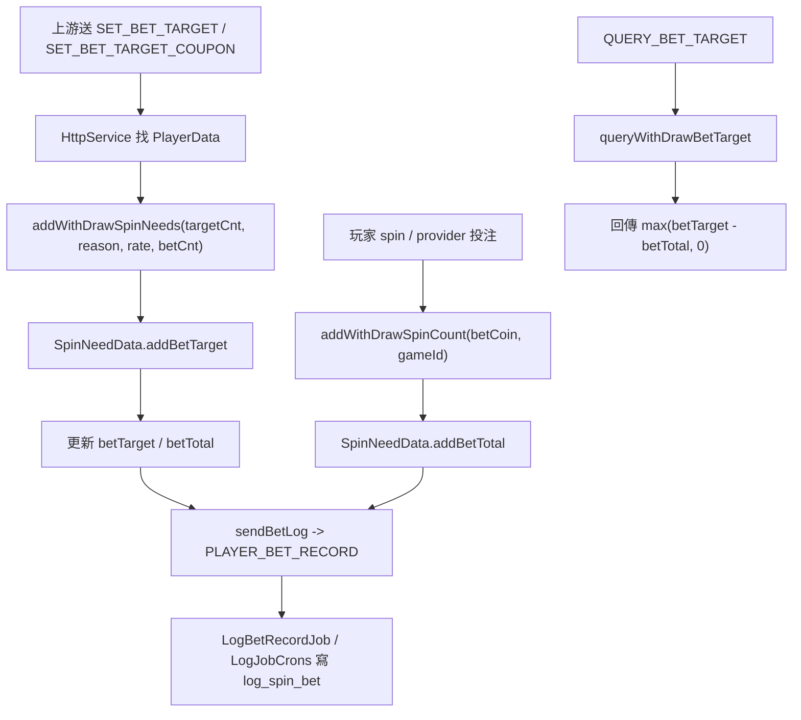

# bet-target-set-query

## 閱讀定位

### Flow 類型與閱讀定位

- Flow 類型: Query / Runtime Support Flow
- 所屬大系統: iwin_gameserver bet target set query
- 面試用途: 輔助 case / runtime query
- 閱讀方式: 先看查詢目標與資料來源，再掛回遊戲 runtime / 營運控制情境。
- 不要期待: 這不是完整下注結算閉環。

- Flow 中文名稱：打碼目標設定 / 查詢 / 投注扣減
- Flow slug：`bet-target-set-query`
- 完成狀態：Step 5 completed
- 掃描等級：Level 2 Flow 深掃
- 證據層級：分層 claim。coupon 打碼目標入口是真實開發過 + code-backed；一般 BI / payment / app_bi 查詢與完整打碼系統 owner 為 code-backed / interview-only
- 本 flow 是：money rule / withdrawal gating rule / log projection
- 是否更新正式履歷 / 自傳：否。Step 5 不新增獨立 gameserver 打碼履歷 bullet；coupon 打碼入口只作既有 coupon / gameserver supporting evidence

## 白話導讀

這條 flow 在管「玩家拿到錢或優惠後，要再投注多少才算完成打碼，可以提款」。

它不是單純查一個欄位。真正的主線有三段：

1. 後台、活動、coupon 或其他系統替玩家增加打碼目標。
2. 玩家之後下注 / spin / 第三方 provider 投注時，系統累積已打碼量。
3. 查詢或提款檢查時，系統用「目標 - 已打碼」判斷玩家還差多少。

這條 flow 的風險是 money rule correctness：打碼目標算少，會讓玩家過早提款；打碼目標算多，會造成玩家無法提款或客服爭議；log 失敗則會讓後續稽核與排查困難。

## 初中階 Code 分層對照

```text
HTTP command：
  HttpService.doCommand()
  SET_BET_TARGET
  SET_BET_TARGET_COUPON
  QUERY_BET_TARGET

HTTP handler：
  HttpService.setPlayerBetTarget()
  HttpService.setPlayerBetTargetCoupon()
  HttpService.queryPlayerBetTarget()

Domain state：
  PlayerData.addWithDrawSpinNeeds()
  PlayerData.queryWithDrawBetTarget()
  PlayerData.addWithDrawSpinCount()
  PlayerData.resetWithDrawLimit()

State object：
  SpinNeedData.betTarget
  SpinNeedData.betTotal

Reason enum：
  SpinBetTargetConst.BI_HANDLE
  SpinBetTargetConst.COUPON
  SpinBetTargetConst.WITH_DRAW
  SpinBetTargetConst.REST_BET_TARGET
  activity / recharge / vip reasons

Log projection：
  SpinNeedData.sendBetLog()
  GameEnum.eGameLogType.PLAYER_BET_RECORD
  LogBetRecordJob
  LogJobCrons PLAYER_BET_RECORD
  Mapper.batchInsertBetRecord()
  log_spin_bet_YYYYMMDD
```

## 最小架構圖



## 正常流程圖



## 正常流程逐步說明

1. 上游透過 center_http command 送 `SET_BET_TARGET`、`SET_BET_TARGET_COUPON` 或 `QUERY_BET_TARGET`。
2. `HttpService.doCommand()` 根據 command 分派到對應 method。
3. `SET_BET_TARGET` 呼叫 `setPlayerBetTarget(accountId, targetCnt)`，使用 `SpinBetTargetConst.BI_HANDLE`。
4. `SET_BET_TARGET_COUPON` 呼叫 `setPlayerBetTargetCoupon(accountId, targetCnt)`，使用 `SpinBetTargetConst.COUPON`。
5. `PlayerData.addWithDrawSpinNeeds()` 先排除內部帳號，再從 `commExt` 讀取 `spinNeeds`。
6. `SpinNeedData.addBetTarget()` 依既有目標是否完成，決定重設或累加 `betTarget`，並把 `betTotal` 歸零或保留。
7. `SpinNeedData.sendBetLog()` 發送 `PLAYER_BET_RECORD` 到 log server。
8. 玩家後續一般 spin 或 provider 投注時，`PlayerData.addWithDrawSpinCount()` 會累加 `betTotal`。
9. `QUERY_BET_TARGET` 呼叫 `PlayerData.queryWithDrawBetTarget()`，回傳剩餘打碼目標。
10. 提現或特殊條件下會呼叫 `resetWithDrawLimit()` / `resetSpinNeed()` 清掉目標。

## 業務問題

這條 flow 服務的是提款前的 wagering / turnover rule：

- 玩家收到 bonus / coupon / activity award 後，需要投注到一定量。
- 系統要知道玩家還差多少打碼量。
- 客服、後台或提款檢查要能解釋為什麼玩家不能提款。

錯誤後果：

- 目標未設定：玩家可能過早提款。
- 已打碼未累加：玩家明明投注了卻仍被限制。
- 目標重複累加：玩家被要求過高打碼。
- log 缺失：客服和稽核難以還原 target change / bet total。

## 系統位置

- 專案：`iwin_gameserver`
- module：`slots-center`、`slots-game-log`
- runtime state：`PlayerData.commExt.spinNeeds`
- log：`PLAYER_BET_RECORD` -> `log_spin_bet_YYYYMMDD`
- 上游已確認：center_http command；coupon command 有 direct commit evidence
- 下游待確認：app_bi 查詢 / payment 提款檢查 / game_api coupon caller 的完整 request contract

## 入口與 code path

已確認：

- `slots-center/src/main/java/com/slots/center/service/HttpService.java`
  - `SET_BET_TARGET`
  - `SET_BET_TARGET_COUPON`
  - `QUERY_BET_TARGET`
  - `setPlayerBetTarget()`
  - `setPlayerBetTargetCoupon()`
  - `queryPlayerBetTarget()`
- `slots-center/src/main/java/com/slots/center/data/PlayerData.java`
  - `addWithDrawSpinNeeds()`
  - `addWithDrawSpinCount()`
  - `queryWithDrawBetTarget()`
  - `resetWithDrawLimit()`
- `slots-center/src/main/java/com/slots/center/data/SpinNeedData.java`
  - `addBetTarget()`
  - `addBetTotal()`
  - `queryPlayerBetTarget()`
  - `sendBetLog()`
- `slots-center/src/main/java/com/slots/center/config/SpinBetTargetConst.java`
  - `BI_HANDLE`
  - `COUPON`
  - `REST_BET_TARGET`
  - activity / recharge / vip reason
- `slots-game-log/src/main/java/com/slots/game/job/player/LogBetRecordJob.java`
- `slots-game-log/src/main/java/com/slots/game/LogJobCrons.java`
- `slots-game-log/src/main/java/com/slots/game/sql/mapper/Mapper.java`

## 資料與狀態

| 狀態 | 來源 | 說明 |
| --- | --- | --- |
| `betTarget` | `SpinNeedData` | 目前要求玩家完成的總打碼目標 |
| `betTotal` | `SpinNeedData` | 玩家已累積的打碼量 |
| `spinNeeds` | `PlayerData.commExt` | 玩家打碼目標與已打碼量的 runtime / persisted extension |
| `targetType` | `SpinBetTargetConst` | 來源原因，例如 BI、coupon、activity、withdraw reset |
| `targetChange` | `PlayerBetRecordRq` | 本次目標變化量 |
| `betCnt` | `PlayerBetRecordRq` | 本次投注 / 打碼累加量 |
| `log_spin_bet_YYYYMMDD` | log server | 打碼目標與已打碼量變更紀錄 |

## State transition

```text
無打碼目標
-> SET_BET_TARGET / SET_BET_TARGET_COUPON
-> betTarget = targetCnt * betRate, betTotal = 0
-> 玩家投注後 addBetTotal
-> betTotal 累加
-> query 回 betTarget - betTotal
-> betTotal >= betTarget 時 query 回 0 / check 通過
-> 提現或低餘額 reset 時清除 spinNeeds
```

## Consistency / idempotency

已確認：

- `addBetTarget()` 會在舊目標已完成時重置，在未完成時累加目標。
- `queryPlayerBetTarget()` 在 `betTotal >= betTarget` 時回 0。
- 內部帳號不維護打碼量。
- 每次 target / betTotal 變更都會送 `PLAYER_BET_RECORD` log。

風險 / 待確認：

- `HttpService.setPlayerBetTarget()` 直接 `findPlayer(accountId)`，目前未看到 offline fallback；若玩家不在線可能 NPE 或失敗，需確認上游是否只對在線玩家呼叫。
- `SET_BET_TARGET` / coupon command 未看到 request idempotency key；上游重送可能重複累加目標。
- `SpinNeedData` 在 `commExt` 中更新，需再確認 save / flush / DB persistence 時機。
- log server failure 不影響打碼目標本身，但會影響後續 audit。

## Failure window

| 情境 | 可能結果 | Owner 觀察點 |
| --- | --- | --- |
| 上游重送 `SET_BET_TARGET_COUPON` | `betTarget` 重複累加 | 需要 request id / coupon id guard |
| 玩家離線但上游呼叫設定 | 找不到 `PlayerData` 可能失敗 | 需確認是否要 `PlayerCache.loadToCache` |
| 設定成功但 log server 失敗 | rule 生效但 audit 缺紀錄 | 需補 durable log / replay |
| 玩家投注成功但 `addWithDrawSpinCount` 未跑 | 打碼未扣減，玩家不能提款 | 需用 spin / provider bet log 對帳 |
| 提現 reset 與投注累加交錯 | 目標或已打碼量可能被不預期清空 | 需明確 transaction / ordering |

## Observability

已確認：

- `SpinNeedData` 會記錄 target / total / count 的 system log。
- `PLAYER_BET_RECORD` 會進 log server。
- `LogBetRecordJob` / `LogJobCrons` 分日寫 `log_spin_bet_YYYYMMDD`。

建議補強：

- 用 `uid + sourceType + sourceBillNo/couponId + timestamp` 串 target change。
- 對 `SET_BET_TARGET` command 增加上游 request id。
- 建查詢視角：目前 `betTarget`、`betTotal`、最近 target change、最近 bet accumulation。

## Owner decision

1. 打碼目標是提款規則，不是單純後台設定。
2. `betTarget` 是 rule state，`betTotal` 是投注累積 state，兩者都要可 audit。
3. coupon 類 target 必須避免重複設定，否則玩家會被多要求打碼。
4. `log_spin_bet` 是 audit source，不是 rule source；缺 log 不代表 rule 沒生效。
5. offline player / cache persistence 是後續若要升級 claim 時要追的重點。

## 面試 / 履歷邊界摘要

可面試講：

- 我追過 iwin_gameserver 的打碼目標設定 / 查詢 flow，能說明 target 設定、投注累積、提款檢查與 audit log 的邊界。
- coupon 打碼目標入口有 Nick / `10gt12nc` direct commit evidence，可作 project-level coupon / bet target supporting evidence。

目前不直接寫正式履歷：

- 不新增獨立 `iwin_gameserver 打碼系統` 履歷 bullet。
- coupon 打碼入口可支撐既有 `game_api coupon` / gameserver supporting evidence。
- payment / app_bi / 一般 BI handle / 完整 wagering rule engine 不升級成 Nick 個人成果。

## Step 4 面試 case 摘要

本 flow 已完成 Step 4，已轉成正式面試 case。面試時可以用三段講：

1. target setup：`SET_BET_TARGET` / `SET_BET_TARGET_COUPON` 進 `HttpService`，更新 `SpinNeedData.betTarget`。
2. bet accumulation：一般 spin / provider bet 成功後累加 `SpinNeedData.betTotal`。
3. query / audit：`QUERY_BET_TARGET` 回剩餘打碼量，`PLAYER_BET_RECORD` 寫 `log_spin_bet` 作 audit。

正式面試重點：

- `SpinNeedData` 是 rule state，`log_spin_bet` 是 audit source。
- coupon / BI command 若 timeout 重送，未防重時可能重複累加 target。
- `HttpService` 直接 `findPlayer(accountId)`，offline player 行為仍待未來補 evidence。
- 投注成功但 `betTotal` 未累加時，需要用 game / provider bet log 與 `PLAYER_BET_RECORD` reconciliation。
- coupon 打碼入口有 Nick / `10gt12nc` direct commits，但不擴張成完整 wagering rule engine owner。

本輪不更新正式履歷 / 自傳。Step 5 claim gate 已完成：這條 flow 保留為 money rule 面試素材，coupon 打碼入口只作 project-level supporting evidence。

## Step 5 Claim Gate

本 flow 已完成 Step 5。結論必須拆開看：

| 範圍 | 證據層級 | 判斷 |
| --- | --- | --- |
| `SET_BET_TARGET_COUPON` / `COUPON` reason / coupon `betCnt` 修正 | 真實開發過 + code-backed | Nick / `10gt12nc` 有 direct commits，可作 coupon 打碼入口 supporting evidence |
| `SpinNeedData` 的 `betTarget` / `betTotal` core rule | 專案存在 / code-backed | 可面試講 state transition 與 owner risk；不寫成 Nick 設計完整 rule engine |
| `SET_BET_TARGET` BI 人工設定 | 專案存在 / code-backed | app_bi 有 caller，但未見 Nick direct evidence；interview-only |
| `QUERY_BET_TARGET` payment / app_bi 查詢 | 專案存在 / code-backed | payment / app_bi 有 caller；可講提款檢查關聯，不寫成 Nick 主導 payment / BI |
| offline player / idempotency / persistence / production incident | 待確認 | 只能作 owner improvement，不得宣稱已完成 |

正式履歷 / 自傳：

- 不新增獨立「負責 iwin_gameserver 打碼系統」或「設計 wagering rule engine」。
- 可以在面試或 project evidence 中保守說：coupon 兌換 path 有打碼目標設定入口 direct commits，能說明 coupon reward、wagering target、投注累加與 audit log 的一致性風險。
- 若未來要寫入 `05` / `08`，應透過 `game_api` / `iwin_gameserver` project-level consolidation 回填，而不是直接由本單條 flow 寫入。

## 下一步

```text
iwin third_games_api gsc-transfer-bet-settle-rollback Step 5
```

原因：

- `bet-target-set-query` 已完成 Step 5 claim gate。
- `iwin_gameserver` 本批前四條代表 flow 均已收斂；Career Track rolling consolidation 已存在，本輪只回填本 flow 邊界。
- 依目前 queue，下一個最直接可做的是 `third_games_api gsc-transfer-bet-settle-rollback Step 5`，完成 project-local flow claim gate。
