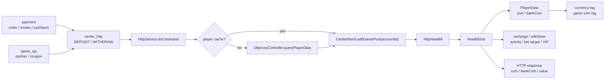
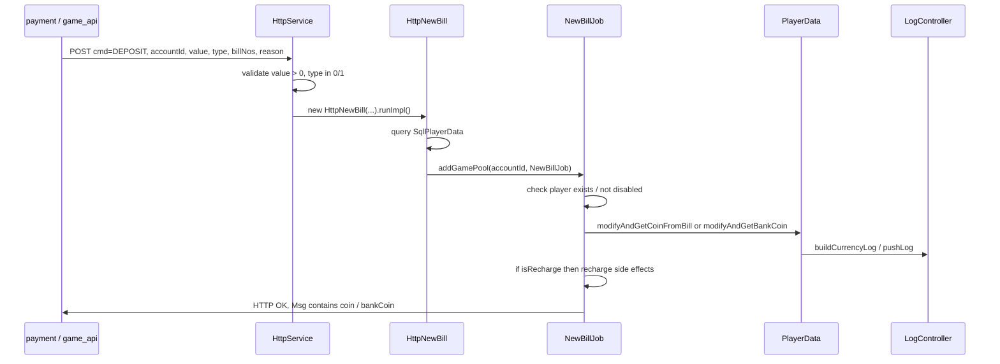
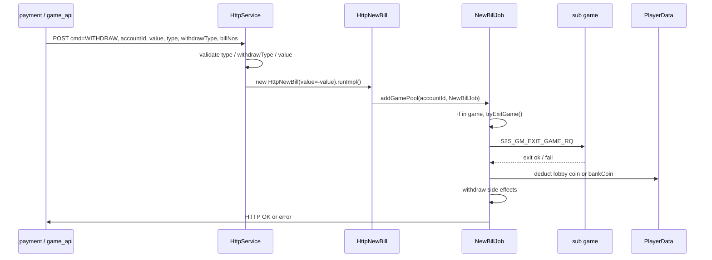

# center-http-deposit-withdraw

中文名稱：center_http 玩家上分 / 下分
Step：5
掃描等級：Level 2 單條 flow 深掃
證據層級：專案存在 / code-backed；Nick 貢獻依三層 claim gate 判斷

## 閱讀定位

這條 flow 不是「完整金流訂單系統」，而是 `iwin_gameserver` 在 center_http 收到上游指令後，真正改玩家 runtime 錢包的路徑。

白話說：

- `payment`、`game_api` 或其他上游服務先決定「這筆錢要加 / 扣」。
- 上游用 HTTP 打到 gameserver 的 center_http，帶 `cmd=DEPOSIT` 或 `cmd=WITHDRAW`、`accountId`、`value`、`type`、`billNos`、`reason` 等欄位。
- `iwin_gameserver` 把請求排進玩家對應的 game pool，查玩家資料、檢查狀態，再改大廳錢包或銀行錢包。
- 改完後寫 currency log、推送玩家餘額變更、做充值 / 提現相關 side effects，最後回 HTTP 結果給上游。

這份 Step 3 的重點是讓 Nick 能看懂「gameserver 怎麼改錢」、「哪裡可能重複加扣」、「哪些責任應該留在 payment / game_api」，不把它誇大成 Nick 主導完整金流 owner。

## Code 分層對照

| 層級 | 主要 code | 責任 |
| --- | --- | --- |
| 上游訂單 / API | `payment` 的 `PayTypeServiceImpl`、`BaseServiceImpl.upperDeposit()`；`game_api` 的 `PartnerServiceImpl`、`CouponRedeemServiceImpl`、`GmIntfcComponent` | 建立訂單、檢查提款條件、產生 `billNos`，呼叫 gameserver center_http |
| HTTP 指令入口 | `slots-center/.../HttpService.java` | 解析 `cmd`、`accountId`，找 player cache / DB，將 job 放進玩家 game pool |
| 上分 / 下分參數驗證 | `HttpService.onDeposit()`、`HttpService.onWithdraw()` | 驗 `value`、`type`、`withdrawType`，建立 `HttpNewBill` |
| SQL job wrapper | `slots-center/.../sql/job/HttpNewBill.java` | 查 `SqlPlayerData`，建立 `NewBillJob`，再排進 `CenterWorld.addGamePool(accountId, job)` |
| 實際錢包變更 | `slots-center/.../job/http/NewBillJob.java` | 檢查玩家、遊戲中狀態、改大廳 / 銀行餘額、處理充值 / 提現 side effects |
| 玩家錢包資料 | `slots-center/.../data/PlayerData.java` | `modifyAndGetCoinFromBill()`、`modifyAndGetBankCoin()`、打碼限制、currency log |
| 記錄 / 通知 | `LogController.pushLog()`、`pushLogOfGameCoin()`、`modifyCoinNotify()`、`modifyCoinNotifyToGame()` | 寫帳變 / 當前餘額 log，通知玩家或子遊戲 |

## 最小架構圖



## 正常流程：上分



逐步說明：

1. 上游送 `DEPOSIT`，`value` 必須大於 0，`type=0` 代表大廳可用金幣，`type=1` 代表銀行 / 倉庫。
2. `HttpService.onDeposit()` 只做參數檢查與建立 `HttpNewBill`，不直接改錢。
3. `HttpNewBill.runImpl()` 查 DB 中的 `SqlPlayerData`，有資料才建立 `NewBillJob` 並排到同一個 `accountId` 的 game pool。
4. `NewBillJob.runHttpTask()` 檢查玩家不存在、封禁、內部帳號限制。
5. 大廳上分走 `PlayerData.modifyAndGetCoinFromBill(0, value, ...)`；銀行上分走 `modifyAndGetBankCoin(value, ...)`。
6. 若 `isRecharge=true`，`NewBillJob.recharge()` 會更新累積充值、每日充值、首充 / 每日首充活動、VIP、打碼要求等 side effects。
7. `afterEvent()` 回 HTTP OK，並在玩家在線時推送金幣變更。

## 正常流程：下分



逐步說明：

1. `WITHDRAW` 的 `withdrawType=1` 是定額下分，`value` 必須大於 0；`withdrawType=2` 是餘額下分，會抓玩家目前大廳或銀行餘額。
2. `HttpService.onWithdraw()` 會把 value 轉成負數：`job.setValue(-value)`。
3. 若玩家在子遊戲中，`NewBillJob` 會先送 `S2S_GM_EXIT_GAME_RQ` 嘗試退出遊戲；成功後才清 runtime game state 並扣錢。
4. 大廳扣款走 `PlayerData.modifyAndGetCoinFromBill(-value, 0, ...)`；銀行扣款走 `modifyAndGetBankCoin(value, ...)`，其中 value 已是負數。
5. 若 `isRecharge` 欄位在下分場景代表 withdraw side effect，`withdraw()` 會重置提款打碼限制、增加提款次數，必要時跑馬燈。
6. 最後 `afterEvent()` 回傳更新後的 `coin`、`bankCoin` 與本次 `value`。

## 上游呼叫邊界

已確認：

- `payment` 的 `BaseServiceImpl.upperDeposit()` 會組 `cmd=DEPOSIT`、`accountId`、`value`、`type=0`、`reason`、`billNos`、`userLayer`、`isRecharge`、`isFirstRecharge`，再 POST center_http。
- `payment` 提款流程會先對 center_http 呼叫 `QUERY_BET_TARGET` 與 `PLAYERINFO`，建立提款訂單；審核退回時可呼叫 `upperDeposit()` 做退款上分。
- `game_api` 的 `GmIntfcComponent` 會依 `centerId` 從 ZK center map 取得 center_http URL，送 `DEPOSIT` / `WITHDRAW`。
- `game_api` 的 partner deposit / withdraw 會先寫本地 coin order，再呼叫 GM command，成功後更新 order status；coupon redeem 會呼叫 `DEPOSIT` 並另外設定打碼要求。

需保留邊界：

- 本次主報告以 `iwin_gameserver` 為主，`payment` 與 `game_api` 只掃到主要入口，不宣稱已完整看完所有金流 provider state machine。
- `payment` 本機 branch `k3s` 已 fetch 但落後 `origin/k3s` 1 commit，本次只記錄已掃 local HEAD，未 pull 公司 repo。

## Senior / Owner 分析

### Source of truth

這條 flow 有兩個 source of truth：

- 上游訂單 source of truth：`payment` / `game_api` 的訂單、審核、partner API 記錄。
- 玩家 runtime wallet source of truth：`iwin_gameserver` 的 `PlayerData.coins` / `bankCoin` 與後續 cache / DB 落地。

Owner 要避免把兩者混成一個 transaction。上游訂單成功不等於 gameserver 改錢成功；gameserver 改錢成功也不等於上游已安全更新訂單狀態。

### Transaction boundary

已確認的 transaction boundary 是 application-level，不是單一 DB transaction：

1. 上游建立或更新訂單。
2. 上游 HTTP 呼叫 center_http。
3. gameserver 查玩家資料並排 per-account game pool。
4. `PlayerData` in-memory 錢包變更。
5. currency log / game coin log push。
6. recharge / withdraw side effects。
7. HTTP response 回上游。
8. 上游再依 response 更新訂單狀態。

這中間沒有看到跨上游訂單、gameserver 錢包、log writer 的共同 transaction。

### Idempotency

本次在 `HttpService`、`HttpNewBill`、`NewBillJob`、`PlayerData.modifyAndGetCoinFromBill()`、`modifyAndGetBankCoin()` 沒看到明確用 `billNos` 做 duplicate guard。

因此 owner 風險是：

- 上游 timeout 但 gameserver 已改錢。
- 上游重送同一個 `billNos`。
- gameserver 再次執行，可能重複加錢或扣錢。

這不代表 production 一定會重複加扣，因為上游可能有自己的訂單狀態防重；但 gameserver 這層至少不應被假設為冪等。

### Per-account ordering

`HttpService` 與 `HttpNewBill` 會把 job 排進 `CenterWorld.addGamePool(accountId, job)`。這能降低同一玩家在 gameserver 內同時改錢的 race，但它不能解決：

- 上游重試造成同一筆 bill 重放。
- 不同服務對同一筆訂單的狀態競爭。
- HTTP response lost 後的 ambiguous success。
- log writer / side effects 與錢包變更不一致。

### Failure windows

| Window | 風險 | 後果 |
| --- | --- | --- |
| 上游 timeout after gameserver mutation | gameserver 已改錢，上游以為失敗 | 重試可能重複加扣；人工對帳需要用 `billNos` 查 |
| coin mutation succeeded, currency log failed | `PlayerData` 已更新，但 `buildCurrencyLog()` catch exception 只寫 error | 報表 / 對帳缺帳變紀錄 |
| coin mutation succeeded, `recharge()` side effects failed | 累積充值、首充、VIP、打碼活動可能部分沒完成 | 玩家錢包正確但活動 / 風控狀態錯 |
| withdraw in-game exit callback delayed / failed | 需等子遊戲退出 callback 才扣款 | HTTP 延遲、上游 timeout、玩家仍在 game 的狀態不明 |
| `withdrawType=2` 依 cache 抓餘額 | 找不到 `CenterWorld` player 時直接回參數錯誤 | 離線餘額下分語意需確認 |
| bank / lobby `type` 傳錯 | 改到不同錢包 | 上游和 gameserver 都要清楚區分 type |
| `resetWithDrawLimit()` reset 後 delete `spinNeeds` | 目前看到會刪整個 spinNeeds | 是否會清掉其他打碼目標需 Step 4 / Level 3 再驗證 |

### Observability

已確認：

- `HttpService` 有 `DepositCount`、`WithdrawCount` 與 profile snap 類統計。
- `NewBillJob` 會用 `LogUtil.BALANCE` 記錄 `ServerUtils.formatBalance(...)`，包含 uid / accountId / value / type / reason / billNo / isRecharge / result。
- `PlayerData.buildCurrencyLog()` 會產出帳變 log 並 push 到 log controller。
- `NewBillJob.afterEvent()` 會記錄玩家金幣變化 callback。

不足或可強化：

- 缺一個明確的 request trace id，串起上游 order、center_http request、gameserver bill、currency log、response。
- `billNos` 是否唯一、是否可查、是否有 duplicate status，需補證據。
- HTTP timeout 後的 ambiguous success 沒有在 gameserver 層看見專門 query-by-billNo API。

## Owner Decision

如果我是 owner，這條 flow 會優先補三件事：

1. `billNos` idempotency guard：至少用 `accountId + cmd + billNos + value + type` 建立 processed record，重送時回同一結果，不再改錢。
2. 明確的 mutation audit：錢包變更、currency log、上游 response 之間要能查到同一 trace / bill。
3. Ambiguous success 處理：上游 timeout 後應先 query bill status / player balance mutation，不直接重送改錢命令。

## Step 4 面試 case 摘要

本 flow 已於 2026-05-21 完成 Step 4，正式面試稿見 [career-interview.md](career-interview.md)，詳細 Q&A 見 [materials/interview.md](materials/interview.md)。

面試主軸：

- 這不是完整金流訂單系統，而是 gameserver runtime wallet mutation path。
- `payment` / `game_api` 是上游 order / API orchestration，`iwin_gameserver` 是玩家 runtime 錢包變更點。
- `CenterWorld.addGamePool(accountId, job)` 能降低同玩家 in-memory wallet race，但不能取代 `billNos` idempotency。
- 最大 owner 風險是 HTTP timeout 後 ambiguous success：上游不知道 gameserver 是否已改錢，若盲目重送可能造成重複加扣。
- coin mutation、currency log、充值 / 提現 side effects 與 HTTP response 不是同一 transaction，必須靠 audit、query-by-billNo、reconciliation 與補償流程收斂。

Step 4 不更新正式履歷 / 自傳。本 flow 目前維持 `專案存在 / code-backed`，可作面試案例；是否能升級為正式履歷 claim，留到 Step 5 claim gate 判斷。

## Step 5 claim gate

完成日期：2026-05-21

結論：

```text
本 flow 維持 code-backed 面試素材，不新增正式履歷 / 自傳 claim。
```

已確認：

- `iwin_gameserver` source repo 已重新 fetch，`main` 與 `origin/main` 一致。
- `DEPOSIT/WITHDRAW` dispatch、`onDeposit()` / `onWithdraw()`、`HttpNewBill`、`NewBillJob`、`modifyAndGetCoinFromBill()`、`modifyAndGetBankCoin()` 的主路徑多數 blame 仍是初始 commit author。
- `10gt12nc` 有觸碰 `HttpService.onDeposit()` 方法簽名與 `PlayerData` wallet mutation hook 的 direct evidence，但 diff context 主要是 Antplay / provider 投派整合、coupon / bet target 或第三方遊戲錢包 hook，不能推論為 Nick 開發完整 center_http 上分 / 下分 flow。
- 上游 `payment` 有 `10gt12nc` 在 withdraw / order insert 清理類 commit；`game_api` 有 coupon `DEPOSIT` caller direct commits。這些可以支援對上游呼叫與 money flow 的理解，但不能單獨升級成 gameserver `DEPOSIT/WITHDRAW` direct owner claim。

可用方式：

- 面試可說：code-backed 深掃過 `iwin_gameserver` center_http 上分 / 下分，能講清楚上游 order、gameserver wallet mutation、per-account queue、timeout retry、`billNos` idempotency 與 log / side effect failure window。
- 履歷仍只使用 project-level `iwin_gameserver` 第三方 provider 投派整合保守 claim，不把本 flow 單獨寫成上分 / 下分成果。

不可用方式：

- 不說 Nick 主導 center_http 上分 / 下分。
- 不說 Nick 負責完整 gameserver wallet。
- 不說 Nick 建立 `billNos` idempotency、query-by-billNo、mutation audit 或 reconciliation。
- 不說 Nick 解決過本 flow 的 duplicate deposit / withdraw production incident。

## 面試 / 履歷邊界摘要

目前可說：

- code-backed 分析過 `iwin_gameserver` center_http 上分 / 下分 flow。
- 能說明 gameserver wallet mutation、per-account queue、`billNos` 防重風險、上游 payment / game_api 邊界、充值 / 提現 side effects。

目前不可說：

- Nick 主導 `iwin_gameserver` 錢包。
- Nick 完整負責上分 / 下分系統。
- Nick 主導完整金流 / gameserver owner。
- 本 flow 已證明 Nick 真實開發過。

Nick 的已確認強 evidence 仍在 `payment` project-level consolidation、`game_api coupon-redeem-credit-grant`、部分 `game_job` flow，以及 `iwin_gameserver` 第三方 provider 投派整合。本 flow 完成 Step 5 後仍作 code-backed 面試素材，不更新正式履歷 / 自傳。

## 下一步建議

只推薦一件事：

```text
iwin iwin_gameserver game-spin-settlement-log-reel Step 4
```

原因：

- `center-http-deposit-withdraw` Step 5 已完成，結論是保留為 code-backed 面試素材，不更新正式履歷。
- `game-spin-settlement-log-reel` Step 3 已完成，下一步可以轉成正式面試 case。
- 這會延續 `iwin_gameserver` 的 Flow Track，不會自行跳到其他 project。
