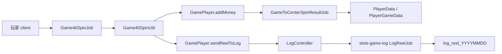
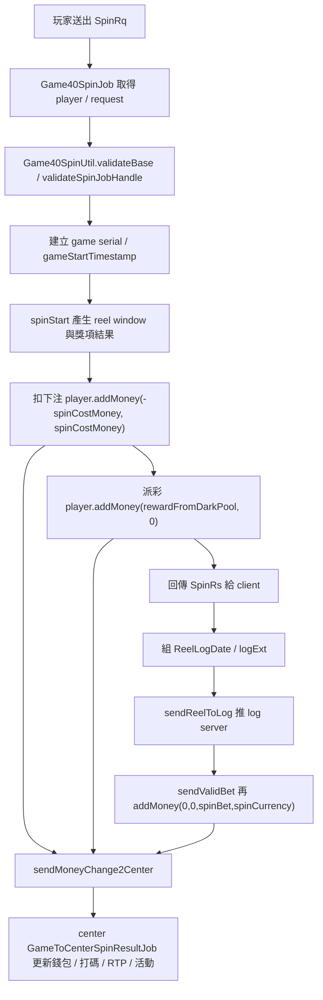

# game-spin-settlement-log-reel

## 閱讀定位

- Flow 中文名稱：遊戲 spin / 結算 / 投注流水寫入
- Flow slug：`game-spin-settlement-log-reel`
- 完成狀態：Step 4 completed
- 掃描等級：Level 2 Flow 深掃
- 證據層級：專案存在 / code-backed；Nick direct contribution 待 Step 5 再判斷
- 代表樣本：`slots-game40-sgj`，因為它是典型 slot spin path，能完整串到 `GamePlayer.addMoney`、center wallet mutation 與 `log_reel`
- 是否更新正式履歷 / 自傳：否。本 Step 只建立 flow 學習包，不更新 `05` / `08`

## 白話導讀

這條 flow 是玩家在某款 slot 遊戲裡按下 spin 後，系統怎麼完成「算結果、扣下注、派彩金、同步中心錢包、寫投注流水」。

它不是單純遊戲演算法。真正的 Senior / Owner 重點在於：

- 玩家看到 spin 結果前後，遊戲服和 center 的錢包要一致。
- spin 結果、扣款、派彩、投注流水不能彼此對不起來。
- `log_reel` 是後續戰績查詢、報表、客服排查與對帳的主要來源之一。
- 如果 center 同步成功但 log server 寫入失敗，玩家錢是對的，但戰績 / 報表可能缺資料。

本次不平均掃 27 個 game module，而是用 `slots-game40-sgj` 當一般 slot game 代表，追一條可讀完整路徑。

## 初中階 Code 分層對照

```text
Client packet：
  Game40Pb.SpinRq

Game job：
  slots-games/slots-game40-sgj/.../job/Game40SpinJob.java

Game business：
  slots-games/slots-game40-sgj/.../util/Game40SpinUtil.java

Game runtime state：
  Game40GameTable
  Game40Player
  slots-games/slots-game-common/.../data/GamePlayer.java

Center sync：
  GamePlayer.addMoney()
  GamePlayer.sendMoneyChange2Center()
  LobbyPb.GameToCenterSpinResultRq
  slots-center/.../job/s2s/game/GameToCenterSpinResultJob.java

Center wallet：
  PlayerData.modifyAndGetCoin(...)
  PlayerGameData.saveDataVersion
  player.bet / validBet / spinCurrency

Log push：
  GamePlayer.sendReelToLog(...)
  slots-common/.../controller/LogController.java

Log server：
  slots-game-log/.../job/player/LogReelJob.java
  slots-game-log/.../LogJobCrons.java
  slots-game-log/.../sql/mapper/Mapper.java

SQL / table：
  log_reel_YYYYMMDD
  log_reel_point_YYYYMMDD
```

## 最小架構圖



## 正常流程圖



## 正常流程逐步說明

1. 玩家送出 `Game40Pb.SpinRq`。
2. `Game40SpinJob.runTask()` 取得 `Game40Player` 與 request，檢查 player / request 是否存在。
3. `Game40SpinUtil.spinJobRunTask()` 做基本玩家狀態與下注倍率驗證。
4. 產生本局 `gameSerialNo` 與 `gameStartTimestamp`。
5. `spin()` / `spinNormal()` / `spinStart()` 依 reel config 產生窗口、計算獎項、免費輪與控制池結果。
6. `rewardFromDarkPool()` 先記錄 `startCoin`，再透過 `player.addMoney(-spinCostMoney, spinCostMoney)` 扣下注。
7. 若有派彩，再用 `player.addMoney(rewardFromDarkPool, 0)` 增加玩家遊戲端金額。
8. `GamePlayer.addMoney()` 先改遊戲端 `totalCoins`，再把 `AddCenterCoin` 放入 queue，呼叫 `sendMoneyChange2Center()`。
9. center 的 `GameToCenterSpinResultJob` 驗證 `PlayerGameData` 版本，成功後呼叫 `PlayerData.modifyAndGetCoin()` 更新中心錢包、打碼、有效投注、實際投注、RTP 與活動資料。
10. 遊戲端回傳 `SpinRs` 給 client。
11. `Game40SpinUtil` 組 `ReelLogDate` 與 `logExt`，呼叫 `player.sendReelToLog()`。
12. `GamePlayer.sendReelToLog()` 推 `REEL_NORMAL` log 到 log server，`LogReelJob` / `LogJobCrons` 分批寫入 `log_reel_YYYYMMDD`。

## 業務問題

這條 flow 同時解決三件事：

1. 玩家本局結果要算對。
2. 玩家錢包要跟下注 / 派彩一致。
3. 戰績資料要能支撐查單、報表、客服與對帳。

錯誤後果：

- 扣款成功但派彩或 center sync 失敗，玩家餘額可能不一致。
- center 錢包成功但 `log_reel` 缺資料，後台查不到戰績。
- `spin_bet` / `spin_currency` 不一致，會影響打碼、活動、VIP 返水與報表。
- log server 批次寫入延遲或失敗，報表與客服排查會出現時間差。

## 系統位置

- 產品：iwin game runtime
- 專案：`iwin_gameserver`
- 代表 game module：`slots-games/slots-game40-sgj`
- 共用 runtime：`slots-games/slots-game-common`
- 大廳 / 錢包：`slots-center`
- Log writer：`slots-game-log`
- 上游：玩家 client / gate packet routing
- 下游：center wallet、log server、`log_reel`、後續 app_bi / 報表查詢

## 入口與 code path

已確認入口：

- `Game40SpinJob.runTask()`
- `Game40SpinUtil.spinJobRunTask()`
- `Game40SpinUtil.spin()`
- `Game40SpinUtil.rewardFromDarkPool()`

已確認錢包同步：

- `GamePlayer.addMoney(long addMoney, long BetCoin, long validBetCoin, long spinCurrency)`
- `GamePlayer.takeAddMoneyQueue2Center()`
- `GamePlayer.sendMoneyChange2Center(...)`
- `GameToCenterSpinResultJob.runS2STask()`

已確認投注流水：

- `Game40SpinUtil.rewardFromDarkPool()` 組 `ReelLogDate` / `logExt`
- `GamePlayer.sendReelToLog(...)`
- `LogController.pushLog(...)`
- `LogReelJob.runImpl(...)`
- `LogJobCrons` 的 `REEL_NORMAL` batch insert
- `Mapper.batchInsertLogReel(...)`

## 資料與狀態

### Game 端

| 狀態 | 來源 | 說明 |
| --- | --- | --- |
| `gameSerialNo` | `GameWorld.getGameSerialNo()` | 本局序號，用於戰績與排查 |
| `gameStartTimestamp` | `Game40GameTable` | center sync 與 log 分表時間依據 |
| `totalCoins` | `GamePlayer` | 遊戲端玩家當前金額 |
| `addMoneyQueue` | `GamePlayer` | 發往 center 的改錢 queue，避免同一玩家多筆中心同步互相覆蓋 |
| `spinRs` | `Game40GameTable` | 回 client 的轉輪結果 |
| `logExt` | `Game40SpinUtil` | 本局窗口、免費輪、獎項與服務費等擴充資料 |

### Center 端

| 狀態 | 來源 | 說明 |
| --- | --- | --- |
| `PlayerData.coins` | `PlayerData.modifyAndGetCoin()` | center 端錢包 source of truth |
| `PlayerGameData.saveDataVersion` | `GameToCenterSpinResultJob` | 防止遊戲端 / center 遊戲資料版本不一致 |
| `bet` | `PlayerData` | 總打碼 |
| `validBet` | `PlayerData.addValidBet()` | 有效下注，會影響 VIP / 打碼 |
| `spinCurrency` | `PlayerData` | 實際下注，對應 log reel 欄位 |

### Log 端

| 狀態 | 來源 | 說明 |
| --- | --- | --- |
| `log_reel_YYYYMMDD` | `LogReelJob` / `LogJobCrons` | 一般戰績表 |
| `log_reel_point_YYYYMMDD` | `LogJobCrons` | 內部 / point 類 user 分流 |
| `serial_id` | `GamePlayer.sendReelToLog()` | 單局查詢 / 對帳關鍵之一 |
| `spin_bet` | `ReelLogDate.curBet` | 戰績表有效下注欄位 |
| `spin_currency` | `ReelLogDate.costCoin` | 實際下注欄位 |

## State transition

```text
可下注玩家
-> spin request 驗證通過
-> 產生結果 / gameSerialNo / gameStartTimestamp
-> 遊戲端 totalCoins 先扣下注
-> 遊戲端 totalCoins 加派彩
-> center 更新 PlayerData / PlayerGameData version
-> 遊戲端收到 center response，更新 saveDataVersion / totalCoins 校正
-> log_reel 寫入戰績
```

## Transaction boundary

這條 flow 沒有一個跨 game server、center、log server 的單一 DB transaction。

實際上是多段式：

1. 遊戲端先在記憶體內改 `GamePlayer.totalCoins`。
2. 遊戲端送 `GameToCenterSpinResultRq` 給 center。
3. center 更新 `PlayerData` 與衍生狀態，回傳 version / coins。
4. 遊戲端推 `LogReelData` 到 log server。
5. log server 先 cache，再批次寫 `log_reel_YYYYMMDD`。

所以 owner 要看的不是「有沒有 transaction annotation」，而是每段失敗後怎麼辨識、重送、補 log、對帳。

## Consistency / idempotency

已確認保護：

- `GamePlayer.addMoneyQueue` 會序列化同一玩家從 game 端送 center 的改錢請求。
- `GameToCenterSpinResultJob` 會檢查 `PlayerGameData.saveDataVersion`，版本不一致會回 `GAME_NOT_VALID_DATA`。
- center response 回來後，game 端會用 center 回傳 `coins` 校正遊戲端 `totalCoins`。

待確認 / 風險：

- 本次未看到單局 `serial_id` 或 `gameSerialNo` 在 center wallet mutation 前作 duplicate guard。
- `sendMoneyChange2Center()` 對非 OK callback 會重送 queue head；若 center 實際已處理但 callback 被視為失敗，是否可能造成重複處理，需要更深一層確認 center 是否能以 version / serial 防住。
- `sendReelToLog()` 與 center wallet update 是不同鏈路；log server 失敗不會回滾錢包。
- `LogController.pushLog()` 找不到 log server 時只記 error；本次未看到本地持久化補償。

## Failure window

| 情境 | 可能結果 | Owner 觀察點 |
| --- | --- | --- |
| spin result 已算出，但扣款 `addMoney(-cost)` 失敗 | client 可能拿不到正確結果或只看到錯誤 | 要確認錯誤碼與玩家狀態是否回復 |
| game 端扣款成功，center sync timeout | game `totalCoins` 已變，center 是否已變不明 | 需要 mutation audit / query-by-gameSerial |
| center 回 `GAME_NOT_VALID_DATA` | game / center version 不一致 | 需排查重送、併發、舊 session |
| center 更新成功，log server 不可用 | 玩家錢正確，但 `log_reel` 缺資料 | 需要 log replay / audit queue |
| `sendReelToLog()` 後又 `addMoney(0,0,spinBet,spinCurrency)` | 有效下注 / 實際下注再送 center | 要確認這筆純打碼同步和錢包改動的順序與 version |
| log server cache 未 flush 前 process crash | 戰績延遲或遺失 | 需要確認 cache flush / shutdown 策略與監控 |

## Observability

已確認：

- `GameToCenterSpinResultJob` 有 `SPIN_TOTAL`、`SPIN_SUCCESS_TOTAL`、`SPIN_FAIL_TOTAL`、耗時統計與 `profileSnap()`。
- center trace log 會輸出本次 addCoin / costCoin / validBet / spinCurrency / finalCoin / cost time。
- `LogController` 有 `LogPool` profile snap。
- `LogReelJob` 有接收 log data 的 system log。

建議補強：

- 以 `gameSerialNo` / `serial_id` / `uid` 串 game result、center mutation、log_reel。
- 對 `logServer is null`、center sync timeout、version mismatch 建 metrics / alert。
- 建一個查單視角：game result exists、center mutation exists、log_reel exists 三方比對。

## Owner decision

1. 不要把 spin 當成單機 function。它跨 game runtime、center wallet、log server。
2. center wallet 是 money source of truth；game 端 `totalCoins` 是 runtime cache，需要 center response 校正。
3. `log_reel` 是戰績 / 報表 source，不是錢包 transaction source。缺 log 不能代表錢沒改。
4. version guard 能防一部分舊資料覆蓋，但不等於完整 business idempotency。
5. Step 4 已把「center sync 成功但 log 失敗」和「center timeout / 重送」轉成正式面試追問；Step 5 再判斷 direct contribution 與 claim gate。

## 面試 / 履歷邊界摘要

可面試講：

- 以 `slots-game40-sgj` 作代表，說明一般 slot spin 如何從 game job 走到 center wallet 與 `log_reel`。
- 說明 `addMoneyQueue`、center `saveDataVersion`、`GameToCenterSpinResultJob`、`LogReelJob` 的一致性邊界。
- 說明 why no single transaction、failure window 與對帳設計。

不建議正式履歷單獨寫：

- 目前 `Game40SpinUtil`、`GameToCenterSpinResultJob`、`LogReelJob` 主要 blame 仍是 initial commit。
- Nick / `10gt12nc` 的 direct evidence 較集中在第三方 provider log reel / 投派整合，不足以說他開發一般 slot spin 主流程。

不能說：

- Nick 主導所有遊戲 spin / settle。
- Nick 是 iwin 遊戲 runtime owner。
- Nick 設計完整 log_reel / wallet consistency 架構。

## Step 3 結論

本 flow 已完成 Step 3 主學習包。它是很好的 Senior 面試素材，因為能清楚講出：

- 遊戲端 runtime state 與 center wallet 的界線。
- spin / settle / log_reel 的跨服務一致性。
- version guard、queue、log async 的保護範圍與缺口。

但目前不更新正式履歷 / 自傳。履歷仍以 project-level `third-party provider 投派整合` 保守 claim 為準。

## Step 4 面試 case 結論

本 flow 已轉成正式面試 case，詳見：

- `career-interview.md`
- `materials/interview.md`

可講主線：

```text
Game40SpinJob -> Game40SpinUtil -> GamePlayer.addMoney -> GameToCenterSpinResultJob -> sendReelToLog -> LogReelJob
```

面試重點：

- game runtime `totalCoins`、center wallet `PlayerData`、`log_reel` 是三個不同 source。
- `addMoneyQueue` 和 `saveDataVersion` 是既有保護，但不是完整 business idempotency。
- center timeout、version mismatch、log server failure 是主要 failure window。
- `log_reel` 是 report source，不是 wallet transaction source。

履歷邊界：

- Step 4 不更新正式履歷 / 自傳。
- 本 flow 仍是 code-backed 面試素材。
- 是否能升級到履歷 claim 要等 Step 5 claim gate。

## 下一步

```text
iwin iwin_gameserver game-spin-settlement-log-reel Step 5
```

原因：

- Step 4 已完成正式面試 case。
- 下一步應做單條 flow claim gate，判斷是否維持 interview-only。
- 不直接更新 05 / 08，除非 Step 5 後另有 project-level consolidation 需要回填。
