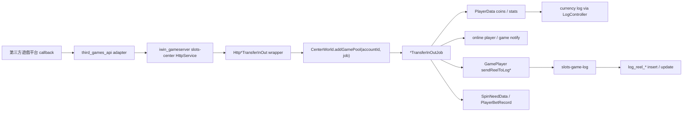
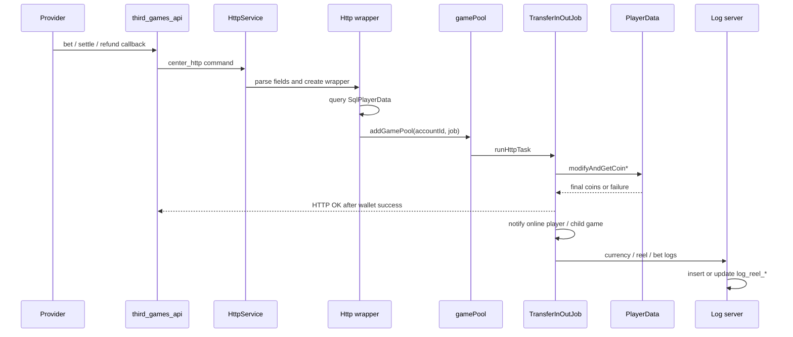

# third-party-transfer-in-out Step 3：第三方遊戲投派整合 / 投注派彩退款

更新時間：2026-05-15
掃描等級：Level 2 單條 flow 深掃
狀態：Step 5 已完成履歷 / 自傳邊界
證據層級：專案存在 / code-backed；Nick 貢獻待確認

## 閱讀定位

這份 `flow.md` 是 `iwin_gameserver` 的單條 flow 主報告。它不是 class summary，也不是第三方遊戲平台總覽；重點是追一筆第三方遊戲投注 / 派彩 / 退款 callback 進入 gameserver 後，玩家餘額、戰績、打碼與 log 會怎麼變。

本輪已確認的主線在 `iwin_gameserver`：

- `slots-center` 接收 center_http command。
- `slots-center` 查玩家、排入 per-account game pool、執行錢包變更。
- `slots-games/slots-game-common` 組戰績 log 資料。
- `slots-game-log` 寫入或更新 `log_reel_*` 類戰績表。
- `PlayerData` 產生 currency log 與玩家統計 side effect。

本輪只對 `/Users/nick/Git/iwin/third_games_api` 做最小 upstream 關聯掃描，用來確認 command 是由 adapter 組到 gameserver；未把 third_games_api 當完整 Step 3 主體。

## 白話導讀

這條 flow 可以想成「外部遊戲平台說玩家下注 / 派彩 / 退款了，gameserver 要把 iwin 內部玩家錢包和報表資料同步到正確狀態」。

外部平台不會直接改 gameserver 的玩家資料。上游 adapter 會把平台 callback 轉成 gameserver command，例如 `PGTRANSFERINOUT`、`ANTPLAYTRANSFERINOUT`、`GSC_BET`、`GSC_SETTLE`、`GSC_REFUND`。gameserver 收到後先找玩家，再依欄位扣錢、加錢、寫 currency log、通知在線玩家、送戰績 log、更新打碼統計。

這裡最值得 Senior / Owner 注意的不是「有幾個 Controller」，而是順序與一致性：

1. 玩家餘額先被改。
2. HTTP OK 會在餘額變更成功後立刻回給上游。
3. 戰績 log、打碼 log、在線玩家通知在 OK 之後才繼續做。

所以如果中間失敗，可能出現「錢包成功，但戰績 / 打碼 / 對帳資料缺漏」的 failure window。另一個關鍵點是 `transactionId` / `betId` 有被一路帶到 log，但本輪沒有在 gameserver 看到明確的防重查詢或唯一約束檢查，因此 duplicate callback 是否會 double apply 仍是待確認風險。

## Code 分層對照

| 層級 | 已確認 code | 角色 |
| --- | --- | --- |
| Upstream adapter | `third_games_api` 的 `OneApiController`、`AntplayController`、`GscController` | 將平台 callback 轉成 gameserver command；本輪只做最小關聯掃描 |
| HTTP command router | `slots-center/src/main/java/com/slots/center/service/HttpService.java` | `deal()` switch 分派 `PGTRANSFERINOUT`、`ANTPLAYTRANSFERINOUT`、`GSC_BET/SETTLE/REFUND/OTHER` |
| Player lookup wrapper | `HttpPGTransferInOut`、`HttpAntplayTransferInOut`、`HttpGSCTransferInOut` | 先查 `SqlPlayerData`，成功後建立實際 job 並丟入 `CenterWorld.addGamePool(accountId, job)` |
| Money job | `PGTransferInOutJob`、`AntplayTransferInOutJob`、`GSCTransferInOutJob` | 檢查玩家狀態、餘額、呼叫 `modifyCoin`、回 HTTP response、通知與送 log |
| Wallet state | `PlayerData.modifyAndGetCoinPG/AP/GSC` | 改 `coins`、更新全服 coin、建立 currency log、更新玩家投注 / 派彩統計 |
| Log model | `AddCenterCoinPG/AP/GSC`、`ReelLogDate`、`SpinNeedData` | 承載 `addMoney`、`betCoin`、`validBetCoin`、`spinCurrency`、`transactionId`、`betId` |
| Log dispatch | `GamePlayer.sendReelToLogPG/AP/GSC`、`LogController.pushLog` | 把戰績送往 log server |
| Log writer | `LogReelJob`、`LogReelAntplayBetJob`、`LogReelAntplaySettleJob`、`LogReelGSCBetJob`、`LogReelGSCSettleJob` | PG / AP 整合路徑多走一般 `REEL_NORMAL`；GSC / 舊 Antplay 分 bet insert 與 settle/refund update |
| Queue / ordering | `CenterWorld.addGamePool(openId, job)` | 使用 `openId.hashCode()` 分派 game pool task；推測用於同玩家序列化，但 thread pool 細節本輪未展開 |

## 最小架構圖



## 正常流程圖



## 正常流程逐步說明

1. 第三方平台送投注、派彩、退款或投派整合 callback 到 upstream adapter。
2. Adapter 依平台轉出 gameserver command：PG / Antplay 整合多是單一 `TRANSFERINOUT`；GSC 則拆成 `GSC_BET`、`GSC_SETTLE`、`GSC_REFUND`、`GSC_OTHER`。
3. `HttpService.deal()` 依 `cmd` 進入對應 method，解析 `accountId/account`、`addMoney/deductMoney/bet`、`transactionId/sign`、`gameId`、`betId`、`reason`、`createTime/timestamp`。
4. `Http*TransferInOut` wrapper 透過 `DbproxyController.queryPlayerData` 查玩家資料。
5. 找到玩家後建立實際 job，並用 `CenterWorld.addGamePool(accountId, job)` 送入 game pool。
6. `*TransferInOutJob.runHttpTask()` 檢查玩家不存在、玩家封禁與部分餘額不足條件。
7. Job 建立 `AddCenterCoin*`，呼叫 `sendMoneyChange2Center()`。
8. `modifyCoin()` 依 `addMoney` 正負呼叫 `PlayerData.modifyAndGetCoinPG/AP/GSC`：正數加錢，負數扣錢。
9. `PlayerData` 修改玩家 `coins`，送 currency log，並更新 win、bet、valid bet、withdraw spin count、排行榜與活動相關 side effect。
10. Job 在錢包變更成功後組 HTTP OK response 回上游，內容包含變更前餘額、變更額與目前餘額。
11. Job 之後才做 `afterEvent()`，通知在線玩家與子遊戲。
12. Job 再送戰績 log 與打碼 log；GSC 的 `gscType == 4` 會跳過戰績與打碼，`gscType == 2` 才送打碼。

## 資料狀態與欄位語意

| 欄位 | 來源 / 用途 | 已確認語意 |
| --- | --- | --- |
| `accountId` / `account` | adapter 傳入 gameserver | 玩家 openId / account key，用於查玩家與 game pool 分派 |
| `addMoney` | PG / AP 整合、GSC settle / other | 正數加錢，負數扣錢；PG / AP 註解對應 transferAmount |
| `deductMoney` | GSC bet | GSC bet 入口轉成負向 `addMoney` |
| `bet` / `BetCoin` / `betCoin` | adapter / gameserver | 打碼量與下注量欄位；PG 使用 `BetCoin` 大寫 |
| `validBetCoin` | PG / AP | 對應戰績 `spin_bet` 與有效投注 |
| `spinCurrency` | PG / AP / GSC | 對應戰績 `spin_currency` |
| `transactionId` / `sign` | adapter 傳入 | 帶到 currency / reel / bet log；本輪未確認防重使用 |
| `betId` | adapter 傳入 | `log_reel.serial_id`、`log_currency.bill_no` 的主要單號 |
| `reason` | adapter 或 HttpService 指定 | PG / AP / GSC 不同操作有不同 reason code；本輪不把 reason code 展開成履歷 claim |
| `createTime` / `timestamp` | adapter 傳入 | 用於 log base time / game start time |

## Transaction Boundary

已確認：

- 錢包變更發生在 `PlayerData.modifyAndGetCoin*`，直接更新記憶體中的玩家 `coins`，並推送 currency log。
- HTTP OK response 在 `modifyCoin()` 成功後立刻送出。
- `afterEvent()`、`sendReelToLog()`、`sendBetLog()` 在 OK response 後才執行。
- `slots-game-log` 的 `log_reel_*` 寫入是透過 log server cache 批次提交，不在 gameserver wallet update 的同一個 database transaction 內。

推測 / 待確認：

- `CenterWorld.addGamePool(accountId, job)` 使用 `openId.hashCode()` 分派 task，應該是同玩家 ordering 的核心保護，但本輪未深追 game pool worker 是否保證同 key 串行。
- 玩家資料最終如何由 center cache 寫回 dbproxy / MySQL，本輪只追到 `PlayerData` runtime state 與 log dispatch，未完整展開 cache flush / db write path。

## Consistency 分析

這條 flow 不是單一 ACID transaction，而是「錢包先成功，再用 side effect 補齊 log / notify / bet record」。

主要一致性目標：

- 玩家餘額不能被重複扣加。
- `log_currency` 要能反映每次錢包變更。
- `log_reel_*` 要能用 `betId` / `serial_id` 對上投注、派彩、退款。
- `SpinNeedData` 與 `PlayerBetRecord` 要能支撐打碼與有效投注統計。
- 線上玩家與子遊戲看到的餘額不能長期落後。

主要 failure window：

| Window | 可能結果 | Owner 觀察點 |
| --- | --- | --- |
| 錢包變更成功，HTTP OK 前失敗 | 上游可能 retry，若無防重可能 double apply | 需要 transaction idempotency |
| HTTP OK 已回，上線通知失敗 | 玩家 UI / 子遊戲短暫不同步 | 需要下一次 sync / login 修正 |
| HTTP OK 已回，reel log 失敗 | 報表 / 對帳缺戰績 | 需要 outbox 或 reconciliation |
| bet insert 成功，settle update 失敗 | 只有下注，沒有派彩 / 退款收斂 | 需要補償 update 或未結算報表 |
| duplicate callback | 可能重複扣款 / 派彩 | 需要用 `transactionId` 或 `betId` 做唯一判斷 |

## Idempotency / Retry / Compensation

已確認：

- `transactionId` 與 `betId` 有被傳入 `AddCenterCoin*`、currency log、reel log 與 bet log。
- GSC bet 對 `log_reel_*` 是 insert，GSC settle / refund 走 update；舊 Antplay split path 也有 bet insert、settle/refund update。
- PG / AP 投派整合路徑送一般 `REEL_NORMAL`，較像單筆整合戰績 insert。

未確認 / 風險：

- 本輪沒有在 `PGTransferInOutJob`、`AntplayTransferInOutJob`、`GSCTransferInOutJob`、`PlayerData.modifyAndGetCoin*` 看到以 `transactionId` / `betId` 查已處理紀錄後再決定是否跳過的邏輯。
- 未確認 `log_currency.bill_no` 或 `log_reel.serial_id` 是否有唯一索引，且即使 log 層唯一，也不等於 wallet update 防重。
- 未確認上游 adapter 是否會在 gameserver timeout 後以同一 id retry，以及 retry 對 gameserver response 的期望。

Owner 角度應追問：

- 防重應放在 gameserver 錢包變更前，還是 upstream adapter 狀態機？
- `transactionId` 與 `betId` 哪個是 provider 全域唯一，哪個只是一局 / 一注唯一？
- timeout 後的 retry 應回傳既有結果，還是重新執行？
- log 補償要靠 batch reconciliation、人工補單，還是 outbox pattern？

## Observability

已確認 log / audit 線索：

- gameserver money job 會 log `uid`、`betId`、餘額、betCoin、耗時與錯誤。
- `PlayerData.buildCurrencyLog*` 會把 currency log request 印出並推給 `LogController`。
- log server bet / settle job 會印 `serial_id`、table key、insert/update 入參與 batch 耗時。
- `LogReelAntplaySettleJob` 與 `LogReelGSCSettleJob` 會呼叫 `AuditUtil.writeAuditLog(data)`。

不足：

- 目前沒有看到跨 `third_games_api -> gameserver -> log server` 的統一 trace id。
- log 大量依賴文字與 `betId` / `uid` grep；若要 owner 級排障，應補一條 correlation key 規範。
- OK response 已回但後續 log 失敗時，缺少明確未完成事件表。

## Owner Decision Notes 摘要

這條 flow 的 owner decision 不應停在「要不要多印 log」。真正要決定的是錢包 flow 的 source of truth 與補償模型：

- 錢包變更以 gameserver `PlayerData` 為 runtime source of truth，log server 是報表 / 稽核資料，不應反向主導錢包。
- 防重必須在錢包變更前生效；只靠 `log_reel` update 不足以防 double wallet mutation。
- HTTP OK 的語意應定義清楚：目前 code 更像「wallet changed」而不是「所有 downstream log 都完成」。
- 如果維持現狀，至少要有 reconciliation：用 provider statement / adapter request / gameserver currency log / log_reel 做差異檢查。
- 若要強化，可評估 outbox：錢包變更與待送 log event 同步落可靠儲存，再由 worker 重試。

## 面試 / 履歷邊界摘要

可安全使用：

- `iwin_gameserver` 存在第三方遊戲投注 / 派彩 / 退款 runtime money flow。
- 這條 flow 橫跨 `slots-center`、`slots-games/slots-game-common`、`slots-game-log` 與 upstream adapter。
- 可把它當 Senior Java Backend / Platform Backend 面試案例，討論 transaction boundary、idempotency、failure window、reconciliation、observability。

不可誇大：

- 不能說 Nick 主導或實作這條 flow。
- 不能說已確認 production incident、改善百分比或正式 owner 決策。
- 不能說 gameserver 已具備完整防重；本輪 Step 3 的結論反而是「防重未確認，是高風險待查點」。

詳細素材見：

- `career-interview.md`
- `materials/evidence.md`
- `materials/interview.md`
- `materials/claim-boundary.md`
- `materials/decision-notes.md`

Step 5 結論：

- 本 flow 可保留為 Senior / Owner 面試分析素材。
- 不更新正式履歷 master。
- 不更新投遞用自傳。
- 若 Nick 後續補本人 MR / ticket / commit / production issue / 本人確認，再重新評估是否升級成 `真實開發過` 或正式成果。

## 下一步建議

只推薦一件事：

```text
iwin_gameserver center-http-deposit-withdraw Step 3
```

原因：

- 本 flow 已完成 Step 5，正式履歷 / 自傳暫不更新。
- Step 5 完成後應回到同 project candidate ranking，而不是跳其他 project。
- `center-http-deposit-withdraw` 是下一條最高價值 money flow，適合進 Step 3 主報告。
