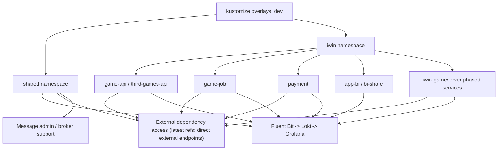

# iwin k3s-deploy Architecture Map

本文件只做最小定位，不取代單條 flow 的 `flow.md`。

證據層級：`專案存在 / code-backed`；Nick 貢獻待確認。

## 最小拓撲

## 主要部署單元

| 區域 | 已確認內容 | Senior / Owner 觀察 |
| --- | --- | --- |
| shared namespace | log stack、message admin；外部依賴 abstraction 在遠端最新 refs 已被簡化 | cluster 共用能力；錯誤會影響多服務 troubleshooting 或 dev 驗證 |
| iwin namespace | app / API / job / payment / BI / game server | 應看服務拓撲、對外入口、啟動依賴、resource 與 rollback |
| iwin-gameserver | phase1 stateless、phase2 center、phase3 gate、phase4 games | 有明確順序與註冊依賴，是最值得深挖的 deploy flow |
| Java services | Deployment + Service + probe + resource | 可討論 rollout、readiness、image tag、config 覆蓋與 dev/prod 差異 |
| PHP / BI services | runtime/log storage、stdout/stderr、hostPath / emptyDir trade-off | 可討論 legacy app 容器化時的 stateful 邊界 |
| observability | Fluent Bit tail container logs，Loki storage，Grafana datasource | 可討論 incident RCA、label、健康檢查過濾與 retention |

## 已確認 code path

- `/Users/nick/Git/iwin/k3s-deploy/dev/kustomization.yml`
- `/Users/nick/Git/iwin/k3s-deploy/dev/iwin/kustomization.yml`
- `/Users/nick/Git/iwin/k3s-deploy/dev/iwin/iwin-gameserver/kustomization.yml`
- `/Users/nick/Git/iwin/k3s-deploy/dev/iwin/iwin-gameserver/phase1-stateless/`
- `/Users/nick/Git/iwin/k3s-deploy/dev/iwin/iwin-gameserver/phase2-center/`
- `/Users/nick/Git/iwin/k3s-deploy/dev/iwin/iwin-gameserver/phase3-gate/`
- `/Users/nick/Git/iwin/k3s-deploy/dev/iwin/iwin-gameserver/phase4-games/`
- `/Users/nick/Git/iwin/k3s-deploy/dev/iwin/game-api/`
- `/Users/nick/Git/iwin/k3s-deploy/dev/iwin/game-job/`
- `/Users/nick/Git/iwin/k3s-deploy/dev/iwin/payment/`
- `/Users/nick/Git/iwin/k3s-deploy/dev/iwin/third-games-api/`
- `/Users/nick/Git/iwin/k3s-deploy/dev/iwin/app-bi/`
- `/Users/nick/Git/iwin/k3s-deploy/dev/iwin/bi-share/`
- `/Users/nick/Git/iwin/k3s-deploy/dev/fluent-bit/`
- `/Users/nick/Git/iwin/k3s-deploy/dev/loki/`
- `/Users/nick/Git/iwin/k3s-deploy/dev/grafana/`
- `/Users/nick/Git/iwin/k3s-deploy/dev/external-services/`

## 不可誇大的邊界

- 這是 dev-k3s manifests 掃描，不是 production SRE 審計。
- 已 fetch remote refs；本機 `main` 落後 `origin/main`，本圖以 Step 2 的遠端差異判斷修正外部依賴定位，但未更新公司 repo 工作樹。
- 只確認 repo 內 manifests、remote refs 與 commit log，未確認 cluster 真實狀態。
- 未讀 secret value，也不把 secret 內容放入 vault。
- 未確認 Nick 本人貢獻，不能寫成主導或 owner。
