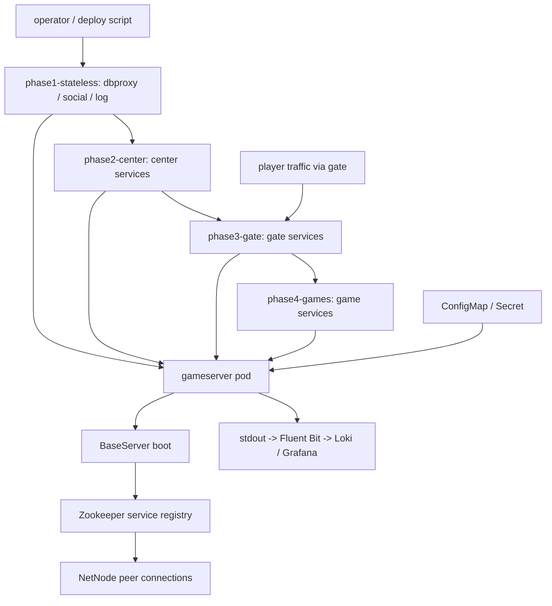
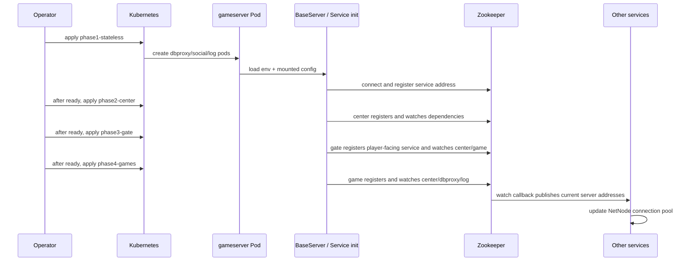

# iwin-gameserver 分階段部署與服務註冊

## 0. 閱讀定位

- Flow 中文名稱：iwin-gameserver 分階段部署與服務註冊
- Flow slug：`gameserver-phased-rollout`
- 完成狀態：Step 4 已建立
- 掃描等級：Level 2 Flow 深掃；未做 Level 3 逐檔逐行 / 逐 commit diff
- 證據層級：`專案存在 / code-backed`；Nick 貢獻 `待確認`
- 本 flow 類型：deploy flow / platform runtime flow
- 是否只確認到入口：不是只確認到 YAML；本輪同時讀到 deploy manifests、generator、gameserver runtime boot、ZK registration 與 shutdown code

本文件是 Step 3 主報告，Step 4 已補齊面試追問與 claim boundary。預設先讀這份，再讀 `career-interview.md`；詳細證據、決策筆記與履歷邊界放在 `materials/`。

## 1. 白話導讀

`iwin-gameserver` 不是單一 Java Web API，而是一組 game runtime 服務。它用同一個 image 跑出多個不同角色，例如 `dbproxy`、`social`、`log`、`center`、`gate` 與多個 game service。每個 pod 透過環境變數決定自己要跑哪個 jar、哪個 appid、哪個 apptype 與哪個 main class。

這條 flow 的核心不是「把 Deployment apply 上去」而已，而是「要照順序把依賴層啟起來」。gameserver runtime 會透過 Zookeeper 註冊自己的服務位址，也會監聽其他服務的 ZK path 來建立連線。如果 center、gate、game 同時亂序啟動，就可能遇到依賴還沒註冊、連線池沒建立、或者雙開註冊風險。

成功時，系統狀態會從「只有 manifests」變成：

1. 每個 phase 的 pods 已啟動。
2. pod 透過 ConfigMap / Secret 取得 config。
3. runtime 讀取 `server.properties` 與 `zookeeper.properties`。
4. 服務把自己的 address 註冊到 ZK。
5. 其他服務 watch ZK path，拿到 peer address 後建立 NetNode connection。
6. `gate` 對玩家入口開放，game / center / dbproxy / log 之間能互相通訊。

失敗最直覺會壞在三個地方：config 沒掛對、ZK 註冊 / watch 沒完成、phase 順序或 rollout 策略造成服務短暫雙開或無法連線。

## 2. 初中階 Code 分層對照

| Nick 熟悉分層 | 本 flow 對應 |
| --- | --- |
| Route / API | `gate` 對玩家 TCP 入口；不是 HTTP route |
| Controller | 各 runtime 的 action manager / NetNode handler；本輪只做 deploy flow，不展開業務 handler |
| Service / Business | `BaseServer.start()`、各服務 `init()`、`ZkService` registration / watch / connect |
| Model / DAO / Repository | 非本 flow 主軸；dbproxy / game 內部才會碰資料存取 |
| SQL / Table | 未掃；本 flow 不主張 DB schema evidence |
| Redis | 部分 lua / redis config 由 shared ConfigMap 管理；Redis 行為未深挖 |
| MQ / Kafka / 下游通知 | 未確認為本 flow 主軸 |
| External API | 既有外部依賴位址與 ZK 連線設定；不在 vault 複製敏感值 |
| Log / Audit | log4j2 收斂到 console，由 container stdout 接 observability pipeline |
| Config | per-service `server.properties` ConfigMap、shared `zookeeper.properties` ConfigMap、global env Secret / ConfigMap、lua / redis ConfigMap |

## 3. 最小架構圖



## 4. 正常流程圖



## 5. 正常流程逐步說明

1. 部署者先讀 `dev/iwin/iwin-gameserver/kustomization.yml` 的註解，正式部署依序 apply phase，而不是直接一次套頂層 kustomization。
2. `phase1-stateless` 先建立 dbproxy / social / log 類服務與 shared config，讓後面的 center / game 有基礎依賴。
3. 每個 Deployment 使用同一個 image，但用 `SVC_JAR`、`SVC_APPID`、`SVC_APPTYPE`、`SVC_MAIN` 決定實際服務身分。
4. pod 啟動時掛載 per-service ConfigMap、shared zookeeper config、lua / redis config、log4j2 config，Secret / shared env 透過環境變數注入。
5. entrypoint 把外掛設定整理到 runtime 預期的 config path；legacy `server.sh` 會用 `-Dapp.server.confpath`、`jsonpath`、`modulespath` 等 JVM system properties 啟動 jar。
6. `BaseServer.start()` 執行 `initApp()`，讀 `server.properties`，非 debug 模式再讀 `zookeeper.properties` 並初始化 ZK。
7. 各服務 `init()` 註冊自己的 NetServer / ClientNetServer，並宣告要連哪些下游服務。
8. `BaseServer.initAfter()` 把已註冊的 network server address 寫入 ZK；`ZkService` 也會 watch 其他服務的 path。
9. ZK watch callback 回傳 server id 與 address 後，`NetNodeConnectPool` 更新連線池，新增或移除 peer connection。
10. phase2 center、phase3 gate、phase4 games 依序啟動後，gate 可以承接玩家入口，game / center / dbproxy / log 之間透過 ZK 發現彼此。

## 6. 業務問題

這條 flow 解決的是「legacy game runtime 怎麼在 K3s 裡安全啟動與更新」。它不是 money transaction flow，但錯誤一樣會影響玩家入口、遊戲服務可用性、內部服務連線與 deploy rollback 判斷。

錯了可能造成：

- phase 順序錯，center / gate / game 在依賴未 ready 時啟動。
- 同 server id 短暫雙跑，造成 ZK registration 重複或 peer 連線混亂。
- ConfigMap / Secret / image tag 不一致，讓不同 game service 吃到不同設定。
- pod ready 但 runtime 尚未完成 ZK registration，導致 operator 誤判可以進下一 phase。
- graceful shutdown 沒對齊 K8s termination，玩家連線或 center / game 收斂狀態不乾淨。

## 7. 系統位置

| 項目 | 內容 |
| --- | --- |
| 產品 / 環境 | iwin dev-k3s deployment；production 差異待確認 |
| 專案 | `/Users/nick/Git/iwin/k3s-deploy`、`/Users/nick/Git/iwin/iwin_gameserver` |
| Deploy module | `dev/iwin/iwin-gameserver` |
| Runtime module | `BaseServer`、`ZkService`、`GateServer`、`CenterServer`、`GameServer` |
| 上游 | operator / deploy pipeline / kustomize apply；實際 CI gate 待確認 |
| 下游 | Zookeeper、DB proxy、log service、social service、center / gate / game peer services |
| 觀測 | container stdout、Fluent Bit、Loki、Grafana；dashboard / alert 待確認 |

## 8. Code 路徑與掃描範圍

已看 deploy repo：

- `/Users/nick/Git/iwin/k3s-deploy`
- 已 fetch remote refs；local `main`：`61cb42a8a21445f51ad7e032ade0d13de73ed7cc`
- `origin/main`：`48e1d50f017b8c67364072a0cb4614c843bfb474`
- ahead / behind：local ahead 0、behind 34
- 公司 repo 工作樹未 pull / merge / checkout；Step 3 以 `origin/main` objects 判斷最新 manifests

已看 deploy code path：

- `origin/main:dev/iwin/iwin-gameserver/kustomization.yml`
- `origin/main:dev/iwin/iwin-gameserver/gen.sh`
- `origin/main:dev/iwin/iwin-gameserver/phase1-stateless/kustomization.yml`
- `origin/main:dev/iwin/iwin-gameserver/phase2-center/kustomization.yml`
- `origin/main:dev/iwin/iwin-gameserver/phase3-gate/kustomization.yml`
- `origin/main:dev/iwin/iwin-gameserver/phase4-games/kustomization.yml`
- `origin/main:dev/iwin/iwin-gameserver/*-cm.yml` 與主要 Deployment / Service 檔名清單
- path-specific log：`origin/main -- dev/iwin/iwin-gameserver`

已看 runtime repo：

- `/Users/nick/Git/iwin/iwin_gameserver`
- 已 fetch remote refs；local `main` = `origin/main`：`30a9fcb95bfda33b582deeb4e149eb06bed4afe3`
- ahead / behind：0 / 0

已看 runtime code path：

- `server.sh`
- `slots_env.sh`
- `slots-common/src/main/java/com/slots/common/server/BaseServer.java`
- `slots-common/src/main/java/com/slots/common/properties/ServerProperties.java`
- `slots-common/src/main/java/com/slots/common/properties/ZkProperties.java`
- `slots-common/src/main/java/com/slots/common/zookeeper/ZkService.java`
- `slots-common/src/main/java/com/slots/common/zookeeper/NetNodeConnectPool.java`
- `slots-common/src/main/java/com/slots/common/zookeeper/NetNodeBeConnectPool.java`
- `slots-game-gate/src/main/java/com/slots/game/gate/server/GateServer.java`
- `slots-game-center/src/main/java/com/slots/game/center/server/CenterServer.java`
- `slots-games/slots-game-common/src/main/java/com/slots/game/common/server/GameServer.java`

未掃 / 待確認：

- 未連線 cluster，未查 `kubectl` events / rollout history。
- 未讀 GitLab MR / issue / pipeline。
- 未讀 secret value、token、內網 IP、production URL。
- 未做 Level 3 逐檔逐行 / 逐 commit diff。
- 未確認 Nick 本人 MR / ticket / production issue。

## 9. Senior / Owner 深度區

### 9.1 Source of Truth

| 類型 | Source of truth | Owner 觀察 |
| --- | --- | --- |
| 部署 desired state | `k3s-deploy` 的 Kustomize manifests 與 generator output | YAML 是 cluster desired state，但本機 `main` 落後 remote，Step 3 以 `origin/main` 為最新 evidence |
| 服務身分 | Deployment env：jar / appid / apptype / main class | 一個 image 多服務，降低 image matrix，但提高 generator / config 正確性要求 |
| runtime config | per-service ConfigMap + shared ConfigMap + Secret / env | config 外掛後 rollback 不只 rollback image，也要對齊 config version |
| 服務發現 | Zookeeper znode | Kubernetes Service 不是 gameserver 內部 discovery 主體；ZK path 才是 runtime peer discovery |
| 實際服務位址 | pod 啟動後註冊的 server address | pod IP / server IP placeholder 若錯，peer 連線會接錯位址 |

### 9.2 State Transition

```text
manifest apply
-> pod scheduled
-> config mounted / env injected
-> JVM boot
-> server.properties / zookeeper.properties loaded
-> ZK connected
-> service address registered
-> peer path watched
-> NetNode connection pool updated
-> traffic accepted / internal calls available
```

這裡沒有傳統 DB transaction boundary；真正的 rollout boundary 是「每個 phase 是否達到可讓下一 phase 啟動的 runtime ready 狀態」。

### 9.3 Consistency / Idempotency

- `kubectl apply -k` 對 manifests 是 declarative / idempotent，但 app runtime 的 ZK registration 不是單純 YAML idempotency 可以覆蓋。
- generator 保留舊 `svrid` 作為 appid，避免 znode 名稱、業務資料或既有 runtime 假設突然改掉。
- Deployment strategy 使用 `Recreate`，推測是為了避免 RollingUpdate 造成同一 server id 短暫雙跑或雙註冊。這是合理推論，仍需 deploy incident / MR 討論補強。
- `BaseServer.checkServerPort()` 會透過 ZK 檢查 server registration 是否重複；這支持「雙開是實際 runtime concern」，不是純想像。

### 9.4 Failure Window

| Failure window | 可能現象 | 目前 evidence | Owner 應對 |
| --- | --- | --- | --- |
| phase 順序錯 | center / gate / game 啟動時依賴不存在 | top kustomization 註解要求手動分 phase apply | 每 phase apply 後先確認 pods ready + ZK registration，再進下一 phase |
| ConfigMap 漏更新 | 某些 game pod 用舊 config 或缺 key | `gen.sh` 產生多個 per-service CM，commit log 顯示 config 外掛演進 | generator output 要可重跑、可 diff；部署前檢查 phase kustomization 是否包含所有 CM |
| Secret / env 變更未重啟 | pod 繼續使用舊 env | Deployment 使用 envFrom 注入 | Secret rotate 後要 rollout restart 或 recreate |
| ZK 連線失敗 | boot 卡住或 service registry 不完整 | `ZkService.start()` 等待 ZK connect，lost connection 會 restart | deployment runbook 要包含 ZK health、znode path 與 app boot log 查核 |
| 雙開 / 重複註冊 | 同 server id 被視為 repeated | `checkServerReg()`、`Recreate` strategy | 避免 RollingUpdate；必要時先 scale down / 等 znode session 清掉 |
| shutdown 未完成 | 玩家未清乾淨、center 仍看到 game | `GameServer.stop()` 等玩家離場、踢玩家、關 NetServer；`CenterServer.stop()` 也有 wait game disappear 邏輯 | terminationGracePeriod / preStop / stop signal 要和 app graceful shutdown 對齊，這輪未看到完整 K8s 設定 |
| log pipeline 破洞 | pod 起不來但缺中央查詢線索 | log4j2 後續 commit 收斂 Console | app log 要確定進 stdout，Fluent Bit / Loki label 要能按 pod / phase 查 |

### 9.5 Retry / Compensation / Rollback

本 flow 的 retry / compensation 比較像 release operation，不是資料對帳：

- 單一 phase 失敗：先停在該 phase，不進下一 phase。
- pod config 錯：修 ConfigMap / Secret 後重新 apply，並重啟相關 pod。
- runtime registration 錯：確認 appid / apptype / POD_IP / zookeeper config，再用 Recreate 或手動刪 pod 讓它重註冊。
- image 錯：rollback image tag 時，同步確認 ConfigMap / Secret 是否也需要回到對應版本。
- player-facing gate 有問題：應優先保護玩家入口與既有連線；這輪沒有 production runbook evidence，不能寫成已驗證方案。

### 9.6 Observability

已確認：

- gameserver log4j2 後續 commit 顯示往 Console 收斂，配合 container stdout。
- project architecture 有 Fluent Bit -> Loki -> Grafana pipeline。
- app boot 會印出 config path、service path、log path，ZK connection / registration 也有 log。

待確認：

- Grafana dashboard / Loki query 是否已固定。
- 是否有 deployment checklist 或 incident RCA。
- 是否有 alert / metrics，而不是只有 logs。

### 9.7 Owner Decision

| Decision | 選擇 | 好處 | 代價 / 風險 |
| --- | --- | --- | --- |
| phase apply 而非一次 apply all | phase1 -> phase2 -> phase3 -> phase4 | 降低啟動依賴錯序 | 需要人工或 pipeline gate，部署較慢 |
| 同 image 多 service | env 決定 jar / appid / main | image 管理簡化 | generator / config 錯會影響多服務 |
| ConfigMap / Secret 外掛 | config 從 image 拆出 | 調整設定不必重建 image | rollback 要同時管 image + config |
| ZK 作 service discovery | app runtime 註冊 / watch peer | 符合 legacy gameserver 架構 | Kubernetes ready 不等於 runtime peer ready |
| Recreate strategy | 避免同 server id 雙跑 | 降低雙註冊風險 | 可能有短暫不可用，需要 phase / HA 設計補足 |
| Console logging | 容器標準 log pipeline | 易接 Fluent Bit / Loki | 需要 log label / retention / query discipline |

## 10. 面試 / 履歷邊界摘要

可以作為面試分析素材：

- 如何把 legacy multi-service game runtime 拆成 K8s phase rollout。
- 為什麼 ZK registration 會影響 Kubernetes rollout strategy。
- ConfigMap / Secret externalization 後，rollback 要怎麼看 image 與 config version。
- `Recreate` vs `RollingUpdate` 不是教科書選擇，而是要看 server id、ZK znode 與雙開風險。

目前不能寫成：

- Nick 主導 iwin gameserver K3s 遷移。
- Nick 設計 production rollout / rollback runbook。
- Nick 建立完整 SRE / observability system。
- 這套 flow 已在 production 驗證。

原因：本輪沒有 Nick 本人 MR / ticket / commit / production issue / 本人確認。

## 11. 本 flow 下一步要補的 evidence

- Nick 是否有相關 MR / ticket / commit。
- 真實 deploy command / pipeline gate / rollback runbook。
- `kubectl rollout history`、events、pod log 或 ZK znode 查核方式。
- terminationGracePeriod / preStop 是否與 `GameServer.stop()`、`CenterServer.stop()` 對齊。
- dev-k3s 與 production deployment 差異。

## 12. Step 4 面試收斂摘要

Step 4 的收斂重點：

- 面試主軸不是「我會 Kubernetes」，而是「Kubernetes rollout 必須尊重 legacy game runtime 的 ZK service discovery」。
- 最能展現 Senior / Owner 判斷的是：phase gate、`Recreate` 取捨、config / image rollback discipline、ZK registration observability、graceful shutdown。
- 仍不能升級成正式履歷成果，因為沒有 Nick 本人 MR / ticket / production issue / 本人確認。

最保守可講版本：

```text
我用 iwin-gameserver 這個 code-backed case 分析過 legacy game runtime 上 K3s 時的 rollout 風險。這類服務不能只看 Pod Ready，因為它靠 Zookeeper 註冊 server id 與 peer address；所以 phase order、Recreate strategy、config externalization 和 rollback 要一起設計。這目前是分析素材，不是我已主導 production rollout 的 claim。
```

## 13. 下一步建議

Step 4 已建立，下一步建議做 Step 5：做最後 claim gate，決定這條 flow 只保留為面試案例，或是否有足夠 Nick evidence 能整理成非常保守的 project-level career note。

```text
iwin k3s-deploy gameserver-phased-rollout Step 5
```
