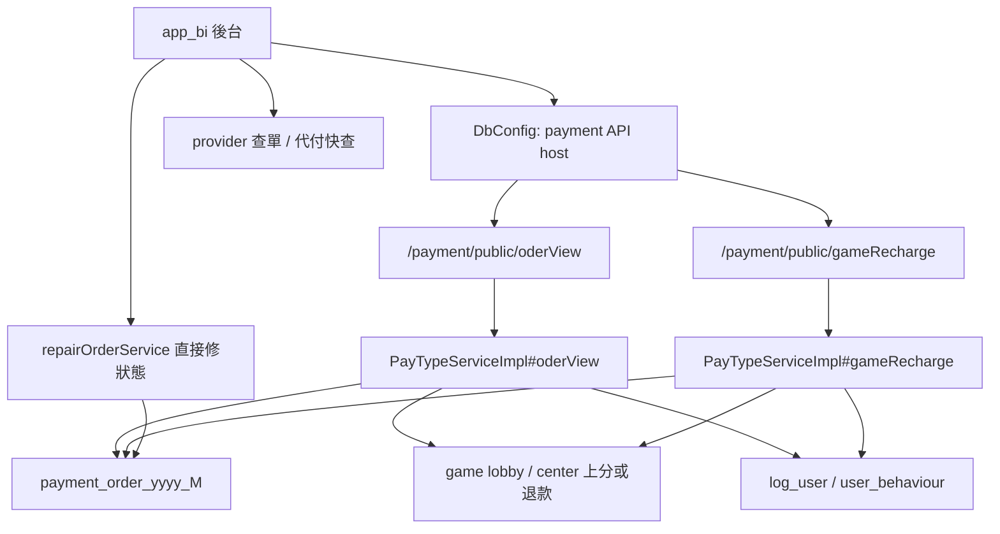
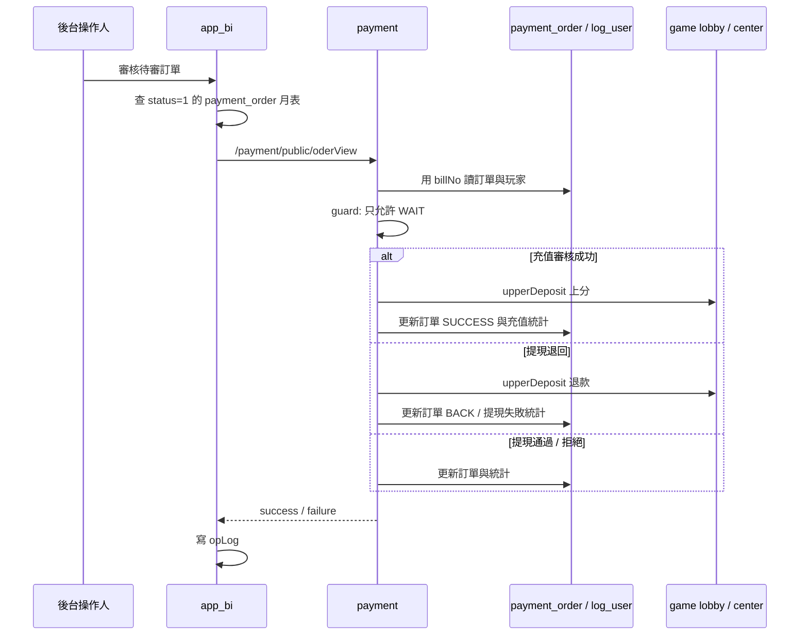

# iwin payment manual-order-review-repair

完成狀態：Step 5 已完成
掃描等級：Level 2 Flow 深掃
證據層級：專案存在 / code-backed；Nick 貢獻未確認到可放正式履歷的直接 evidence

本 flow 研究的是：

> 充值 / 提現訂單卡在待審、異常、掉單或需要營運介入時，後台如何觸發人工審核、補單、退回與狀態修復；payment 後端如何把人工動作轉成訂單狀態、玩家上分 / 退款、統計、通知與跨月表更新。

## 1. 閱讀定位

先分清楚三件事：

| 層次 | 代表 code | 本 flow 判斷 |
| --- | --- | --- |
| 後台操作入口 | `app_bi` 的 `UserCurrency::bill_check`、`DataListService::repairOrderService` | 讓營運按審核、修狀態、查三方單；不是 money correctness source of truth |
| payment 審核 / 補單 API | `PayPublicController#/payment/public/oderView`、`/payment/public/gameRecharge` | 人工審核、補單、GM 上下分的核心入口 |
| payment 狀態與副作用 | `PayTypeServiceImpl#oderView`、`#gameRecharge`、`BaseServiceImpl#updateOrderStatus`、`#upperDeposit`、`#updateServiceFiled` | 真正決定訂單狀態、玩家餘額副作用與統計更新 |

這條 flow 不等於完整 reconciliation。它只確認有人工審核 / 修復入口與部分 safety guard；是否有完整三方 statement、wallet log、payment order 三邊對帳，仍是待確認。

## 2. 白話導讀

payment 訂單不是只有「改 status」。

人工審核一筆充值成功時，後端需要：

- 確認訂單還是待審。
- 呼叫玩家上分。
- 更新 `payment_order`。
- 更新 `log_user` / `user_behaviour` 充值統計。
- 可能發信、重算玩家層級。

人工退回一筆提現時，後端需要：

- 確認訂單還是待審。
- 把交易語意改成提現退回。
- 呼叫玩家上分，把已扣的錢退回。
- 更新訂單與玩家統計。
- 發送提現失敗通知。

人工修復狀態則更危險。`app_bi` 的 `repairOrderService` 可以直接更新 `payment_order_yyyy_M.status` 與 remark，但這條路徑沒有在該 method 內看到玩家上分、退款、統計更新或 provider 查單後的 source-of-truth 判斷。因此它只能是 repair boundary，不能當作完整補償流程。

## 3. Code 分層對照

| 功能 | Code path | 已確認行為 |
| --- | --- | --- |
| 後台找 payment API | `app_bi/app/common/DbConfig.php` | `Deposit` 指向 `/payment/public/gameRecharge`，`VipDeposit` 指向 `/payment/public/oderView`，查單指向 provider `getOrderStatus` |
| 後台審核提款 | `app_bi/app/admin/controller/UserCurrency.php#bill_check` | 只查 `status=1` 的待審單；非自動出款會呼叫 payment `/oderView`；自動出款會呼叫 `/withdraw/{type}/{merchant}` |
| 後台修狀態 | `app_bi/app/business/DataListService.php#repairOrderService` | 允許把指定 `billNos` 更新成 `0/2/3/4` 並寫 remark / opLog |
| payment 審核入口 | `PayPublicController#oderView` | 轉進 `PayTypeServiceImpl#oderView` |
| payment 補單 / GM 上下分入口 | `PayPublicController#gameRecharge` | 轉進 `PayTypeServiceImpl#gameRecharge` |
| 審核狀態 enum | `OrderReviewStatusEnum` | `WAIT=1`、`REFUSE=2`、`BACK=3`、`ERROR=4`、`PAYSUCCESS=5`、`PROCESSING=6`、`PENALTIESERR=7`、`SUCCESS=0` |
| 跨月表 routing | `DruidDBConfig` | `billNo` 前 8 碼決定 `payment_order_yyyy_M` |
| 狀態更新 | `BaseServiceImpl#updateOrderStatus` | 對 `payment_order` insert / update，失敗會 throw |
| 玩家副作用 | `BaseServiceImpl#upperDeposit`、`#gmDownScore` | 連到 game lobby / center 做上分 / 下分 |
| 統計更新 | `BaseServiceImpl#updateServiceFiled` | 更新充值 / 提現成功失敗次數、金額、行為表 |

## 4. 最小架構圖



## 5. 正常流程圖



## 6. 逐步說明

### 6.1 後台審核入口

`app_bi` 的 `UserCurrency::bill_check` 先依 `billNos` 推出 `payment_order_yyyy_M`，只查 `status=1` 的待審單。這點和 payment 後端的 guard 一致：人工審核應該只處理待審單，不應覆蓋成功、退回、異常等終態。

若 status 是自動出款類型，`app_bi` 會依提現類型呼叫 `/withdraw/bank/{merchant}`、`/withdraw/zfb/{merchant}` 或 `/withdraw/pix/{merchant}`。若是一般審核，會呼叫 `/payment/public/oderView`。

### 6.2 payment 審核入口

`PayTypeServiceImpl#oderView` 會：

1. 查 `log_user`。
2. 用 `DynamicDataSourceContextHolder.setBillNo(billNo)` 讓月表 routing 找到正確 `payment_order_yyyy_M`。
3. 查訂單。
4. 檢查訂單必須是 `WAIT`。
5. 寫入操作人 `mid`、目標 status、remark。
6. 依 billType 分成充值審核與提現審核。

### 6.3 充值人工審核成功

充值訂單若審核成功：

- 呼叫 `upperDeposit(order, logUser, true)`。
- `updateOrderStatus(order)`。
- `updateServiceFiled(order, logUser)`。
- 非同步重算玩家層級、發充值成功通知。

重點：充值人工通過不是只把 `payment_order.status` 改成 `SUCCESS`；它包含玩家上分和統計更新。

### 6.4 提現退回

提現訂單若退回：

- 把 reason 改為 `CenterServerCurrencyEnum.CASHBACK`。
- 把 tradeType 改為 `WITHDRAWBACK`。
- 呼叫 `upperDeposit(order, logUser, false)` 把錢退回玩家。
- 更新訂單與玩家失敗統計。
- 發提現失敗通知。

重點：退回是 money movement；不能只修 status。

### 6.5 提現通過 / 拒絕

提現通過會更新訂單與玩家提現成功統計，並可能發送通知與跑馬燈。拒絕或其他失敗類 status 會更新訂單、失敗統計與通知。

### 6.6 人工補單 / GM 上下分

`gameRecharge` 支援：

- 銀商代理充值。
- 兌換補單。
- GM 人工充值。
- 線上掉單補單。
- 其他線下充值。
- GM 下分。

多數上分場景都會先 `createOrderNo`，再 `upperDeposit`，再把訂單更新成 `SUCCESS`，最後更新服務欄位。這裡可作補單素材，但 Step 3 只確認 code path，不確認每種操作的實際 SOP。

## 7. Senior / Owner 深度區

### 7.1 狀態機

| 狀態 | 語意 | 人工處理判斷 |
| --- | --- | --- |
| `WAIT=1` | 待審 | `oderView` 與 app_bi `bill_check` 的主要可處理狀態 |
| `PROCESSING=6` | 審核中 / 出款中 | provider 可能已接單，不能盲目退款或手動出款 |
| `SUCCESS=0` | 成功 | 終態；人工修正要確認是否已上分 / 出款 / 統計 |
| `REFUSE=2` | 已拒絕 | 終態；需保留原因與通知 |
| `BACK=3` | 已退回 | 提現退回通常已發生退款副作用 |
| `ERROR=4` | 異常 | 需要查 provider / wallet / payment 三邊 |
| `PENALTIESERR=7` | 下分接口異常類訂單異常 | 需要人工處理，但不能直接假設可重試 |

### 7.2 Transaction boundary

這條 flow 不是單一 DB transaction：

- payment 先查 / 更新 `payment_order`。
- 上分 / 退款會呼叫 game lobby / center。
- `updateServiceFiled` 會更新玩家累計欄位與行為表。
- email、marquee、calc layer 是後續副作用。

因此 owner 要關注「外部上分成功但本地 update 失敗」、「本地 status 被修掉但 wallet 沒動」、「統計更新失敗但訂單已終態」這類半完成狀態。

### 7.3 Consistency

已確認的保護：

- `oderView` 只允許 `WAIT` 訂單被人工審核。
- `app_bi bill_check` 也只查 `status=1`。
- `DruidDBConfig` 會用 `billNo` 前 8 碼定位月表，避免跨月審核打錯當月表。
- `BaseServiceImpl#updateOrderStatus` 失敗會 throw。

仍待確認：

- `billNo` 是否有 DB unique。
- 下游 wallet 是否用 `billNo` 去重。
- `repairOrderService` 直接修 status 後，是否有外部 SOP 確認 wallet / provider 狀態。
- 是否有完整 audit diff：before status、after status、operator、reason、provider evidence。

### 7.4 Idempotency

`WAIT` guard 是人工審核的第一層 idempotency。問題在於：

- `repairOrderService` 可直接把狀態改成 `0/2/3/4`，不做上分 / 退款副作用。
- provider callback 可能晚到；若人工先修成成功或退回，callback 後續如何 no-op 要回到 callback flow 的終態 guard。
- 提現退回一旦呼叫 `upperDeposit`，如果失敗後重試，需要下游 `billNo` 去重支撐。

保守說法：這裡有狀態 guard 與 `billNo` trace，但不能宣稱 end-to-end exactly-once。

### 7.5 Failure window

| 斷點 | 可能後果 | 現有 evidence | Owner 要補 |
| --- | --- | --- | --- |
| `upperDeposit` 成功，`updateOrderStatus` 失敗 | 玩家已上分 / 退款，但訂單仍非終態 | flow 是分段呼叫 | wallet idempotency、reconcile job、人工待處理狀態 |
| `updateOrderStatus` 成功，`updateServiceFiled` 失敗 | 訂單終態但玩家統計不一致 | `updateServiceFiled` 是後續呼叫 | 統計修復 / replay |
| `repairOrderService` 直接修 status | 狀態與 wallet / provider 不一致 | method 只 update status / remark | 修復前查 provider、wallet log、payment order |
| `PROCESSING` 卡住 | provider 可能已接單，未知成功或失敗 | app_bi UI 提醒要先代付快查 / 商戶後台確認 | unknown 不退款、不手動出款 |
| 人工退回後 callback 晚到 | 可能狀態衝突或重複副作用 | callback flow 有終態 guard | callback inbox / repair SOP |

### 7.6 Observability

已看到：

- app_bi `bill_check` 成功後寫 `opLog`。
- `repairOrderService` 寫 `opLog`。
- payment 端有 log 記錄審核、訂單號、玩家 id、通知參數。
- app_bi operator UI 有明確提示：自動提現提交異常時要用代付快查與商戶後台確認，不要盲目改手動出款。

不足：

- 未看到統一 repair event / before-after snapshot。
- 未看到 provider raw query result 與人工修復結果綁定。
- 未看到 dead letter / aging order dashboard。

### 7.7 Owner decision

這條 flow 面試時要講的 owner decision 不是「我會讓後台能改狀態」，而是：

1. 人工審核只能操作可安全轉移的狀態。
2. 退回 / 補單這類 money movement 必須走 payment API，不能只改 DB status。
3. 直接修狀態要被降級成 break-glass repair，必須附原因、查單 evidence、operator、before-after。
4. `PROCESSING` unknown 不能直接退款或成功，要先查 provider 與 wallet。
5. callback 晚到時要靠終態 guard / inbox / repair SOP 防止覆蓋人工判斷。

## 8. Step 4 面試 case

### 8.1 3 分鐘講法

我會把這條 flow 定位成金流 recovery / operation boundary，而不是後台 CRUD。正常人工審核會從 app_bi 進來，但 app_bi 只是操作入口；真正要看 payment 的 `/payment/public/oderView`。這個 API 會先確認訂單仍是 `WAIT`，再依充值或提現分支處理。充值通過會呼叫 `upperDeposit` 上分，再更新 `payment_order` 與玩家充值統計；提現退回會把交易語意改成 `WITHDRAWBACK`，再呼叫 `upperDeposit` 把錢退回玩家，接著更新訂單與失敗統計。

這裡最容易出事的是直接修狀態。app_bi 的 `repairOrderService` 可以直接把月表裡的 `payment_order.status` 改成成功、拒絕、退回或異常，並寫 remark / opLog；但這條路徑沒有在 method 內處理 wallet 上分 / 退款、provider 查單或統計更新。所以我會把它定義成 break-glass repair，只能在有 provider 查單、wallet log、payment order 三邊 evidence 後使用。

如果面試官問 `PROCESSING` 卡住怎麼辦，我不會直接說退款或改成功。`PROCESSING` 代表 provider 可能已接單，正確處理要先查 provider / 商戶後台、payment order、game lobby currency log。只有 provider 明確 failed 才能走退款；success 要補終態；unknown 要保留人工待查，而不是用猜的改狀態。

### 8.2 高頻追問

| 追問 | 建議回答 |
| --- | --- |
| 人工審核是直接改 DB 嗎？ | 正常審核不是。app_bi `bill_check` 會呼叫 payment `/oderView`，由 payment 做狀態 guard、上分 / 退款與統計更新。但另有 direct repair 工具，只能當最後手段。 |
| 為什麼只能審 `WAIT`？ | 因為終態訂單可能已完成玩家餘額、副作用通知或 provider 出款。覆蓋終態會造成重複上分、重複退款或 audit 斷裂。 |
| 提現退回和拒絕差在哪？ | 退回是 money movement，要把已扣的錢加回玩家；拒絕 / 失敗類狀態主要是狀態與統計語意。面試時要強調退回不能只改 status。 |
| `PROCESSING` 卡住怎麼辦？ | 先查 provider 查單 / 商戶後台、payment order、wallet log；success 補終態，failed 才退款，unknown 保留人工待查。 |
| callback 晚到怎麼辦？ | callback flow 要有終態 guard，人工修復也要留 reason / provider evidence。若人工已補成功或退回，晚到 callback 應 no-op 或進人工衝突處理，不可覆蓋。 |
| direct repair 要怎麼設計比較安全？ | 權限隔離、雙人覆核、高風險狀態限制、before-after snapshot、provider query raw evidence、wallet log evidence、operator / reason / ticket link，並能查出後續是否需要補統計。 |

### 8.3 人工 repair SOP checklist

建議 SOP：

1. 先確認 `billNo` 對應的 `payment_order_yyyy_M`。
2. 看目前狀態：`WAIT`、`PROCESSING`、`SUCCESS`、`BACK`、`ERROR`。
3. 查 provider：callback log、query order、商戶後台或出款平台。
4. 查 wallet：game lobby / center currency log 是否已上分 / 扣分 / 退款。
5. 查 payment 統計：`log_user`、`user_behaviour` 是否已更新。
6. 判斷 source of truth：provider 成功、provider 失敗、wallet 已動、wallet 未動或 unknown。
7. 選操作：走 `/oderView`、走 `gameRecharge` 補單、或用 `repairOrderService` break-glass。
8. 寫入 operator、reason、before-after、查單結果與 ticket / 工單。
9. 處理 callback 晚到：確保終態 guard / no-op / 人工衝突處理。
10. 事後抽樣對帳：payment order、provider、wallet log 三邊一致。

### 8.4 Step 4 面試結論

這條 flow 可以拿來講「人工補償邊界」：

- 自動流程無法解決所有 unknown，營運入口必須存在。
- 但人工權限越大，越需要嚴格 evidence、audit、狀態 guard 與補償 SOP。
- 正常審核 API 與 direct status repair 必須分層，不能混成一個「改狀態」操作。

## 9. 面試 / 履歷邊界摘要

可作面試素材：

- 人工審核 / 補單 / 修復不是 CRUD，而是跨 payment order、wallet、provider、營運操作的 recovery flow。
- 可講 `WAIT` guard、跨月月表 routing、`billNo` trace、上分 / 退款副作用與 direct repair 的風險。
- 可銜接前面三條 payment flow：provider request、callback、自動出款卡住後，人工 repair 是最後防線。

目前不可放進正式履歷：

- 未找到 Nick 直接修改 `oderView`、`gameRecharge`、`repairOrderService` 或人工審核主線的 path-specific evidence。
- `app_bi` repair 相關 path history 目前主要是 gill / arnold；payment 人工審核核心 history 主要是 Derek / gill / arnold。
- 只保留為 `專案存在 / code-backed` 與 Senior 面試分析素材。

## 10. Step 4 結論

`manual-order-review-repair` 已完成 Step 4。這條 flow 的核心不是單一人工按鈕，而是「營運介入如何安全地改變 money state」。

最重要的 code-backed 結論：

- `oderView` 只允許 `WAIT` 訂單人工審核。
- 充值成功與提現退回會呼叫 `upperDeposit`，不是只改 status。
- `gameRecharge` 支援人工充值、線上掉單補單、兌換補單與 GM 下分。
- app_bi 的 `repairOrderService` 是直接修狀態工具，應視為 break-glass repair，不可等同完整 reconciliation。
- Step 4 已補可面試的 3 分鐘講法、追問答法與人工 repair SOP。

## 11. Step 5 履歷 / 自傳 claim gate

本 flow 已完成 Step 5，結論是不更新正式履歷 / 自傳。

判斷理由：

- 已重新 fetch source repo remote refs；`payment` 本機 `k3s` 落後 `origin/k3s` 1 commit，`app_bi` 本機 `main` 落後 `origin/main` 4 commits，因此本次 claim gate 以最新 remote refs 的 path history 補判讀，未 pull、未 checkout、未改公司 repo。
- `10gt12nc` 在本次人工審核 / 修復相關 path 只找到共享建單 / 提款 insert id 清理 commit：`03c28e3`、`6539d7a`，可支撐 provider request / withdraw insert consistency 相關保守說法，但不能延伸成人工審核 / 補單 / 修單主線 owner。
- 目前未找到 `10gt12nc` 直接修改 `PayTypeServiceImpl#oderView`、`PayTypeServiceImpl#gameRecharge` 主邏輯、app_bi `bill_check` 或 `repairOrderService` 的 path-specific evidence。
- 沒有 Nick 本人 MR / ticket / production issue / 本人確認前，這條 flow 只保留為 `專案存在 / code-backed` 與 `分析素材 / learning-only`。

可用方式：

- 面試時可用這條 flow 講人工修復、break-glass repair、`PROCESSING` unknown、callback 晚到與 money side effect 邊界。
- 正式履歷 / 自傳不新增「人工審核、補單、修單、reconciliation」相關 claim。

## 12. Step 5 結論

`manual-order-review-repair` 已完成 Step 5。最終定位是 Senior Backend / Owner 面試素材，不進正式履歷。

同一個 `payment` project 目前已完成：

- `payment-provider-callback` Step 5。
- `withdrawal-auto-review-refund` Step 5。
- `payment-order-provider-request` Step 5。
- `manual-order-review-repair` Step 5。

後續狀態更新：第五條 `payment-channel-config-selection` 已完成 Step 5，project-level contribution consolidation 也已完成。

## 13. 下一步建議

只推薦一件事：

```text
iwin game_api partner-deposit-withdraw-bill Step 3
```

## 履歷 claim 分層（2026-05-18 KB 對齊）

- 可放履歷：本 flow 目前不單獨升級成真實開發成果；project-level consolidation 已完成，payment 履歷只保守寫 provider 對接 / 維護與 order consistency。
- 可面試講：code-backed / 分析過。可講本 flow 的 money correctness、狀態轉移、冪等、retry、補償、人工修復或 config consistency。
- 不可誇大：不得寫成 Nick 主導完整 payment / wallet owner、設計完整金流架構、建立完整 reconciliation 或解決 production incident。
