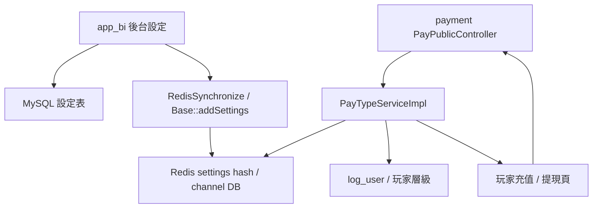
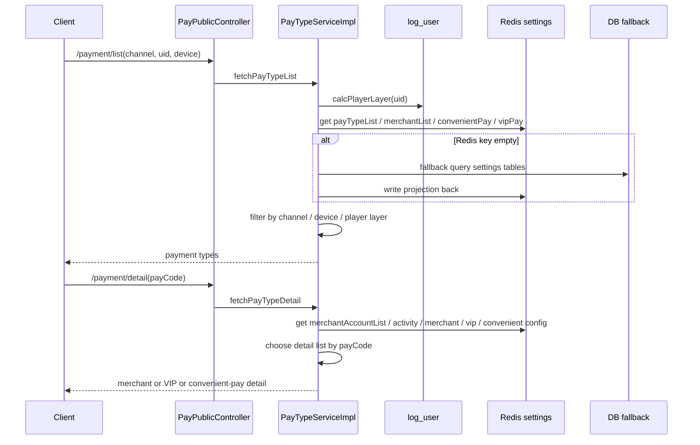

# iwin payment payment-channel-config-selection

完成狀態：Step 5 已完成
掃描等級：Level 2+ claim gate
證據層級：專案存在 / code-backed；分析素材 / learning-only；Nick 貢獻未確認到可放履歷的直接 evidence

本 flow 研究的是：

> 玩家進入充值 / 提現頁時，payment runtime 如何依玩家、channel、device、玩家層級、Redis 設定與商戶狀態，決定「可以看到哪些支付方式、哪些商戶檔位、哪些提現方式與限制」。

## 1. 閱讀定位

### Flow 類型與閱讀定位

- Flow 類型: Control Plane Flow
- 所屬大系統: iwin payment channel config / selection
- 面試用途: 輔助 case / payment routing control
- 閱讀方式: 先看 channel config 如何影響 provider routing，再看 cache / consistency / fallback。
- 不要期待: 這不是實際扣款 callback 主流程。

這條 flow 不是金流扣款 / 上分主線，而是金流入口前的 eligibility / runtime config selection。

| 層次 | 代表 code | 本 flow 判斷 |
| --- | --- | --- |
| 玩家 API 入口 | `PayPublicController#/payment/list`、`/payment/detail`、`/payment/public/withdrawConfig` | 前端取得可用支付方式、支付詳情、提現設定 |
| runtime 選擇邏輯 | `PayTypeServiceImpl#fetchPayTypeList`、`#fetchPayTypeDetail`、`#withdrawConfig` | 依玩家層級、channel、device、商戶 / 提現設定過濾 |
| Redis projection | `BaseServiceImpl#getPayTypeList`、`#getMerchantList`、`#getConvenientPayList`、`#getVipList`、`#getWithdrawConfig` | 優先讀 Redis；部分 key 空時 fallback DB 並寫回 Redis |
| 後台同步入口 | `app_bi RedisSynchronize`、`Base::addSettings` | 從 MySQL 設定表同步 `settings` hash 到各 channel Redis DB |

這條 flow 的 Senior / Owner 價值在於：DB 設定、Redis projection、runtime consumer 三者是否一致；以及玩家層級 / device / channel 過濾錯誤時，會不會造成支付入口不可用或錯商戶曝光。

## 2. 白話導讀

玩家打開充值頁時，後端不是直接把所有支付方式都丟給前端。

系統會先查玩家資料，算出玩家層級，再依 channel 找對 Redis DB。接著從 Redis 讀：

- `payTypeList`：有哪些支付類型。
- `merchantList`：哪些商戶、檔位、device、玩家層級可以用。
- `merchantAccountList`：商戶帳號 / provider id 對照。
- `convenientPay`：快捷支付 / 線下銀行卡。
- `vipPay`：銀商 / VIP 充值聯絡方式。
- `paySetting`：提現方式、單筆上下限、打碼倍數、保底限制、客服 URL。

如果設定同步錯、Redis 是舊的、玩家層級對不上，玩家最直覺會遇到：

- 充值頁沒有支付方式。
- 同一支付類型看不到可用商戶。
- iOS / Android 顯示不一致。
- 玩家層級不該看到的商戶被顯示。
- 提現最低 / 最高金額或綁定狀態顯示錯。

## 3. Code 分層對照

| 分層 | Code / key | 已確認行為 |
| --- | --- | --- |
| Route / API | `/payment/list` | 取得支付方式列表 |
| Route / API | `/payment/detail` | 取得指定 pay code 的商戶 / VIP / 快捷支付詳情 |
| Route / API | `/payment/public/withdrawConfig` | 取得玩家可用提現方式與限制 |
| Controller | `PayPublicController` | 只做參數整理後轉 service |
| Service | `PayTypeServiceImpl#fetchPayTypeList` | 查玩家層級，讀 payment config，過濾可見支付類型 |
| Service | `PayTypeServiceImpl#fetchPayTypeDetail` | 依 pay code 回傳快捷支付、VIP 充值或一般商戶列表 |
| Service | `PayTypeServiceImpl#withdrawConfig` | 讀提現設定並遮罩玩家已綁定帳號 |
| Redis / DB helper | `BaseServiceImpl#getPayTypeList` 等 | 優先讀 Redis，部分 key 空時 fallback DB |
| Redis hash | `settings` | 存放 payment runtime config projection |
| Redis fields | `payTypeList`、`merchantList`、`merchantAccountList`、`convenientPay`、`vipPay`、`paySetting`、`layers` | payment / app_bi 共用設定 key |
| DB tables | `paytype_channel`、`paytype`、`merchant`、`merchant_account`、`convenientPay`、`vipPay`、`settings`、`userLayer`、`log_user` | 設定來源與玩家層級來源 |
| app_bi sync | `RedisSynchronize#savePayClientSettingToRedis` 等 | 將 MySQL 設定同步到 Redis |

## 4. 最小架構圖



## 5. 正常流程圖



## 6. 正常流程逐步說明

1. 前端帶 `channel`、`uid`、`device` 呼叫 `/payment/list`。
2. `PayTypeServiceImpl#fetchPayTypeList` 切到 `bi_log`，用玩家 uid 計算或取得玩家層級。
3. 用 `Utils.getChannelId(uid)` 決定 Redis DB。
4. 從 Redis `settings` 讀 `payTypeList`、`merchantList`、`convenientPay`、`vipPay`。
5. 快捷支付看 `convenientPay.channel` 是否符合玩家 channel 或全渠道，並檢查玩家層級。
6. VIP / 銀商支付只要 `vipPay` 有資料就顯示該支付類型。
7. 一般商戶支付會檢查商戶 pay type、device 是否符合、玩家層級是否在 merchant layers。
8. `/payment/detail` 會依 pay code 分三種：快捷支付、VIP 充值、一般商戶。
9. 一般商戶詳情會補 `merchantAccountList` 裡的 merchant id，並依商戶檔位分組。
10. `/public/withdrawConfig` 會依玩家 channel 讀 `paySetting`，把提現設定轉成玩家可看的金額單位，並遮罩已綁定帳號。

## 7. Senior / Owner 深度區

### 7.1 Source of truth

設定來源分成三層：

| 層 | 角色 | 風險 |
| --- | --- | --- |
| MySQL 設定表 | 後台可維護的 source of truth | 改了 DB 不代表 runtime 已看到 |
| Redis `settings` projection | payment runtime 的主要讀取來源 | 同步失敗 / partial sync 會造成舊設定 |
| payment runtime filter | 最終決定玩家看到什麼 | 過濾條件錯會讓正確設定也顯示錯 |

這裡不能只說「設定存在」。Owner 要看 DB -> Redis -> payment runtime 三段是否一致。

### 7.2 Consistency

已確認：

- app_bi 會同步 `payTypeList`、`merchantList`、`merchantAccountList`、`convenientPay`、`vipPay`、`paySetting`、`layers` 到 Redis。
- payment runtime 會從 Redis 讀這些 key。
- `merchantList` 在 app_bi 同步時只同步 `status=1`，payment runtime 讀取後也再過濾 `status=1`。
- 玩家層級是 payment selection 的核心條件。

待確認：

- 同步多個 key 時是否有 atomic version / batch id。
- 多 channel Redis DB 是否可能只同步部分成功。
- payment instance 是否有本地 cache 或只讀 Redis。
- Redis key 空時 fallback DB 後，是否會立刻回傳新資料。

### 7.3 Failure window

| 斷點 | 可能結果 | Evidence | Owner 要補 |
| --- | --- | --- | --- |
| DB 已改，Redis 未同步 | 玩家仍看到舊商戶 / 舊檔位 | app_bi 手動 sync projection | waitSyn dashboard、同步 SLA |
| Redis 只同步部分 key | `payTypeList` 有新 code，但 `merchantList` 沒對應商戶 | 多 key 分散寫入 | versioned config / batch validation |
| `payTypeList` cache miss fallback | fallback DB 後可能回傳原本空 list | `getPayTypeList` 寫 Redis 後未重新 assign return list | cold-cache test / 修正回傳 |
| `merchantAccountList` 與 `merchantList` 不一致 | 前端看到商戶但缺 merchant id | detail 用 merchant name + channel 對應 | sync validation |
| 玩家層級變動但 Redis / `log_user` 未同步 | 玩家看錯支付方式 | runtime 用 `log_user.userLayer` | layer update audit |
| `paySetting` 空或格式錯 | 提現配置錯或 exception | `getWithdrawConfig` 讀 settings JSON | schema validation / default safe response |

### 7.4 Idempotency / retry

這條 flow 沒有直接 money mutation，但它仍需要「設定同步 idempotency」：

- 同一份設定重複同步應得到同一份 Redis projection。
- 部分同步失敗時，要知道哪些 channel / key 失敗。
- key 空時 fallback DB 不應讓第一個請求拿到空結果。
- runtime 讀到不完整 config 時，應 fail closed，例如不顯示不可確認商戶，而不是曝光錯商戶。

### 7.5 Observability

已看到：

- app_bi 同步 method 會寫 `opLog`。
- 部分同步成功會 `removeWaitSync`。
- payment list/detail 為空時會 log channel、玩家層級、uid。

不足：

- 未看到 config version / hash。
- 未看到每個 channel / key 的同步結果表。
- 未看到 payment runtime 對 Redis key miss / schema mismatch 的 structured alert。
- 未看到「某支付方式曝光給哪些層級 / device」的線上診斷工具。

### 7.6 Owner decision

這條 flow 面試時不要講成「後台同步 Redis」而已，要講成：

1. MySQL 是設定來源，Redis 是 runtime projection，payment API 是最後 eligibility decision。
2. 支付列表和支付詳情要分兩層：先決定支付類型，再決定該類型下有哪些商戶 / VIP / 快捷支付 detail。
3. 玩家層級、channel、device 是核心 filter，不可只看商戶 status。
4. config sync 要有版本、驗證與回滾，不然 partial sync 會讓玩家看到不一致入口。
5. 這條 flow 不直接改錢，但會決定玩家能不能進入 money flow，所以仍屬於 payment correctness 的前置條件。

## 8. 面試 / 履歷邊界摘要

可作面試素材：

- Runtime config selection：DB 設定、Redis projection、payment API eligibility。
- 玩家層級、device、channel、商戶 status 與商戶帳號對應的交叉過濾。
- Redis projection partial sync、cold-cache fallback、config versioning 的 owner decision。

Step 5 判定不放正式履歷：

- 未找到 Nick 直接修改這條 payment list/detail/withdrawConfig 或 app_bi payment config sync 主線的 path-specific evidence。
- app_bi 設定同步相關 history 目前主要是 gill / arnold。
- payment 相關 history 中 `10gt12nc` 只支撐 provider request / order insert consistency 題材，不支撐本 flow owner claim。

## 9. Step 4 面試 case

### 9.1 3 分鐘講法

這條 flow 我會定位成 payment 的 runtime config selection。玩家打開充值或提現頁時，payment API 不是把所有支付方式和商戶直接回給前端，而是先取得玩家層級，再依 channel、device 和 Redis `settings` 裡的 payment projection 做 eligibility decision。

資料來源分三層：app_bi 後台維護 MySQL 設定，`RedisSynchronize` 把 payment type、merchant、merchant account、convenient pay、VIP pay、pay setting、layers 同步到 Redis，payment runtime 再透過 `/payment/list`、`/payment/detail`、`/payment/public/withdrawConfig` 消費這些 projection。

Senior / Owner 風險在於這不是單一 cache key，而是多個 key 要同版本。如果 `payTypeList` 已同步但 `merchantList` 沒同步，玩家可能看到支付類型但沒有可用 detail；如果 `merchantList` 與 `merchantAccountList` 不一致，後續建單可能缺 merchant id；如果 Redis cold cache fallback 只寫回 Redis 卻沒有讓第一個 request 拿到新資料，玩家會看到空白支付列表。Owner decision 應該是 config version、同步後 validation、per-channel readiness、schema validation，以及 runtime 對不完整設定 fail closed。

### 9.2 高頻追問

| 追問 | 保守答法 |
| --- | --- |
| 這條跟金流 correctness 有關嗎？ | 有，但它是 money flow 的前置 eligibility，不直接上分 / 扣款。錯了會讓玩家不能進入正確支付或提現入口。 |
| DB 和 Redis 誰是 source of truth？ | MySQL 設定是 source of truth，Redis 是 runtime projection，payment API 是最後 eligibility decision。 |
| list 和 detail 為什麼要分開看？ | list 先決定玩家可見支付類型；detail 再決定該 pay code 下的商戶、VIP 或快捷支付細節。 |
| 玩家看不到支付方式先查什麼？ | 查 uid 對應 channel / Redis DB、玩家層級、`payTypeList`、`merchantList`、device、layers、商戶 status、`merchantAccountList` 對應。 |
| partial sync 怎麼防？ | 加 batch/version、同步後 validation、per-channel/key result，runtime 讀到跨 key 不一致時 fail closed 並告警。 |
| Redis miss 怎麼處理？ | 可以 fallback DB，但要確保本次 response 拿到 fallback 結果，不只是寫回 Redis；也要有 cold-cache test 與 key miss alert。 |
| 這條能寫履歷嗎？ | 目前不寫正式履歷。它是 code-backed 分析素材，Nick 直接 path-specific evidence 還不足。 |

### 9.3 Production 排查順序

玩家看不到支付方式：

1. 用 uid 確認 channel、Redis DB、玩家層級。
2. 查 `/payment/list` log 是否有空列表 warning。
3. 查 `settings/payTypeList` 是否有該 channel 可用 pay type。
4. 查 `merchantList` / `convenientPay` / `vipPay` 是否有符合 channel、device、layers 的資料。
5. 查 app_bi sync 是否最近有失敗、只同步部分 key，或 waitSync 沒清掉。
6. 若 Redis key 空，確認 fallback DB 後 response 是否仍空。

玩家看到支付類型但 detail 空：

1. 查 list 回傳的 pay code。
2. 查 `merchantList` 是否有該 pay code 的商戶。
3. 查 `merchantAccountList` 是否有 merchant name + channel 對應。
4. 查商戶 fixed amount / amount gears / activity 設定是否能組成前端 detail。
5. 查玩家 layer / device 是否被 detail 再次過濾。

提現設定顯示錯：

1. 查 `paySetting` 是否為該 channel 的最新 JSON。
2. 查玩家已綁定 zfb / pix / bank account 是否被正確遮罩。
3. 查金額單位轉換是否一致。
4. 查設定 schema 是否有缺欄位或舊格式。

### 9.4 Owner decision

面試時可把改善方向收斂成五個 owner decision：

| Decision | 為什麼 |
| --- | --- |
| Versioned config | 多 key projection 必須知道是否同一批設定 |
| Sync validation | `payTypeList`、`merchantList`、`merchantAccountList` 要能互相對上 |
| Per-channel readiness | 每個 channel / Redis DB 的同步成功狀態要可觀測 |
| Cold-cache safety | Redis miss fallback 不能讓第一個玩家 request 拿空資料 |
| Fail closed + explainability | 不完整設定不曝光商戶，並能說明為什麼某玩家看不到 |

## 10. Step 4 結論

`payment-channel-config-selection` 已完成 Step 4。這條 flow 的核心不是商戶 CRUD，而是：

```text
app_bi MySQL 設定
-> Redis settings projection
-> payment runtime 依玩家 / channel / device / layer 過濾
-> 前端看到可用支付方式與提現設定
```

Step 4 已把這條 runtime config flow 轉成可面試 case，重點放在 config consistency、partial sync、cold-cache fallback、production 排查順序與 fail closed owner decision。

## 11. Step 5 Claim Gate

### 11.1 結論

本 flow 已完成 Step 5，判定如下：

| 項目 | 判定 |
| --- | --- |
| 是否更新正式履歷 master | 不更新 |
| 是否更新投遞用自傳 | 不更新 |
| 是否可作面試 case | 可以 |
| 證據層級 | 專案存在 / code-backed；分析素材 / learning-only |
| Nick 個人貢獻 | 未確認到可放履歷的直接 evidence |

### 11.2 為什麼不更新履歷

Step 5 重新 fetch 並檢查 payment / app_bi 相關 path history 後，仍未找到 `10gt12nc` 直接修改以下主線的 evidence：

- `PayPublicController#/payment/list`
- `PayPublicController#/payment/detail`
- `PayTypeServiceImpl#fetchPayTypeList`
- `PayTypeServiceImpl#fetchPayTypeDetail`
- `PayTypeServiceImpl#withdrawConfig`
- app_bi payment config / Redis sync 主線

有看到 `10gt12nc` 在相關 path 的 commit：

- `03c28e3`：充值建單前清掉 BeanUtil 帶入的 copied order id。
- `6539d7a`：提款建單前清掉 BeanUtil 帶入的 copied order id。

這兩筆是 order insert consistency / provider request 方向的 evidence，不是 payment channel config selection 的直接 evidence。真正支撐本 flow config / Redis projection 的 path history 主要是 Derek / gill / arnold，例如 `c92a8c2` 修正 Redis `payTypeList` 格式、`ea9bf27` 商戶同步只保留 `status=1`。

### 11.3 可保留的面試價值

這條 flow 雖然不進正式履歷，但很適合當 Senior / Owner 面試補充案例：

- runtime eligibility：玩家是否能看到正確支付 / 提現入口。
- DB source of truth、Redis projection、payment runtime filter 三層一致性。
- `payTypeList` / `merchantList` / `merchantAccountList` 多 key partial sync。
- Redis cold-cache fallback 與第一個 request 空列表風險。
- fail closed、config version、sync validation、per-channel readiness、explainability。

### 11.4 不能誇大的邊界

不可說：

- 我主導 payment channel config selection。
- 我設計 payment runtime config center。
- 我修復支付列表 / 商戶設定 production incident。
- 我建立完整 config version / atomic rollout。

可說：

- 我分析過 payment runtime config selection，能說明 DB 設定、Redis projection、payment API eligibility 的一致性風險。
- 我會用這條案例討論支付入口前置條件、partial sync、cold-cache fallback、fail closed 與 owner decision。

## 12. Step 5 結論

`payment-channel-config-selection` 已完成 Step 5。這條 flow 最終定位是：

```text
code-backed runtime config consistency 面試案例
不是正式履歷成果
```

- 全域下一步狀態：目前沒有預設 project flow 下一步；請以 senior-owner-playbook/01-senior-owner-flow-inventory.md 與 senior-owner-playbook/06-todo.md 為準。

## 13. 歷史下一步紀錄

原本的下一步已完成：

```text
- 全域下一步狀態：目前沒有預設 project flow 下一步；請以 senior-owner-playbook/01-senior-owner-flow-inventory.md 與 senior-owner-playbook/06-todo.md 為準。
```

## 履歷 claim 分層（2026-05-18 KB 對齊）

- 可放履歷：本 flow 目前不單獨升級成真實開發成果；project-level consolidation 已完成，payment 履歷只保守寫 provider 對接 / 維護與 order consistency。
- 可面試講：code-backed / 分析過。可講本 flow 的 payment config consistency、狀態轉移、冪等、retry、補償、人工修復或 config consistency；不可說成金流 / wallet owner。
- 不可誇大：不得寫成 Nick 主導完整 payment / wallet owner、設計完整金流架構、建立完整 reconciliation 或解決 production incident。
