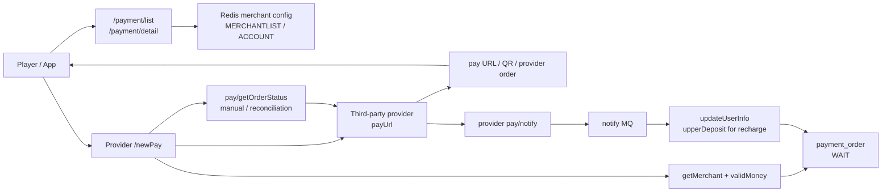
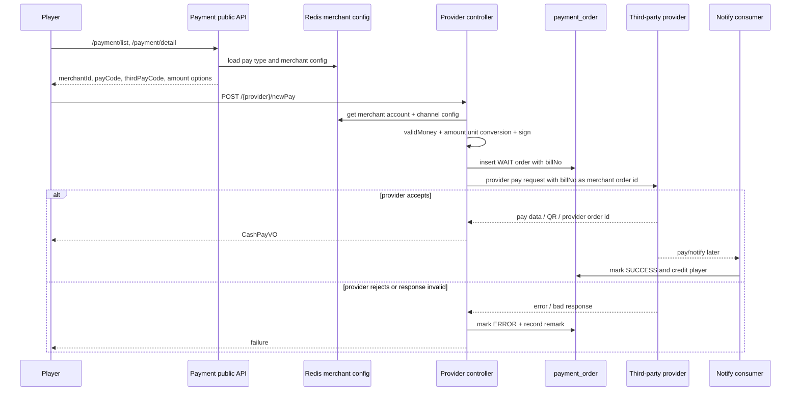

# payment-order-provider-request

## 0. 閱讀定位

- Flow 中文名稱：充值建單與 provider request。
- Flow slug：`payment-order-provider-request`。
- 專案：`/Users/nick/Git/iwin/payment`。
- 完成狀態：Step 5，Level 2+ claim gate；2026-05-18 建立主學習包、轉成面試 case，並完成 Nick 個人貢獻判定。
- 證據層級：`真實開發過` / `專案存在 / code-backed` 混合。
- Nick 個人貢獻層級：`部分 provider request 真實開發過`。已從 source repo path-specific history 確認 `10gt12nc <60815760+10gt12nc@users.noreply.github.com>` 在 `origin/pay4z-Nick` / `origin/NaNapay_Nick` / `origin/feature/nimtestpay-dev` / GoldenPay 相關 commits 中，新增或修改 Pay4z、NaNapay、BFPAY、GoldenPay、NimTestPay 這類 provider request / query / callback code。整體 `payment` 金流架構、全部 provider、完整 reconciliation owner 仍不得誇大。
- 是否只確認到入口：否。已確認玩家支付選擇、provider controller `/newPay`、訂單建立、商戶設定、簽章、金額單位轉換、provider HTTP request、回傳支付資訊、失敗標 `ERROR`、查單入口；但 DB unique key、provider accepted 後無 callback 的自動 reconciliation、完整 request / callback raw log 仍是 `待確認`。

本 flow 的核心問題是：

> 玩家選擇三方充值後，payment 如何先建立本地 `payment_order`，再帶著本地 `billNo`、商戶設定、金額、notify URL 與簽章去呼叫 provider 下單；如果 provider request timeout、回傳失敗或回傳格式異常，如何避免本地訂單和 provider 訂單對不上。

## 1. 白話導讀

充值建單不是「直接打三方 API」而已。玩家先從 payment 取得可用支付方式與商戶，選定商戶、金額和通道後，系統會進入對應 provider controller，例如 `Pay4zController.newPay`、`NimTestPayController.newPay` 或 `NewCashPayController.pay`。

provider controller 會先從 Redis 讀商戶設定，檢查充值金額是否符合商戶檔位 / 最小最大值，然後用玩家資料建立一筆 `payment_order`。這筆訂單會先是 `WAIT`，本地訂單號 `billNo` 會被放進 provider request，作為之後 callback / 查單要對回來的 merchant order id。

接著 controller 依 provider 規格組 request：商戶號、訂單號、金額、幣別、notify URL、支付產品碼、簽章。送出 HTTP request 後，如果 provider 回成功，payment 回給前端支付資訊，例如 QR code、pay URL、到期時間、provider order id；真正上分仍要等 provider callback 進 `payment-provider-callback` flow。若 provider 回失敗或格式不對，payment 會把本地訂單標 `ERROR`，留下失敗原因。

這條 flow 的 owner 重點是：本地訂單先建、provider request 後送，兩者不是同一個 transaction；request timeout 或 provider accepted 但 callback 不來時，必須靠 `billNo`、provider order id、查單與人工補償收斂。

## 2. 初中階 Code 分層對照

```text
Route / API：
- `/payment/list`
- `/payment/detail`
- provider-specific `/newPay`
- provider-specific `/pay/getOrderStatus`
- provider-specific `/pay/notify`

Controller：
- `PayPublicController.queryPayTypeList`
- `PayPublicController.queryPayTypeDetail`
- `NimTestPayController.newPay`
- `Pay4zController.newPay`
- `NewCashPayController.pay`

Service / Business：
- `PayTypeServiceImpl.fetchPayTypeList`
- `PayTypeServiceImpl.fetchPayTypeDetail`
- `BaseController.getMerchant`
- `BaseController.validMoney`
- `BaseServiceImpl.createOrderNo`
- `BaseServiceImpl.updateOrderStatus`
- `BaseServiceImpl.asynUpdateOrderStatus`

Model / DAO：
- `PayVO`
- `OrderVO`
- `MerchantVO`
- `CashPayVO`
- `LogUserVO`

SQL / Table：
- `payment_order`
- `log_user`

Redis / Config：
- `MERCHANTLIST_ACCOUNT`
- `MERCHANTLIST`
- merchant `others`：notify URL、provider-specific sign key / extra config
- merchant `payUrl`
- merchant `payInquirePage`
- merchant `payUnit`
- merchant `min` / `max` / `gears`

MQ / 下游通知：
- provider request 本身不直接上分。
- provider callback 成功後才透過 `asynUpdateOrderStatus` 進 notify MQ，再由 callback flow 更新玩家餘額與訂單終態。

External API：
- payment 呼叫三方 provider payUrl 下單。
- payment 呼叫三方 provider payInquirePage 查單。

Log / Audit：
- controller log provider request / response 與 billNo。
- `payment_order.recordRemark` 記錄 request failure / parse failure。
```

| 層級 | 代表 code | 責任 |
| --- | --- | --- |
| 支付列表 | `PayPublicController#/payment/list`、`PayTypeServiceImpl#fetchPayTypeList` | 根據玩家層級、device、支付方式和商戶設定回可用支付類型 |
| 支付詳情 | `PayPublicController#/payment/detail`、`PayTypeServiceImpl#fetchPayTypeDetail` | 回商戶、檔位、pay code、thirdPayCode、merchantId |
| provider 建單入口 | `*/newPay` | 接收 `PayVO`，查商戶設定、檢查金額、建立本地訂單、組 provider request |
| 本地訂單 | `BaseServiceImpl#createOrderNo` | 建立 `payment_order`，初始 `WAIT`，保存 `billNo` / merchant / pay code / money |
| 三方 request | `HttpRequest.post` / `HttpUtil.post` | 呼叫 provider pay URL |
| 成功回前端 | `CashPayVO` | 回 QR code / pay URL / provider order id / expire time |
| 失敗落單 | `updateOrderStatus` | provider fail / response parse fail 時把訂單標 `ERROR` |
| 查單 | `*/pay/getOrderStatus` | 用本地 `billNo` 查 provider 狀態，作 reconciliation 輔助 |

## 3. 最小架構圖



## 4. 正常流程圖



## 5. 正常流程逐步說明

1. 玩家打 `/payment/list`，payment 依 channel、uid、device 取得玩家層級和可用支付類型。
2. 玩家打 `/payment/detail`，payment 從 Redis 取商戶、商戶帳號、檔位與支付類型，回傳可選商戶。
3. 前端或上游選定 provider 後，呼叫對應 provider controller 的 `/newPay`，帶 `PayVO`：`openId`、`uid`、`money`、`merchantId`、`payCode`、`merchantName`、`thirdPayCode`。
4. provider controller 用 `Utils.getChannelId(uid)` 找 Redis DB。
5. controller 呼叫 `getMerchant`，先從 `MERCHANTLIST_ACCOUNT` 找商戶帳號，再從 `MERCHANTLIST` 找對應 `thirdPayCode` 的通道設定。
6. `validMoney` 檢查金額大於 0，並依商戶 `decide` 判斷非定額 min/max 或定額 gears。
7. controller 呼叫 `createOrderNo` 建立本地 `payment_order`。
8. `createOrderNo` 查 `log_user`，產生 `billNo`，把 `log_user` 轉成 `OrderVO`，清掉 copied id，寫入 `payment_order`，初始狀態 `WAIT`。
9. controller 根據 provider 規格組 request，把 `billNo` 放入 provider 的 merchant order id 欄位，例如 `mchOrderId`、`merchantOrderNo` 或 `merchantOrderId`。
10. controller 依 `merchant.payUnit` 轉換金額單位。有些 provider 用分，有些用元。
11. controller 從 merchant `others` 取 notify URL 或 provider-specific 設定，從 merchant password / key 組簽章。
12. controller 呼叫 provider `payUrl`。
13. provider 回 accepted / success 時，controller 回 `CashPayVO` 給前端，包含 QR code / pay URL、order id、amount、expire time、merchant name。
14. provider 回 fail 或 response parse fail 時，controller 把本地訂單改 `ERROR`，寫 `recordRemark`，回 failure。
15. 真正充值成功要等 provider callback 進 `payment-provider-callback` flow，由 notify MQ 和 `updateUserInfo` 上分。
16. 若 callback 不來，provider-specific `/pay/getOrderStatus` 可用 `billNo` 查 provider 狀態，但本輪未確認是否有自動 reconciliation job。

## 6. 業務問題

這條 flow 解決的是「玩家如何建立一筆可被三方 provider 識別、回調和查單的充值訂單」。

如果它壞掉，常見後果是：

- 本地訂單建立成功，但 provider request 沒送出去。
- provider request 成功，但本地沒有保存足夠的 provider order id / pay data。
- provider request timeout，本地不知道 provider 是否已建單。
- provider 回傳成功，但 callback 不來，訂單卡在 `WAIT`。
- 金額單位轉錯，provider 顯示金額與本地 `payment_order.money` 不一致。
- notify URL / sign key / merchant config 錯，provider callback 打不回來或驗簽失敗。
- request 失敗時本地訂單標 `ERROR`，但 provider 其實已 accepted，後續 callback 可能又回來造成狀態衝突。

## 7. 系統位置

- 產品：iwin 金流 / 充值。
- 專案：`payment`。
- 上游：玩家支付列表 / 詳情、前端選商戶後的 provider `/newPay`。
- 下游：第三方 provider pay API、provider callback、notify MQ、game lobby / center 上分。
- 已完成關聯 flow：`payment-provider-callback` Step 5。
- 相關但本輪未完整深掃：DB schema / unique key、完整 provider matrix、timer reconciliation、app_bi 人工查單 / 修單 UI。

## 8. 資料狀態與 State Transition

| 階段 | `payment_order` 狀態 | provider 狀態 | 說明 |
| --- | --- | --- | --- |
| 玩家看支付方式 | 無訂單 | 無 | `/payment/list` / `/payment/detail` 只讀 Redis / DB projection |
| 建立本地訂單 | `WAIT` | 尚未送出或送出中 | `createOrderNo` insert `payment_order` |
| provider accepted | `WAIT` | provider 已建立待支付單 | controller 回 QR / pay URL，等待玩家付款與 callback |
| provider request fail | `ERROR` | provider 拒絕或 response invalid | controller 直接更新本地訂單失敗 |
| provider request timeout | 多半仍是 `WAIT` 或被 catch 成 `ERROR`，依 provider 實作 | unknown | 本輪未看到統一 timeout state |
| provider callback success | `SUCCESS` | paid | callback flow 透過 MQ 上分並更新終態 |
| provider callback fail | `ERROR` | failed | 部分 provider 直接 `autoViewOrder`，部分走 callback flow |

## 9. Senior / Owner 深度重點

### Source of truth

- `payment_order` 是 payment 內部訂單 source of truth。
- provider 的 pay order 是外部 source of truth。
- 玩家餘額 source of truth 在 game lobby / center，充值成功後才上分。

這表示 `newPay` 成功只代表「本地訂單和 provider 支付單建立到某個階段」，不代表玩家已付款，也不代表玩家已上分。

### Transaction boundary

已確認非 atomic 的斷點：

- `createOrderNo` insert 本地訂單後，才呼叫 provider pay URL。
- provider HTTP request 與本地 DB insert 不在同一 transaction。
- provider request accepted 後，callback / 上分是另一條 flow。
- provider response fail / parse fail 時，controller 更新本地 `ERROR`，但無法保證 provider 端一定沒有建立訂單。
- `pay/getOrderStatus` 存在，但本輪未確認有自動 job 主動 reconcile `WAIT` aging order。

### Idempotency

已確認保護：

- 本地 `billNo` 由時間 / billType / uid 組成，並作為 provider merchant order id。
- `BaseController#getOrderVO` 在 callback / 查單時會用 `billNo` 找訂單，且對已終態訂單有 guard。
- `03c28e3` 修正 `createOrderNo` 從 `log_user` BeanUtil 複製 id 後未清掉，導致同 uid 第二筆 payment order 可能撞主鍵的風險。

待確認保護：

- `payment_order.bill_no` 是否有 DB unique key。
- provider 對同一 merchant order id 重送下單是否 idempotent。
- controller timeout 後重試 `/newPay` 是否會生成新 `billNo`，造成 provider orphan order。
- provider callback 與人工查單 / 手動修單如何避免互相覆蓋。

### Provider 代表差異

| Provider | 建單簽章 | 金額單位 | 成功回傳 | 失敗處理 | 查單 |
| --- | --- | --- | --- | --- | --- |
| `NimTestPayController` | SHA512，ASCII 排序，空值 / `"0"` 不參與 | 依 `payUnit` 分 / 元 | 回 `payData` / `mchOrderId` | `code != 0` 標 `ERROR` | `/pay/getOrderStatus` |
| `Pay4zController` | `SignUtil.getSignStr + secret` 後 MD5 | 依 `payUnit` 分 / 元 | 回 raw / merchantOrderNo | provider success false 標 `ERROR` | `/pay/getOrderStatus` |
| `NewCashPayController` | Basic auth + response sign verify | 依 `payUnit` 分 / 元 | 回 payUrl / qrcodeRaw / orderId | response abnormal / parse fail 標 `ERROR` | `/pay/getOrderStatus` |

本 flow 不平均整理所有 provider，以上三個只作共通形狀代表。

## 10. Failure Window

| 斷點 | 可能後果 | 現有 evidence | Owner 追問 |
| --- | --- | --- | --- |
| 商戶設定不存在或 Redis projection 舊 | 玩家無法下單或選到錯商戶 | `getMerchant` 讀 `MERCHANTLIST_ACCOUNT` / `MERCHANTLIST` | 設定更新如何同步 / rollback |
| 金額單位轉錯 | provider 訂單金額與本地 money 不一致 | provider 各自依 `payUnit` 轉分 / 元 | 是否有 provider contract test |
| `payment_order` insert 成功後 provider request timeout | 本地 `WAIT`，provider 端可能已建單 | 已確認先 insert 再 HTTP request | 如何查單 / reconcile unknown |
| provider response success 但 pay data 缺欄位 | 前端拿不到 QR / URL | 部分 provider 會檢查欄位，部分需逐 provider 確認 | 是否統一 response validation |
| provider response fail 但 provider 其實建單 | 本地 `ERROR`，後續 callback 可能回來 | HTTP timeout / parse fail 無法證明 provider 未建單 | `ERROR` 是否允許 callback 再處理 |
| provider callback 不來 | 訂單停 `WAIT` | 查單入口存在，自動 job 未確認 | `WAIT` aging monitor / query job |
| request log 帶簽名前敏感內容 | secret / key 風險 | `a56b407` 曾做憑證外部化與 log key mask | 是否所有 provider 都已遮罩 |
| 重複 `/newPay` | 可能產生多筆本地訂單 / provider 訂單 | 每次會產生新 `billNo` | 前端重送和 provider orphan order 如何處理 |

## 11. 補償 / Retry / Reconciliation

已確認：

- 多個 provider 有 `/pay/getOrderStatus`。
- `billNo` 會作為 provider merchant order id，也是 callback / 查單的對應 key。
- provider callback success 會進 `asynUpdateOrderStatus`，由 callback flow 做上分與終態更新。
- provider request fail / response abnormal 時，controller 會把本地訂單標 `ERROR` 並記錄原因。

待確認：

- 是否有 scheduled job 主動掃 `WAIT` aging order 並查 provider。
- 是否有 raw provider request / response inbox / outbox。
- provider request timeout 是否有統一 unknown 狀態，而不是直接 fail。
- app_bi / admin 是否能以 `billNo` 查 provider、payment order、wallet log 三邊。

Owner 判斷：

- `WAIT` 太久不應直接補上分，也不應直接改失敗；要先查 provider 狀態。
- request timeout 不能簡化成 provider fail，因為 provider 可能已 accepted。
- response fail 後若 callback 又回成功，必須依 order state guard 和人工 SOP 判斷是否允許覆蓋。
- 最理想改善是本地 outbox / request log + provider query job + aging dashboard。

## 12. Owner Decision

| Decision | 現況 | 取捨 | 改善方向 |
| --- | --- | --- | --- |
| 先 insert 本地訂單再打 provider | `createOrderNo` 在 request 前建立 `WAIT` 訂單 | 有本地追蹤點，但 provider request fail 會留下待處理訂單 | request outbox / unknown state / query job |
| 每個 provider 自己組 request | controller 內有 provider-specific sign / amount / response parsing | 對接快，但重複與風險分散 | 抽 provider adapter contract / response validator |
| `billNo` 當 merchant order id | provider request 和 callback 都用它對應 | trace 清楚，但 DB / provider idempotency 待確認 | DB unique + provider idempotent contract |
| provider fail 直接標 `ERROR` | 多個 controller 如此處理 | 前端可立即知道失敗，但 timeout / partial success 容易誤判 | 區分 rejected / unknown / accepted |
| 查單入口存在 | `/pay/getOrderStatus` | 可人工補償，但不等於自動對帳 | aging monitor + scheduled reconcile |

## 13. 面試 / 履歷邊界摘要

可說：

- Nick 有 code history 可支撐「參與多個 iwin payment provider request / callback / query 對接與維護」。
- 最強 evidence 是 Pay4z：`origin/pay4z-Nick` 與 `7853917 feat(#285): pay4z 对接` 新增 `Pay4zController` / `Pay4zServiceImpl`，包含 `/newPay`、callback、查單、簽章、金額單位與 merchant order id。
- 也可用 NaNapay、BFPAY、GoldenPay、NimTestPay 作輔助 evidence，但要分清楚 production provider、query / fix、provider integration、local / SIT manual testing；GoldenPay 目前只標 code-backed provider integration，不寫 production owner。
- 可以用它談 provider integration、簽章、金額單位、merchant order id、HTTP timeout、查單 / callback / reconciliation。

不能說：

- Nick 主導或設計 iwin provider request 架構。
- Nick 對接全部 payment provider。
- Nick 建立完整自動 reconciliation 機制。
- 所有 provider 都已確認具備一致 idempotency。
- 已確認完整自動 reconciliation。
- NimTestPay 只能說 local / SIT manual testing merchant controller，不要包裝成正式 production provider 上線成果。

詳細面試素材放在 `career-interview.md` 與 `materials/interview.md`，證據與待確認清單放在 `materials/evidence.md` 與 `materials/claim-boundary.md`。

## 14. 下一步

- 歷史下一步已完成：iwin_gameserver center-http-deposit-withdraw 已完成到 Step 5；目前沒有預設下一步，請以 senior-owner-playbook/01-senior-owner-flow-inventory.md 與 senior-owner-playbook/06-todo.md 為準。

```text
- 歷史下一步已完成：iwin_gameserver center-http-deposit-withdraw 已完成到 Step 5；目前沒有預設下一步，請以 senior-owner-playbook/01-senior-owner-flow-inventory.md 與 senior-owner-playbook/06-todo.md 為準。
```

## 履歷 claim 分層（2026-05-18 KB 對齊）

- 可放履歷：真實開發過。Nick / `10gt12nc` 的 Pay4z、NaNapay、BFPAY、GoldenPay、NimTestPay 與 `createOrderNo` 相關 commits / branches 可支撐「參與第三方金流 provider request / callback / query 對接與維護」。
- 可面試講：code-backed / 分析過。可講 provider request、callback、query、timeout unknown、訂單狀態與查單補償。
- 不可誇大：不是主導完整金流 owner；不得寫全部 provider、完整架構 owner、完整 reconciliation 或量化改善。
