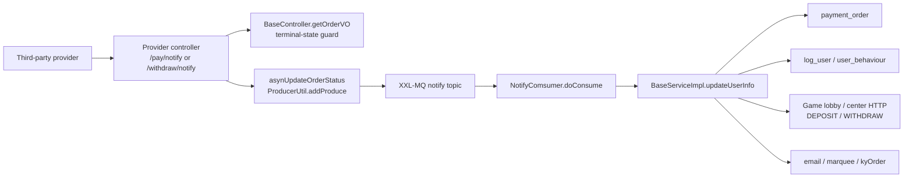
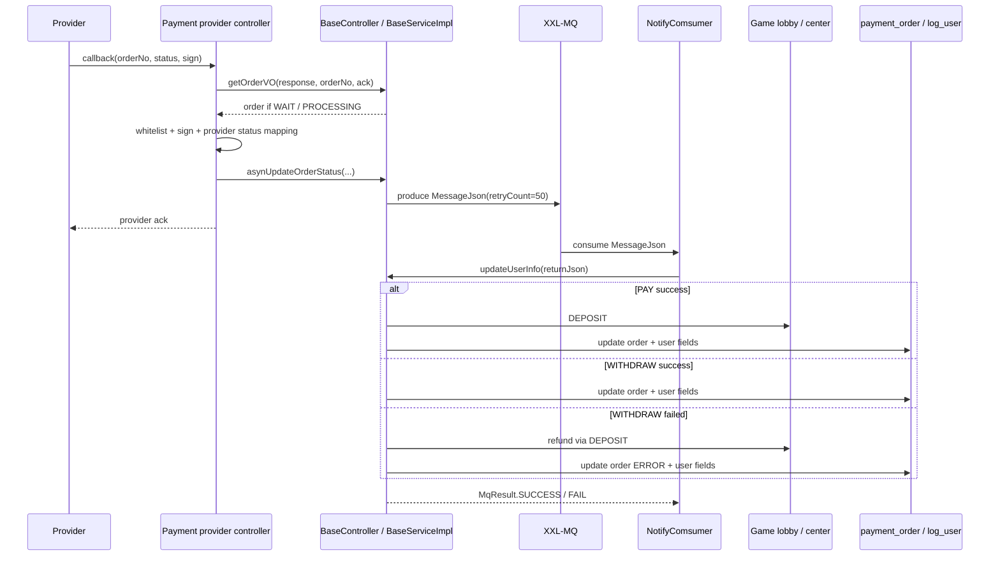

# payment-provider-callback

## 0. 閱讀定位

- Flow：三方金流 provider callback，涵蓋代收充值 callback 與代付提現 callback。
- 專案：`/Users/nick/Git/iwin/payment`
- 本輪 Step：Step 3，Level 2 單條 flow 深掃初版。
- 主要證據層級：`專案存在 / code-backed`。
- Nick 個人貢獻層級：`待確認`。目前只看到 branch / commit message / code path，沒有 Nick 本人 MR、ticket、commit author 或本人確認，因此不能寫成「Nick 真實開發過」。
- 讀者入口：本檔先用初階 / 中階可讀方式講清楚 callback 在做什麼，再進入 Senior / Owner 角度的 money correctness、state transition、idempotency、retry / compensation 與 observability。

本 flow 的核心問題不是「哪個 controller 收到哪個欄位」，而是：

> provider 說某筆充值或提現已成功 / 失敗後，payment 如何安全地把外部事件轉成內部訂單狀態、玩家上下分 / 退款、副作用通知，並避免重複 callback 或 MQ retry 造成重複入帳 / 重複退款。

## 1. 白話導讀

玩家充值或提現時，payment 會先建立 `payment_order`。之後第三方金流商不一定同步回覆最終結果，而是透過 callback 打回 payment。

callback 到 payment 後，單一 provider controller 先做幾件事：

1. 解析 provider callback 參數。
2. 用商戶設定檢查白名單 IP。
3. 用 provider 規格重算簽章。
4. 查出 `payment_order`，確認訂單還在 `WAIT` 或 `PROCESSING`。
5. 把 provider 狀態轉成內部 `OrderReviewStatusEnum`。
6. 呼叫 `asynUpdateOrderStatus` 丟到 XXL-MQ。
7. 立即回 provider 指定的 ack 字串，例如 `ok` 或 `success`。

真正改錢與改訂單的地方不是 provider controller，而是 MQ consumer 之後的 `updateUserInfo`：

- 充值成功：呼叫 game lobby / center 上分，更新 `payment_order` 成成功，更新 `log_user` / `user_behaviour` 等業務欄位，寄信，處理跨月訂單。
- 提現成功：更新訂單成功、更新業務欄位，必要時寄信 / 跑馬燈。
- 提現失敗：把錢退回玩家，更新訂單成異常，寫失敗原因，刪 Redis lock / billNo，寄失敗通知。

所以這條 flow 的 owner 關注點是：callback ack、MQ enqueue、consumer 更新錢包、訂單終態、退款補償，這幾段不是同一個 atomic transaction。

## 2. Code 分層對照

| 層級 | 代表 code | 責任 |
| --- | --- | --- |
| Provider callback controller | `NanaPayController.payNotify` / `withdrawNotify`、`Pay4zController.payNotify` / `withdrawNotify` | 收 provider callback、驗 IP、驗 sign、狀態 mapping、回 ack、送 MQ |
| 共用 callback guard | `BaseController.getOrderVO(response, orderNo, returnMsg)` | 查訂單，若終態或非可處理狀態，回 provider ack 並阻止再次處理 |
| MQ producer | `BaseServiceImpl.asynUpdateOrderStatus`、`ProducerUtil.addProduce` | 包成 `MessageJson`，送到 XXL-MQ topic / group，retryCount=50 |
| MQ consumer | `NotifyComsumer.doConsume` | 反序列化 `MessageJson`，呼叫 `updateUserInfo`，失敗回 `MqResult.FAIL` |
| 狀態與副作用核心 | `BaseServiceImpl.updateUserInfo` | 依充值 / 提現分支改訂單、上下分 / 退款、更新玩家業務欄位、寄信、跑馬燈、跨月處理 |
| 玩家錢包 / game lobby | `upperDeposit`、`gmDownScore`、`getGameServerIp` | 透過 Redis 設定找到 center HTTP endpoint，呼叫外部 game lobby / center |
| 訂單模型 | `OrderVO`、`OrderReviewStatusEnum`、`PayTypeOrderEnum` | `payment_order` 欄位、狀態 enum、充值 / 提現 bill type |

## 3. 最小架構圖

圖上的 `Controller -> MQProducer -> Consumer -> Core` 是本 flow 已確認的主線；`Game lobby / center HTTP` 是已確認有呼叫，但下游實作與 idempotency 尚未掃，先標 `待確認`。

## 4. 正常流程圖

## 5. 正常流程逐步說明

1. 玩家先透過下單流程建立 `payment_order`，初始狀態通常是 `WAIT`。
2. provider 完成代收 / 代付處理後打 callback 到對應 endpoint，例如 `/nanapay/pay/notify`、`/pay4z/withdraw/notify`。
3. provider controller 解析 callback 參數，取得內部訂單號，例如 NanaPay 的 `mchOrderId`、Pay4z 的 `merchantOrderNo`。
4. controller 呼叫 `getOrderVO(response, orderNo, returnMsg)`。如果訂單已是成功、拒絕、退回或異常，會先回 provider ack，再丟出 exception 阻止重複處理。
5. controller 用商戶設定檢查 callback IP 白名單。
6. controller 依 provider 規則重算簽章，比對 callback sign。
7. controller 把 provider status 轉成內部狀態。例如 Pay4z `PAID` 轉 `SUCCESS`；`PAY_FAILED` / `REFUND` 對提現轉 `ERROR`。
8. controller 呼叫 `asynUpdateOrderStatus`，把 `orderNo`、`status`、`billType`、失敗訊息與 provider 單號組成 `MessageJson`。
9. `ProducerUtil.addProduce` 送到 XXL-MQ，retryCount 設為 50。
10. `NotifyComsumer.doConsume` 收到訊息後呼叫 `updateUserInfo`。
11. `updateUserInfo` 再次確認訂單仍是 `WAIT` / `PROCESSING`。若已終態，直接回 `MqResult.SUCCESS`，避免 MQ 重送重複處理。
12. 依 `billType` 與 `status` 執行充值上分、提現成功、提現失敗退款等分支。

## 6. 狀態模型

本 flow 使用的核心狀態來自 `OrderReviewStatusEnum`：

| 狀態 | code | 意義 | callback flow 解讀 |
| --- | ---: | --- | --- |
| `WAIT` | 1 | 待審核 / 新訂單 | callback 可處理 |
| `PROCESSING` | 6 | 審核中 | callback 可處理 |
| `SUCCESS` | 0 | 成功 | 終態，重複 callback / MQ retry 應 no-op |
| `REFUSE` | 2 | 已拒絕 | 終態 |
| `BACK` | 3 | 已退回 | provider 特定狀態可能會 mapping 到這裡，但 `updateUserInfo` 對 withdraw `BACK` 未看到完整處理分支 |
| `ERROR` | 4 | 異常 | 終態，提現失敗退款後使用 |
| `PAYSUCCESS` | 5 | 支付成功 | 本輪代表 provider callback 未看到主線使用 |
| `PENALTIESERR` | 7 | 訂單異常 | 提現下分異常用途，非本 callback 主線 |

已確認的狀態保護有兩層：

- provider controller 入口的 `getOrderVO(response, orderNo, ack)` 會擋終態與非 `WAIT` / `PROCESSING`。
- MQ consumer 核心的 `updateUserInfo` 也會再次檢查訂單狀態，不可處理就回 `MqResult.SUCCESS`。

這是 callback idempotency 的主要 code-backed evidence。但它不是完整 exactly-once，因為「外部上分 / 退款成功」與「本地訂單更新成功」仍可能落在不同 failure window。

## 7. Money Correctness 與交易邊界

本 flow 的 money correctness 取決於三個系統的狀態一致：

1. provider 的交易狀態。
2. payment 的 `payment_order` / `log_user` / `user_behaviour`。
3. game lobby / center 的玩家餘額。

目前 code-backed 看到的 transaction boundary：

- controller 收 callback 與 MQ produce 不在同一個 DB transaction。
- `ProducerUtil.addProduce` catch produce exception 後只 log，沒有把失敗往上拋給 controller。
- `updateUserInfo` 內會呼叫外部 HTTP 上分 / 退款，再更新本地訂單與玩家業務欄位；本輪未看到分散式交易或 outbox / inbox 表。
- `updateOrderStatus` 使用 ActiveRecord `updateById` / `insert`，失敗會丟 exception。
- `NotifyComsumer` catch exception 後回 `MqResult.FAIL`，由 MQ 重試。

因此 owner 不能把這條 flow 描述成 ACID transactional flow；比較精準的說法是：

> payment 用訂單終態 guard + MQ retry + 手動查單 / 補償能力，去收斂 provider callback、玩家餘額與本地訂單的一致性。

## 8. 充值成功分支

充值 callback 成功時：

1. provider controller 驗證 callback 後，把狀態送成 `PayTypeOrderEnum.PAY` + `OrderReviewStatusEnum.SUCCESS`。
2. `updateUserInfo` 確認訂單仍可處理。
3. 呼叫 `upperDeposit(order, logUser, true, true)`，向 game lobby / center 做 `DEPOSIT`。
4. 將 `payment_order.status` 更新為 callback 狀態。
5. 更新 `log_user`、`user_behaviour` 等業務欄位。
6. 重算 player layer。
7. 發送充值成功郵件。
8. 呼叫 `kyOrder` 處理跨月訂單。

已確認風險：

- `upperDeposit` 先呼叫外部 HTTP，再回來更新本地訂單；如果外部成功但本地更新失敗，可能需要人工對帳。
- `upperDeposit` 在 `isThirdParty=true` 時 catch exception 不直接更新訂單成 ERROR，而是往上拋給 MQ consumer，交由 retry / 後續人工處理。

## 9. 提現成功分支

提現 callback 成功時：

1. provider controller 驗證 callback 後，把狀態送成 `PayTypeOrderEnum.WITHDRAW` + `SUCCESS`。
2. `updateUserInfo` 確認訂單仍可處理。
3. 將 `payment_order.status` 更新為 `SUCCESS`。
4. 更新玩家業務欄位。
5. 依金額門檻可能寄信與發跑馬燈。
6. 呼叫 `kyOrder`。

這裡沒有再次扣款，因為提款建單 / 自動出款前的扣款與 provider request 是另一條 flow；本 flow 只處理 provider callback 回來後的終態確認。

## 10. 提現失敗 / 退款分支

提現 callback 失敗時：

1. provider controller 驗證 callback 後，把狀態送成 `PayTypeOrderEnum.WITHDRAW` + `ERROR`，附上 provider 失敗訊息。
2. `updateUserInfo` 進入自動審核失敗場景。
3. 將訂單 `tradeType` 改成 `WITHDRAWBACK`。
4. 呼叫 `upperDeposit(order, logUser, false, true)`，把提款扣掉的金額退回玩家。
5. 更新 `payment_order.status=ERROR`、`outBillNo`、`recordRemark`。
6. 更新玩家業務欄位。
7. 刪除 Redis billNo 相關物件。
8. 寄送提現失敗 / 退款通知。

這段是本 flow 最需要 owner 盯的地方。code 裡有明確註解：若退款場景發生 exception，會把訂單設為失敗並回 `MqResult.SUCCESS`，目的是避免「已退款但又因 exception 觸發 MQ retry，進而重複退款」。這代表團隊曾經碰過或預防過重複退款風險。

## 11. Idempotency 判斷

已確認：

- `getOrderVO(response, orderNo, ack)` 在 provider controller 入口擋終態，並先回 provider ack。
- `updateUserInfo` 在 consumer 端再擋非 `WAIT` / `PROCESSING` 訂單。
- 提現失敗退款分支有防 MQ retry 重複退款的例外處理。
- path history 有 `pay4z` 重複 callback / 重複退款相關 fix commit message，代表這不是理論風險。

待確認：

- `payment_order.bill_no` 是否有 DB unique key。
- game lobby / center 的 `DEPOSIT` / `WITHDRAW` 是否用 `billNos` 做 idempotency。
- provider callback raw event 是否有 inbox / callback log 表可以去重或 replay。
- `ProducerUtil.addProduce` produce 失敗只 log 的設計是否有外部監控或補償機制。

保守結論：

> 本 flow 有「訂單終態 guard + consumer no-op」的 idempotency 基礎，但沒有足夠 evidence 說它達到 end-to-end exactly-once。正式面試應說成至少一次處理下的冪等保護與人工補償，而不是強一致交易。

## 12. Failure Window

| Window | 可能問題 | 現有保護 | 待補 evidence |
| --- | --- | --- | --- |
| provider callback 已收到，但 MQ produce 失敗 | controller 可能仍回 ack，後續沒有 consumer 處理 | `ProducerUtil` log error | 是否有 alarm / 補單 / callback replay |
| MQ 重送同一筆成功 callback | 重複上分 / 重複更新 | controller / consumer 訂單狀態 guard | game lobby 是否用 billNos 去重 |
| 充值上分成功，本地訂單更新失敗 | 玩家餘額已變，payment_order 未終態 | MQ retry 可能再跑；需靠下游 idempotency 或人工對帳 | game lobby idempotency、對帳流程 |
| 提現失敗退款成功，後續欄位更新或通知失敗 | 可能 MQ retry 重複退款 | catch 後更新訂單失敗狀態並回 SUCCESS | 是否能查到退款已成功的 audit evidence |
| provider 回失敗 / 退回狀態 mapping 不一致 | payment 狀態與 provider 狀態語意偏差 | 各 provider controller 分別 mapping | 所有 provider 狀態矩陣 |
| 終態後 provider 持續 callback | provider 重送壓力、log noise | `getOrderVO` 回 ack 並阻止處理 | 是否有 rate limit / alert 閾值 |
| 跨月訂單 callback | 月表 / 分表定位錯誤 | `DynamicDataSourceContextHolder.setBillNo`、`kyOrder` | DB 分表規則與跨月搬移測試 |

## 13. Retry / Compensation / Reconciliation

已確認：

- MQ producer 設定 retryCount=50。
- consumer 失敗回 `MqResult.FAIL`，交給 XXL-MQ 重試。
- provider controller 有查單 endpoint，例如 `pay/getOrderStatus`、`withdraw/getOrderStatus`。
- `Pay4zController` 對支付失敗 callback 會走 `autoViewOrder` 直接更新成 ERROR；提現失敗則走 MQ refund 分支。

推測：

- 人工補單 / 補償應與 admin 或 app_bi 的 order repair flow 有關，但本輪沒有把 app_bi / admin 修復流程納入 Step 3 主線。

待確認：

- 是否有定時對帳 job。
- 是否有 dead letter queue 或人工處理 queue。
- provider 查單結果如何回寫本地訂單。
- app_bi `payment-order-status-repair` 與 payment 訂單終態的責任邊界。

## 14. Observability / Auditability

已確認的 trace key：

- `billNo` / provider order id / uid。
- provider controller log callback request map。
- `ProducerUtil` log MQ message。
- `NotifyComsumer` log MQ message payload。
- `upperDeposit` / `gmDownScore` log 外部 HTTP request / response 與耗時。
- `recordRemark` 會保存部分失敗訊息，且有 commit message 顯示長訊息曾被截斷處理。

風險：

- log 中可能包含 provider payload、簽章前字串或 URL；本 vault 文件不複製敏感值，只描述欄位與行為。
- 未看到獨立 callback event table，因此 raw callback replay / audit trail 是否完整仍待確認。
- `ProducerUtil` produce exception 只 log，若沒有 alert，callback accepted but not processed 會較難被即時發現。

## 15. Owner Decision Notes

這條 flow 在 owner 角度最值得問的不是「怎麼接第 N 家 provider」，而是以下決策：

1. Callback ack 時機：應該在 durable enqueue 成功後才 ack，還是接到可驗證 callback 就 ack？目前 code 形狀接近後者，但 produce exception 只 log，風險較高。
2. Exactly-once 不可假設：要以至少一次 delivery + idempotency guard 設計，並確認 game lobby / center 是否用 `billNos` 去重。
3. 提現失敗退款是最高風險分支：退款成功後任何 exception 都不能導致 retry 重複退款。現有 code 有專門防護，應列為面試重點。
4. Provider adapter 應薄，核心狀態機應集中：目前多個 provider controller 有重複結構，容易出現某 provider 漏驗 sign / 漏 ack / 狀態 mapping 不一致。
5. Reconciliation 需要獨立角色：查單 endpoint、人工補單、定時對帳、callback log / inbox 不應混在 controller 裡靠 log 補。

## 16. 面試 / 履歷邊界摘要

目前可以安全說：

- `payment` 專案存在 provider callback flow，涵蓋充值成功、提現成功、提現失敗退款。
- code-backed 看到 callback 驗簽 / IP 白名單、訂單終態 guard、XXL-MQ retry、consumer 端 no-op、玩家上分 / 退款與訂單更新。
- 這條 flow 可作為 Senior Backend 面試的「金流 callback consistency / idempotency / compensation」分析素材。

目前不能說：

- Nick 主導或設計此 callback flow。
- Nick 修過 pay4z 重複退款，除非補到本人 MR / commit author / ticket / 本人確認。
- 這套 flow 是 end-to-end exactly-once 或強一致。
- game lobby / center 已具備 idempotent wallet API，因本輪未掃下游。

詳細面試素材放在 `career-interview.md`，證據與待確認清單放在 `materials/evidence.md` 與 `materials/claim-boundary.md`。

## 17. Step 3 結論

`payment-provider-callback` 值得作為 iwin payment 第一條深挖 flow，因為它同時打到：

- money correctness。
- provider callback trust boundary。
- 訂單狀態轉移。
- MQ retry / duplicate callback。
- 玩家上分與提現退款。
- 人工補償 / 對帳待確認邊界。

下一步不應急著更新正式履歷，而是進 Step 4：補 `payment-provider-callback` 的 failure / consistency evidence，特別是 DB schema unique key、game lobby `billNos` idempotency、對帳 / 補單流程，以及代表 bugfix commit diff。
