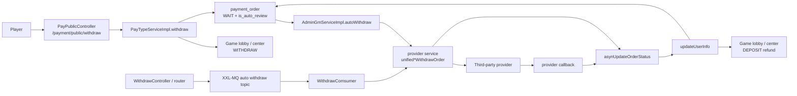
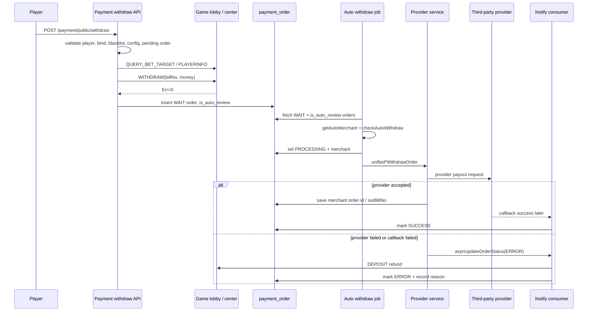

# withdrawal-auto-review-refund

## 0. 閱讀定位

- Flow 中文名稱：玩家提款、自動審核 / 自動出款與失敗退款。
- Flow slug：`withdrawal-auto-review-refund`。
- 專案：`/Users/nick/Git/iwin/payment`。
- 完成狀態：Step 3，Level 2 單條 flow 深掃；2026-05-18 建立主學習包。
- 證據層級：`專案存在 / code-backed`。
- Nick 個人貢獻層級：`待確認`。目前只看到 branch / code path / commit message，沒有 Nick 本人 MR、ticket、commit author、production issue 或本人確認，因此不能寫成「Nick 真實開發過」。
- 是否只確認到入口：否。已確認玩家提款建單、扣分、auto-review flag、排程自動審核、商戶路由、XXL-MQ 自動出款 consumer、provider 代付下單、callback / provider request 失敗退款、game lobby `DEPOSIT` / `WITHDRAW` 關鍵下游路徑；但 DB schema / unique key、下游 `billNo` 強制去重、完整對帳 / DLQ 仍是 `待確認`。

本 flow 的核心問題是：

> 玩家按提款後，payment 如何先檢查玩家與風控條件、扣除玩家可用餘額、建立提款訂單，再由自動審核 / 自動出款送三方 provider；若三方失敗或 callback 回失敗，如何把錢退回玩家，並避免重複退款或長時間卡單。

## 1. 白話導讀

玩家提款不是單純新增一筆訂單。它會先驗證玩家是否能提、提多少、是否達成打碼、帳號綁定與黑名單是否 OK，然後呼叫 game lobby / center 做 `WITHDRAW` 扣分。

扣分成功後，payment 才寫入 `payment_order`，狀態先是 `WAIT`。如果當下有符合金額 / 時間的自動出款商戶，訂單會被標 `is_auto_review=1`。之後 `AdminGmServiceImpl.autoWithdraw` 每分鐘掃最近待審訂單，符合玩家層級與金額條件的訂單會被改成 `PROCESSING`，再呼叫對應 provider service 下代付單。

三方 provider 可能同步回「代付下單失敗」，也可能之後才 callback 失敗。這兩種失敗最後都會回到 `BaseServiceImpl.asynUpdateOrderStatus` / `updateUserInfo`，走提現失敗退款分支：把 `tradeType` 改成 `WITHDRAWBACK`，呼叫 game lobby / center `DEPOSIT` 把提款金額退回玩家，更新訂單 `ERROR`，寫失敗原因與寄通知。

所以這條 flow 的 owner 重點不是「有沒有自動審核」，而是扣分、建單、出款、callback、退款這些非同一 transaction 的副作用如何收斂。

## 2. 初中階 Code 分層對照

```text
Route / API：
- `/payment/public/withdraw`
- `/withdraw/bank/{merchantName}`
- `/withdraw/zfb/{merchantName}`
- `/withdraw/pix/{merchantName}`
- provider callback，如 `/pay4z/withdraw/notify`、`/nanapay/withdraw/notify`

Controller：
- `PayPublicController.withdraw`
- `WithdrawController.bankHandlerRouter`
- `WithdrawController.zfbHandlerRouter`
- `WithdrawController.pixHandlerRouter`
- provider-specific withdraw callback controller

Service / Business：
- `PayTypeServiceImpl.withdraw`
- `AdminGmServiceImpl.autoWithdraw`
- `HandlerRouterServiceImpl`
- `WithdrawComsumer`
- `BaseServiceImpl.gmDownScore`
- `BaseServiceImpl.upperDeposit`
- `BaseServiceImpl.asynUpdateOrderStatus`
- `BaseServiceImpl.updateUserInfo`

Provider Service：
- `NimTestPayServiceImpl.unifiedPixWithdrawOrder`
- `Pay4zServiceImpl.unifiedPixWithdrawOrder`
- 其他 `service/impl/withdraw/*ServiceImpl`

Model / Enum：
- `OrderVO`
- `QueryWithdrawVO`
- `BankWithdrawVO` / `ZfbWithdrawVO` / `PixWithdrawVO`
- `OrderReviewStatusEnum`
- `PayTypeOrderEnum`
- `TradeTypeEnum`
- `WithdrawTypeEnum`

SQL / Table：
- 已確認主表：`payment_order`、`log_user`、`user_layer`、`log_reel`。
- `payment_order` 依 `billNo` / 月份走動態表名。
- 待確認：DB schema、`bill_no` unique key、是否有 callback inbox / outbox。

Redis / Config：
- `CENTER_HTTP`：game lobby / center endpoint。
- `AUTOSUBSCRIBERSETTING`：自動審核商戶設定。
- `LAYER`：玩家層級自動出款條件。
- job switch / job status key：控制自動審核排程。

MQ：
- `HandlerRouterServiceImpl` 會把人工 / router 出款丟到 auto withdraw topic。
- `WithdrawComsumer` 消費 auto withdraw topic，反射呼叫 provider service。
- `asynUpdateOrderStatus` 會把 provider 結果丟到 notify topic，由 callback flow 的 consumer 收斂狀態。

External API：
- payment 呼叫 game lobby / center HTTP：`QUERY_BET_TARGET`、`PLAYERINFO`、`WITHDRAW`、`DEPOSIT`。
- payment 呼叫三方 provider 代付 API。
- provider callback 回 payment。
```

| 層級 | 代表 code | 責任 |
| --- | --- | --- |
| 玩家提款入口 | `PayPublicController.withdraw` | 接收玩家提款請求 |
| 建單與扣分 | `PayTypeServiceImpl.withdraw` | 查玩家、綁定、黑名單、提款設定、待審單、打碼目標、玩家狀態、扣分、寫 `payment_order` |
| 遊戲錢包副作用 | `BaseServiceImpl.gmDownScore` | 呼叫 game lobby / center `WITHDRAW` 扣玩家金額 |
| 自動審核排程 | `AdminGmServiceImpl.autoWithdraw` | 每分鐘掃 `is_auto_review=1`、`WAIT` 訂單，檢查玩家自動出款條件並呼叫 provider |
| 人工 / router 出款 | `WithdrawController`、`HandlerRouterServiceImpl` | 將指定商戶的提款路由成 MQ auto withdraw message |
| 自動出款 consumer | `WithdrawComsumer` | 依 `withdrawType` 反射呼叫 provider `unified*WithdrawOrder` |
| provider 代付 | `NimTestPayServiceImpl`、`Pay4zServiceImpl` 等 | 組 provider request、送代付下單、保存 provider 單號或回報失敗 |
| 退款收斂 | `BaseServiceImpl.updateUserInfo` | provider 失敗時呼叫 `upperDeposit` 退回玩家，更新訂單終態 |

## 3. 最小架構圖



## 4. 正常流程圖



## 5. 正常流程逐步說明

1. 玩家呼叫 `/payment/public/withdraw`。
2. `PayTypeServiceImpl.withdraw` 先用 uid 取得 Redis DB，再查 `bi_log.log_user`。
3. 內部帳號、未綁定支付資料、黑名單、提款通道關閉、提款設定缺漏會直接拒絕。
4. 服務查最近提款紀錄，若存在 `WAIT` 或 `PROCESSING` 訂單，拒絕重複送審。
5. 服務呼叫 game lobby / center `QUERY_BET_TARGET`，確認玩家打碼目標已達成。
6. 服務呼叫 game lobby / center `PLAYERINFO`，取得 VIP、手續費與玩家狀態資訊。
7. 服務產生提款訂單號，依提款方式設定 `tradeType`：銀行、支付寶或 PIX。
8. 服務讀取自動審核商戶設定，透過 `getAutoMerchant` 依金額與時間區間篩出可用商戶；若有符合商戶，設定 `is_auto_review=1`，否則 `0`。
9. 服務呼叫 `gmDownScore`，送 game lobby / center `WITHDRAW`，帶入 `billNos=orderNo`。
10. 扣分成功後才 insert `payment_order`，狀態為 `WAIT`。
11. `AdminGmServiceImpl.autoWithdraw` 每分鐘執行，先看 job switch，然後查最近 3 天 `is_auto_review=1` 且 `WAIT` 的提款單。
12. 對每筆訂單再次跑 `getAutoMerchant`，若沒有商戶，改回人工審核。
13. 對玩家跑 `checkAutoWithdraw`：檢查玩家是否開啟自動出款、玩家層級是否允許、提款金額上下限、今日充值、今日打碼比例。
14. 符合條件時，訂單改為 `PROCESSING`，寫入 merchant name / id。
15. 排程依提款類型轉成 `BankWithdrawVO`、`PixWithdrawVO` 或 `ZfbWithdrawVO`，反射呼叫 provider service 的 `unified*WithdrawOrder`。
16. provider service 組 provider request 並送出代付下單。
17. provider 同步回成功時，provider service 保存 merchant id / name / outBillNo，等待 callback 終態。
18. provider 同步回失敗或 response 無法解析時，provider service 呼叫 `asynUpdateOrderStatus(ERROR, WITHDRAW)`。
19. provider callback 回失敗時，也會走 `asynUpdateOrderStatus(ERROR, WITHDRAW)`。
20. notify consumer 進 `updateUserInfo` 後，若訂單仍是 `WAIT` / `PROCESSING`，才處理提款成功或失敗；若已終態，直接 no-op 成功。
21. 提款失敗時，`updateUserInfo` 把 `tradeType` 改成 `WITHDRAWBACK`，呼叫 `upperDeposit(..., isRecharge=false, isThirdParty=true)` 退回玩家金額。
22. 退款成功後，訂單改 `ERROR`，寫 provider outBillNo / record remark，更新玩家業務欄位，刪除 Redis billNo，寄失敗通知。

## 6. 業務問題

這條 flow 解決的是「玩家提款從申請到出款 / 退款的資金閉環」。

如果它壞掉，常見後果是：

- 玩家扣分成功但訂單沒有建立。
- 訂單建立成功但自動審核排程沒有出款。
- provider 代付下單成功但沒有 callback，訂單卡在 `PROCESSING`。
- provider 失敗後退款沒成功，玩家少錢。
- provider 重複失敗 callback 或 MQ retry，造成重複退款。
- 自動出款條件錯誤，應人工審核的訂單被自動送三方。
- MQ produce 失敗只 log，訂單已 `PROCESSING` 但沒有後續 consumer 處理。

## 7. 系統位置

- 產品：iwin 金流 / 提款 / 自動出款。
- 專案：`payment`。
- 上游：玩家提款 API、後台 / 人工出款 router。
- 下游：game lobby / center HTTP、三方 provider payout API、provider callback、XXL-MQ notify / auto withdraw topic。
- 相關但本輪未完整深掃：DB schema、timer 對帳、app_bi 人工補單 UI、完整 provider callback matrix。

## 8. 資料狀態與 State Transition

| 階段 | `payment_order` 狀態 | 錢包狀態 | 說明 |
| --- | --- | --- | --- |
| 建單前驗證 | 無訂單 | 未扣分 | 玩家、綁定、黑名單、提款設定、待審單、打碼目標、玩家狀態檢查 |
| 扣分成功 | 尚未 insert | 玩家已扣分 | `gmDownScore` 呼叫 game lobby / center `WITHDRAW` 成功 |
| 建單完成 | `WAIT` | 玩家已扣分 | `payment_order` insert，`is_auto_review` 記錄是否可走自動審核 |
| 自動審核出款中 | `PROCESSING` | 玩家已扣分 | job 或 router 已選商戶並呼叫 provider |
| provider 成功 callback | `SUCCESS` | 玩家已扣分，provider 已出款 | 提款完成 |
| provider 失敗 / callback 失敗 | `ERROR` | 退款成功後玩家加回 | `tradeType=WITHDRAWBACK`，`upperDeposit` 呼叫 `DEPOSIT` |
| 自動條件不符 | `WAIT` + `is_auto_review=0` | 玩家已扣分 | 改回人工審核，等待人工處理 |

## 9. Senior / Owner 深度重點

### Source of truth

- `payment_order` 是 payment 內部訂單狀態 source of truth。
- 玩家餘額的實際 source of truth 在 game lobby / center。
- provider 終態來自三方 callback 或 provider request response。

這表示單一 DB transaction 無法包住所有事情。提款扣分、payment insert、provider request、callback、退款都是跨系統副作用。

### Transaction boundary

已確認非 atomic 的斷點：

- `gmDownScore` 扣分成功後，`orderInsert.insert()` 才執行。
- `AdminGmServiceImpl.autoWithdraw` 先把訂單改 `PROCESSING`，再反射呼叫 provider。
- `HandlerRouterServiceImpl` 先改 `PROCESSING`，再丟 auto withdraw MQ。
- `ProducerUtil.addProduce` catch exception 只 log，沒有把錯誤拋回 caller。
- `updateUserInfo` 退款成功後才更新訂單 `ERROR` 與玩家業務欄位。

### Idempotency

已確認保護：

- 建單前會拒絕同玩家已有 `WAIT` / `PROCESSING` 提款單。
- `updateUserInfo` 對提現 callback / notify 會檢查訂單必須仍是 `WAIT` 或 `PROCESSING`，終態重送直接 no-op。
- 失敗退款 catch 內有防護：若已退款後又拋 exception，會清 billNo 並回 `MqResult.SUCCESS`，避免 MQ retry 再次進退款。

待確認保護：

- `payment_order.bill_no` 是否有 unique key。
- game lobby / center 是否用 `billNo` 強制去重。已確認 `NewBillJob` 把 `billNo` 帶入 `modifyAndGetCoinFromBill` / `modifyAndGetBankCoin` 與 currency log，但目前未看到明確 duplicate guard。
- provider request 是否有 request-level idempotency key / query reconcile。

### Retry / Compensation

- auto withdraw MQ producer 設定 retryCount 5 或 10。
- notify MQ producer 設定 retryCount 50。
- PIX auto withdraw job 內部有最多重試次數，超過後改回人工審核。
- provider 同步失敗 / parse fail 會轉 `ERROR` 並進退款。
- provider callback 失敗也會轉 `ERROR` 並進退款。
- `PROCESSING` 長時間無 callback 的 query / reconcile job 本輪未確認。

## 10. Failure Window

| 斷點 | 可能後果 | 現有 evidence | Owner 追問 |
| --- | --- | --- | --- |
| `QUERY_BET_TARGET` / `PLAYERINFO` timeout | 玩家無法提款 | 會 throw `CENTER_HTTP_ERROR` 或解析失敗 | 是否有 user-facing retry / 降級提示 |
| `gmDownScore` timeout 但下游可能已扣分 | payment 以為扣分失敗，但玩家可能已扣 | 只看到回傳 msg 判斷，未見查單補償 | 下游是否以 `billNo` 可查扣分結果 |
| 扣分成功後 `payment_order.insert()` 失敗 | 玩家少錢但沒有 payment 訂單 | 已確認 insert 在扣分後 | 是否需要 outbox / pending record / 自動補償 |
| `is_auto_review=1` 但 job switch 關閉 | 訂單停在 `WAIT` | job switch 不為 `1` 就 return | 是否有監控 `WAIT` backlog |
| job 改 `PROCESSING` 後 provider call exception | 訂單改回 `WAIT` + `is_auto_review=0` | catch 內轉人工審核 | 是否保留 provider partial response |
| router 改 `PROCESSING` 後 MQ produce 失敗 | 訂單卡 `PROCESSING` | `ProducerUtil` catch 後只 log | 是否有 failed enqueue alarm |
| provider accepted 但 callback 不來 | 訂單卡 `PROCESSING` | 查單 / reconciliation 未確認 | 是否有 query order job |
| provider 失敗 callback 重複送 | 可能重複退款 | 終態 guard + retry catch 防重複退款 | 下游 `billNo` 是否再保底去重 |
| 退款 `upperDeposit` 成功但 update order 失敗 | 玩家已收到錢，訂單可能未終態 | catch 內把訂單設 ERROR 並回 SUCCESS | 是否有 audit 標示「退款後狀態更新異常」 |

## 11. 面試 / 履歷邊界摘要

可說：

- 這是一條 code-backed 的提款 / 自動出款 / 退款 flow 分析。
- 可以用它談 money correctness、跨系統 transaction boundary、MQ retry、失敗補償、終態 guard、人工審核 fallback。
- 可以說「我分析過這類 flow，會先確認扣分建單順序、provider request、callback 終態、退款 idempotency 與 reconciliation」。

不能說：

- Nick 主導或設計 iwin 自動出款。
- Nick 修過重複退款 bug。
- Nick 是 payment owner。
- 下游 game lobby 已確認具備 `billNo` 去重。

## 12. 下一步

建議下一步只做一件事：Step 4 補 failure / consistency / idempotency / retry / reconciliation，尤其是扣分成功但建單失敗、MQ enqueue 失敗、provider accepted no callback、下游 `billNo` 去重待確認。

```text
iwin payment withdrawal-auto-review-refund Step 4
```
