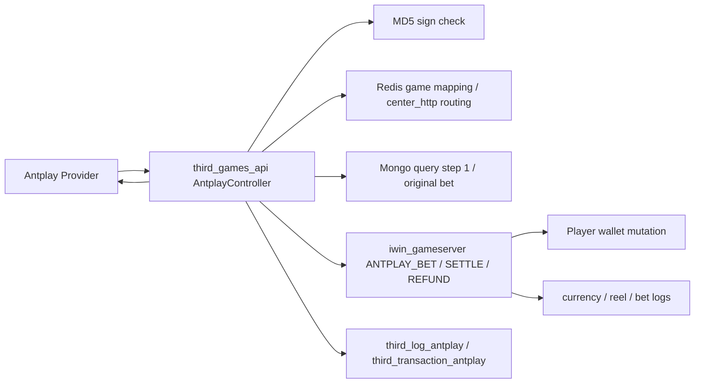
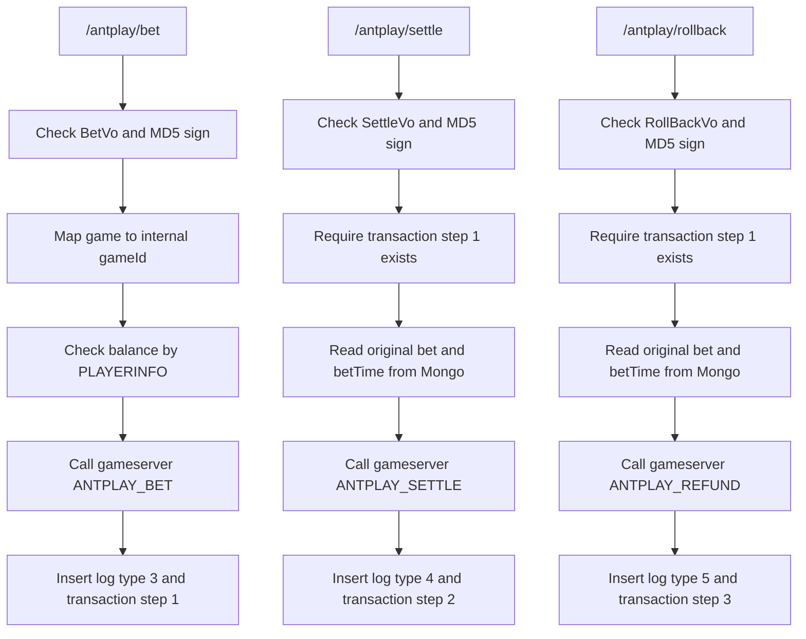

# Antplay bet / settle / rollback 三段式 Flow

## 閱讀定位

Flow 中文名稱：Antplay 投注 / 結算 / rollback 三段式流程。

Flow slug：`antplay-bet-settle-rollback`。

完成狀態：Step 5 已完成，單條 flow claim gate 已收斂；下一步回同 project candidate ranking，做 `gsc-seamless-withdraw-deposit-cancel Step 4`。

證據層級：`專案存在 / code-backed`、`分析素材 / learning-only`。`third_games_api` 本 repo 的 Antplay path 只掃到 Nick / `10gt12nc` 局部測試 commit，不足以標成 Nick 在 `third_games_api` 真實開發過。下游 `iwin_gameserver` 有 Nick / `10gt12nc` Antplay direct commits，但歸屬 `iwin_gameserver` project claim，不反包成 `third_games_api` direct contribution。

本 flow 是業務功能 / 共用能力 / 後台入口 / 報表查詢 / deploy flow：業務功能，屬於第三方遊戲 provider 三段式 seamless wallet money flow。

是否只確認到入口：不是。已確認 provider-facing adapter 入口、MD5 簽章、Redis game mapping / center routing、Mongo step evidence、gameserver `ANTPLAY_BET / ANTPLAY_SETTLE / ANTPLAY_REFUND` dispatch、wallet mutation job、currency log 與 reel log side effect。未確認 provider 官方 contract、Mongo unique index、production 目前是否仍使用舊三段式 endpoint。

掃描深度：Level 2 Flow 深掃。已重讀 vault KB、`third_games_api` README / Step 1 / Step 2 / contribution consolidation、既有 GSC / OneAPI flow；Step 5 已重新 fetch `/Users/nick/Git/iwin/third_games_api` 與 `/Users/nick/Git/iwin/iwin_gameserver` remote refs，兩者 local branch 與 tracked remote 均為 `0 / 0`，本輪只讀 source repo，沒有 pull、checkout、merge、rebase 或改公司 repo。

## 白話導讀

Antplay 舊版 flow 不是一個整合式 callback，而是三個 endpoint：

1. `/antplay/bet`：玩家下注，先扣錢。
2. `/antplay/settle`：遊戲結算，派彩加錢。
3. `/antplay/rollback`：投注失敗或取消，退回原下注。

`third_games_api` 在這條 flow 扮演 adapter：驗簽、查 Redis 找遊戲 id 與 gameserver URL、組 gameserver command、成功後寫 Mongo 紀錄。真正改玩家錢包的是下游 `iwin_gameserver`。

這條 flow 的 Senior / Owner 重點很明顯：`bet` 成功後必須有 durable evidence，否則 `settle` / `rollback` 找不到原下注；`settle` / `rollback` retry 也不能重複加錢或重複退款。現在 adapter 的主要狀態依賴 Mongo step 紀錄，但 Mongo 是在 gameserver 成功後才寫，這中間有典型的 failure window。

另有新版 `/antplay/bet_settle-new` 與 `ANTPLAYTRANSFERINOUT` 線索，像是後來的投派整合版本。本 Step 3 先聚焦 Nick 指定的舊三段式 flow，新版只作演進對照，不混成同一條 flow。

## 初中階 Code 分層對照

| Layer | Code / Data | 角色 |
| --- | --- | --- |
| Route / API | `POST /antplay/bet` | Provider 通知下注，adapter 送 gameserver 扣款 |
| Route / API | `POST /antplay/settle` | Provider 通知結算，adapter 送 gameserver 派彩 |
| Route / API | `POST /antplay/rollback` | Provider 通知 rollback，adapter 送 gameserver 退款 |
| Controller | `AntplayController` | 驗參、驗簽、查 Redis、查 Mongo、組 gameserver request |
| Request VO | `BetVo`、`SettleVo`、`RollBackVo` | 承載 merchant、account、game、betId、金額、timestamp、sign |
| Redis | `Game:List:ThirdIdList`、`Game:ThirdPlatform:Antplay` | provider game code 對 internal game id；centerId 對 gameserver URL |
| Mongo audit | `bi_log.third_log_antplay` | 寫 provider 原始 request log，type 3 / 4 / 5 對 bet / settle / rollback |
| Mongo transaction | `bi_log.third_transaction_antplay` | 寫 step 1 / 2 / 3 transaction evidence |
| Downstream command | `ANTPLAY_BET`、`ANTPLAY_SETTLE`、`ANTPLAY_REFUND` | gameserver 實際扣款、派彩、退款 |
| Gameserver dispatch | `HttpService#antplaySettled`、`HttpAntplaySettled`、`AntplaySettledJob` | 轉成 player job，進行 wallet mutation 與 log side effect |
| Wallet mutation | `PlayerData.modifyAndGetCoinAntplay` | 修改玩家餘額並寫 currency log |
| Reel / bet logs | `GamePlayer#sendReelToLogAntplay`、`AntplaySettledJob#sendBetLog` | 寫戰績與打碼相關 side effect |

## 最小架構圖



## 正常流程圖



## 正常流程逐步說明

### 1. Bet：下注扣款

1. Provider 打 `POST /antplay/bet`，欄位包含 `merchantId`、`account`、`game`、`betId`、`bet`、`timestamp`、`sign`。
2. Adapter 取 `uid = account.substring(2)`，用 `merchantId + account + game + betId + bet + timestamp + antplayKey` 組 MD5 lowercase。
3. `bet` 乘 `100000` 轉成內部金額單位。
4. 透過 Redis `Game:List:ThirdIdList` 找 `Antplay` provider game 對應的 internal `gameId`。
5. 先用 gameserver `PLAYERINFO` 查餘額，若餘額小於下注額就回金額不足。
6. 透過 Redis `Game:ThirdPlatform:Antplay` 依玩家 `centerId` 找 `center_http`。
7. 呼叫 gameserver `ANTPLAY_BET`，帶 `accountId`、`account`、`deductMoney`、`bet`、`sign`、`timestamp`、`betId`、`gameId`。
8. gameserver 成功後，adapter 寫 `third_log_antplay` type `3`，再寫 `third_transaction_antplay` step `"1"`。

### 2. Settle：結算派彩

1. Provider 打 `POST /antplay/settle`，欄位包含 `totalWin`、`normalWin`、`bonusTotalWin`、`freeTotalWin`、`status`。
2. Adapter 用 `merchantId + account + game + betId + totalWin + normalWin + bonusTotalWin + freeTotalWin + status + timestamp + antplayKey` 組 MD5 lowercase。
3. 先用 `hasBetId(betId)` 查 `third_transaction_antplay` 是否有 step `"1"`。
4. 從 `third_log_antplay` type `3` 查原始 bet，從 `third_transaction_antplay` step `"1"` 查 betTime。
5. `totalWin` 乘 `100000`，呼叫 gameserver `ANTPLAY_SETTLE`。
6. gameserver 成功後，adapter 寫 `third_log_antplay` type `4`，再寫 `third_transaction_antplay` step `"2"`。

### 3. Rollback：投注退款

1. Provider 打 `POST /antplay/rollback`，欄位包含 `merchantId`、`account`、`game`、`betId`、`timestamp`、`sign`。
2. Adapter 用 `merchantId + account + game + betId + timestamp + antplayKey` 組 MD5 lowercase。
3. 一樣先要求 Mongo 已有 `third_transaction_antplay` step `"1"`。
4. 從 Mongo 查原始 bet；程式也查 betTime，但 gameserver refund request 實際帶的是 rollback request 的 `timestamp`。
5. 呼叫 gameserver `ANTPLAY_REFUND`，帶 `bet = original bet * 100000`。
6. gameserver 成功後，adapter 寫 `third_log_antplay` type `5`，再寫 `third_transaction_antplay` step `"3"`。

## 業務問題

這條 flow 處理的是第三方遊戲的錢包閉環：

- `bet` 代表玩家下注扣款。
- `settle` 代表局結束後依中獎金額派彩。
- `rollback` 代表下注失敗或取消時退回投注。

它會影響玩家餘額、投注額、有效投注、打碼、戰績與 provider 對帳。因此它不能只看 API response 是否回 `ok`，還要看 gameserver 錢包、Mongo evidence、log side effect 三者是否一致。

## 系統位置

`third_games_api` 是 provider-facing adapter，不是 wallet source of truth。

本 flow 的 money boundary 在 `iwin_gameserver`：

- `third_games_api`：驗簽、欄位轉換、game mapping、center routing、Mongo audit / transaction evidence。
- `iwin_gameserver`：玩家餘額加扣、currency log、reel log、bet log、每日投注 / 有效投注 / 提現打碼資料更新。
- `game_job` / BI：可能後續讀 log 做報表或備份；本輪未重掃 `game_job`，不納入已確認範圍。

## 入口與 Code 路徑

`third_games_api`：

- `src/main/java/com/slots/web/controller/AntplayController.java`
  - `bet(...)`
  - `settle(...)`
  - `rollback(...)`
  - `insertMongo(int type, ...)`
  - `insertMongo(String merchantId, ..., String step, ...)`
  - `hasBetId(String betId)`
  - `queryBet(String betId, ...)`
  - `queryBetTime(String betId, ...)`
  - `moneyInoutGetBalance(...)`

`iwin_gameserver`：

- `slots-center/src/main/java/com/slots/center/service/HttpService.java`
  - `ANTPLAY_BET` -> `antplaySettled(ctx, data, 1)`
  - `ANTPLAY_SETTLE` -> `antplaySettled(ctx, data, 2)`
  - `ANTPLAY_REFUND` -> `antplaySettled(ctx, data, 3)`
- `slots-center/src/main/java/com/slots/sql/job/HttpAntplaySettled.java`
- `slots-center/src/main/java/com/slots/center/job/http/AntplaySettledJob.java`
- `slots-center/src/main/java/com/slots/center/data/PlayerData.java`
  - `modifyAndGetCoinAntplay`
  - `buildCurrencyLogAntplay`
- `slots-games/slots-game-common/src/main/java/com/slots/game/common/data/GamePlayer.java`
  - `sendReelToLogAntplay`

## DB / Redis / MQ / 外部 API

Mongo：

- `bi_log.third_log_antplay`
  - type `3`：bet request log。
  - type `4`：settle request log。
  - type `5`：rollback request log。
- `bi_log.third_transaction_antplay`
  - step `"1"`：bet transaction evidence。
  - step `"2"`：settle transaction evidence。
  - step `"3"`：rollback transaction evidence。

Redis：

- `Game:List:ThirdIdList`
  - `Antplay` provider game code 對 internal game id。
- `Game:ThirdPlatform:Antplay`
  - 依玩家 centerId 找 gameserver `center_http`。

外部 / 下游：

- Antplay provider request。
- gameserver `center_http` command：`ANTPLAY_BET`、`ANTPLAY_SETTLE`、`ANTPLAY_REFUND`、`PLAYERINFO`。

MQ / Kafka：

- 本 flow adapter 未看到 MQ / Kafka。
- gameserver 內部有 player game pool job 與 log push side effect；本 Step 3 不把它寫成 Kafka / MQ 架構。

## 資料狀態與 State Transition

| 狀態 | 來源 | 已確認變化 | 風險 |
| --- | --- | --- | --- |
| Bet received | `/antplay/bet` | 驗簽、查餘額、送 `ANTPLAY_BET` | adapter 未見 betId pre-check duplicate guard |
| Bet wallet mutated | gameserver | `addMoney = -deductMoney`，reason `10501` | gameserver 是否以 sign / betId 防重待確認 |
| Bet evidence written | Mongo step 1 | `third_log_antplay` type 3、`third_transaction_antplay` step 1 | gameserver 成功但 Mongo 寫失敗會失去後續 settle / rollback 前置 evidence |
| Settle received | `/antplay/settle` | 驗簽、要求 step 1 存在、讀原始 bet / betTime | 只查 step 1，不查 step 2 是否已處理 |
| Settle wallet mutated | gameserver | `addMoney = totalWin`，reason `10502`；有派彩時更新有效投注 | retry 可能重複派彩，除非 gameserver 另有防重 |
| Settle evidence written | Mongo step 2 | 寫 settle log 與 transaction | gameserver 成功但 Mongo 寫失敗會讓 retry 看起來仍未 settle |
| Rollback received | `/antplay/rollback` | 驗簽、要求 step 1 存在、讀原始 bet | 只查 step 1，不查 step 3 是否已處理 |
| Refund wallet mutated | gameserver | `addMoney = original bet`，reason `10503` | retry 可能重複退款，除非 gameserver 另有防重 |
| Rollback evidence written | Mongo step 3 | 寫 rollback log 與 transaction | gameserver 成功但 Mongo 寫失敗會讓 retry 看起來仍未 rollback |

## Consistency / Idempotency

已確認：

- `settle` / `rollback` 會先檢查 `third_transaction_antplay` 是否有 `betId + step = "1"`。
- `settle` / `rollback` 會回查 bet 原始金額，避免 provider settle / rollback request 不帶完整扣款資料。
- gameserver 會把 `transactionId = sign`、`betId`、`gameId` 帶入 wallet mutation 與 log。

待確認：

- Mongo `third_transaction_antplay` 是否有 unique index。
- gameserver 在 `modifyAndGetCoinAntplay` 前是否有用 `transactionId` / `betId` 防重。
- Provider retry contract 是用同一 `sign`、同一 `betId`、還是每次重送都可能不同 timestamp / sign。
- 舊三段式 endpoint 在 production 是否仍 active，或已由 `/bet_settle-new` / slot-game-api 對接取代。

Owner 判斷：

- 只用 adapter 成功後 Mongo step 紀錄當 idempotency guard 不夠穩，因為 money mutation 已先發生。
- 最終防重應該放在 wallet mutation boundary，或至少先落 durable request 狀態，再用 pending / success / failed 狀態機推進下游改錢。
- Mongo audit 可以作 evidence / reconciliation，但不應是唯一防 double pay / double refund 的 source of truth。

## Failure Window

| Failure | 現在觀察 | 可能後果 | Owner 追問 |
| --- | --- | --- | --- |
| `ANTPLAY_BET` 成功，Mongo step 1 寫失敗 | Adapter 先打 gameserver，後寫 Mongo | Provider retry bet 可能再次扣款；settle / rollback 也可能因找不到 step 1 失敗 | 防重在 gameserver 還是 adapter？有沒有補償 job？ |
| `ANTPLAY_SETTLE` 成功，Mongo step 2 寫失敗 | settle 只要求 step 1 存在 | Provider retry settle 可能再次派彩 | 有沒有 step 2 duplicate guard 或 wallet idempotency key？ |
| `ANTPLAY_REFUND` 成功，Mongo step 3 寫失敗 | rollback 只要求 step 1 存在 | Provider retry rollback 可能再次退款 | refund 是否以 betId / action 去重？ |
| Provider out-of-order settle / rollback before bet | `hasBetId` 查不到 step 1 | 回 Mongo 條件不符，provider 可能重試 | 是否需要 pending queue 或 later retry？ |
| `third_log_antplay` type 3 缺失 | `queryBet` 依 type 3 查原始 bet | settle / rollback 取不到原始 bet，可能轉金額失敗 | 原始 bet 應放 transaction step 1 還是 log？ |
| Redis mapping / center routing 錯 | gameId 或 center_http 由 Redis 決定 | 打錯 gameserver 或找不到 game | config 更新與回滾怎麼觀測？ |
| gameserver 錢包成功，log side effect 失敗 | `AntplaySettledJob` 改錢後再送事件 / 戰績 / 打碼 | 錢包與報表 / 戰績不一致 | log side effect 是否可 replay？ |

## Owner Decision Notes 摘要

- Idempotency key 應該至少包含 provider、betId、action / step；若 provider contract 有 transaction id，還要確認 transaction id 是否跨 retry 穩定。
- `bet` / `settle` / `rollback` 應該有明確狀態機，例如 `RECEIVED -> WALLET_APPLIED -> AUDIT_WRITTEN -> ACKED`。
- Wallet mutation boundary 應該能自行拒絕 duplicate，adapter Mongo 寫入不能是唯一 guard。
- `queryBet` 不宜依賴 log collection 作主資料來源；原始 bet / betTime 應該在 transaction evidence 有穩定欄位與唯一性。
- 舊三段式與新 `/bet_settle-new` 不應混講。面試可以說「舊 flow 暴露三段式 state transition failure window；後續整合式 flow 可能是改善方向，但 production 使用狀態待確認」。

## 面試 / 履歷邊界摘要

可面試講：

- code-backed 分析過 Antplay 三段式 bet / settle / rollback。
- 可以說明 adapter 驗簽、Redis routing、gameserver wallet boundary、Mongo audit、retry / failure window。
- 可以對照 GSC / OneAPI 已完成 flow，講第三方遊戲 seamless wallet 常見風險。

不可誇大：

- 不寫 Nick 主導 `third_games_api` Antplay adapter。
- 不寫 Nick 完整設計 Antplay provider 對接。
- 不把下游 `iwin_gameserver` Antplay direct commits 反向包成 `third_games_api` direct contribution。
- 不宣稱已確認 production 目前仍使用舊三段式 endpoint。

Step 5 claim gate 結論：

- 可面試講：可以，作為 code-backed 第三方遊戲三段式 bet / settle / rollback、wallet boundary、Mongo audit failure window 案例。
- 可放正式履歷：不建議新增 `third_games_api` standalone bullet。
- 可回填 project consolidation：只回填為 interview-only flow 已完成；不升級正式成果。
- 不更新 `05-resume-master-zh.md` / `08-application-autobiography-zh.md`：本輪沒有找到新的 Nick / `10gt12nc` production adapter direct evidence。
- 不可反向歸因：下游 `iwin_gameserver` Antplay direct commits 仍屬於 `iwin_gameserver` project-level third-party provider 投派整合 claim。

## 下一步建議

只推薦一件事：

```text
iwin third_games_api gsc-seamless-withdraw-deposit-cancel Step 4
```

原因：

- GSC transfer、OneAPI / PG bet_result、Antplay 三條 high-value transaction flow 都已完成 Step 5。
- Step 2 ranking 的下一條未完成 candidate 是 GSC 分離式 withdraw / deposit / rollback / cancel，可用來確認 split endpoint 是否仍有 production / interview 價值。
- 這會更新 flow 文件與索引；目前不預期更新正式履歷，除非補到新的 Nick direct evidence。
