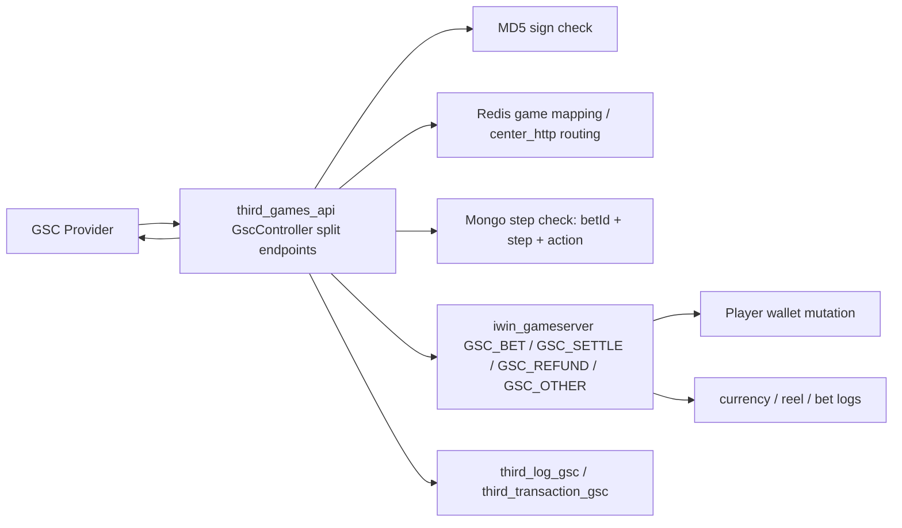
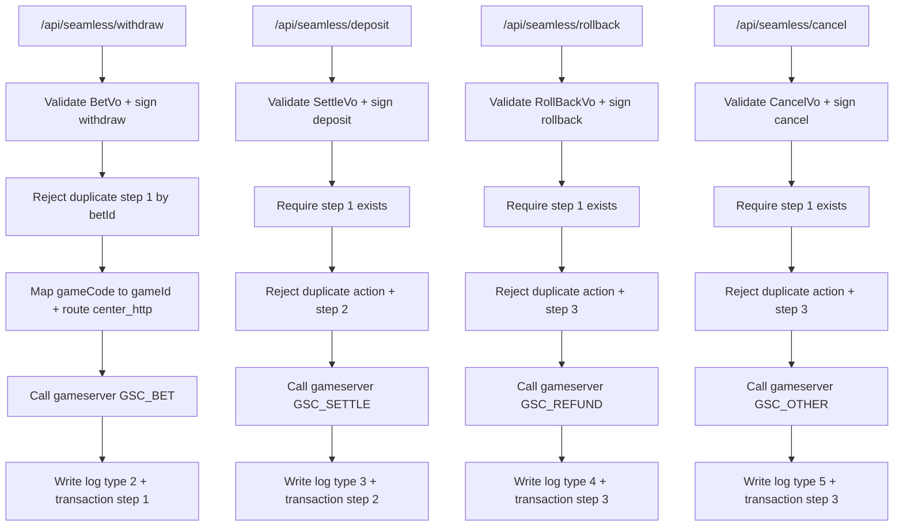

# GSC seamless withdraw / deposit / rollback / cancel Flow

## 閱讀定位

Flow 中文名稱：GSC seamless 分離式 withdraw / deposit / rollback / cancel。

Flow slug：`gsc-seamless-withdraw-deposit-cancel`。

完成狀態：Step 3 已完成，已建立主學習包；下一步做 Step 4 轉正式面試 case。

證據層級：`專案存在 / code-backed`、`分析素材 / learning-only`。目前沒有 Nick 本人在 `third_games_api` GSC split endpoints 的 direct production evidence；下游 `iwin_gameserver` GSC direct commits 歸屬 `iwin_gameserver` project claim，不反包成本 repo claim。

本 flow 是業務功能 / 共用能力 / 後台入口 / 報表查詢 / deploy flow：業務功能，屬於第三方遊戲 provider seamless wallet 分離式交易 callback。

是否只確認到入口：不是。已確認 `third_games_api` provider-facing API、MD5 sign、currency / player validation、Redis game mapping / center routing、Mongo step evidence、gameserver `GSC_BET / GSC_SETTLE / GSC_REFUND / GSC_OTHER` dispatch、`GSCTransferInOutJob` wallet mutation 與 GSC reel log side effect。未確認 provider 官方 spec、production 目前是否仍使用 split endpoint、Mongo unique index、gameserver wallet mutation 前的 transaction-level duplicate guard。

掃描深度：Level 2 Flow 深掃。已重讀 vault KB、`third_games_api` README / Step 1 / Step 2 / contribution consolidation、既有 GSC transfer / OneAPI / Antplay flow；已 fetch `/Users/nick/Git/iwin/third_games_api` 與 `/Users/nick/Git/iwin/iwin_gameserver` remote refs，兩者 local branch 與 tracked remote 均為 `0 / 0`。本輪只讀 source repo，沒有 pull、checkout、merge、rebase 或改公司 repo。

## 白話導讀

這條 flow 是 GSC 舊式或相容式的「分離式錢包 callback」：

1. `/api/seamless/withdraw`：玩家下注，先扣錢。
2. `/api/seamless/deposit`：遊戲結算，派彩加錢。
3. `/api/seamless/rollback`：投注或交易回滾，退款。
4. `/api/seamless/cancel`：取消交易，走另一種 cancel / other 語意。

它和已完成的 `gsc-transfer-bet-settle-rollback` 不同。`/transfer` 是投派整合式 endpoint，單一 API 內用 action 決定 bet / settle / rollback。這條 split flow 則是四支 endpoint 分開接，狀態更像傳統三段式：先有 withdraw step 1，deposit / rollback / cancel 再依賴 step 1。

這條 flow 最重要的 Senior / Owner 問題是：adapter 用 Mongo `third_transaction_gsc` 的 `betId + step + action` 做前置與重複判斷，但真正改錢在下游 gameserver；而 Mongo 是 gameserver 成功後才寫。只要 gameserver 成功、Mongo 寫失敗或 adapter timeout，provider retry 就可能再次進入 wallet mutation，除非 gameserver 底層另有冪等保護。

另外，commit history 明確出現「回調路徑改成 `/api/seamless/*`」與「實測結果是投派整合，需串接 `/transfer` API」這類線索。所以本 flow 的 production status 要保守：current code 存在且完整，但目前是否仍是 production 主線待確認。

## 初中階 Code 分層對照

| Layer | Code / Data | 角色 |
| --- | --- | --- |
| Route / API | `POST /api/seamless/withdraw` | Provider 通知下注扣款 |
| Route / API | `POST /api/seamless/deposit` | Provider 通知結算派彩 |
| Route / API | `POST /api/seamless/rollback` | Provider 通知回滾退款 |
| Route / API | `POST /api/seamless/cancel` | Provider 通知取消 / other 類事件 |
| Controller | `GscController` | 驗參、驗簽、查 Redis、查 Mongo、組 gameserver request |
| Request VO | `BetVo`、`SettleVo`、`RollBackVo`、`CancelVo` | 承載 operator、member、currency、transactions、requestTime、sign |
| Redis | `Game:List:ThirdIdList`、`Game:ThirdPlatform:PG` | provider game code 對 internal game id；centerId 對 gameserver URL |
| Mongo audit | `bi_log.third_log_gsc` | type 2 / 3 / 4 / 5 對 withdraw / deposit / rollback / cancel request log |
| Mongo transaction | `bi_log.third_transaction_gsc` | step `"1"` withdraw、step `"2"` deposit、step `"3"` rollback / cancel |
| Downstream command | `GSC_BET`、`GSC_SETTLE`、`GSC_REFUND`、`GSC_OTHER` | gameserver 實際扣款、派彩、退款或 cancel / other 處理 |
| Gameserver dispatch | `HttpService#GSCTransferInOut`、`HttpGSCTransferInOut`、`GSCTransferInOutJob` | 轉成玩家 job，進行 wallet mutation 與 log side effect |
| Wallet mutation | `PlayerData.modifyAndGetCoinGSC` | 修改玩家餘額並寫 GSC currency log |
| Reel / bet logs | `GamePlayer#sendReelToLogGSC`、`GSCTransferInOutJob#sendBetLog` | 寫 GSC 下注 / 結算 / 退款戰績與打碼 side effect |

## 最小架構圖



## 正常流程圖



## 正常流程逐步說明

### 1. Withdraw：下注扣款

1. Provider 打 `POST /api/seamless/withdraw`。
2. Adapter 驗 request body、`operatorCode + requestTime + "withdraw" + gscKey` MD5 sign、currency、member account。
3. 取第一筆 `transactions[0]`，要求 `action == wager_status`。
4. 用 `betId = wager_code` 查 `third_transaction_gsc` 是否已有 step `"1"`，有則回 Duplicate Transaction。
5. 將 `bet_amount` 乘 `100000` 轉內部金額。
6. 從 Redis `Game:List:ThirdIdList` 的 `PG` mapping 取得 `gameId`。
7. 先用 `moneyInoutGetBalance(memberAccount)` 查餘額，餘額不足直接回 provider。
8. 用 Redis `Game:ThirdPlatform:PG` 依玩家 `centerId` 找 gameserver `center_http`。
9. 呼叫 gameserver `GSC_BET`，帶 `deductMoney`、`bet`、`sign`、`timestamp`、`betId`、`gameId`。
10. gameserver 成功後，adapter 寫 `third_log_gsc` type `2` 與 `third_transaction_gsc` step `"1"`。

### 2. Deposit：結算派彩

1. Provider 打 `POST /api/seamless/deposit`。
2. Adapter 驗 `operatorCode + requestTime + "deposit" + gscKey` MD5 sign、currency、member account。
3. 取第一筆 `transactions[0]`，要求 `action == wager_status`。
4. 先要求 `betId` 的 step `"1"` 存在，否則回 Bet Not Exist。
5. 再用 `betId + action + step "2"` 檢查是否重複 deposit。
6. 從 transaction 取 `bet_amount`、`valid_bet_amount`、`prize_amount`，全部乘 `100000`。
7. 呼叫 gameserver `GSC_SETTLE`，帶 `addMoney = prize_amount`、`bet = bet_amount`、`sign`、`timestamp`、`betId`、`gameId`。
8. gameserver 成功後，adapter 寫 `third_log_gsc` type `3` 與 `third_transaction_gsc` step `"2"`。

### 3. Rollback：回滾退款

1. Provider 打 `POST /api/seamless/rollback`。
2. Adapter 驗 `operatorCode + requestTime + "rollback" + gscKey` MD5 sign、currency、member account。
3. 取第一筆 `transactions[0]`，要求 `action == wager_status`。
4. 先要求 `betId` 的 step `"1"` 存在，否則回 Bet Not Exist。
5. 再用 `betId + action + step "3"` 檢查是否重複 rollback。
6. 用 `amount * 100000` 當 refund 金額。
7. 呼叫 gameserver `GSC_REFUND`。
8. gameserver 成功後，adapter 寫 `third_log_gsc` type `4` 與 `third_transaction_gsc` step `"3"`。

### 4. Cancel：取消 / other

1. Provider 打 `POST /api/seamless/cancel`。
2. Adapter 驗 `operatorCode + requestTime + "cancel" + gscKey` MD5 sign、currency、member account。
3. 取第一筆 `transactions[0]`；目前 `action == wager_status` 檢查被註解。
4. 先要求 `betId` 的 step `"1"` 存在，否則回 Bet Not Exist。
5. 再用 `betId + action + step "3"` 檢查是否重複 cancel。
6. 用 `amount * 100000` 當 other / cancel 金額。
7. 呼叫 gameserver `GSC_OTHER`，下游 `gscType = 4`，reason `10510`。
8. gameserver 成功後，adapter 寫 `third_log_gsc` type `5` 與 `third_transaction_gsc` step `"3"`。

## 業務問題

這條 flow 處理的是 provider 分開通知下注、派彩、回滾、取消的 seamless wallet 交易。

它的業務風險比單支查詢 API 高，因為它直接影響：

- 玩家餘額。
- provider wager / betId 狀態。
- 有效投注與打碼。
- GSC reel log / currency log。
- 後續對帳、客服查單與事故修復。

Owner 要能回答：如果 withdraw 成功但 deposit / rollback 延遲、重送或 out-of-order，系統要怎麼保證 wallet 和 provider statement 最後一致。

## 系統位置

`third_games_api` 是 provider-facing adapter，不是 wallet source of truth。

本 flow 的 money boundary 在 `iwin_gameserver`：

- `third_games_api`：驗簽、欄位轉換、game mapping、center routing、Mongo audit / transaction evidence、provider response。
- `iwin_gameserver`：玩家餘額加扣、currency log、reel log、bet log、打碼與每日投注資料更新。
- `game_job` / BI：可能讀 GSC log 做備份、報表或清理；本輪未重掃，不納入已確認範圍。

## 入口與 Code 路徑

`third_games_api`：

- `src/main/java/com/slots/web/controller/GscController.java`
  - `bet(...)` -> `/api/seamless/withdraw`
  - `settle(...)` -> `/api/seamless/deposit`
  - `rollback(...)` -> `/api/seamless/rollback`
  - cancel method -> `/api/seamless/cancel`
  - `insertMongo(int type, ...)`
  - `insertMongo(String step, ...)`
  - `hasBetId(String betId)`
  - `hasBetId(String betId, String action, String step)`
  - `queryBet(...)`
  - `moneyInoutGetBalance(...)`

`iwin_gameserver`：

- `slots-center/src/main/java/com/slots/center/service/HttpService.java`
  - `GSC_BET` -> `GSCTransferInOut(ctx, data, 1)`
  - `GSC_SETTLE` -> `GSCTransferInOut(ctx, data, 2)`
  - `GSC_REFUND` -> `GSCTransferInOut(ctx, data, 3)`
  - `GSC_OTHER` -> `GSCTransferInOut(ctx, data, 4)`
- `slots-center/src/main/java/com/slots/sql/job/HttpGSCTransferInOut.java`
- `slots-center/src/main/java/com/slots/center/job/http/GSCTransferInOutJob.java`
- `slots-center/src/main/java/com/slots/center/data/PlayerData.java`
  - `modifyAndGetCoinGSC`
  - `buildCurrencyLogGSC`
- `slots-games/slots-game-common/src/main/java/com/slots/game/common/data/GamePlayer.java`
  - `sendReelToLogGSC`

## DB / Redis / MQ / 外部 API

Mongo：

- `bi_log.third_log_gsc`
  - type `2`：withdraw request log。
  - type `3`：deposit request log。
  - type `4`：rollback request log。
  - type `5`：cancel request log。
- `bi_log.third_transaction_gsc`
  - step `"1"`：withdraw transaction evidence。
  - step `"2"`：deposit transaction evidence。
  - step `"3"`：rollback / cancel transaction evidence。

Redis：

- `Game:List:ThirdIdList`
  - `PG` provider game code 對 internal game id。
- `Game:ThirdPlatform:PG`
  - 依玩家 centerId 找 gameserver `center_http`。

外部 / 下游：

- GSC provider request。
- gameserver `center_http` command：`PLAYERINFO`、`GSC_BET`、`GSC_SETTLE`、`GSC_REFUND`、`GSC_OTHER`。

MQ / Kafka：

- 本 flow adapter 未看到 MQ / Kafka。
- gameserver 內部有 player game pool job 與 log push side effect；本 Step 3 不把它寫成 Kafka / MQ 架構。

## 資料狀態與 State Transition

| 狀態 | 來源 | 已確認變化 | 風險 |
| --- | --- | --- | --- |
| Withdraw received | `/withdraw` | 驗簽、查餘額、查 duplicate step 1、送 `GSC_BET` | gameserver 成功但 Mongo step 1 寫失敗，retry 可能再次扣款 |
| Withdraw wallet mutated | gameserver | `gscType = 1`，`addMoney = -deductMoney`，reason `10507` | gameserver 是否以 transactionId / betId 防重待確認 |
| Withdraw evidence written | Mongo step 1 | `third_log_gsc` type 2、`third_transaction_gsc` step 1 | Mongo 是後寫 evidence，不是 wallet source of truth |
| Deposit received | `/deposit` | 要求 step 1 存在、檢查 step 2 duplicate、送 `GSC_SETTLE` | step 1 沒寫會拒絕合法 deposit |
| Deposit wallet mutated | gameserver | `gscType = 2`，`addMoney = prize_amount`，reason `10508` | retry 可能重複派彩，除非下游防重 |
| Deposit evidence written | Mongo step 2 | 寫 deposit log / transaction | gameserver 成功但 Mongo fail 會造成 retry ambiguity |
| Rollback received | `/rollback` | 要求 step 1 存在、檢查 step 3 duplicate、送 `GSC_REFUND` | rollback / deposit 是否互斥待確認 |
| Rollback wallet mutated | gameserver | `gscType = 3`，`addMoney = amount`，reason `10509` | retry 可能重複退款 |
| Cancel received | `/cancel` | 要求 step 1 存在、檢查 step 3 duplicate、送 `GSC_OTHER` | cancel 與 rollback 共用 step 3，action 才區分；語意需 spec |
| Cancel wallet mutated | gameserver | `gscType = 4`，`addMoney = amount`，reason `10510`；不送 reel / bet log | 是否應視為 wallet mutation 或 provider validation 待確認 |

## Consistency / Idempotency

已確認：

- `withdraw` 會用 `hasBetId(betId)` 擋 step `"1"` duplicate。
- `deposit` 會先要求 step `"1"` 存在，再用 `betId + action + step "2"` 擋 duplicate。
- `rollback` / `cancel` 會先要求 step `"1"` 存在，再用 `betId + action + step "3"` 擋 duplicate。
- gameserver 會依 `gscType` 映射不同 reason 與 addMoney / betCoin / validBetCoin / spinCurrency。

待確認：

- Mongo `third_transaction_gsc` 是否有 unique index。
- gameserver `modifyAndGetCoinGSC` 前是否有 transaction-level duplicate guard。
- `sign` 是否可當 transactionId；若 provider retry timestamp / sign 會變，就不適合當最終 idempotency key。
- `deposit` 與 `rollback` / `cancel` 是否互斥。
- split endpoints 在 production 是否仍 active，或已被 `/transfer` 取代。

Owner 判斷：

- Adapter Mongo check 可以擋一部分重送，但不能當最終 money idempotency，因為 Mongo evidence 是 gameserver 成功後才寫。
- 最終防重應靠近 wallet mutation boundary，至少要有 provider + betId + action / step 的 durable unique key。
- 若 split endpoint 只是 legacy / fallback，也應該在文件、routing 與監控上明確標示，避免維運把它當主線。

## Failure Window

| Failure | 現在觀察 | 可能後果 | Owner 追問 |
| --- | --- | --- | --- |
| `GSC_BET` 成功，Mongo step 1 寫失敗 | Adapter 先打 gameserver，後寫 Mongo | Provider retry withdraw 可能再次扣款；deposit / rollback 可能查不到 step 1 | 下游有沒有 betId 防重？是否有 audit repair？ |
| `GSC_SETTLE` 成功，Mongo step 2 寫失敗 | deposit duplicate guard 依賴 Mongo step 2 | Provider retry deposit 可能再次派彩 | wallet mutation 是否 idempotent？ |
| `GSC_REFUND` 成功，Mongo step 3 寫失敗 | rollback duplicate guard 依賴 Mongo step 3 | Provider retry rollback 可能再次退款 | refund 是否用 betId + action 去重？ |
| `GSC_OTHER` 成功，Mongo step 3 寫失敗 | cancel 與 rollback 都用 step 3，但 action 不同 | cancel retry 可能重複加款或 other side effect | cancel 和 rollback 的互斥關係是什麼？ |
| deposit / rollback before withdraw | `hasBetId(step 1)` 查不到 | 回 Bet Not Exist，provider 可能重試 | 是否需要 pending queue 或 later retry？ |
| cancel 的 action check 被註解 | 不要求 `action == wager_status` | provider 狀態不一致可能仍進下游 | 這是 spec 差異還是驗證放寬？ |
| Redis mapping miss | gameId 或 center_http 查不到 | 交易無法送下游 | config refresh / alert / fallback 怎麼做？ |
| gameserver 錢包成功，log side effect 失敗 | `GSCTransferInOutJob` 先改錢再推 log / bet log | 錢包與戰績 / 報表不一致 | log side effect 是否可 replay？ |

## Owner Decision Notes 摘要

- Idempotency key 建議至少包含 provider、betId、action / step；sign 若含 requestTime，不能未確認就當唯一 key。
- split endpoint 的狀態機應明確定義：`WITHDRAW_APPLIED -> DEPOSIT_APPLIED` 或 `WITHDRAW_APPLIED -> ROLLBACK_APPLIED / CANCEL_APPLIED`，互斥規則要可查。
- Mongo audit 可作 evidence / reconciliation join point，但不應是唯一防 double pay / double refund 的 source of truth。
- `cancel` 目前走 `GSC_OTHER` 且不送 reel / bet log，語意要補 provider spec 或 production evidence。
- `/transfer` 已完成 Step 5 且 commit history 指向投派整合；split endpoint 面試時要保守說成舊 / 兼容 / 待確認 production 使用狀態。

## 面試 / 履歷邊界摘要

可面試講：

- code-backed 分析過 GSC split endpoint withdraw / deposit / rollback / cancel。
- 可以說明 adapter Mongo step evidence、gameserver wallet boundary、retry / out-of-order / duplicate 風險。
- 可以和 `/transfer` 整合式 flow 對照，說明 provider API 演進與狀態機複雜度。

不可誇大：

- 不寫 Nick 主導 `third_games_api` GSC split endpoint。
- 不寫 Nick 完整設計 GSC provider 對接。
- 不把下游 `iwin_gameserver` GSC direct commits 反向包成 `third_games_api` direct contribution。
- 不宣稱已確認 production 目前仍使用 split endpoint。

本 Step 3 不更新 `05-resume-master-zh.md` / `08-application-autobiography-zh.md`。後續 Step 4 先轉正式面試 case；Step 5 再做單條 flow claim gate。

## 下一步建議

只推薦一件事：

```text
iwin third_games_api gsc-seamless-withdraw-deposit-cancel Step 4
```

原因：

- Step 3 已建立 split endpoint 的系統理解、狀態機、failure window 與 production status 邊界。
- 下一步應轉成正式面試 case，特別要對照 `/transfer` 整合式 flow，避免把 legacy / compatibility endpoint 講成目前主線。
- 這會更新 flow-level interview 文件與索引；目前不更新正式履歷。
