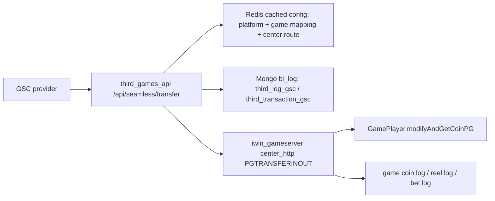
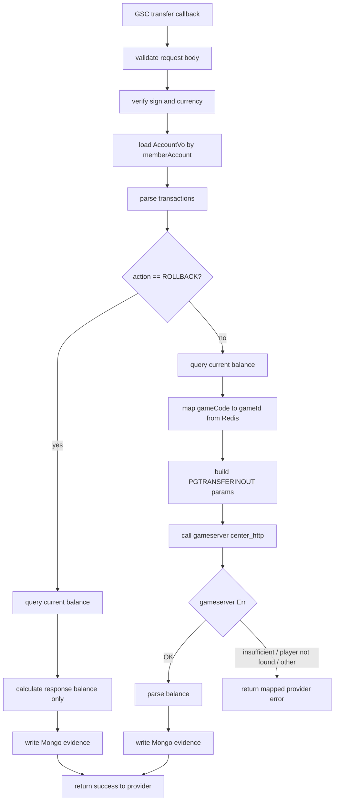

# GSC transfer bet / settle / rollback Flow

## 閱讀定位

本文件是 `iwin third_games_api gsc-transfer-bet-settle-rollback Step 3` 的主報告。

Flow 中文名稱：GSC transfer 投注 / 派彩 / rollback 整合回調。

Flow slug：`gsc-transfer-bet-settle-rollback`。

完成狀態：Step 3 已建立，並依更新後 KB 做過深度檢查與局部補強；可作為 Step 4 面試 case 的輸入。

證據層級：`專案存在 / code-backed`。目前沒有 Nick 本人 MR / ticket / commit / production issue / 本人確認，因此不能寫成 Nick 真實開發成果。

本 flow 是業務功能 / 共用能力 / 後台入口 / 報表查詢 / deploy flow：業務功能，屬於第三方遊戲 provider callback 到內部錢包異動的 production flow。

是否只確認到入口：不是。已確認 provider API 入口、Redis routing、下游 gameserver command dispatch、wallet mutation job 與 log projection 呼叫點；但 gameserver wallet method 的底層持久化與冪等仍是待確認。

掃描深度：Level 2 Flow 深掃。這輪已重讀 vault KB、`third_games_api` Step 1 / Step 2、既有 flow package、`third_games_api` 最新 `beta` 分支與 `iwin_gameserver` 最新 `main` 分支，並補看 `iwin_gameserver` 的 `origin/Nick-GSC_PG` path history 作為分支線索。沒有切分支、沒有 pull、沒有修改公司專案。

本 flow 研究的是 GSC provider 打進 `POST /api/seamless/transfer` 後，`third_games_api` 如何驗簽、解析交易、查玩家、找 gameserver，再透過 gameserver 做投注 / 派彩錢包異動；以及 `ROLLBACK` action 在目前 code 裡的特殊處理方式。

## 白話導讀

這條 flow 可以先想成「第三方遊戲把一筆下注 / 派彩 / 回滾結果送回 iwin，iwin 要決定玩家錢包要不要扣錢或加錢」。

`third_games_api` 不是最終錢包，它比較像 provider adapter：

1. 接 GSC 的 transfer callback。
2. 驗證簽名、幣別、玩家是否存在。
3. 把 provider 的交易資料轉成 iwin gameserver 看得懂的 `PGTRANSFERINOUT` command。
4. 呼叫 gameserver，由 gameserver 真的改玩家餘額與投注統計。
5. 回覆 provider，並在 Mongo 留 callback / transaction evidence。

最值得注意的是：`ROLLBACK` 在這個 endpoint 裡走一條很特別的路。它不呼叫 gameserver，只用「目前餘額 + request amount」算出一個 response balance，然後寫 Mongo。這可能是為了配合 GSC 驗證或特定 provider 語意，但從 money correctness 角度看，它不是完整 rollback wallet mutation，必須標成 `待確認`。

## Code 分層對照

| 層級 | 已確認 code | 角色 |
| --- | --- | --- |
| Route / API | `POST /api/seamless/transfer` | GSC provider 的 transfer callback 入口 |
| Provider API | `third_games_api/src/main/java/com/slots/web/controller/GscController.java` `transfer(...)` | 接 `POST /api/seamless/transfer`，驗簽、驗玩家、解析 transactions、呼叫 gameserver、寫 Mongo |
| Service / Business | `GscController#transfer` 內部流程 | 目前 business orchestration 主要寫在 controller，未拆出獨立 service |
| Model / DTO | `GscTransferReq`、`AccountVo`、gameserver response JSON | 承接 provider request、玩家資料與下游回應 |
| SQL / Table | 未在本輪看到直接 SQL table 寫入 | 錢包底層可能在 gameserver / player data，需另追 |
| Redis routing | `third_games_api/src/main/java/com/slots/web/common/utils/GetGameRedis.java` | 快取 third platform / game mapping / center routing |
| Redis refresh | `third_games_api/src/main/java/com/slots/web/schedule/ScheduleServer.java` | 每 5 秒重新初始化 `GetGameRedis` |
| External API | gameserver `center_http` command `PGTRANSFERINOUT` / `PLAYERINFO` | `third_games_api` 查餘額與送錢包異動的下游 HTTP |
| Gameserver HTTP dispatch | `iwin_gameserver/slots-center/src/main/java/com/slots/center/service/HttpService.java` | 接 `PGTRANSFERINOUT` command，建立 job |
| Gameserver job wrapper | `iwin_gameserver/slots-center/src/main/java/com/slots/sql/job/HttpPGTransferInOut.java` | 用 `accountId` 找玩家，丟進 game pool |
| Wallet mutation job | `iwin_gameserver/slots-center/src/main/java/com/slots/center/job/http/PGTransferInOutJob.java` | 檢查餘額、呼叫 `modifyAndGetCoinPG`、回覆 HTTP、推 log / bet log |
| Player wallet method | `iwin_gameserver/slots-games/slots-game-common/src/main/java/com/slots/game/common/data/GamePlayer.java` | 錢包異動落點之一；本輪只追到呼叫點，未逐行展開底層持久化 |
| MQ / Kafka | 本輪未看到此 flow 直接使用 MQ / Kafka | 後續 log / event 是否有非同步機制需另追 |
| Log / Audit | Mongo `third_log_gsc`、`third_transaction_gsc`、gameserver game coin / reel / bet log | callback evidence、transaction evidence 與 gameserver 投影 |

## 最小架構圖

## 正常流程圖

## 正常流程逐步說明

1. GSC 呼叫 `POST /api/seamless/transfer`，body 內含 operator、member、product、currency、game type、transactions、request time 與 sign。
2. `GscController#transfer` 先做 request validation。若 binding error，直接回 provider invalid request。
3. API 用 `operatorCode + requestTime + "transfer" + gscKey` 計算 MD5，比對 provider sign。`gscKey` 是設定值，本文件不記錄實值。
4. API 檢查幣別，並要求 `memberAccount` 是數字字串，再用 account id 查 `AccountVo`。
5. API 逐筆讀 `transactions`，但目前 local variables 會保留最後一筆 transaction 的 `amount`、`bet`、`validBetAmount`、`prizeAmount`、`wager_code`、`action`、`wagerStatus`、`gameCode`、`settleAt`。
6. 若 `action` 是 `BONUS`、`JACKPOT`、`PROMO`，`addMoney = amount`；其他情境用 `prizeAmount - betAmount` 代表本次淨異動。
7. API 先用 `moneyInoutGetBalance(memberAccount)` 呼叫 gameserver 查目前餘額。
8. 若是 `ROLLBACK`，目前 code 不呼叫 gameserver 修改錢包，只回覆 `amount + currentBalance`，並寫 Mongo。
9. 若不是 `ROLLBACK`，API 從 Redis `Game:List:ThirdIdList` 的 `PG` mapping 取得 `gameId`。
10. API 以 `PGTRANSFERINOUT` 呼叫 gameserver，帶入 `accountId`、`addMoney`、`BetCoin`、`validBetCoin`、`spinCurrency`、`transactionId`、`gameId`、`betId`、`reason`、`createTime`。
11. gameserver `PGTransferInOutJob` 檢查玩家存在與餘額，呼叫 `modifyAndGetCoinPG` 進行錢包異動，然後回覆 HTTP，並推送 game coin / reel / bet log。
12. `third_games_api` 解析 gameserver response balance，寫入 `third_log_gsc` 與 `third_transaction_gsc`，再回 GSC success。

## 業務問題

GSC 類 provider 通常會在玩家遊戲過程中回傳下注、派彩、取消或 rollback 類交易。iwin 端要把外部 provider 的交易語意轉成內部錢包可以理解的扣款 / 加款 / audit evidence。

這條 flow 的業務問題不是單純「接一支 API」，而是：

- 玩家在第三方遊戲下注後，iwin 內部餘額要正確扣除。
- 派彩或 bonus 類事件要正確加回。
- provider retry、timeout、重送時不能重複扣加。
- rollback / reversal 的語意要和 provider spec、內部 wallet ledger 對齊。
- wallet、callback audit、報表 log 之間需要能對帳。

## 系統位置

`third_games_api` 位在 provider-facing adapter 層，負責接外部 callback、轉換資料格式、找下游 gameserver 與留下 callback evidence。

`iwin_gameserver` 位在內部 wallet / player runtime 層，負責真正的玩家餘額異動、投注統計與 log projection。

因此這條 flow 的 owner 視角要分成兩層：

- Adapter correctness：驗簽、幣別、玩家存在、game mapping、response mapping、Mongo audit。
- Money correctness：gameserver wallet mutation、idempotency、rollback semantics、reconciliation。

## 入口與 code 路徑

已確認入口：

- `third_games_api`：`GscController#transfer`
- gameserver 查餘額：`moneyInoutGetBalance(...)` 發 `PLAYERINFO`
- gameserver 錢包異動：`PGTRANSFERINOUT`
- gameserver dispatch：`HttpService#PGTransferInOut`
- gameserver job：`HttpPGTransferInOut#runImpl`
- wallet mutation job：`PGTransferInOutJob#runHttpTask`、`modifyCoin`、`sendMoneyChange2Center`

待確認入口：

- provider spec 對 `ROLLBACK` 的正式定義。
- `modifyAndGetCoinPG` 底層是否有 transaction id / bet id 的唯一性保護。
- Mongo index / schema 是否對 `betId`、`transactionId` 或 `action` 做 unique constraint。

## DB / Redis / MQ / 外部 API

| 類型 | 已確認內容 | Owner 注意點 |
| --- | --- | --- |
| DB / Wallet | gameserver `GamePlayer.modifyAndGetCoinPG` 呼叫點 | 真正持久化與冪等仍待深追 |
| Mongo | `third_log_gsc`、`third_transaction_gsc` | audit / transaction evidence，不等於最終帳本 |
| Redis | `Game:List:ThirdIdList`、third platform PG routing cache | mapping miss 會讓交易無法送下游；refresh 失敗告警待確認 |
| MQ / Kafka | 本輪未看到直接使用 | 若 log projection 有非同步投遞，需另追 |
| 外部 API | GSC provider callback | 外部 retry / timeout 會放大 idempotency 風險 |
| 內部 HTTP | gameserver `PLAYERINFO`、`PGTRANSFERINOUT` | adapter 與 wallet mutation 不在同一個 transaction |

## 已確認資料狀態

| 狀態 / 資料 | 來源 | 用途 | 注意事項 |
| --- | --- | --- | --- |
| Provider request | GSC `transfer` callback | 原始交易事件 | 多筆 transactions 目前只留下最後一筆作為主要處理資料 |
| AccountVo | `third_games_api` account cache / lookup | 驗玩家、取得 `openId` / `centerId` | `memberAccount` 必須是數字 |
| Redis platform config | `GetGameRedis.thirdPlatformPG` | 找 gameserver `center_http` routing | 每 5 秒 refresh，但 refresh 失敗時的降級策略未完整確認 |
| Redis game mapping | `GetGameRedis.thirdIdList` | `gameCode` 對 `gameId` | 缺 mapping 會造成交易無法送 gameserver |
| Gameserver wallet | `GamePlayer.modifyAndGetCoinPG` | 真正錢包異動 | 本輪只追到呼叫點，底層持久化與冪等未完整確認 |
| Mongo `third_log_gsc` | `third_games_api` 寫入 | callback audit | 不是已確認的最終帳本 |
| Mongo `third_transaction_gsc` | `third_games_api` 寫入 | transaction evidence / query evidence | 本輪未看到 unique index evidence |

## State Transition

| 階段 | 狀態 | 已確認行為 | 待確認 |
| --- | --- | --- | --- |
| Provider callback received | 外部交易到達 adapter | request validation、sign、currency、player check | request 是否可一次多筆交易 |
| Parsed transaction | provider transaction 轉成內部欄位 | 取 `amount`、`bet`、`validBetAmount`、`prizeAmount`、`wager_code`、`action` | 多筆 transactions 是否只應保留最後一筆 |
| Pre-balance checked | adapter 查目前餘額 | 呼叫 gameserver `PLAYERINFO` | 查餘額與扣款之間沒有 lock，最終仍應以 gameserver mutation 為準 |
| Non-rollback command sent | 送 gameserver `PGTRANSFERINOUT` | 帶 `addMoney`、`BetCoin`、`validBetCoin`、`spinCurrency`、`transactionId`、`betId` | 下游 command 是否有冪等 |
| Wallet mutated | gameserver 修改玩家錢包 | `PGTransferInOutJob` 呼叫 `modifyAndGetCoinPG` | 底層 ledger / DB 寫入方式 |
| Audit written | adapter 寫 Mongo | 寫 `third_log_gsc`、`third_transaction_gsc` | insert 失敗的 repair |
| Rollback branch | 特殊 rollback response | 不送 gameserver，只回算 balance 與寫 Mongo | 是否符合 provider spec |

## Transaction Boundary

已確認：

- `third_games_api` 的 transaction boundary 不包含 gameserver wallet mutation 與 Mongo insert 的原子性。
- 真正扣款 / 加款發生在 `iwin_gameserver` 的 `PGTransferInOutJob#modifyCoin`，不是 `third_games_api`。
- `third_games_api` 是先呼叫 gameserver，成功後才寫 Mongo。
- gameserver job 會先完成 wallet mutation 與 HTTP OK response，再做後續 event / reel log / bet log 類投遞。

推論：

- 系統的 money source of truth 應在 gameserver / player wallet，不在 `third_games_api` Mongo。
- Mongo 更像 provider callback evidence、查詢輔助與 reconciliation 素材。

待確認：

- `GamePlayer.modifyAndGetCoinPG` 是否以 `transactionId` / `betId` 做底層冪等。
- Mongo collection 是否有 unique index。
- provider retry 時，gameserver 成功但 `third_games_api` Mongo 失敗的補償流程。

## Consistency 與 Idempotency

已確認風險：

| 面向 | 現況 | Owner 風險 |
| --- | --- | --- |
| Provider retry | `transfer` 內沒有明確呼叫 `hasBetId(...)` 做重送防護 | 同一筆 provider event 若重送，是否重複扣 / 加款取決於 gameserver 底層是否冪等 |
| 多筆 transactions | loop 只把最後一筆交易留在 local vars | 若 provider 一次送多筆，前面交易可能沒有完整處理 |
| duplicate action check | 目前只檢查同一 request 內 action 是否重複 | 不是跨 request 的 transaction idempotency |
| Mongo after wallet | gameserver 成功後才寫 Mongo | Mongo 寫失敗可能導致 provider 收到錯誤或 evidence 缺口，但 wallet 已變更 |
| HTTP response timing | gameserver 回 OK 後還會做 log / bet log | provider 成功語意與後續投影完整性不是同一個 atomic boundary |
| ROLLBACK | 不呼叫 gameserver，只回算餘額並寫 Mongo | 可能不是實際 wallet rollback，語意需要 provider spec 或 production evidence 確認 |

這裡最適合轉成 Senior / Owner 面試重點：第三方 seamless wallet 不能只問「API 有沒有回成功」，要問「source of truth 在哪裡、重送如何收斂、外部成功與內部投影不一致時誰負責修正」。

## Failure Window

| Window | 可能情境 | 已確認 / 推測 | 影響 | 建議追查 |
| --- | --- | --- | --- | --- |
| 驗簽失敗 | sign mismatch | 已確認會拒絕 | provider request 不進入錢包異動 | 只需保留 audit / alert 策略 |
| Redis mapping 缺失 | `gameCode` 找不到 `gameId` 或 center route | 已確認依 Redis routing | 交易無法送 gameserver | 查 Redis refresh 失敗告警與 fallback |
| 查餘額成功，扣款前餘額變動 | concurrent request | 推測 | `moneyInoutGetBalance` 只是 pre-check，不是 lock | 以 gameserver 原子扣款結果為準 |
| gameserver wallet 成功，HTTP response 到 API 失敗 | network / timeout | 待確認 | provider 可能重送，若無冪等可能重複扣加 | 追 gameserver transaction idempotency |
| gameserver 成功，Mongo insert 失敗 | Mongo exception | 已確認 insert 在 gameserver 成功後 | callback evidence 缺失，API catch 可能回 ServerError | 補 outbox / retry / reconciliation |
| API 回 provider success，後續 bet log 失敗 | gameserver response 早於部分 log | 已確認 response timing 線索 | wallet 正確但報表 / 稽核投影可能缺口 | 補 log retry 與 reconciliation report |
| ROLLBACK 不改 wallet | `action == ROLLBACK` branch | 已確認 code 行為 | response 看似 rollback，但錢包未反向異動 | 必須用 provider spec / production issue 確認語意 |

## Retry / Compensation / Reconciliation

目前 code-backed 的可說法：

- Provider-facing API 有把 request 與 transaction 寫進 Mongo，具備 audit / reconciliation 素材。
- gameserver 端有 game coin log、reel log、bet log 等投影，能支撐跨系統核對。
- `queryBet` / `queryBetTime` 等 helper 存在，但 `transfer` 主線沒有用它們做完整重送防護。

不能腦補的部分：

- 不能說系統已經有完整 exactly-once。
- 不能說 rollback 已真正補償 wallet。
- 不能說 Mongo 是帳本或唯一 source of truth。
- 不能說 provider retry 一定安全，除非後續補到 gameserver 底層冪等 evidence。

建議 Owner decision：

1. 以 gameserver wallet ledger 作為 money source of truth。
2. 讓 provider `transactionId` / `wager_code` 在 wallet mutation 層具備唯一性或可重入結果。
3. 對 gameserver 成功但 Mongo 失敗建立 repair job 或 reconciliation query。
4. 明確定義 `ROLLBACK`：是 provider validation shortcut、查詢型 response，還是真正補償交易。
5. 把 `third_games_api` Mongo、gameserver coin log、provider transaction id 做成對帳 join key。

## Observability

已確認觀察點：

- `third_games_api` 會在 `third_log_gsc` 記錄 request / transaction / bet id / amount 類 callback evidence。
- `third_games_api` 會在 `third_transaction_gsc` 記錄 step、action、balance、beforeBalance、bet time、settle time。
- gameserver `PGTransferInOutJob` 會推 game coin log、reel log、bet log。

待補：

- 這些 log 是否有統一 trace id。
- Mongo 與 gameserver log 是否有 dashboard 或 daily reconciliation。
- `ROLLBACK` 分支是否有特別告警。
- Redis refresh 失敗是否會告警到 owner。

## Owner Decision 摘要

這條 flow 的 Owner 不是只維護 endpoint，而是要維護「外部 provider callback 與內部錢包 mutation 的一致性契約」。

真正需要 owner 決策的點：

- `transfer` 要不要支援一次多筆 transactions；如果 provider spec 允許多筆，目前實作要改成逐筆處理或明確拒絕。
- `ROLLBACK` 到底是不是 money mutation；如果不是，文件與 monitoring 要清楚標出，避免營運或工程誤解。
- provider retry 的冪等要放在 adapter 層、wallet 層，或兩層都放。
- Mongo insert 失敗時要回 provider error、success，還是進 repair queue。
- 報表投影與錢包帳本不一致時，以哪一邊修正另一邊。

## 面試 / 履歷邊界摘要

可用作面試素材：

- 第三方 seamless wallet callback 的 transaction boundary 分析。
- Provider retry / timeout / duplicate transaction 的冪等設計。
- Adapter Mongo audit 與 gameserver wallet source of truth 的切分。
- Rollback 語意不清時如何用 code evidence、provider spec、production reconciliation 收斂。

目前不建議放進正式履歷：

- 「主導 GSC provider 串接」。
- 「設計第三方錢包架構」。
- 「解決 rollback 一致性問題」。
- 「保證 exactly-once」。

正式履歷若要更新，必須等 Nick 補本人參與 evidence，並完成更深的 branch / commit / issue / production case 確認。

## Lead / Architect 追問

1. 如果 provider timeout 後重送同一筆 transfer，你如何保證不重複扣款？
2. 為什麼 idempotency 不能只放在 `third_games_api` Mongo？
3. gameserver wallet 成功但 Mongo insert 失敗時，API 應該回 success 還是 error？
4. `ROLLBACK` 不呼叫 gameserver 是 spec-driven 還是技術債？你會怎麼驗證？
5. 若 `transactions` 允許多筆，現有只保留最後一筆的行為會造成什麼資料正確性問題？
6. 報表 log、callback audit、wallet ledger 三者不一致時，以誰為準？如何 repair？
7. Redis routing cache 每 5 秒 refresh，如果 mapping miss 或 stale，交易要 fail fast、fallback 還是降級？

## 下一步要查的 evidence

- GSC provider spec 對 `transfer`、`ROLLBACK`、多筆 transactions、retry 的正式語意。
- `GamePlayer.modifyAndGetCoinPG` 底層是否有 provider transaction id / bet id unique protection。
- Mongo `third_log_gsc` / `third_transaction_gsc` index。
- gameserver 成功但 adapter audit 寫失敗時的 production repair / reconciliation SOP。
- `PGTransferInOutJob` 後續 log / bet log 失敗的 retry 機制。

## 本 Step 3 結論

`gsc-transfer-bet-settle-rollback` 是一條高價值 Senior Backend flow，因為它把 provider API、Redis routing、gameserver wallet mutation、Mongo audit、rollback semantics、retry / idempotency 全部串在一起。

但它目前的履歷層級只能是 `專案存在 / code-backed` 與 `分析素材 / learning-only`。最重要的下一個洞是：補 Step 4 面試 case 時，要把「ROLLBACK 不改 wallet」與「gameserver 成功但 Mongo 失敗」整理成可講、保守、不誇大的交易一致性案例。
