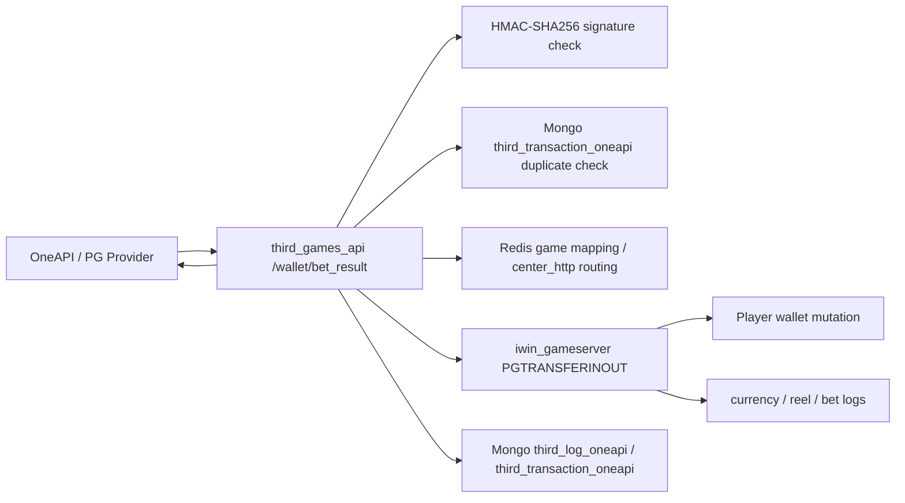
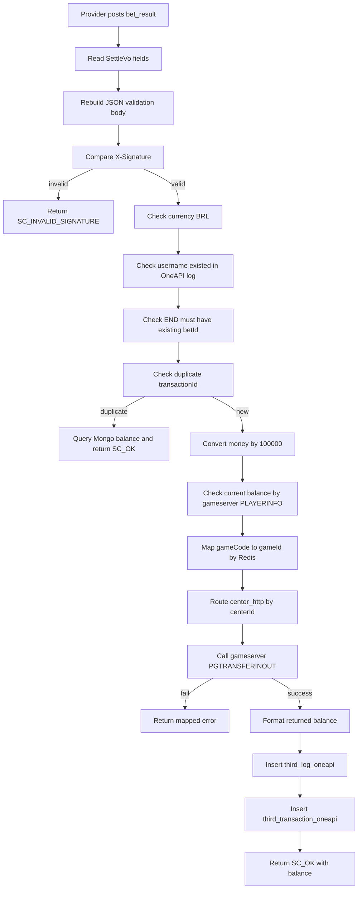

# OneAPI / PG bet_result 投派 callback Flow

## 閱讀定位

Flow 中文名稱：OneAPI / PG bet_result 投派 callback。

Flow slug：`oneapi-wallet-bet-result`。

完成狀態：Step 5 已完成，已完成單條 flow claim gate；下一步回同 project candidate ranking，做 `antplay-bet-settle-rollback Step 4`。

證據層級：`專案存在 / code-backed`、`分析素材 / learning-only`。`third_games_api` 本 repo 的 OneAPI adapter 目前未見 Nick / `10gt12nc` direct commit；下游 `iwin_gameserver` 的 PG bet_result / PGTransferInOut 有 Nick / `10gt12nc` direct commits，但歸屬 `iwin_gameserver` project claim，不反包成 `third_games_api` direct contribution。

本 flow 是業務功能 / 共用能力 / 後台入口 / 報表查詢 / deploy flow：業務功能，屬於第三方遊戲 provider 投派結果 callback 到 gameserver 錢包異動的 production money flow。

是否只確認到入口：不是。已確認 provider callback 入口、HMAC 驗簽、Mongo transaction duplicate check、Redis game mapping / platform routing、gameserver `PGTRANSFERINOUT` dispatch、wallet mutation job 與 Mongo audit 寫入。未確認 Mongo unique index、provider 官方狀態機與 production retry contract。

掃描深度：Level 2 Flow 深掃。Step 5 已重讀 vault KB、`third_games_api` README / Step 1 / Step 2 / contribution consolidation、既有 GSC flow 與本 flow Step 3 / Step 4 文件，並重新確認 `/Users/nick/Git/iwin/third_games_api` 最新 `beta` 與 `/Users/nick/Git/iwin/iwin_gameserver` 最新 `main`。兩個 source repo 均已 fetch remote refs，未 pull、未 checkout、未 merge、未 rebase，未修改公司 repo。

## 白話導讀

OneAPI 是第三方遊戲 provider。玩家在 PG / OneAPI 遊戲裡完成一局或一次投注結果後，provider 會打 `POST /wallet/bet_result` 回 `third_games_api`。

這個 API 做幾件事：

1. 確認 request body 和 `X-Signature` 是否對得上，避免外部偽造 callback。
2. 確認幣別、玩家、`transactionId`、`betId` 等基本資料。
3. 如果同一個 `transactionId` 已處理過，就不要再送 gameserver 改錢，而是回 Mongo 裡記錄的餘額。
4. 如果是新交易，就把 `betAmount`、`winAmount`、`jackpotAmount`、`effectiveTurnover` 轉成內部金額單位。
5. 用 Redis 找 provider `gameCode` 對應的 iwin `gameId`，再用玩家 `centerId` 找 gameserver `center_http`。
6. 呼叫 gameserver `PGTRANSFERINOUT` 進行實際錢包加扣。
7. gameserver 成功後，`third_games_api` 才寫 Mongo `third_log_oneapi` 與 `third_transaction_oneapi`，並回 `SC_OK` 給 provider。

成功後，玩家錢包在 gameserver 端已被加扣，Mongo 會留下 OneAPI callback 與 transaction evidence。失敗最直覺會壞在三個地方：簽章組字串不一致、gameserver 已改錢但 Mongo 沒寫、或 provider retry 時 duplicate guard 不在最終 wallet boundary。

## 初中階 Code 分層對照

| Layer | Code / Data | 角色 |
| --- | --- | --- |
| Route / API | `POST /wallet/bet_result` | OneAPI provider 投派結果 callback |
| Controller | `OneApiController#settle` | 驗簽、檢查玩家 / 幣別 / duplicate、組 gameserver command |
| Request VO | `SettleVo` | 承載 `traceId`、`transactionId`、`betId`、`roundId`、金額與結果型別 |
| Service / Business | Controller 內組流程 | 本 repo 未拆 service；controller 直接處理 business orchestration |
| Model / DAO | `AccountDao#queryAccountByVo` | 查玩家 openId / centerId |
| Redis | `Game:List:ThirdIdList`、`Game:ThirdPlatform:PG` | provider gameCode -> internal gameId；centerId -> gameserver URL |
| External API | gameserver `center_http` command `PGTRANSFERINOUT` | 真正錢包加扣與打碼 / log side effect |
| Gameserver dispatch | `HttpService#PGTransferInOut`、`HttpPGTransferInOut`、`PGTransferInOutJob` | 接 command、查玩家、排入 game pool、執行 wallet mutation |
| Wallet mutation | `PlayerData.modifyAndGetCoinPG` | 修改玩家餘額並寫 currency log |
| Log / Audit | `third_log_oneapi`、`third_transaction_oneapi` | provider callback / transaction evidence |
| Downstream log | `sendReelToLog`、`sendBetLog` | gameserver 端戰績 / 打碼 log side effect |
| Config | `oneApi.secretKey`、`oneApi.apiKey`、`OneapiRedis` constants | provider auth 與 runtime routing 設定 |

## 最小架構圖



## 正常流程圖



## 正常流程逐步說明

1. Provider 打 `POST /wallet/bet_result`，body 進 `SettleVo`。
2. Controller 取出 `traceId`、`username`、`transactionId`、`betId`、`externalTransactionId`、`roundId`、`resultType`、金額、`currency`、`token`、`gameCode`、`betTime`、`settledTime`。
3. 用固定欄位順序建立 `LinkedHashMap`，序列化成 JSON，再用 `oneApiSecretKey` 做 HMAC-SHA256。
4. 比對 request header `X-Signature`。不一致直接回 `SC_INVALID_SIGNATURE`。
5. 幣別不是 `BRL`，回 `SC_WRONG_CURRENCY`。
6. `hasUsername(username)` 會查 `third_log_oneapi`，若查不到回 `SC_USER_NOT_EXISTS`。
7. `resultType = END` 且 `hasBetId(betId)` 查不到時，回 `SC_TRANSACTION_NOT_EXISTS`。
8. `hasTransactionId(transactionId)` 查 `third_transaction_oneapi` step 1；若存在，查同 `betId` 的 balance 回 `SC_OK`，不再呼叫 gameserver。
9. 新交易會把 `betAmount`、`winAmount`、`jackpotAmount`、`effectiveTurnover` 乘 `100000`。
10. 先用 `moneyInoutGetBalance(username, betId)` 查目前餘額；若餘額小於下注額，回 `SC_INSUFFICIENT_FUNDS`。
11. 依 `resultType` 計算 `addMoney`：`WIN / BET_WIN / BET_LOSE` 是 win + jackpot - bet；`LOSE` 是 0。其他 resultType 目前未看到明確處理，需待確認。
12. 從 Redis `Game:List:ThirdIdList` 的 `PG` mapping 取得 internal `gameId`。
13. 查玩家 openId / centerId，從 Redis `Game:ThirdPlatform:PG` 的 `center_http` 取得 gameserver URL。
14. 組 `PGTRANSFERINOUT` command，帶 `accountId`、`addMoney`、`BetCoin`、`validBetCoin`、`spinCurrency`、`transactionId`、`gameId`、`betId`、`reason`、`createTime`。
15. gameserver `HttpService` dispatch 到 `HttpPGTransferInOut`，再建立 `PGTransferInOutJob`。
16. `PGTransferInOutJob` 檢查玩家 / 封禁 / 餘額，呼叫 `modifyAndGetCoinPG` 修改錢包，成功後通知事件、送戰績、送打碼 log。
17. `third_games_api` 解析 gameserver response 的 coins，轉回小數餘額，回 `SC_OK`。
18. 最後寫 Mongo `third_log_oneapi` 與 `third_transaction_oneapi`，作為 callback 與 transaction evidence。

## 業務問題

這條 flow 處理的是第三方遊戲 provider 的「一筆投注結果」。它不是單純查詢，也不是後台操作，而是直接影響玩家錢包、有效投注、下注流水、第三方交易 id 與後續對帳。

Owner 看這條 flow 會關心：

- provider callback 是否可被偽造。
- 同一 `transactionId` retry 是否會重複改錢。
- gameserver 錢包成功但 Mongo 寫失敗時，下一次 retry 會不會 double apply。
- `resultType` 對 `addMoney`、有效投注、round end 的語意是否完整。
- Mongo audit、gameserver currency log、reel log、bet log 是否能對得回 provider statement。

## 系統位置

`third_games_api` 是 provider-facing adapter。它不是錢包 source of truth，也不是最終帳本。

本 flow 的真正 money commit boundary 在 `iwin_gameserver`：

- `third_games_api` 負責驗簽、欄位轉換、路由與 Mongo evidence。
- `iwin_gameserver` 負責玩家餘額加扣、currency log、戰績與打碼 side effect。
- `game_job` / BI 可能負責 Mongo old data backup / cleanup；本輪只用 workspace 舊索引確認有 OneAPI log / transaction backup job 線索，未重掃 `game_job` source。

## 入口與 Code 路徑

`third_games_api`：

- `src/main/java/com/slots/web/controller/OneApiController.java`
  - `settle(HttpServletRequest, @RequestBody SettleVo)`
  - `insertMongoLog`
  - `insertMongoTransaction`
  - `hasBetId`
  - `hasTransactionId`
  - `queryBalance`
- `src/main/java/com/slots/web/pojo/vo/oneapi/SettleVo.java`
- `src/main/java/com/slots/web/pojo/vo/oneapi/ThirdGameTransactionVO.java`
- `src/main/java/com/slots/web/common/constant/OneapiRedis.java`

`iwin_gameserver`：

- `slots-center/src/main/java/com/slots/center/service/HttpService.java`
  - `deal()` dispatch `PGTRANSFERINOUT`
  - `PGTransferInOut(ChannelHandlerContext, JSONObject)`
- `slots-center/src/main/java/com/slots/sql/job/HttpPGTransferInOut.java`
- `slots-center/src/main/java/com/slots/center/job/http/PGTransferInOutJob.java`
- `slots-games/slots-game-common/src/main/java/com/slots/game/common/data/AddCenterCoinPG.java`
- `slots-center/src/main/java/com/slots/center/data/PlayerData.java`

## DB / Redis / MQ / 外部 API

Mongo：

- `bi_log.third_log_oneapi`
  - callback audit log。
- `bi_log.third_transaction_oneapi`
  - transaction evidence，`step = 1`，欄位包含 `traceId`、`username`、`transactionId`、`betId`、`externalTransactionId`、`roundId`、金額、`resultType`、`balance`、`createdTime`。

Redis：

- `Game:List:ThirdIdList`
  - `PG` provider gameCode 到 internal game id。
- `Game:ThirdPlatform:PG`
  - `center_http` 依玩家 centerId 找 gameserver URL。

外部 / 下游：

- OneAPI provider request header `X-Signature`。
- gameserver `center_http` command `PGTRANSFERINOUT`。

MQ / Kafka：

- 本 flow 未看到 MQ / Kafka；gameserver 內部有 game pool job queue 與 log side effect，但不是 Kafka。

## 資料狀態與 State Transition

| 狀態 | 來源 | 已確認變化 | 風險 |
| --- | --- | --- | --- |
| Provider callback received | OneAPI request | `SettleVo` 被解析 | body 欄位順序和簽章組字串需一致 |
| Signature validated | HMAC-SHA256 | 通過才進入 money logic | 沒有 nonce / timestamp replay guard |
| Duplicate checked | Mongo `transactionId + step` | duplicate 回 Mongo balance，不呼叫 gameserver | guard 在 adapter 層，不在 wallet mutation 前 |
| Money command built | Controller params | `addMoney`、`BetCoin`、`validBetCoin`、`spinCurrency`、`transactionId`、`betId` 送下游 | resultType 未完整處理可能造成 addMoney 不符合 provider 語意 |
| Wallet mutated | gameserver job | `modifyAndGetCoinPG` 修改玩家餘額 | 未確認 gameserver 端以 transactionId / betId 防重 |
| Audit written | Mongo insert | 成功後寫 `third_log_oneapi` / `third_transaction_oneapi` | gameserver 成功但 Mongo insert 失敗會讓 retry 失去 duplicate evidence |
| Provider response | JSON response | 回 `SC_OK` + balance | response timeout 後 provider 可能重送 |

## Consistency / Idempotency

已確認：

- Adapter 層有 `hasTransactionId(transactionId)`，查 `third_transaction_oneapi` 的 `transactionId + step = 1`。
- Duplicate 命中時，會用 `betId` 查 Mongo balance，回 `SC_OK`。
- gameserver 端會把 `transactionId` / `betId` 帶進 `PGTransferInOutJob` 與 `AddCenterCoinPG`。

待確認：

- Mongo collection 是否有 unique index。舊 workspace 文件提到未看到唯一索引保證；本輪 source 掃描也未看到 createIndex / ensureIndex。
- gameserver wallet mutation 前是否另有 transactionId / betId duplicate guard。本輪在 `PGTransferInOutJob` 與相關 wallet path 未看到明確「先查已處理 transaction 再跳過」邏輯。
- Provider 是否保證 `transactionId` 對同一 event 全域唯一，或 `betId + resultType` 才是完整 idempotency key。

Owner 判斷：

- 只靠 Mongo duplicate check 不夠穩，因為 Mongo 寫入是在 gameserver 成功後才做。
- 若 gameserver 成功、Mongo insert 失敗或 process crash，下一次 provider retry 會查不到 transactionId，可能再次送 `PGTRANSFERINOUT`。
- 更穩的設計是讓 wallet mutation boundary 自己有 idempotency guard，或先落 durable request record，再以狀態機推進 gameserver mutation。

## Failure Window

| Failure | 現在觀察 | 可能後果 | Owner 追問 |
| --- | --- | --- | --- |
| 簽章驗證失敗 | 回 `SC_INVALID_SIGNATURE` | provider 交易不處理 | canonical JSON 欄位順序是否和 provider 完全一致 |
| username 查不到 | 查 `third_log_oneapi` | 回 user not exists | 用 log 判斷使用者存在是否可靠 |
| `END` 但 betId 查不到 | 回 transaction not exists | provider end event 被拒 | provider event order 是否可能 out-of-order |
| transactionId duplicate | 回 Mongo balance | 避免 adapter 再送 gameserver | Mongo balance 是否最新、是否會查到同 betId 其他 transaction |
| gameserver 成功、Mongo 寫失敗 | code 未見補償 | retry 可能 double apply | wallet boundary 要不要防重 |
| provider timeout | provider 可能重送 | 依 duplicate evidence 收斂 | response 發出前後的 crash window 如何處理 |
| gameserver side effect 失敗 | wallet 成功後還要送 event / reel / bet log | 錢包與報表 / 打碼不一致 | log outbox / reconciliation 是否存在 |

## 補償 / Retry / Reconciliation

目前 code-backed 可以說：

- Provider retry 主要靠 `third_transaction_oneapi.transactionId + step` 判斷 duplicate。
- gameserver response 成功後才寫 Mongo transaction。
- `game_job` 舊索引顯示有 `ThirdLogOneapiJob` 與 `ThirdTransactionOneapiJob` 做 Mongo backup / cleanup，但本輪未重掃 source，不把它當交易補償。

目前不能說：

- 不能說已經有 exactly-once。
- 不能說 gameserver 已以 transactionId / betId 做防重。
- 不能說有完整 reconciliation job。

建議 Owner 補強方向：

1. 確認 provider `transactionId` / `betId` / `roundId` 唯一範圍。
2. 在 wallet mutation 前建立 durable idempotency key，例如 `provider + transactionId + eventType`。
3. Mongo audit 和 gameserver currency log / reel log 建 reconciliation report。
4. 對 gameserver 成功但 adapter Mongo 失敗的情境，保留可重建 evidence 的 outbox 或 repair task。

## Senior / Owner 設計取捨

### HMAC 驗簽 vs replay 防護

HMAC 能證明 body 沒被改、來源知道 secret，但不等於防 replay。若同一 body + signature 被重送，HMAC 仍會通過，所以仍需要 idempotency key。

### Adapter duplicate guard vs wallet duplicate guard

Adapter guard 便宜、容易做，但 guard evidence 可能比 wallet mutation 晚寫。Wallet guard 更接近 money source of truth，通常更安全。

### Mongo audit vs transaction ledger

`third_transaction_oneapi` 很有用，但目前更像 adapter audit / duplicate projection，不應直接當唯一帳本。面試時要講清楚：錢包 source of truth 在 gameserver，Mongo 是 provider callback evidence。

### 先回 provider 還是先落 audit

目前是 gameserver 成功後寫 Mongo，再回 response。這能讓 response 反映 gameserver 結果，但仍有 crash / timeout window。若先落 pending request，再推進 state，實作會更複雜，但 retry / repair 更可控。

## Lead / Architect 追問

Q：這條 flow 最危險的點是什麼？

A：不是 HMAC，而是 idempotency boundary。`transactionId` duplicate check 在 Mongo，但 Mongo 是 gameserver 成功後才寫。如果 gameserver 改錢成功、Mongo 沒寫，retry 可能再次進 gameserver。

Q：`transactionId` 和 `betId` 哪個該做 key？

A：不能猜，要看 OneAPI contract。若 `transactionId` 是每次 transaction 唯一，就用它；若一個 betId 下有 bet / settle / end 等多個 event，就要包含 event type。保守設計會用 `provider + transactionId + resultType` 或 provider 明確定義的唯一鍵。

Q：`END` 查不到 betId 回錯，可能代表什麼？

A：代表系統假設 END 一定在前置 transaction 之後。若 provider 可能 out-of-order，這個策略會把合法補結算擋掉，或需要 provider retry / repair 流程。

Q：你會怎麼補觀測？

A：至少把 `traceId`、`transactionId`、`betId`、`roundId`、gameserver response、Mongo insert result 串成 correlation log，並建 provider statement vs adapter transaction vs gameserver currency log 的 reconciliation。

## Step 4 面試 Case 收斂

Case 標題：第三方遊戲 OneAPI / PG bet_result callback 的 idempotency 與 wallet boundary。

30 秒說法：

```text
我分析過 OneAPI / PG bet_result 這條 provider callback。它先用 HMAC-SHA256 驗 request body，再用 transactionId 查 Mongo duplicate evidence；新交易才會轉成 gameserver PGTRANSFERINOUT command。真正錢包異動在 gameserver，third_games_api 只負責 provider contract、路由與 Mongo audit，所以核心風險不是簽章，而是 gameserver 成功但 adapter Mongo 未寫時 provider retry 可能 double apply。
```

3 分鐘說法：

```text
OneAPI provider 會把 transactionId、betId、roundId、投注額、派彩、jackpot、有效投注與 resultType 打到 /wallet/bet_result。Adapter 先用固定欄位順序重建 JSON，透過 HMAC-SHA256 驗 X-Signature，再檢查 currency、username、END 是否已有 betId，以及 transactionId 是否已在 third_transaction_oneapi 處理過。

如果 transactionId 已存在，adapter 回 Mongo 記錄的 balance，不再送 gameserver。新交易會把金額轉成內部倍率，算 addMoney，透過 Redis 找 gameId 與 center_http，送 gameserver PGTRANSFERINOUT。gameserver 才是 wallet mutation boundary，會查玩家、檢查餘額與封禁、修改錢包並帶出 currency / reel / bet log side effect。最後 adapter 才寫 third_log_oneapi 和 third_transaction_oneapi。

我會把這條 flow 的 Senior 重點放在 idempotency boundary。HMAC 只能證明 request 沒被改，不能防合法 request replay；adapter Mongo duplicate guard 也只能擋住已成功寫 Mongo 後的 retry。最危險的是 gameserver 改錢成功，但 adapter crash 或 Mongo insert 失敗，provider retry 時查不到 transactionId，就可能再次送 PGTRANSFERINOUT。更穩的 owner 設計會把 idempotency guard 放到 wallet mutation 前，或先落 durable request state，再用 reconciliation 對 provider statement、adapter Mongo 與 gameserver log。
```

面試官追問時的核心回答：

| 追問 | 回答重點 |
| --- | --- |
| HMAC 解決什麼？ | 解決 request integrity / shared secret 驗證，不解決 replay；同一份合法 body 重送仍會通過。 |
| duplicate guard 在哪？ | Adapter 層查 Mongo `third_transaction_oneapi` 的 `transactionId + step = 1`；這不是 wallet source of truth。 |
| 最大 failure window？ | `gameserver wallet success -> adapter Mongo insert fail / crash / timeout -> provider retry`。 |
| `transactionId` / `betId` 怎麼選？ | 不能猜 provider contract；若 transactionId 是 event unique 就用它，否則要把 provider、event type、transaction id 或官方唯一鍵組成 idempotency key。 |
| 你會怎麼改善？ | 先確認 provider unique key contract，把 guard 移近 wallet mutation boundary，補 durable state / outbox / reconciliation，讓 provider statement、adapter Mongo、gameserver currency / reel / bet log 能對帳。 |

正式履歷邊界：

- 這條 flow 可作 `code-backed / 分析過` 的面試 case。
- 不新增 `third_games_api` standalone 履歷 bullet。
- 下游 `iwin_gameserver` PGTransferInOut direct commits 可支撐 `iwin_gameserver` claim，不反包成 `third_games_api` direct contribution。
- 不說 Nick 開發 OneAPI adapter、不說主導 provider integration、不說已落地 exactly-once。

## 面試 / 履歷邊界摘要

可面試講：

- OneAPI bet_result flow 的 HMAC contract、transactionId duplicate guard、gameserver `PGTRANSFERINOUT` boundary。
- Adapter 層與 gameserver 錢包層的責任切分。
- `gameserver success -> Mongo insert` 的 failure window。
- 為什麼 Mongo audit 不等於 wallet ledger。

不可誇大：

- 不說 Nick 開發 OneAPI adapter。
- 不說 Nick 主導 `third_games_api`。
- 不說已建立 complete idempotency / reconciliation。
- 不把 `iwin_gameserver` 的 direct commits 包成 `third_games_api` direct contribution。

本輪不更新正式履歷 / 自傳。若要放履歷，必須透過 project-level contribution consolidation；目前 `third_games_api` consolidation 結論仍是不新增 standalone 正式履歷主成果。

## Step 5 Claim Gate

結論：本 flow 完成 Step 5 後，維持 `專案存在 / code-backed` 與 `分析素材 / learning-only`。不升級為 `真實開發過`，不新增 `third_games_api` standalone 正式履歷成果。

### 可面試講

```text
我分析過 OneAPI / PG bet_result provider callback。這條 flow 先用 HMAC-SHA256 驗 request body，再以 transactionId 查 Mongo duplicate evidence；新交易才轉成 gameserver PGTRANSFERINOUT command。真正錢包異動在 gameserver，所以我會把重點放在 wallet boundary idempotency：gameserver 成功但 adapter Mongo 未寫時，provider retry 可能再次改錢。改善方向是把 idempotency guard 移近 wallet mutation boundary，或先落 durable request state，再做 reconciliation。
```

### 可放履歷

不建議新增獨立 bullet。原因：

- `third_games_api` OneAPI adapter path 未看到 Nick / `10gt12nc` direct commit。
- OneAPI adapter 主體 commit 目前只能作專案存在與 code-backed 分析素材。
- 下游 `iwin_gameserver` PGTransferInOut 有 Nick / `10gt12nc` direct evidence，但 project attribution 屬於 `iwin_gameserver`，不能反向包裝成 `third_games_api` direct contribution。

若履歷大段落需要保留第三方遊戲經驗，仍沿用 project-level consolidation 的保守口徑：

```text
參與或分析第三方遊戲 provider integration 與遊戲結算相關流程，涵蓋登入、轉入轉出、下注 / 派彩、rollback、交易同步、紀錄保存與報表鏈路，聚焦玩家餘額、provider transaction 與 round log 的一致性。
```

這句不能被解讀成 Nick 主導 `third_games_api` 或開發 OneAPI adapter。

### 不可誇大

- 不說 Nick 開發 OneAPI adapter。
- 不說 Nick 主導 OneAPI / PG provider integration。
- 不說 Nick 建立完整 provider idempotency / reconciliation。
- 不說已修復 OneAPI production 錯帳。
- 不把 `iwin_gameserver` PG direct commits 寫成 `third_games_api` direct contribution。

### 回填判斷

- 已回填 `third_games_api` README / Step 1 / Step 2 / contribution consolidation。
- 已回填 `projects/iwin/README.md`、`01-senior-owner-flow-inventory.md`、`04-interview-casebook.md`、`06-todo.md`。
- 不更新 `05-resume-master-zh.md` / `08-application-autobiography-zh.md`，因為本 flow Step 5 只支撐面試素材，不支撐正式履歷新增。

## 下一步

```text
iwin third_games_api antplay-bet-settle-rollback Step 4
```

原因：

- `gsc-transfer-bet-settle-rollback` 已完成 Step 5。
- `oneapi-wallet-bet-result` 已完成 Step 5，結論是 code-backed interview-only，不新增正式履歷。
- 依 Step 2 ranking，下一條同 project 候選 flow 是 `antplay-bet-settle-rollback`；先做 Step 3 flow learning package。
- 不會直接更新 05 / 08；仍需 commit，不需要 push，除非 Nick 明確要求。
