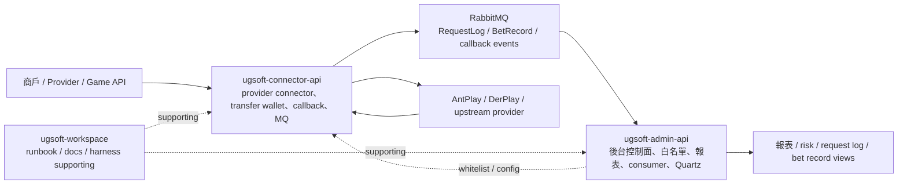
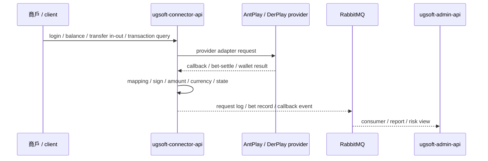
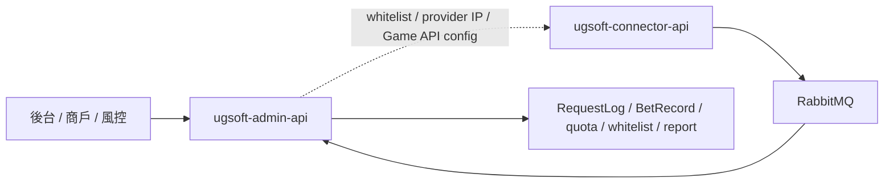

# UGSoft system map v1

更新日期：2026-05-28

本檔是 UGSoft domain-level 大地圖，用來把 `ugsoft-admin-api`、`ugsoft-connector-api` 與 `ugsoft-workspace` 的代表 flows / contribution consolidation 收成架構視角。它不是新的 Flow Step，也不是全量 code audit；不新增履歷 claim。

## 閱讀定位

| 項目 | 結論 |
| --- | --- |
| 掃描深度 | Domain map Level 1.5-2：重讀 KB、UGSoft README / project README / Step / flow inventory / contribution consolidation，並檢查主力來源 repo 本地 branch 狀態 |
| 證據來源 | 既有 `projects/ugsoft/**` flows / consolidation、2026-05-26 UGSoft re-audit、2026-05-27 flow closure + refresh |
| 本輪未做 | 未重新逐檔逐行掃所有 source code；未重新 fetch 公司 repo remote refs；未改公司 repo |
| 用途 | 架構視角、面試系統圖、claim boundary 對齊 |
| 非用途 | 不代表全 UGSoft 全量掌握、不新增履歷 claim、不取代單條 flow 深掃 |

本輪來源 repo 本地狀態摘要：

| Repo | 本地狀態 |
| --- | --- |
| `ugsoft-admin-api` | `main...origin/main [behind 42]` |
| `ugsoft-connector-api` | `Nick_Test`，有既有 `.DS_Store` / test / docs 髒檔 |
| `ugsoft-workspace` | `main...origin/main` |

以上只作 map 校準。UGSoft map 主要吸收既有 Step / flow / contribution refresh，不宣稱 source repo 最新全量狀態。

## 一句話總覽

UGSoft 可以粗分成三層：`ugsoft-connector-api` 是 provider connector / gateway，處理商戶 connector API、AntPlay / DerPlay adapter、transfer wallet、callback、request / bet record MQ 與 job sync；`ugsoft-admin-api` 是後台控制面，處理 login / JWT / RBAC、商戶 / provider 白名單、Game API / provider IP 白名單、request log / bet record consumer、報表 / 風控與 Quartz job；`ugsoft-workspace` 是 cross-repo docs / harness / runbook supporting，不是 runtime service。

## 最小架構圖

## 子系統定位

| Project | 系統責任 | 已完成代表素材 | Career claim 狀態 |
| --- | --- | --- | --- |
| `ugsoft-connector-api` | provider connector / gateway、transfer wallet、callback、request / bet record MQ、provider contract mapping | 3 flows + refreshed consolidation | 可保守寫 provider connector / transfer wallet / callback / MQ / job sync |
| `ugsoft-admin-api` | 後台 API / control plane、auth / RBAC、白名單、request / bet record consumer、報表 / 風控、Quartz | 3 flows + refreshed consolidation | 可保守寫後台控制面與非同步資料處理 |
| `ugsoft-workspace` | workspace / docs / harness / runbook / migration notes | rolling consolidation | supporting evidence，不放 standalone 主成果 |
| `official-web-v3` / `ugsoft-admin-web` | 官網 / 前端入口 | 無主線 KB | 不作 Senior backend 主線 |

## 兩條主線

### 1. Provider connector / transfer wallet 主線

已可講：transfer-wallet-in-out-query、provider-callback-bet-settle-to-mq、request-bet-record-mq-sync。

不可誇大：完整 provider gateway owner、完整 wallet source of truth、完整 reconciliation / exactly-once / outbox owner。

### 2. Admin control plane / async data 主線

已可講：connect-bet-record-mq-ingestion、request-log-rabbitmq-admin-consumer、game-api-provider-white-ip-control-plane。

不可誇大：完整 UG platform owner、完整 security platform、完整 RabbitMQ architecture owner。

## 完整度判斷

| 層級 | 狀態 | 結論 |
| --- | --- | --- |
| Flow-level | UGSoft 主要代表 flows 已有 6 條 `flow.md` | 足夠支撐 provider connector + admin control plane 面試 |
| Project-level | admin-api、connector-api refreshed consolidation 已完成；workspace supporting 邊界清楚 | 足夠支撐非 iwin 廣度與通用 Senior Backend 投遞包 |
| Domain-level | 本檔與 `integration-map.md` 已補 v1 | 架構視角已補齊；不是全 UGSoft 全量 owner |

## 後續維護規則

- 若新增 UGSoft flow Step 5，先更新該 project README / contribution consolidation，再判斷是否回填本檔。
- 若只是 JD 客製或面試口說，不一定改本檔。
- 若要升級為 Level 3 架構審計，需先處理 source repo 遠端 / branch / 髒檔狀態；目前 v1 不宣稱最新全量 source code。
