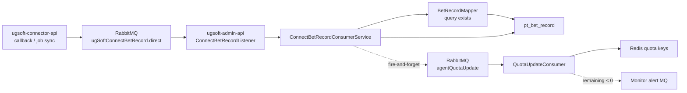
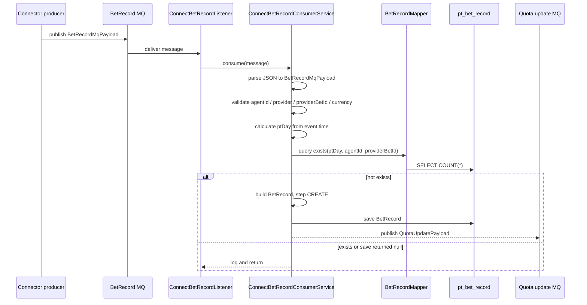

# connect-bet-record-mq-ingestion Step 5

## 閱讀定位

- Flow 中文名稱：Connector BetRecord MQ 入庫與 quota update
- Flow slug：`connect-bet-record-mq-ingestion`
- Project：`ugsoft-admin-api`
- Step：Step 5 / Claim gate
- 完成狀態：Step 3 主報告、Step 4 面試 case 與 Step 5 claim gate 已完成；本 flow 已形成 flow-level 閉環，但不代表整個 `ugsoft-admin-api` project 完整。
- 證據層級：`真實開發過 + code-backed`、`code-backed / 主管或團隊 context`、`分析素材 / 待確認` 混合。
- 本 flow 類型：RabbitMQ consumer / provider bet record ingestion / duplicate check / quota async supporting flow。
- 是否只確認到入口：否。已確認 listener、consumer service、MQ config、payload、mapper duplicate query、`pt_bet_record` entity、quota update publish 與 quota consumer context；未驗證 production broker ack / retry / DLQ 實際設定、DB schema migration、真實 incident / ticket。

這條 flow 是 `ugsoft-admin-api` 第一條代表 flow。它補的是 `ugsoft-connector-api` 把 provider callback 或 job sync 資料送到 BetRecord MQ 之後，admin-api 這一側如何 consume、查重、寫入正式 `pt_bet_record`，再 fire-and-forget 發 quota update。Nick / `10gt12nc` 的 direct evidence 集中在 BetRecord MQ 初版、job 多單修正、BetRecord / RequestLog MQ 合併與 currency default；2026-04 後 `arnold` 的 id 生成、duplicate 改查 `provider_bet_id`、amount normalization、quota monitoring 只能作 latest behavior / 主管 context，不當 Nick direct evidence。

## 白話導讀

這條 flow 可以想成：connector 那邊收到第三方 provider 的注單資料後，不直接在同一個 request 裡把所有 downstream 都做完，而是把注單資料丟進 RabbitMQ。`ugsoft-admin-api` 這邊有一個 consumer 專門收這個 queue，確認這筆 provider 注單還沒入庫，就寫進 `pt_bet_record`。

成功後，系統至少會得到一筆正式 bet record，後續報表、風控、quota 或人工查詢才有資料可以看。最新 code 也會在寫入成功後送一個 quota update message，但這是支援額度監控的後續非同步動作，不是 bet record 寫入的強交易邊界。

最直覺會壞的地方有三個：

1. MQ message 解析失敗或 payload 缺欄位，consumer 直接 skip。
2. duplicate check 和 DB unique boundary 不一致，可能重複或漏寫。
3. bet record 已經寫入，但 quota update publish 失敗，造成短暫或永久的 quota view 不一致。

## 初中階 Code 分層對照

| 分層 | Code / Table | 角色 |
| --- | --- | --- |
| MQ config | `RabbitMQConfig#connectBetRecordExchange / Queue / Binding` | 宣告 durable direct exchange、queue 與 routing key。 |
| MQ constants | `RabbitMq.BET_RECORD_EXCHANGE / ROUTING_KEY / QUEUE` | 定義 BetRecord MQ 名稱。 |
| Listener | `ConnectBetRecordListener#receive` | 監聽 `connectBetRecordQueue`，收到字串 message 後交給 service。 |
| Service / Business | `ConnectBetRecordConsumerService#consume` | parse payload、validate、查重、建立 `BetRecord`、save、publish quota update。 |
| Payload | `BetRecordMqPayload` / `BetRecordMqMessage` | MQ message 欄位 contract。 |
| Duplicate query | `BetRecordMapper#queryBetRecordExists` / `BetRecordMapper.xml` | 依 `pt_day + agent_id + provider_bet_id` 查是否已存在。 |
| Entity / table | `BetRecord` / `pt_bet_record` | 正式注單資料。entity unique constraint 顯示 boundary 包含 `pt_day, agent_id, provider, provider_bet_id, currency`。 |
| Repository | `BetRecordRepositoryNew#save` | 寫入 `BetRecord`。 |
| State constant | `BetRecordStep.CREATE` | 新建 provider bet record 的 step。 |
| 下游 MQ | `QuotaUpdatePayload` + `RabbitMq.QUOTA_UPDATE_*` | bet record 寫入後 fire-and-forget 發 quota update。 |
| Quota consumer | `QuotaUpdateConsumer` | 依 step / providerBetId 過濾，Redis idempotency 後更新 quota remaining，必要時發 monitor alert。 |
| Log / Audit | service log / listener error log | 記錄 received、duplicate、saved、quota publish failure。 |

## 最小架構圖



## 正常流程圖



## 正常流程逐步說明

### 1. Connector publish BetRecord MQ

上游來自 `ugsoft-connector-api`，可能是 provider callback bet-settle，也可能是 job-driven request bet record sync。兩條已完成的 connector flows 都會把資料收斂到同一條 BetRecord MQ。這次 Step 3 主要深挖 admin-api consumer，不重新驗證 connector producer 全細節。

### 2. Listener 收 RabbitMQ message

`ConnectBetRecordListener` 使用 `@RabbitListener(queues = "#{connectBetRecordQueue.name}")` 監聽 queue。收到 message 後只做薄薄一層 try / catch，主要邏輯交給 `ConnectBetRecordConsumerService#consume`。

目前 listener catch exception 後只 log，沒有重新 throw。這點會影響 RabbitMQ redelivery / retry 語意：如果 exception 被吃掉，broker 可能視為已處理。實際 ack mode / retry 設定未在本輪驗證。

### 3. Service parse payload 並做基本驗證

service 會把 message parse 成 `BetRecordMqPayload`。payload null 直接 skip。最新 code 會把 `providerBetId` fallback 到 `id`，currency fallback 到 `CNY`，event time fallback 到現在。

必要欄位包含：

- `agentId > 0`
- `provider` 非空
- `providerBetId` 非空
- `currency` 非空

缺任一條會 log warn 並 return，不寫 DB。

### 4. 用 event time 算 `ptDay`

`ptDay` 來自 message event time，而不是 consumer 當下時間。這是分表 / partition / 查重的重要邊界：provider 注單可能晚到，不能用 consume time 判斷應該查哪一天。

### 5. Duplicate check

最新 `origin/main` 用 `BetRecordMapper#queryBetRecordExists(ptDay, agentId, providerBetId)` 查 `pt_bet_record` 是否已有資料。

這裡要注意兩層 boundary：

- mapper 查重條件是 `pt_day + agent_id + provider_bet_id`。
- entity unique constraint 顯示更完整的 unique boundary 包含 `pt_day + agent_id + provider + provider_bet_id + currency`。

這代表 code-level duplicate check 和 entity-level unique boundary 不完全一樣。可能是刻意收斂成 provider bet id 全域唯一，也可能是待確認風險；Step 4 / Step 5 追問時不能直接說已完全解決所有 duplicate 問題。

### 6. 建立 `BetRecord`

不存在才建立 `BetRecord`：

- `id` 最新 code 用 `OrderPrefixUtil#createOrderId(agentId)` 產生。
- `providerBetId` 保留 provider 原始 bet id。
- amount 欄位會經過 provider normalization。
- `currency` default `CNY`。
- `step = BetRecordStep.CREATE`。
- `notifyCount = 0`、`notify = false`。

Nick direct evidence 覆蓋 BetRecord MQ 初版與 currency default。`id` 改用 bufferId / order id 與 amount normalization 是 `arnold` current behavior，不當 Nick direct evidence。

### 7. save 成功後 publish quota update

bet record save 成功後，service 建 `QuotaUpdatePayload` 並送 `agentQuotaUpdate` MQ。這段 try / catch 只 log warn，不回滾 bet record，也不阻擋主流程。

這是本 flow 的重要 owner decision：bet record 是主要落庫事實，quota update 是非同步衍生 view。好處是 bet record 寫入不被 quota 系統拖垮；代價是 quota update publish 失敗時，bet record 和 quota remaining 會不一致，需要靠補償 / 對帳 / 重送機制補上。

## 業務問題

第三方 provider 的 bet record 是報表、查詢、風控與額度監控的重要資料來源。callback path 或 job sync 拿到 provider 注單後，如果每個來源都自己寫 DB，會讓重複檢查、欄位 normalize、currency default、quota update 邊界散掉。

這條 flow 把下游入庫集中到 admin-api consumer：

- 上游只要送同一種 MQ payload。
- 下游統一決定 provider bet id、ptDay、currency、amount、step。
- quota update 用後續 MQ 解耦，不讓 quota 系統影響 bet record 寫入。

## 系統位置

`ugsoft-admin-api` 在這條 flow 裡不是單純後台查詢 API，而是 provider bet record 的 consumer / ingestion side。它位於：

```text
provider / connector callback or sync
-> ugSoftConnectBetRecord RabbitMQ
-> ugsoft-admin-api consumer
-> pt_bet_record
-> quota update / report / risk / admin query
```

它和 `ugsoft-connector-api request-bet-record-mq-sync`、`provider-callback-bet-settle-to-mq` 互補：connector 是 producer / normalize / publish，admin-api 是 consumer /入庫 /衍生 quota update。

## 資料狀態與 state transition

| 階段 | 狀態 | 說明 |
| --- | --- | --- |
| message received | MQ message 字串 | 尚未可信，可能 parse fail 或缺欄位。 |
| payload valid | `BetRecordMqPayload` | 已有 agentId / provider / providerBetId / currency。 |
| duplicate checked | exists / not exists | 依 `ptDay + agentId + providerBetId` 查正式表。 |
| saved | `pt_bet_record` 新增一筆 | `step=CREATE`、`notify=false`、`notifyCount=0`。 |
| quota publish attempted | `QuotaUpdatePayload` | fire-and-forget；成功與否不影響已寫入 bet record。 |
| quota consumer processed | Redis quota remaining 更新 | 這是 downstream supporting state，非本 flow 主交易事實。 |

## Transaction / consistency / idempotency

### Transaction boundary

本輪沒有看到 `ConnectBetRecordConsumerService#consume` 方法上有明確 transaction annotation。`BetRecordRepositoryNew#save` 本身標了 `@Transactional` / `@Modifying`，但實際 transaction scope 需看 repository implementation 與 Spring behavior。Step 3 不能宣稱「整個 consume + quota publish 在同一個 transaction」。

### Idempotency

主要 idempotency 來自 duplicate query 與 table unique boundary。message 重送時，如果第一次已寫入，第二次應該查到 exists 後 return。

但要保守標示：

- duplicate query 與 unique constraint 欄位不完全一致。
- 查後寫之間若高併發，同一 providerBetId 可能仍需 DB unique constraint 擋。
- listener catch exception 不重拋可能讓 redelivery 語意不清。

### Consistency

bet record 與 quota update 是 eventual consistency。最重要 failure window 是：

1. bet record save 成功。
2. quota update publish 失敗。
3. consumer catch log 後 return。
4. `pt_bet_record` 已有資料，但 quota remaining 沒更新。

這不是不能接受，但 owner 要知道這需要補償策略，例如 retry publish、outbox、quota rebuild job、依 bet record 重算 quota 或人工 repair。

## Failure windows

| Failure | 目前 code 行為 | 風險 | 面試可講 owner 補強 |
| --- | --- | --- | --- |
| JSON parse fail | outer listener catch 或 service payload null skip | message 可能被視為處理完成，資料遺失 | poison message / DLQ / invalid payload metric |
| 必要欄位缺失 | log warn and return | provider data 丟失，只能靠上游補送或人工查 | invalid payload dashboard / producer contract check |
| duplicate query DB fail | listener catch exception | 若 exception 被吃掉，可能不重送 | 明確 ack / retry policy |
| 查重後 save 發生 race | 依 DB unique constraint 防線 | duplicate / constraint exception 需要處理 | unique key + catch duplicate as idempotent success |
| save 成功但 quota publish fail | log warn，不回滾 | quota view 落後或不一致 | outbox / retry / quota rebuild |
| quota consumer fail | `QuotaUpdateConsumer` rethrow，理論上觸發 retry / DLQ | quota update 延遲 | DLQ replay / idempotency key / alert |
| amount normalization 錯 | 最新 code 依 provider 做 normalization | 報表 / quota 金額錯 | provider contract tests / unit tests |

## Senior / Owner 設計取捨

### 1. MQ decoupling 是合理方向

provider callback / sync 不直接同步寫完所有 downstream，可以降低 provider request latency，也讓 callback flow 和 job sync flow 共用同一個 consumer。但 MQ decoupling 必須配套 retry / DLQ / idempotency / observability，否則只是把失敗延後。

### 2. BetRecord 是主事實，quota 是衍生 view

這條 flow 的主成功定義應該是 `pt_bet_record` 正確入庫。quota update 是衍生狀態，失敗時不回滾 bet record 是可理解的 trade-off。面試時要講清楚：我不會把 quota update 當成和 bet record 同 transaction 的強一致資料。

### 3. Duplicate boundary 要和上下游對齊

connector sync flow 用 `providerBetId|currency` 去重，下游 consumer 最新查 `ptDay + agentId + providerBetId`，entity unique 邊界又包含 provider / currency。這幾個 boundary 要對齊，否則可能同一 provider bet id 的不同 currency / provider 被誤判或漏判。

### 4. `ptDay` 是 late data 正確性的核心

event time 算 `ptDay` 比 consume time 更適合 provider late data。這也是可面試的重點：跨日資料補抓最容易錯在查錯 partition / table。

### 5. 不要誇大成 exactly-once

目前 evidence 支撐 at-least-once-ish consumer + duplicate check + DB unique constraint + downstream quota idempotency。沒有看到完整 outbox、publisher confirm、全鏈路 replay dashboard，不能講 exactly-once。

## 面試 / 履歷邊界摘要

可面試講：

- UGSoft connector 會把 provider callback / job sync 的 bet record 收斂到 RabbitMQ。
- admin-api consumer 解析 payload、依 event time 算 `ptDay`、做 duplicate check、寫 `pt_bet_record`。
- 寫入後 fire-and-forget 發 quota update，讓 quota 系統和 bet record 入庫解耦。
- 可主動指出 duplicate boundary、quota publish failure、listener ack / retry、amount normalization 與 outbox / DLQ 補強方向。

可保守作 project-level 素材：

- 參與 UGSoft 後台 API / control plane 中 RabbitMQ bet record 非同步入庫、重複檢查、currency default 與 quota supporting flow 的開發 / 維護。

不可誇大：

- 不說完整 wallet / ledger / quota owner。
- 不說 exactly-once / outbox / DLQ / replay 已完整落地。
- 不把 `arnold` 的 quota monitoring、id 生成、amount normalization 說成 Nick direct evidence。
- 不說完整 provider connector / gateway owner；那是 `ugsoft-connector-api` 的 project-level claim 另外收斂。

## Step 5 Claim Gate 結論

本 flow 可作 `ugsoft-admin-api` project-level 「RabbitMQ bet record 非同步入庫 / 後台非同步資料處理」的強 supporting evidence。

可放履歷的層級是：參與 UGSoft 後台 API / control plane 中 RabbitMQ bet record 非同步入庫與資料處理維護，包含 BetRecord MQ 初版、consumer 調整、mapper 查重與 currency default。這句仍應放在 project-level consolidation 的大句裡，不單獨寫成完整 RabbitMQ / quota / provider gateway owner。

可面試講的層級是：provider callback / job sync 送 MQ 後，admin-api consumer 如何 parse payload、用 event time 算 `ptDay`、做 duplicate check、寫 `pt_bet_record`，以及 save 後 fire-and-forget 發 quota update 帶來的 eventual consistency / failure window。可以講 outbox、publisher confirm、DLQ replay、quota rebuild 是 owner 補強方向。

不可誇大：不能說主導完整 quota monitoring、完整 wallet / ledger / reconciliation、完整 exactly-once / outbox / DLQ 平台、完整 provider gateway，且不能把 `arnold` 的 quota monitoring、id 生成、amount normalization 當 Nick direct evidence。

## 下一步

本 flow 已完成 Step 5。後續第二條代表 flow `request-log-rabbitmq-admin-consumer Step 5` 也已完成，第三條代表 flow `game-api-provider-white-ip-control-plane Step 3` 已完成；若繼續 `ugsoft-admin-api` Flow Track，下一步應做同 flow Step 4；不要跳到 project contribution final，也不要把單條 flow Step 5 當成整個 project 完整。
