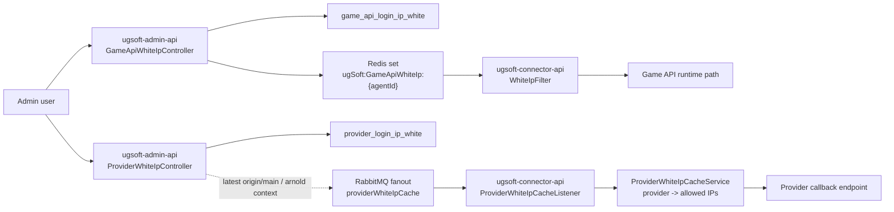
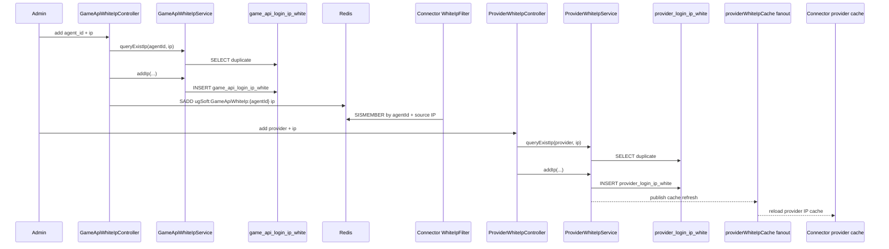

# game-api-provider-white-ip-control-plane Step 3

日期: 2026-05-27

## 閱讀定位

- Flow 中文名稱: Game API / provider white IP 後台控制面
- Flow slug: `game-api-provider-white-ip-control-plane`
- Project: `ugsoft-admin-api`
- Step: Step 3 / Flow learning package
- 完成狀態: 已建立 Step 3 主報告、code 分層、正常流程、主要 failure window 與初步 claim boundary；尚未整理正式 Step 4 面試稿，也尚未做 Step 5 claim gate。
- 證據層級: `真實開發過 + code-backed`、`code-backed / 下游 context`、`主管或團隊 context` 混合。
- 本 flow 類型: 後台 control plane / runtime access-control 設定 / DB + Redis + RabbitMQ fanout cache reload。
- 是否只確認到入口: 否。已確認 admin controller、service、mapper、Redis key、operation log、provider fanout publish，以及 connector 端 Game API white IP filter / Provider White IP cache reload / callback IP check context；未驗證 production DB DDL、實際 RabbitMQ broker、admin-web 入口與真實 incident。

這條 flow 是 `ugsoft-admin-api` 本批第三條代表 flow。它補的是後台控制面如何影響 runtime access control：Game API 白名單由後台寫 DB 並同步 Redis set，connector runtime filter 依 `agentId` + source IP 判斷是否放行；Provider 白名單由後台維護 DB，最新 `origin/main` 會 publish fanout 通知 connector-api 重新載入 in-memory provider IP cache。

Nick / `10gt12nc` direct evidence 主要是:

- `f90a1eb`、`6cf3855`、`4c86d96`、`1dd366c`: Game API white IP 後台功能、Redis add / remove、agentId 前端必傳與狀態修正。
- `2fb2ce5`: Provider white IP 後台表與 CRUD 初版。

`arnold` 後續 `caf9fe7` fanout reload 與 `30fff32` provider white IP 全站共用是 current behavior / 主管 context，不能當 Nick direct evidence。

## 白話導讀

這條 flow 可以想成「後台改一筆 IP 白名單，runtime API 要立刻或準即時知道誰能打進來」。

Game API 白名單比較像商戶 / agent 維度的入口控制。後台新增某 agent 的 IP 時，資料會寫進 `game_api_login_ip_white`，也會同步放進 Redis set `ugSoft:GameApiWhiteIp:{agentId}`。connector-api 的 `WhiteIpFilter` 在 `/auth/login/*`、`/api/public`、`/api/connect/client` 這類受限路徑上，會從 request 取得 `agentId`，再看來源 IP 是否在 Redis set 裡。

Provider 白名單比較像第三方 provider callback 的入口控制。Nick 初版是 `agent_id + provider + ip` 維度；最新 `origin/main` 由 `arnold` 改成 provider 全站共用，後台新增 / 刪除後會 publish fanout message，connector-api 收到後重新從 `provider_login_ip_white` 載入 provider -> allowed IP set，callback endpoint 再用 provider + source IP 判斷是否放行。

這條 flow 的 Senior 價值不在 CRUD，而在 control plane 的一致性與風險:

- 後台 DB 寫成功但 Redis / fanout 失敗，runtime 是否仍是舊白名單。
- Redis 先改、DB 後改或反過來時，partial failure 會留下哪種錯誤狀態。
- provider 白名單從 agent-scoped 改成全站共用，是 access-control scope 的 owner decision。
- 操作權限、操作紀錄、limited admin gate 要避免一般後台帳號誤改 runtime access。

## Code 分層對照

| 分層 | Code / Table / Key | 角色 |
| --- | --- | --- |
| Game API admin route | `GameApiWhiteIpController` | `/game_api_white_ip/add`、`getList`、`delete`、`sync_ss00172r001` 後台入口 |
| Game API service | `GameApiWhiteIpServiceImpl` | DB CRUD、`WhitelistSync` 多 agent 同步、Redis set 更新由 controller / service 協作 |
| Game API mapper | `GameApiWhiteIpMapper.xml` | `game_api_login_ip_white` insert / delete / duplicate query / list |
| Game API Redis | `RedisKey.GAME_API_WHITE_IP` | Redis set key prefix: `ugSoft:GameApiWhiteIp:{agentId}` |
| Game API runtime context | `ugsoft-connector-api WhiteIpFilter` | 受限 API path 依 `agentId` + source IP 查 Redis set |
| Provider admin route | `ProviderWhiteIpController` | `/provider_white_ip/add_white_ip`、`get_white_ip`、`delete_white_ip` |
| Provider service | `ProviderWhiteIpServiceImpl` | DB CRUD；latest `origin/main` add / delete 後 publish provider cache refresh |
| Provider mapper | `ProviderWhiteIpMapper.xml` | `provider_login_ip_white` insert / delete / duplicate query / list |
| Provider RabbitMQ context | `RabbitMq.PROVIDER_WHITE_IP_CACHE_EXCHANGE` | latest `origin/main` publish `providerWhiteIpCache.fanout` |
| Provider runtime context | `ugsoft-connector-api ProviderWhiteIpCacheListener / ProviderWhiteIpCacheService` | fanout listener reload provider -> IP cache；callback controller 檢查來源 IP |
| 權限與 audit | `@RoleFilter`、`AdminAuthService#isLimitedAdmin`、`AdminOperationLogService` | 控制誰能改白名單，紀錄新增 / 刪除操作 |

## 最小架構圖

## 正常流程圖

## 正常流程逐步說明

### 1. Game API 白名單新增

後台呼叫 `/game_api_white_ip/add`，角色限制是 admin / super agent / level one agent，且 controller 會檢查 `adminAuthService.isLimitedAdmin()`。輸入包含 `agent_id`、`ip`、`desc`。

controller 先判斷 IP 是否空，再用 `gameApiWhiteIpService.queryExistIp(agentId, ip)` 查 `game_api_login_ip_white` 是否已存在同 agent + IP。不存在才 insert DB，接著把 IP 加到 Redis set `RedisKey.GAME_API_WHITE_IP + agentId`。成功時會寫 admin operation log。

### 2. Game API 白名單查詢

`/game_api_white_ip/getList` 會從 JWT auth details 取得目前使用者的 role type 與 agentId，再交給 `AgentRoleUtil#processAgentIds` 決定可查範圍。若結果是 all，查全部；若是 success_list，查 relative agent IDs；否則回空。

這不是單純列表查詢，因為白名單本身會影響 runtime access-control，所以後台查詢範圍必須和角色 / agent hierarchy 一致。

### 3. Game API 白名單刪除

`/game_api_white_ip/delete` 會先用 `getIpById(ipId)` 找出 IP，再 delete DB，並從 Redis set 移除同一個 IP。成功時寫 admin operation log。

這裡的風險是 DB delete 和 Redis remove 不在同一個 transaction。若 DB 成功但 Redis remove 失敗，runtime 可能還放行舊 IP；若 Redis 先被移除但 DB 仍存在，下一次重建 cache 時可能又回來。

### 4. Game API 白名單 runtime enforcement

下游 `ugsoft-connector-api` 的 `WhiteIpFilter` 會對 `/auth/login/*`、`/api/public`、`/api/connect/client` 等 path 做白名單檢查。它從 query string 或 request body 取 `agentId`，用 source IP 組合 Redis key 查 `SISMEMBER`。非 dev 環境未命中會拒絕。

這段是下游 code-backed context；它證明 admin-api 寫 Redis 不是純後台資料，而是會直接影響 runtime path 的 access-control。

### 5. Provider 白名單新增 / 刪除

Nick / `10gt12nc` 在 `2fb2ce5` 建立 provider white IP 表與後台 CRUD。初版是 `agent_id + provider + ip` 維度，後續 `arnold` 在 `30fff32` 改成 provider 全站共用，移除 agentId。latest `origin/main` 的 duplicate key 是 `provider + ip`，並限制 provider 只能是 allowed set。

latest `origin/main` 的 `ProviderWhiteIpServiceImpl` 在 add / delete 後會呼叫 `notifyConnectorRefresh`，publish 到 `providerWhiteIpCache.fanout`。這是 `arnold` current behavior context，不是 Nick direct evidence。

### 6. Provider 白名單 runtime reload

下游 `ugsoft-connector-api origin/master` 有 `ProviderWhiteIpCacheListener` 監聽 anonymous queue；收到 fanout 後呼叫 `ProviderWhiteIpCache#init()`，再透過 `ProviderWhiteIpCacheService#refresh` 從 `provider_login_ip_white` 載入 provider -> allowed IP set。

callback endpoint 例如 `ConnectCallbackController` 會以 provider + client IP 呼叫 `providerWhiteIpCacheService.isAllowed(...)`。未命中時回傳 provider white IP 錯誤。這段只作下游 context，不把 connector callback owner 寫成 admin-api flow owner。

## Senior / Owner 深度

### Source of truth

| 資料 | Source of truth | Runtime cache |
| --- | --- | --- |
| Game API white IP | `game_api_login_ip_white` | Redis set `ugSoft:GameApiWhiteIp:{agentId}` |
| Provider white IP | `provider_login_ip_white` | connector-api in-memory `provider -> Set<ip>`，由 fanout reload |
| 後台操作 | admin operation log | 無，用於 audit |

Game API 的 runtime cache 是 Redis，Provider 的 runtime cache 最新行為是 connector in-memory cache。這兩者 failure policy 不一樣，面試時要分開講。

### Transaction boundary

Game API 新增 / 刪除是 DB operation + Redis operation 的組合。controller 沒有把 DB + Redis 包成同一個 transaction；Redis 也不能跟 DB transaction 原子提交。因此 consistency 是 eventual / best-effort。

Provider 最新行為是 DB operation + RabbitMQ fanout publish。publish 失敗只 log error，不回滾 DB。這代表 DB 已更新但 connector runtime cache 可能還沒 reload，要靠下一次 reload、job init、人工操作或重新部署恢復。

### Idempotency / duplicate

Game API duplicate check 是 `agent_id + ip`。Provider latest duplicate check 是 `provider + ip`。兩者都是先查再 insert；若 DB 沒有 unique constraint，並發新增同一筆仍有 race window。本輪未驗證 DDL，所以不能宣稱完全防重。

### Failure window

| Window | 可能結果 | Owner 判斷 |
| --- | --- | --- |
| Game API DB insert 成功、Redis SADD 失敗 | 後台看到已新增，但 runtime filter 仍拒絕 | 需要 retry / rebuild Redis / admin repair |
| Game API DB delete 成功、Redis SREM 失敗 | 後台刪了，但 runtime 仍放行舊 IP | 這是 access-control 風險，應有告警或 rebuild |
| WhitelistSync 中途失敗 | 部分 agents DB / Redis 已同步，部分未同步 | 需要標示批次同步結果；目前是 transaction + Redis 混合，仍有非 DB side effect |
| Provider DB insert 成功、fanout publish 失敗 | DB 已有新 IP，但 connector cache 未刷新 | callback 可能持續拒絕新 IP |
| Provider fanout 成功、單一 connector reload 失敗 | 部分節點 cache stale | fanout + anonymous queue 是節點級更新，需監控 reload log |
| Provider cache reload 查 DB 失敗 | connector 保留舊 cache | 需要 lastRefresh / metric / manual reload |
| role / limited admin gate 配錯 | 不該改的人能改 runtime access | 需要 RoleFilter、limited admin 與 operation log 對齊 |

### Owner decision

1. Game API 白名單用 Redis set 是為了讓 runtime filter 快速判斷，不每次查 DB。
2. Provider 白名單 latest 改成全站共用，是 access-control scope 的重大決策；不能把舊 agent-scoped 和新 global scoped 混著講。
3. DB 是設定 source of truth，Redis / in-memory cache 是 runtime view；兩者不一致時要知道哪邊可以重建。
4. DB + Redis / RabbitMQ fanout 不是原子交易，面試要主動承認 eventual consistency 和 partial failure。
5. 這是 control plane，不是 money flow；重點是 runtime access boundary、cache freshness、權限與 audit。

## 履歷 / 面試邊界摘要

可保守說:

- 參與 UGSoft 後台 Game API / provider IP 白名單控制面開發維護，處理後台 CRUD、DB / Redis 同步、權限範圍與操作紀錄。
- 可用這條 case 說明後台 control plane 如何影響 runtime API access control，以及 cache 不一致的 failure window。

只能作 code-backed / 下游 context:

- connector-api 的 Game API `WhiteIpFilter`。
- connector-api Provider White IP fanout listener、in-memory cache reload 與 callback IP check。

不可誇大:

- 不說主導完整 access-control platform。
- 不說完整 connector reload owner。
- 不把 `arnold` 的 provider fanout reload、全站共用 scope refactor 當 Nick direct evidence。
- 不說 DB / Redis / RabbitMQ cache consistency 已完整強一致。

## Step 3 結論

`game-api-provider-white-ip-control-plane` Step 3 已完成。這條 flow 補上 `ugsoft-admin-api` 的 control-plane 視角: 後台設定不是只存在 DB，而是會透過 Redis / fanout / connector cache 影響 runtime access-control。

下一步若繼續本 flow，應做 Step 4，把這條轉成正式面試 case，重點放在:

- control plane -> runtime enforcement。
- DB / Redis / RabbitMQ fanout 的一致性邊界。
- provider white IP 從 agent-scoped 到 global-scoped 的 scope decision。
- Nick direct evidence 與 `arnold` current behavior 的界線。
