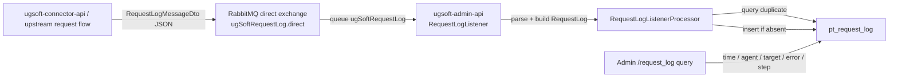
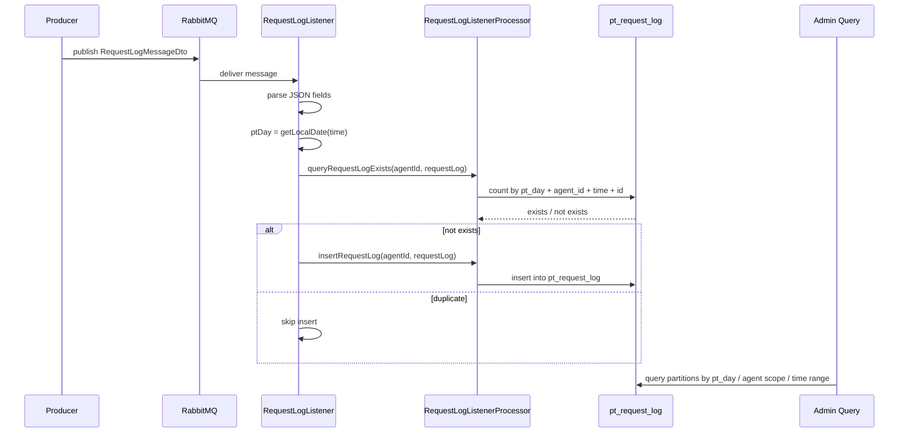

# request-log-rabbitmq-admin-consumer Step 5

日期: 2026-05-27

## 閱讀定位

這條 flow 是 `ugsoft-admin-api` 的第二條代表 flow，主題是 RequestLog 從同步寫入改為 RabbitMQ 非同步入庫後，後台 consumer 如何把 request / response log 寫入 `pt_request_log`，再供 admin `/request_log` 查詢。

目前完成到 Step 5: 已建立 flow learning package、code 分層、正常流程、主要 failure window、正式面試稿與單條 flow claim gate。本 flow 可作 `ugsoft-admin-api` project-level 「RabbitMQ / request log 非同步資料處理」的 supporting evidence，但不直接回填 `05 / 08`；履歷 master 仍要等 project contribution refresh 或 rolling resume package 統一處理。

Evidence 層級:

| 類別 | 判斷 |
| --- | --- |
| Nick / `10gt12nc` direct evidence | `814b024`、`f3a9d72`、`5f838f8`、`821bc2e` 顯示 Nick 參與 RequestLog RabbitMQ 非同步化、listener / mapper / processor 調整 |
| code-backed | `RequestLogListener`、`RequestLogListenerProcessor`、`RequestLogMapper.xml`、`RequestLogController`、`RequestLogsService` 已在 `ugsoft-admin-api origin/main` 檢視 |
| upstream context | `ugsoft-connector-api` 的 `AgentApiFacade` / `ConnectorUtil` 會 publish RequestLog message；本輪只作 producer context，不把 connector 端寫成 admin-api 完整 owner |
| supervisor / team context | `arnold` 後續 request-log key 格式與查詢修正只作 current behavior context，不當 Nick direct evidence |

## 白話導讀

RequestLog 是 provider / connector 請求與回應的稽核紀錄，包含 request id、agent、step、target、URI、method、headers、params、body、response、status、error message、elapsed time。

原本如果請求流程直接同步寫 DB，log DB 慢、分表錯、DB 瞬斷，都可能拖慢主流程。這條 flow 的設計是：上游處理完請求後，把 RequestLog payload 丟到 RabbitMQ；`ugsoft-admin-api` consumer 再非同步寫入 `pt_request_log`。後台查詢時，再依 agent、時間區間、`pt_day` 分區、target、error / step 條件查回紀錄。

這條 flow 的 Senior 價值不在「多一張 log 表」，而在幾個 production 判斷:

- async logging 不能反過來拖垮主請求。
- message duplicate 要能保守防止重複入庫。
- `ptDay` / partition / time range 錯了，後台會查不到或查錯資料。
- consumer 吃掉 exception 後，RabbitMQ ack / retry / DLQ 行為要非常小心確認。
- request / response body 進 DB，有資料長度、敏感資訊與查詢成本風險。

## Code 分層對照

| Layer | Code | 角色 |
| --- | --- | --- |
| MQ config | `src/main/java/com/ps/domain/admin/config/RabbitMQConfig.java`、`RabbitMq.java` | 建立 `ugSoftRequestLog.direct` direct exchange、queue、routing key binding |
| Consumer entry | `src/main/java/com/ps/domain/admin/rabbitMq/RequestLogListener.java` | `@RabbitListener` 收 message，parse JSON，組 `RequestLog` entity，查重後 insert |
| Consumer processor | `src/main/java/com/ps/domain/admin/rabbitMq/RequestLogListenerProcessor.java` | 用 `@UseSchema` 走 default schema，查重與 `@Transactional` insert |
| Payload DTO | `src/main/java/com/ps/domain/admin/rabbitMq/requestLog/RequestLogMqPayload.java` | RequestLog MQ payload 結構存在；目前 listener 最新行為仍是手動 parse JSON |
| Entity | `src/main/java/com/ps/domain/manage/data/entity/RequestLog.java` | request log 資料模型，含 `id`、`time`、`ptDay`、`agentId`、request / response 欄位 |
| Mapper | `src/main/java/com/ps/domain/admin/mapper/RequestLogMapper.java`、`RequestLogMapper.xml` | duplicate check、insert、admin list / count 查詢 |
| Admin query | `RequestLogController.java`、`RequestLogsService.java` | 後台 `/request_log` 依角色 / agent scope、時間區間、`ptDays` 查詢 |
| Upstream producer context | `ugsoft-connector-api` 的 `AgentApiFacade`、`ConnectorUtil` | 上游 publish RequestLog message 到相同 exchange / routing key；本輪只作上下游 context |

## 最小架構圖



## 正常流程圖



## 正常流程逐步說明

1. 上游 request flow 建立 RequestLog payload，包含 request / response / status / elapsedTime 等欄位。
2. producer 透過 `RabbitTemplate.convertAndSend(RabbitMq.REQUEST_LOG_EXCHANGE, RabbitMq.REQUEST_LOG_ROUTING_KEY, message)` 發到 RabbitMQ。
3. `RequestLogListener` 監聽 `RabbitMq.REQUEST_LOG_QUEUE_KEY`，收到 message 後用 JSON parse 出各欄位。
4. listener 依 message 裡的 `time` 算出 `ptDay`，避免入庫時只靠當下 consumer 時間。
5. listener 建立 `RequestLog` entity，呼叫 processor 查重。
6. `queryRequestLogExists` 以 `pt_day + agent_id + time + id` 查 `pt_request_log` 是否已存在。
7. 若不存在，listener 呼叫 `insertRequestLog`；processor 用 `@Transactional` 包住 insert。
8. 後台查詢 `/request_log` 時，controller 依登入角色決定可看的 agent 範圍，限制查詢時間最多 7 天，service 建出 `RequestLogPartitionKey(ptDay, agentId)`，mapper 查 list / count。

## Senior / Owner 深度

### State 與資料邊界

| 狀態 | 來源 | 風險 |
| --- | --- | --- |
| request 已完成 | upstream producer | 若 producer send 失敗，主流程是否要失敗要看 upstream 設計；admin consumer 看不到這段 |
| MQ message 已送出 | RabbitMQ | message durable / confirm / return callback 未在本輪完整驗證 |
| message 被 consumer 取到 | `RequestLogListener` | parse 失敗會進 catch；目前 listener catch exception 後只 log，不 rethrow |
| entity 建立 | listener | `time`、`agentId`、`id`、body 欄位缺失會影響 `ptDay` / duplicate / insert |
| duplicate check | mapper | check + insert 分兩次呼叫，不是嚴格 atomic；需靠 DB unique / PK 或接受 race 風險 |
| insert 成功 | `pt_request_log` | insert transaction 只包 insert method；query 與 insert 之間仍可能有並發窗口 |
| admin 可查 | controller / service / mapper | partition key、role scope、time window、list / count 條件要一致 |

### Transaction Boundary

目前 latest code 的 transaction 位置在 `RequestLogListenerProcessor.insertRequestLog`，也就是 insert method 本身有 `@Transactional`。`queryRequestLogExists` 與 `insertRequestLog` 是 listener 分開呼叫，因此它能降低「insert 內部半套寫入」問題，但不能保證「查重 + insert」是一個不可切開的 exactly-once transaction。

面試時要講成:

- 這是 at-least-once consumer 常見的保守 dedupe 寫法。
- 若 RabbitMQ redelivery 或 producer retry 導致重複 message，duplicate check 可避免多數重複入庫。
- 若兩個相同 message 並發通過 duplicate check，仍需要 DB unique / PK 約束兜底；本輪未驗證實際 DDL，所以不能宣稱完全防 race。

### Idempotency / Duplicate

duplicate key 目前以:

```text
pt_day + agent_id + time + id
```

查 `pt_request_log` count。這個 key 的語意是「同一 agent、同一 request id、同一 request time、同一天分區」只保留一筆。

風險:

- 如果 `id` 產生策略不穩，duplicate check 會失效。
- 如果 `time` 在 producer / consumer 語意不一致，可能同一 request 被視為不同資料。
- 如果 `ptDay` 用錯時區或錯用 consumer 當下時間，會查不到舊分區。
- 如果 DB 沒有唯一約束，check-then-insert 仍可能 race。

### MQ Ack / Retry / Poison Message

`RequestLogListener` catch all `Exception` 並 log error，目前本輪沒有驗證 Spring AMQP listener container 的 ack mode、retry interceptor、DLQ 設定。保守結論:

- 不能說這條 flow 已有完整 DLQ / replay。
- 不能說 parse failure 一定 redelivery。
- 若 ack mode 是 auto 且 exception 被吃掉，錯誤 message 可能被視為已處理，造成 log loss。
- 若 rethrow 才會觸發 retry / DLQ，那目前 catch-and-log 會讓 retry 語意變弱。

這是 Step 4 / Step 5 面試時很值得主動講的 owner decision: audit log 可以接受部分 loss 嗎？如果不能，就要補 retry / DLQ / poison message observable。

### Admin Query Consistency

目前 `RequestLogController` 會限制查詢時間最多 7 天，並依 role / agent hierarchy 建出可查 agent 範圍。`RequestLogsService` 再把 `ptDays x agentIds` 組成 partition keys。

current behavior context 有一個要注意的點: `arnold` 後續修正加入 `step` filter；本輪檢視 latest XML 時，count query 可見 `step` 條件，但 list query 片段未看到同等 `step` 條件。這只能先標成「current behavior 疑點」，不能當成 Nick direct evidence，也不能在沒有完整驗證前宣稱 production bug。

## Failure Window

| Window | 可能結果 | Owner 判斷 |
| --- | --- | --- |
| producer publish 失敗 | request log 沒進 MQ | upstream 要決定 log publish 失敗是否影響主請求；admin consumer 無法補 |
| message JSON parse 失敗 | listener catch error | 需確認 ack / retry / DLQ；目前不能宣稱可靠重試 |
| `time` 缺失或格式錯 | `ptDay` 計算失敗或入錯分區 | producer contract 要固定；consumer 可補 validation / metric |
| duplicate check 後 insert 前並發 | 可能重複 insert 或 DB error | 需 DB unique / PK 兜底；本輪 DDL 未驗證 |
| insert DB 失敗 | log 未落地 | 需確認 exception 是否 rethrow；目前 catch-and-log 可能降低 redelivery |
| body / header 過大 | 欄位截斷或 DB 寫入失敗 | producer 有截斷 context，但 consumer 自身仍要信任 payload |
| list / count 條件不一致 | 後台頁數與資料不一致 | current behavior 疑點，Step 4 可整理成追問 |

## Owner Decision

這條 flow 面試時可以抓住 5 個 owner decision:

1. 為什麼 request log 要非同步化: 降低主請求被 log DB / 分表 / 查詢寫入拖慢。
2. RequestLog 是 audit / observability 資料，不是 money source of truth；因此 failure policy 可以和 bet settle / wallet 不同。
3. Dedupe key 要從 request id / event time / agent / partition 一起看，不能只靠一個 id。
4. catch exception 是否吞掉 redelivery，是 MQ consumer 的高風險設計點，要確認 ack / retry / DLQ。
5. 後台查詢不是單純 select，還要處理 role scope、time window、partition key、list / count 條件一致。

## 履歷 / 面試邊界

可保守說:

- 參與 UGSoft RequestLog RabbitMQ 非同步入庫 flow，處理 consumer parse、`ptDay` 分區、duplicate check、DB insert 與後台查詢支援。
- 熟悉 request / response audit log 非同步化後的 retry、idempotency、partition、observability 與查詢一致性風險。

可面試講:

- 為什麼 logging 類資料適合從同步 DB write 改成 MQ async。
- check-then-insert 為什麼不是完整 exactly-once，DB unique / DLQ / metric 要怎麼補。
- request log 和 bet record / wallet 類 money correctness 的 failure policy 不同。

不可誇大:

- 不說主導完整 RabbitMQ platform。
- 不說已完成 exactly-once / outbox / DLQ / replay。
- 不說這條 flow 是完整 money / wallet correctness。
- 不把 `arnold` commits 當 Nick direct evidence。

## Step 5 結論

`request-log-rabbitmq-admin-consumer` Step 5 已完成。這條 flow 能補 `ugsoft-admin-api` 的 async audit / observability / admin query case，和已完成的 `connect-bet-record-mq-ingestion` 形成「交易資料 MQ 入庫」與「request log MQ 入庫」兩種不同 failure policy 的對照。

Claim gate 結論:

- 可放履歷: 可作 `ugsoft-admin-api` project-level RabbitMQ / request log 非同步資料處理 supporting evidence，採「參與」口徑。
- 可面試講: async audit log、idempotency、`ptDay` partition、catch-and-log 對 retry / DLQ 的風險、admin query consistency。
- 不直接更新 `05 / 08`: 單條 flow Step 5 不代表 project-level final consolidation；等 `ugsoft-admin-api` contribution refresh 或 rolling resume package 再統一回填。
- 不可誇大: 不說完整 RabbitMQ platform、exactly-once、DLQ / replay / outbox、完整 provider connector 或 money correctness owner。

後續第三條代表 flow `game-api-provider-white-ip-control-plane Step 5` 已完成。`ugsoft-admin-api` 本批三條代表 flows 均已 Step 5，project-level contribution claim consolidation refresh 也已完成。
