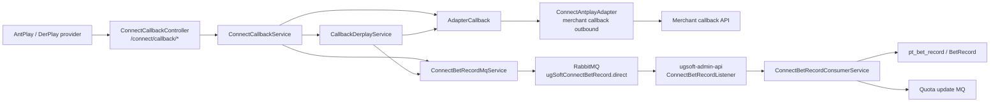
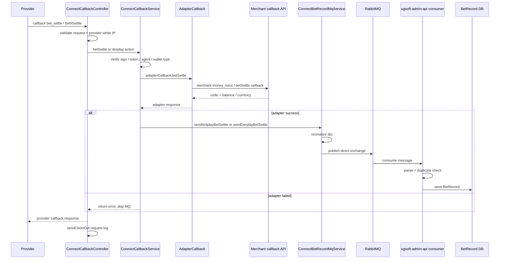

# provider-callback-bet-settle-to-mq Step 3 / Step 4 / Step 5

## 閱讀定位

- Flow 中文名稱：Provider callback 下注結算到 MQ 入庫
- Flow slug：`provider-callback-bet-settle-to-mq`
- Project：`ugsoft-connector-api`
- Step：Step 5 / 單條 flow claim gate
- 完成狀態：Step 3 主學習包、Step 4 面試 case、Step 5 claim gate 已完成；這不代表整個 `ugsoft-connector-api` final consolidation 已完成。
- 證據層級：`真實開發過 + code-backed`、`code-backed / 主管或團隊 context`、`分析素材 / 待確認` 混合。
- 本 flow 類型：provider callback / bet-settle / MQ eventual consistency / downstream bet record persistence。
- 是否只確認到入口：否。已確認 connector callback 入口、service、adapter callback、MQ producer、RabbitMQ exchange / queue，以及 `ugsoft-admin-api` 下游 consumer；未驗證 production 部署 branch、實際 incident / ticket 或完整 DLQ / retry 策略。

本 flow 是 `ugsoft-connector-api` 第二條代表 flow。第一條 `transfer-wallet-in-out-query` 已完成 Step 5；這條補的是 provider callback / bet-settle / MQ 非同步落地能力。Nick / `10gt12nc` 的 direct evidence 主要落在 callback 後寫 MQ、ConnectBetRecordMqService、DerPlay / AntPlay bet record MQ、admin-api consumer 初版與 currency / pt_day 修正。最新 IP whitelist、subAgent 改寫、amount scaling、error code propagation 多為 `arnold` / 團隊 context；Nick 已確認 `arnold` 是主管帳號，不得當成 Nick direct evidence。

## 白話導讀

這條 flow 可以想成：第三方遊戲 provider 打回 UGSoft connector，通知「這個玩家一局遊戲已下注並結算」。connector 不直接在 callback request 裡做完整注單入庫，而是先把 provider callback 正規化成一個 `ConnectBetRecordMqDto`，再送到 RabbitMQ。後續由 `ugsoft-admin-api` 的 consumer 把 MQ payload 寫入 `BetRecord`，並再觸發 quota update。

正常情境大概是：

1. AntPlay 或 DerPlay 打 callback 到 `/connect/callback/*`。
2. Controller 先做 request validation、provider IP 白名單檢查，最後一定寫 callback request log。
3. Service 驗簽、檢查 agent / wallet type。
4. Service 透過 `AdapterCallback` 呼叫商戶側 info / balance / betSettle API，確認商戶端處理成功。
5. 只有 adapter response code 成功時，connector 才把 bet-settle payload 轉成 MQ DTO。
6. `ConnectBetRecordMqService` publish 到 `ugSoftConnectBetRecord.direct`。
7. `ugsoft-admin-api` 的 `ConnectBetRecordListener` consume 同一個 queue，做重複檢查、寫 `BetRecord`，再 fire-and-forget 發 quota update。

成功後，至少會留下三種資料：

- callback request / response log：知道 provider 何時打進來、connector 回了什麼。
- MQ message：把 provider callback 正規化成統一 bet record payload。
- admin-api bet record：下游 consumer 寫入正式注單資料，並用 provider bet id / currency 等欄位防重。

最直覺會壞的地方是：callback 重送造成重複 MQ、adapter 成功但 MQ publish 失敗、MQ consumer 寫入失敗、amount / currency 單位轉錯、DerPlay / AntPlay payload 欄位不一致、下游 duplicate key 判斷和 connector producer 的 key 不一致。

## 初中階 Code 分層對照

| 分層 | Code / Table | 角色 |
| --- | --- | --- |
| Route / Controller | `ConnectCallbackController#/connect/callback/antplay/info/{connectorAgentId}` | AntPlay 查玩家資訊 callback。 |
| Route / Controller | `ConnectCallbackController#/connect/callback/antplay/balance/{connectorAgentId}` | AntPlay 查餘額 callback。 |
| Route / Controller | `ConnectCallbackController#/connect/callback/antplay/bet_settle/{connectorAgentId}` | AntPlay 下注結算 callback 主入口。 |
| Route / Controller | `ConnectCallbackController#/connect/callback/derplay/{connectorAgentId}` | DerPlay form callback，依 `action` 分 `getBalance` / `betNSettle`。 |
| Service / Business | `ConnectCallbackService#antplayInfo / antplayBalance / betSettle / derplay` | 驗簽、agent / wallet type 檢查、轉呼叫 adapter callback、成功後送 MQ。 |
| Service / Business | `CallbackDerplayService#getBalance / betNSettle` | DerPlay callback token / message 驗證、amount normalization、送 MQ。 |
| Provider callback adapter | `AdapterCallback#info / balance / betSettle` | 把 provider callback 轉成對商戶 callback API 的 outbound request。 |
| Merchant callback adapter | `ConnectAntplayAdapter#info / balance / betSettle` | 組商戶 callback request、sign、parse response。 |
| MQ producer | `ConnectBetRecordMqService#sendAntplayBetSettle / sendDerplayBetSettle / send` | 正規化 AntPlay / DerPlay bet-settle payload，publish RabbitMQ。 |
| MQ config | `RabbitMQConfig#connectBetRecordExchange / Queue / Binding` | 定義 durable direct exchange / queue / routing key。 |
| MQ constants | `RabbitMq.CONNECT_BET_RECORD_*` | exchange / queue / routing key 名稱。 |
| Downstream consumer | `ugsoft-admin-api ConnectBetRecordListener` | Consume `ugSoftConnectBetRecord` queue。 |
| Downstream service | `ugsoft-admin-api ConnectBetRecordConsumerService` | parse payload、duplicate check、寫 `BetRecord`、發 quota update。 |
| DB / Table | `BetRecord` / `pt_bet_record` | 下游正式注單資料，unique boundary 包含 `pt_day, agent_id, provider, provider_bet_id, currency`。 |
| Log / Audit | `connectorUtil.sendClientOut` | callback client-out request log；AntPlay 用 connectorAgentId 避免污染 request serial key。 |

## 最小架構圖



## 正常流程圖



## 正常流程逐步說明

### 1. Provider 打 callback

AntPlay 會打 JSON callback：

- `/connect/callback/antplay/info/{connectorAgentId}`
- `/connect/callback/antplay/balance/{connectorAgentId}`
- `/connect/callback/antplay/bet_settle/{connectorAgentId}`

DerPlay 會打 form callback：

- `/connect/callback/derplay/{connectorAgentId}`
- `action=getBalance`
- `action=betNSettle`

Controller 先做 validation 與 provider IP whitelist。AntPlay 三個 callback 在 finally 都用 `connectorAgentId` 寫 request log，避免使用 provider 自己的 agentId 造成 request serial key 污染。DerPlay 依 action 決定 request step。

### 2. Service 驗簽與基本邊界

AntPlay：

- `antplayInfo`：用 `antplayAgentId + token + signTime` 驗簽。
- `antplayBalance`：用 `antplayAgentId + account + signTime` 驗簽。
- `betSettle`：用 `antplayAgentId + game + account + betId + wins + status + signTime` 驗簽。
- balance / betSettle 遇到 transfer wallet agent 會回 `TRANSFER_WALLET_NOT_SUPPORTED`。

DerPlay：

- `derplay` 依 action 分派到 `CallbackDerplayService`。
- `getBalance` / `betNSettle` 先用 cert 找 `DerPlayAuthToken`，拿 currency。
- `betNSettle` 要 parse `DerplayBetNSettleMessage`，並檢查 gameName、winAmount、settleTime、betAmount、betID。

### 3. AdapterCallback 呼叫商戶 callback

`AdapterCallback` 是 provider callback 到商戶 callback 的橋：

- `info` 轉到 `ConnectAntplayAdapter#info`。
- `balance` 轉到 `ConnectAntplayAdapter#balance`。
- `betSettle` 轉到 `ConnectAntplayAdapter#betSettle`。

這裡的名字容易誤會：`ConnectAntplayAdapter` 不一定只代表「打 AntPlay provider」，在 callback flow 裡它也負責組商戶 callback API request，包含 sign、agentId、data、subAgentId 改寫與 response parsing。

### 4. 成功才送 MQ

AntPlay `ConnectCallbackService#betSettle` 只有在 `adapterResp.getCode() == 0` 時才呼叫：

```text
connectBetRecordMqService.sendAntplayBetSettle(connectorAgentId, data)
```

DerPlay `CallbackDerplayService#betNSettle` 也是 adapter callback 成功後才呼叫：

```text
connectBetRecordMqService.sendDerplayBetSettle(connectorAgentId, accountname, currency, msg, message)
```

這代表 MQ 是「商戶 callback 成功後的非同步 bet record pipeline」，不是 provider callback 一進來就無條件入庫。

### 5. MQ DTO 正規化

`ConnectBetRecordMqService` 把不同 provider payload 統一成 `ConnectBetRecordMqDto`：

- `time`
- `id`
- `agentId`
- `provider`
- `providerBetId`
- `gameId`
- `game`
- `account`
- `detail`
- `bet`
- `totalWin`
- `normalWin`
- `bonusTotalWin`
- `freeTotalWin`
- `status`
- `updateTime`
- `currency`

AntPlay 直接取 `ConnectCallbackBetSettleData` 的 BigDecimal 欄位。DerPlay 則把 callback message 的 bet / win / settleTime 轉成 DTO，game code 會補 DerPlay prefix，currency 來自 auth token。

### 6. RabbitMQ publish

connector producer 發到：

- exchange：`ugSoftConnectBetRecord.direct`
- routing key：`ugSoftConnectBetRecord`
- queue：`ugSoftConnectBetRecord`

publish exception 目前在 producer 裡 catch log，不會再往外拋；這代表 callback response 是否成功，不一定能代表 MQ 一定成功入 queue。這是 Step 3 要保留的 failure window。

### 7. Admin-api 下游 consumer 入庫

`ugsoft-admin-api` 有同名 queue binding 與 listener：

- `ConnectBetRecordListener#receive`
- `ConnectBetRecordConsumerService#consume`

consumer parse payload 後，會檢查：

- `agentId`
- `provider`
- `providerBetId`
- `currency`

再依 `ptDay + agentId + id` 查重，未存在才建立 `BetRecord`，並設定 `providerBetId`、amount、status、currency、step、notify flags。成功寫入後，再 fire-and-forget 發 quota update MQ。

## 業務問題

這條 flow 處理的是 provider callback 的下注結算正確性。對商戶和平台來說，重點不是「callback endpoint 有沒有回 200」，而是：

- provider 的 bet-settle 是否有被驗證。
- 商戶端是否成功接受 money_inout / betSettle。
- 成功的下注結算是否有進 MQ。
- MQ 是否最後被 admin-api consume 並落到 bet record。
- 重送、晚到、不同 currency、不同 provider bet id 是否不會造成重複入庫或漏入庫。

## 系統位置

`ugsoft-connector-api` 在這條 flow 裡是 producer / gateway：

- 接 provider callback。
- 打 merchant callback API。
- 成功後 publish MQ。

`ugsoft-admin-api` 是 downstream consumer / persistence：

- consume MQ。
- 寫正式 bet record。
- 觸發 quota update。

因此面試時要分清楚：connector 不是完整 bet record owner；它負責 callback gateway 與 MQ producer。完整資料一致性要跨 connector + admin consumer + DB unique / duplicate check 看。

## 資料狀態與 state transition

### Callback request 狀態

```text
provider callback received
-> validation / whitelist checked
-> sign / cert / agent checked
-> merchant callback called
-> provider response returned
-> callback request log written
```

### Bet-settle MQ 狀態

```text
adapter callback success
-> build provider-specific DTO
-> publish RabbitMQ
-> downstream consumer receives
-> duplicate check
-> save BetRecord
-> optional quota update publish
```

### 重要 source of truth

| 資料 | Source of truth 判斷 |
| --- | --- |
| provider callback 原始 payload | request log / `detail` 欄位保留一部分；不是完整 guaranteed audit。 |
| 商戶 callback 成功與否 | `AdapterCallback` response code；失敗不送 MQ。 |
| MQ delivery | RabbitMQ queue；producer catch exception 只 log。 |
| 正式 bet record | `ugsoft-admin-api` consumer 寫入的 `BetRecord` / `pt_bet_record`。 |
| duplicate boundary | downstream `ptDay + agentId + id` check，以及 entity unique key 的 provider / provider_bet_id / currency 邊界。 |

## Failure Window

| 情境 | 現有行為 | 風險 |
| --- | --- | --- |
| provider callback 重送 | connector 可能重送 MQ；下游 consumer 做 duplicate check。 | 若 duplicate key 口徑不一致，可能重複或漏判。 |
| adapter callback 失敗 | connector 回錯，不送 MQ。 | provider 可能之後重送；若不重送，資料缺口要靠 sync job 補。 |
| adapter 成功但 MQ publish 失敗 | producer catch exception log。 | callback 可能仍回成功，bet record 沒進 MQ。 |
| MQ consumer 失敗 | listener catch exception log。 | 若沒有 retry / DLQ 策略，message 是否重回 queue 要看 listener container ack 設定，Step 3 未確認。 |
| amount / currency 單位不一致 | 有多次 2026-04 修正 amount scaling / currency default。 | 這是高風險區，不能假設一次 mapping 永遠正確。 |
| DerPlay action / message 格式錯 | `CallbackDerplayService` 會回錯，不送 MQ。 | provider 是否重送、人工補單流程未確認。 |
| 下游 quota update 失敗 | consumer catch log，不阻擋 bet record write。 | quota 與 bet record 可能短暫不一致。 |

## Senior / Owner 觀察

### 1. 這不是 exactly-once，而是 at-least-once + 下游去重

callback / MQ 這類 flow 通常要假設 provider 會重送、MQ 也可能重送。現有設計比較像：

```text
允許重送 -> 下游用 providerBetId / id / ptDay / currency 去重
```

不要在履歷或面試說「exactly-once」。比較成熟的說法是：這是 eventual consistency pipeline，需要靠 duplicate key、consumer idempotency、retry / DLQ、補償 job 一起兜。

### 2. producer 成功與 consumer 成功不是同一件事

`sendAntplayBetSettle` 成功代表 producer 嘗試送 MQ；不等於 admin consumer 已經落庫。若要 owner 這條 flow，觀測上至少要能看：

- callback success count
- MQ publish failure count
- queue depth / consumer lag
- consumer save success / duplicate / invalid payload count
- quota update publish failure

### 3. provider payload normalization 是核心風險

AntPlay 用 BigDecimal 欄位；DerPlay message 用 long amount，且註解表示單位是分。2026-04 有多次 amount scaling 修正，代表這一層很容易錯。面試時可以把它講成 provider integration 的 hard part：不是把 JSON 轉發出去，而是要確認 amount unit、currency、providerBetId、game code、status、settle time 全部和下游資料模型一致。

### 4. Step 3 先不寫完整 recovery

這輪沒有看到完整 outbox、DLQ、manual repair UI、production incident。因此只能說 code-backed 分析與 direct commits 支撐「參與 callback -> MQ pipeline」，不能說「設計完整 reconciliation / exactly-once / lossless recovery」。

## 面試 / 履歷邊界摘要

可面試講：

- Provider callback gateway 如何驗簽、驗 IP、查 agent / wallet type。
- AntPlay / DerPlay callback payload 如何正規化。
- 成功後才送 MQ，避免商戶 callback 失敗還入庫。
- MQ downstream consumer 如何做 duplicate check 與 bet record save。
- 為什麼這是 eventual consistency，而不是 exactly-once。
- amount / currency / providerBetId / ptDay 是高風險欄位。

可保守放 project-level claim 的素材：

- 參與 UGSoft provider connector callback / bet-settle / bet record MQ pipeline，處理 AntPlay / DerPlay callback、MQ payload normalization、currency / pt_day / provider bet id 等資料邊界。

不能說：

- 主導完整 bet record pipeline。
- 設計完整 outbox / exactly-once。
- 完整 owner callback / MQ / admin consumer / quota 全鏈路。
- 完整解決所有 amount / currency / duplicate 問題。

## 本次掃描範圍

已掃：

- KB：`AGENTS.md`、`00-operating-rules.md`、`09-ai-prompt-manual.md`、`03-flow-learning-package-template.md`。
- Vault：`projects/ugsoft/ugsoft-connector-api/README.md`、Step 1、Step 2、contribution consolidation、第一條 flow Step 5 文件。
- Source repo：`/Users/nick/Git/ugsoft/ugsoft-connector-api`，已 `git fetch --all --prune`。
- Source branch state：local branch `Nick_Test`，local HEAD `c2cab730c0cd6ead6d92a038ef56f97987577059`；`origin/master` `4bd2195e1e574978f11a1d4b5e744792f16ecad0`；`origin/develop` `079aa6603b50db3c185e383295ca5966bbe272fb`；local vs `origin/master` `0 / 61`，local vs `origin/develop` `190 / 0`。
- Connector paths：`ConnectCallbackController`、`ConnectCallbackService`、`CallbackDerplayService`、`AdapterCallback`、`ConnectAntplayAdapter` callback methods、`ConnectBetRecordMqService`、`RabbitMQConfig`、`RabbitMq`、MQ DTO / callback DTO。
- Git history：callback / MQ / bet-settle / provider callback path-specific logs and key diffs。
- Downstream repo：`/Users/nick/Git/ugsoft/ugsoft-admin-api`，已 fetch；確認 `ConnectBetRecordListener`、`ConnectBetRecordConsumerService`、`RabbitMQConfig`、BetRecord MQ commits。

未掃 / 待確認：

- 未做 Level 3 逐檔逐行。
- 未確認 production 實際部署 branch。
- 未確認 Rabbit listener container ack / retry / DLQ 設定。
- 未看 production incident / ticket / monitoring dashboard。
- 未完整追 quota update consumer，因它不是本 flow Step 3 主體。

## Step 4 面試 case 摘要

Step 4 已把本 flow 轉成正式面試素材，主檔見：

```text
projects/ugsoft/ugsoft-connector-api/flows/provider-callback-bet-settle-to-mq/career-interview.md
projects/ugsoft/ugsoft-connector-api/flows/provider-callback-bet-settle-to-mq/materials/interview.md
```

Step 4 的面試主軸：

- 這是 provider callback -> merchant callback -> MQ -> admin consumer -> bet record 的 eventual consistency flow。
- Nick / `10gt12nc` direct evidence 可支撐 callback 寫 MQ、BetRecord MQ consumer、currency / pt_day / duplicate boundary 相關經驗。
- 最新 IP whitelist、subAgent rewrite、amount scaling、error code propagation 多為 `arnold` / 團隊 context，只能當 current behavior / team context。
- 面試要主動說這不是 exactly-once，也不是完整 outbox / reconciliation owner。

## Step 5 claim gate

Step 5 判定：本 flow 可以回填 `ugsoft-connector-api` project-level provider connector / callback / MQ claim，作為既有 rolling contribution consolidation 的強化 evidence。

可回填的 project-level claim：

- 參與 UGSoft provider connector callback / bet-settle / bet record MQ pipeline。
- 參與 AntPlay / DerPlay callback 後的 MQ payload normalization。
- 參與 connector-api producer 與 admin-api consumer 的 bet record MQ 對接維護。
- 能保守說明 `pt_day`、currency、provider bet id、duplicate boundary 與 eventual consistency 風險。

證據層級：

- `真實開發過 + code-backed`：Nick / `10gt12nc` direct commits 覆蓋 `ConnectBetRecordMqService`、callback 寫 MQ、DerPlay / AntPlay bet record MQ、admin-api BetRecord MQ 入庫、currency / pt_day 類修正。
- `code-backed / 團隊 context`：IP whitelist、subAgent rewrite、amount scaling、error code propagation、request log connectorAgentId 等 current behavior 多為 `arnold` / 團隊 context；Nick 已確認 `arnold` 是主管，不當 Nick direct evidence。
- `分析素材 / 待確認`：production branch、Rabbit listener ack / retry / DLQ、outbox / replay、monitoring、incident / ticket。

不能升級的 claim：

- 不說主導完整 callback / MQ / admin consumer architecture。
- 不說設計完整 exactly-once、outbox、DLQ 或 lossless recovery。
- 不說完整 owner bet record reconciliation、quota update 或所有 provider callback 行為。
- 不說完整解決 amount scaling、currency、duplicate、missing MQ、callback 重送。
- 不寫量化改善或 production incident owner。

是否更新正式履歷：

- 本 Step 5 不直接更新 `05 / 08 / 04 / 17`。
- 既有 `contribution-claim-consolidation.md` 已有 provider connector / callback / MQ rolling claim，本輪只回填「第二條 flow 已 Step 5」與 evidence 邊界。

## 下一步

本 flow 已完成 Step 5。同 project 第三順位 `request-bet-record-mq-sync` 也已完成 Step 5。若繼續 `ugsoft-connector-api`，應回到 project-level `contribution claim consolidation refresh`，把三條代表 flow 的 claim gate 收口。這是可選非 iwin 廣度補強，不是投遞前必做。

```text
ugsoft ugsoft-connector-api contribution claim consolidation refresh
```
