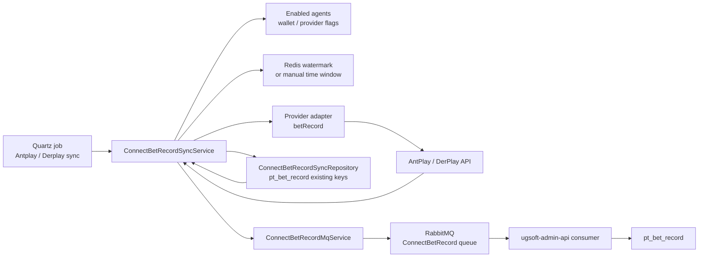
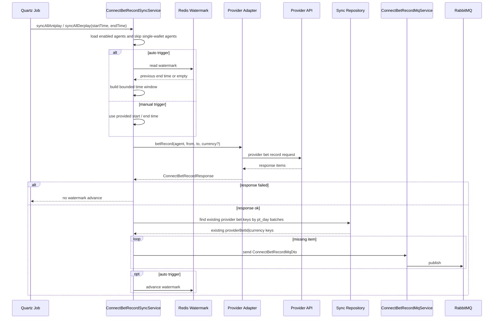

# request-bet-record-mq-sync Step 3

## 閱讀定位

- Flow 中文名稱：Provider bet record job sync / late data 補資料到 MQ
- Flow slug：`request-bet-record-mq-sync`
- Project：`ugsoft-connector-api`
- Step：Step 3 / 單條 flow learning package
- 完成狀態：Step 3 已建立；Step 4 面試 case 與 Step 5 claim gate 尚未完成。
- 證據層級：`真實開發過 + code-backed`、`code-backed / 主管或團隊 context`、`分析素材 / 待確認` 混合。
- 本 flow 類型：Quartz job / provider bet record pull / Redis watermark / duplicate check / RabbitMQ eventual consistency。
- 是否只確認到入口：否。已確認 Quartz job、sync service、provider adapter、existing-key 查重、MQ producer 與 Redis watermark；未驗證 production branch、實際 scheduler runtime、MQ ack / DLQ、監控告警與 incident。

這是 `ugsoft-connector-api` 第三條代表 flow。第一條 `transfer-wallet-in-out-query` 與第二條 `provider-callback-bet-settle-to-mq` 已完成 Step 5；這條補的是 callback 以外的 job-driven late data / 補資料路徑。Nick / `10gt12nc` 的 direct evidence 主要落在 BetRecord MQ、job、跨日 `pt_day`、DerPlay 單一錢包日期、currency default / currency 修正；Redis watermark、amount normalization、subAgent 傳遞等較新的 current behavior 多為 code-backed / 團隊 context，不直接升級成 Nick direct claim。

## 白話導讀

這條 flow 可以想成：如果 provider callback 沒打到、資料晚到，或平台需要補抓一段 provider bet record，系統會透過 Quartz job 定期呼叫 AntPlay / DerPlay 的 bet record API，把 provider 回來的注單資料整理成和 callback flow 相同的 `ConnectBetRecordMqDto`，再送到 RabbitMQ。下游仍由 admin-api consumer 寫入正式 `BetRecord`。

它不是完整 reconciliation，也不是保證零漏單的 outbox。它比較像一條補資料 pipeline：

1. Quartz job 每分鐘觸發 AntPlay / DerPlay sync。
2. Service 掃 enabled agents，排除單一錢包 agent；DerPlay 另外檢查 `derplayOpen` 與 currencies。
3. 自動模式用 Redis watermark 決定時間窗；手動模式用 job 參數指定 start / end。
4. 呼叫 provider bet record API。
5. 成功回來後，依事件日期分組，查 `pt_bet_record` 是否已存在。
6. 以 `providerBetId|currency` 當同批與 DB 查重 key。
7. 未存在的資料轉成 MQ DTO，送到 `ConnectBetRecordMqService`。
8. 自動模式若 response 成功，推進 Redis watermark。

這條 flow 最值得追問的點不是「有沒有 job」，而是 watermark 推進、MQ publish 成敗、跨日查重、pagination、per-currency sync 與 late data 能不能真的不漏。

## 初中階 Code 分層對照

| 分層 | Code / Table | 角色 |
| --- | --- | --- |
| Quartz job | `AntplayBetRecordSyncJob` | 讀 optional `startTime / endTime`，呼叫 `syncAllAntplay`。 |
| Quartz job | `DerplayBetRecordSyncJob` | 讀 optional `startTime / endTime`，呼叫 `syncAllDerplay`。 |
| Job registry | `JobOptions` | 註冊 AntPlay / DerPlay bet record sync job，排程每分鐘執行。 |
| Sync service | `ConnectBetRecordSyncService` | agent loop、time window、provider fetch、查重、送 MQ、watermark。 |
| Provider adapter | `ConnectAntplayAdapter#betRecord` | 呼叫 AntPlay bet record API，解析 common response。 |
| Provider adapter | `ConnectDerPlayAdapter#betRecord` | 呼叫 DerPlay page game record API，支援 currency overload 與欄位 normalize。 |
| Response DTO | `ConnectBetRecordResponse` | 統一 provider response：`code / message / page / pageSize / total / items`。 |
| Duplicate repository | `ConnectBetRecordSyncRepository` | 依 `pt_day / agent_id / provider / provider_bet_id` 查既有 key。 |
| BetRecord table | `pt_bet_record` | 下游正式注單表；本 flow 用它判斷是否已入庫。 |
| MQ DTO / producer | `ConnectBetRecordMqDto` / `ConnectBetRecordMqService#send` | 把補抓資料轉成和 callback path 相同的 MQ payload。 |
| Redis key | `RedisKey.BET_SYNC_WATERMARK` | 自動模式進度水位，避免每次重掃太大時間窗。 |
| Downstream context | `ugsoft-admin-api ConnectBetRecordListener` | callback flow 已掃過的 consumer；本 flow 不重新深掃，只作下游 context。 |

## 最小架構圖



## 正常流程圖



## 正常流程逐步說明

### 1. Quartz 或手動 job 觸發

`AntplayBetRecordSyncJob` 與 `DerplayBetRecordSyncJob` 會讀 job data map 內的 `startTime / endTime`。如果沒有提供時間或為 0，就是自動模式；如果有提供，就是手動補跑指定區間。

`JobOptions` 目前把兩個 job 都放在 `ConnectBetRecord` group，排程每分鐘執行。這裡只確認 code 設定，未確認 production 實際 scheduler 是否完全照此設定跑。

### 2. 掃 enabled agents 與 provider boundary

`syncAllAntplay` / `syncAllDerplay` 會查 enabled agents。共通邊界是跳過單一錢包 agent，避免和 single-wallet callback / wallet flow 混在一起。

DerPlay 另外有兩層邊界：

- `derplayOpen` 未開啟就跳過。
- 會解析 agent 的 currencies，逐 currency 拉資料；如果沒有 currency，會用 provider default path。

### 3. 自動模式計算時間窗

自動模式會用 Redis watermark 決定 `from / to`：

- 沒有 watermark：預設從現在往前約 10 分鐘，到現在往前約 3 分鐘。
- 有 watermark：從上一個 watermark 往前加一段 safety buffer，避免邊界秒數漏資料。
- `from` 不會無限制往前追，會被限制在最近約 10 分鐘內。
- `to` 固定避開最近幾分鐘，降低 provider 資料尚未穩定的風險。

手動模式不走 watermark，可用於人工補跑指定時間區間。

### 4. 呼叫 provider bet record API

AntPlay 走 `ConnectAntplayAdapter#betRecord`，組出 provider request，包含 agent、trace id、from / to、page / pageSize、signTime 與 signature，最後解析成 `ConnectBetRecordResponse`。

DerPlay 走 `ConnectDerPlayAdapter#betRecord`，呼叫 page game record API。DerPlay response 會被 normalize 成 common item 欄位，例如 `_id`、`subgameid`、`userid`、`username`、`betid`、`betChip`、`winChip`、`timestamp`、`settleTime`。

### 5. 失敗 response 不推進水位

`handleResponse` 遇到 response 為 null 或 code 非 0，會回 false。自動模式只在 response 被視為成功時才推進 watermark，因此 provider API 失敗時，下次 job 仍會回來掃同一段附近時間窗。

空資料 response 被視為成功；也就是「provider 成功回答這段沒資料」會讓 watermark 前進。

### 6. 依事件日期分組做 existing-key 查重

正常 response 有 items 後，service 會先 normalize 成 JSON items，再依 item event date 算 `pt_day` 分組。這是跨日正確性的關鍵：同一個時間窗可能跨過日期邊界，不能只查單一天。

`ConnectBetRecordSyncRepository#findExistingProviderBetKeys` 依下列條件查 `pt_bet_record`：

- `pt_day`
- `agent_id`
- `provider`
- `provider_bet_id IN (...)`

repository 會批次查詢 ids，並回傳 `providerBetId|currency`。service 也會用同一個 key 避免同一批 response 內重複送 MQ。

### 7. 建 MQ DTO 並送 RabbitMQ

未存在的 item 會轉成 `ConnectBetRecordMqDto`。

AntPlay mapping 主要看：

- `betId`
- `game`
- `account`
- `bet`
- `totalWin`
- `status`
- `currency`，缺值時 default `CNY`

DerPlay mapping 主要看：

- provider id：優先 `betid`，fallback `_id`
- game：加 DerPlay game prefix
- account：`username`
- amount：`betChip / winChip`
- time：`settleTime / timestamp`
- `currency`，缺值時 default `CNY`

送 MQ 使用 `ConnectBetRecordMqService#send`，和 callback path 共用 producer。

### 8. 自動模式推進 watermark

自動模式在 provider response 成功後會寫 Redis watermark。`writeWatermark` 只允許新值大於舊值，避免時間倒退。

這裡的 owner 判斷點是：watermark 代表「這個時間窗已處理到哪」，因此理想上應該和 durable publish / downstream ack 有更強連動。現有 code 中 MQ producer catch exception，不往外拋，會讓 sync service 以為 send 已完成；這是 Step 3 最重要的 failure window。

## Senior / Owner 深度觀察

### 1. 這是補資料 pipeline，不是完整 reconciliation

本 flow 具備 late data 補抓與 duplicate check，但沒有看到完整對帳表、outbox、provider total reconciliation、DLQ replay dashboard 或人工 reconcile workflow。面試可以講「job-driven bet record sync / compensation-like path」，不要講「完整 reconciliation owner」。

### 2. Watermark 與 MQ publish 成敗沒有強一致

`ConnectBetRecordMqService#send` 會 catch publish exception 並 log。若 MQ publish 失敗但 exception 沒回到 `handleResponse`，service 仍可能把資料計為 sent，並在自動模式推進 watermark。

這代表最壞情境是：

1. provider API 成功回資料。
2. DB 查重判斷資料不存在。
3. MQ publish 失敗但被吞掉。
4. watermark 前進。
5. 下次自動 job 不再掃同一段，形成漏資料。

這是面 Senior 時可以講的 owner decision：若要更穩，至少要讓 producer 回傳成功 / 失敗，或改成 local outbox / retry queue / DLQ replay，再推進 watermark。

### 3. DerPlay per-currency watermark 有 partial success 風險

DerPlay 會逐 currency 拉資料。code 目前以「有任一 currency 成功」作為 `anyOk`，自動模式就可能寫 watermark。若 A currency 成功、B currency provider fail，仍有可能推進同一個 agent / provider 的 watermark，導致 B currency 該時間窗被跳過。

比較穩的設計會把 watermark 拆到 provider + agent + currency 粒度，或至少只有全部 currency 成功才推進共同 watermark。

### 4. Pagination 未看到完整 loop

provider request 有 page / pageSize / total，但 Step 3 掃描未看到針對 total 的完整 pagination loop。若單一時間窗資料量超過 pageSize，可能需要縮小時間窗、分頁拉取，或根據 total 做下一頁。

這不代表 production 一定有問題，因為時間窗很短；但它是高流量時要追問的風險。

### 5. Cross-day duplicate check 是本 flow 的正確方向

把 items 依 event date 分組後查 `pt_day`，比只用 job window 的某一天查重更可靠。Nick / `10gt12nc` 有 `feat: mq 跨日 pt_day` direct evidence，可作為這條 flow 的強證據之一。

### 6. Duplicate key 要和下游 consumer 對齊

本 flow 用 `providerBetId|currency` 避免重複送 MQ；repository 查 `pt_day / agent / provider / provider_bet_id`，回傳時也帶 currency。下游 admin-api consumer 的 duplicate boundary 若與這裡不一致，就可能出現 connector 認為不存在但 consumer 判重不同，或反過來漏掉不同 currency 的資料。

### 7. Manual catch-up 是必要但要有邊界

自動模式只掃最近短時間窗，適合日常補晚到資料；如果 provider 停很久、MQ 故障很久、consumer 故障很久，就需要手動指定 start / end 補跑。這個手動補跑需要避免大區間爆量、重複 publish 與 provider rate limit。

## 面試 / 履歷邊界摘要

可面試講：

- `ugsoft-connector-api` 有 callback path 以外的 job-driven bet record sync。
- Quartz job 定期拉 provider bet record，透過 Redis watermark 控制時間窗。
- 依 `pt_day` 分組查既有 `pt_bet_record`，用 `providerBetId|currency` 避免重複 MQ。
- 補資料後送同一條 BetRecord MQ，由 admin-api consumer 入庫。
- 可以主動指出 watermark / MQ publish / per-currency / pagination 風險。

可保守放入 project-level 素材：

- 參與 UGSoft provider connector / gateway 的 request / bet record MQ、job 補資料、跨日查重與 currency 修正。
- 不單獨寫成完整 reconciliation，也不寫成完整 bet record pipeline owner。

不可誇大：

- 不寫 exactly-once。
- 不寫完整 outbox / DLQ / replay 平台。
- 不寫完整金流或完整 wallet ledger owner。
- 不寫完整 reconciliation owner。
- 不把 `arnold` commits 當 Nick direct evidence。

## Step 3 結論

`request-bet-record-mq-sync` 已建立 Step 3 learning package。它補強 `ugsoft-connector-api` 在 job / async data / late data 補資料方面的廣度，和前兩條 transfer / callback flow 形成一組比較完整的 connector runtime 面試素材。

下一步若繼續本 flow，應做 Step 4，把本報告壓成 90 秒 / 3 分鐘 case、追問題庫與回答邊界：

```text
ugsoft ugsoft-connector-api request-bet-record-mq-sync Step 4
```
