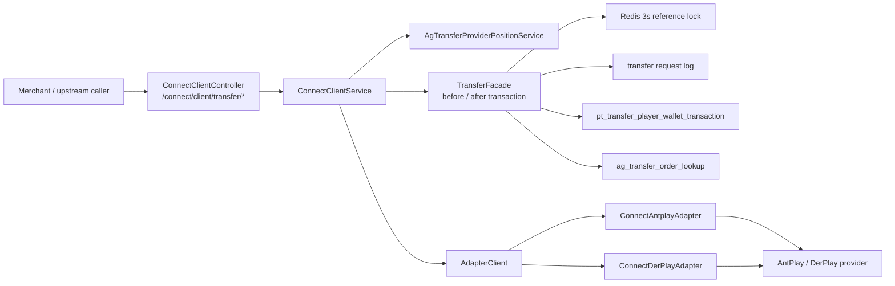
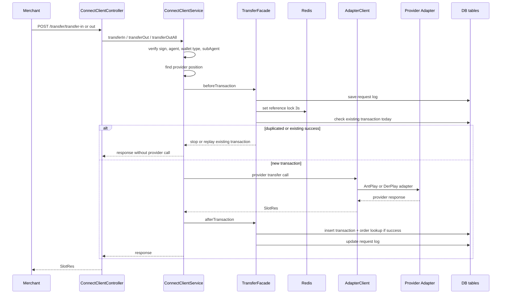

# transfer-wallet-in-out-query Step 3 / Step 4 / Step 5

## 閱讀定位

- Flow 中文名稱：商戶轉帳錢包轉入 / 轉出 / 全額轉出 / 單筆交易查詢
- Flow slug：`transfer-wallet-in-out-query`
- Project：`ugsoft-connector-api`
- Step：Step 5 / Level 2+ claim gate
- 完成狀態：Step 3 flow 主學習包、Step 4 面試 case、Step 5 單條 flow claim gate 已完成。
- 證據層級：`真實開發過 + code-backed`、`code-backed / 主管或團隊 context`、`分析素材 / 待確認` 混合。
- 本 flow 類型：provider connector / transfer wallet / money-adjacent transaction flow。
- 是否只確認到入口：否。已確認 controller、service、transfer facade、provider adapter、DB table、Redis guard 與 request log；未驗證 production 實際部署 branch / incident / ticket。

Nick / `10gt12nc` 的 direct evidence 主要落在 AntPlay / DerPlay provider adapter transfer、DerPlay single transaction，以及 2025 transfer transaction / lookup / compensation 相關底層 path。`TransferFacade#beforeTransaction / afterTransaction`、Redis duplicate guard、final lookup replay 與二級代理修正主要是 `arnold` / 團隊 context；Nick 已確認 `arnold` 是主管帳號，不得當成 Nick direct evidence。

## 白話導讀

這條 flow 是商戶或上游系統透過 UGSoft connector API，把玩家在第三方遊戲 provider 裡的轉帳錢包做轉入、轉出、全額轉出，或查詢單筆交易結果。

最直覺可以這樣理解：

1. 商戶送一個帶簽名的 transfer request 給 UGSoft connector。
2. connector 先確認簽名、agent、subAgent、wallet type 與玩家目前所在 provider。
3. connector 先寫一筆 request log，並用 Redis 對 `transferReferenceId` 做短時間重複提交擋板。
4. 如果已經有成功交易，系統回放既有交易結果，不再打 provider。
5. 如果是新交易，connector 依 provider 呼叫 AntPlay 或 DerPlay adapter。
6. provider 成功後，connector 寫入 transfer transaction 分表與 lookup 表，讓之後可用 `transferReferenceId` 查單。
7. 若 provider 失敗或 timeout，connector 不寫成功 transaction，只更新 request log 為失敗。

成功後，系統至少會留下三層資料：

- client request / response log：知道商戶送了什麼、系統回什麼。
- provider transaction / wallet transaction：成功時記錄 provider transaction id、balance before / after。
- order lookup：用 `transferReferenceId` 找回實際 transaction table id，支援單筆交易查詢。

失敗最直覺會壞在：provider 成功但本地 DB 寫入失敗、Redis 3 秒擋板過短、重試跨天查不到同日分表、provider query order 與本地 lookup 不一致。

## 初中階 Code 分層對照

| 分層 | Code / Table | 角色 |
| --- | --- | --- |
| Route / Controller | `ConnectClientController#/transfer/transfer-in` | 接商戶轉入 request，記錄 client out log。 |
| Route / Controller | `ConnectClientController#/transfer/transfer-out` | 接商戶轉出 request，記錄 client out log。 |
| Route / Controller | `ConnectClientController#/transfer/transfer-out-all` | 接商戶全額轉出 request，記錄 client out log。 |
| Route / Controller | `ConnectClientController#/transfer/get-single-transaction` | 依 `transferReferenceId` 查 lookup，再查 provider 單筆交易。 |
| Service / Business | `ConnectClientService#transferIn / transferOut / transferOutAll` | 驗簽、subAgent、wallet type、provider position、before / after transaction。 |
| Service / Business | `ConnectClientService#transferGetSingleTransaction` | 查本地 lookup / transaction，再帶 provider transaction id 查 provider。 |
| Facade | `TransferFacade#beforeTransaction` | 建 request log、Redis duplicate guard、查既有 transaction。 |
| Facade | `TransferFacade#afterTransaction` | provider 成功後寫 transaction 與 order lookup，更新 request log。 |
| Provider dispatch | `AdapterClient#transferIn / transferOut / transferOutAll / getSingleTransaction` | 依 provider 轉到 AntPlay / DerPlay adapter，統一 response。 |
| Provider adapter | `ConnectAntplayAdapter` | 組 AntPlay transfer API request、sign、parse response。 |
| Provider adapter | `ConnectDerPlayAdapter` | DerPlay query balance、create order、transfer chip、query order、query balance。 |
| Provider position | `AgTransferProviderPositionService` | 記錄玩家目前在哪個 provider；login 時可能觸發跨 provider inner transfer。 |
| DB / Table | `pt_transfer_player_wallet_transaction` | 成功轉帳交易紀錄，含 provider、amount、balance before / after、status。 |
| DB / Table | `ag_transfer_order_lookup` | `transferReferenceId -> transaction table id / provider transaction id` 查詢索引。 |
| Redis | `ugSoft:Transfer:ReferenceLock:{transferReferenceId}` | 3 秒 hash guard，避免短時間重複提交。 |
| Log / Audit | `pt_transfer_request_log` / client out log | 記錄轉帳 request、response、elapsed time、error message。 |
| MQ | 無直接 MQ | 本 flow 本身不是 MQ flow；MQ 留給 callback / bet record sync 代表 flow。 |

## 最小架構圖

## 正常流程圖

## 正常流程逐步說明

### Transfer In

1. 商戶呼叫 `/connect/client/transfer/transfer-in`，body 帶 `agentId`、`signTime`、`sign`、`traceId`、`account`、`currency`、`amount`、`transferReferenceId`、可選 `subAgentId`。
2. Controller 驗 request binding，並在 finally 呼叫 `connectorUtil.sendClientOut` 記 client out log。
3. Service 用 `agentId + traceId + account + currency + amount + transferReferenceId + signTime` 驗簽。
4. Service 檢查 subAgent，並用 `AgTransferProviderPositionService#findProvider` 找玩家目前 provider；找不到時預設 AntPlay。
5. `TransferFacade#beforeTransaction` 先寫 transfer request log，再用 Redis key `ugSoft:Transfer:ReferenceLock:{transferReferenceId}` 以 account 為 hash field 做 3 秒重複提交擋板。
6. `beforeTransaction` 再查當日 `pt_transfer_player_wallet_transaction`。如果已有 `FAILED`，直接回交易失敗；如果已有 `SUCCESS`，回放既有 transaction。
7. 如果是新交易，Service 呼叫 `AdapterClient#transferIn`，再 dispatch 到 AntPlay 或 DerPlay adapter。
8. Provider 成功後，`TransferFacade#afterTransaction` 解析 adapter response，取 provider transaction id、beforeBalance、balance。
9. `afterTransaction` 寫入 `pt_transfer_player_wallet_transaction`，再寫 `ag_transfer_order_lookup`。
10. `afterTransaction` 更新 request log 狀態、response body、elapsed time。

### Transfer Out / Transfer Out All

- Transfer Out 與 Transfer In 相同，差異是會先確認 agent 不是 single wallet，交易型別為 `transfer-out`。
- Transfer Out All 不帶 amount；`beforeTransaction` 暫以 `"0"` 放入 amount，實際 provider adapter 會先查 provider 餘額，再全部轉出。
- 最新 `origin/master` 已把 subAgentId 傳給下游 adapter，並在重放既有交易時回傳已儲存的 balance before / after。

### Get Single Transaction

1. 商戶呼叫 `/connect/client/transfer/get-single-transaction`。
2. Service 驗簽、檢查 agent / wallet type / subAgent。
3. Service 用 replaceAgentId 查 `ag_transfer_order_lookup`。
4. 再依 lookup 的 table id 查 `pt_transfer_player_wallet_transaction`。
5. 從 transaction 取 provider、account、currency，從 lookup 取 provider transaction id。
6. 呼叫 `AdapterClient#getSingleTransaction`，再 dispatch 到 provider adapter 查 provider 狀態。

## 業務問題

這條 flow 解的是「商戶透過 connector 操作第三方遊戲 provider 的轉帳錢包」問題。它不是完整 ledger 系統，而是 provider gateway 的轉帳通道，需要在以下事情上盡量保守：

- 同一個 `transferReferenceId` 不要短時間重複送 provider。
- provider 回成功後，本地要能留下 transaction 與 lookup，之後才查得到。
- 商戶查單時，要能由本地 reference id 找到 provider transaction id。
- provider 切換時，要知道玩家目前餘額在哪個 provider，必要時做 best-effort inner transfer。

## 系統位置

`ugsoft-connector-api` 介於商戶 / 上游 API 與第三方 provider 之間。它不像 `ugsoft-admin-api` 是控制面，也不像遊戲 runtime 自己算輸贏；它更接近 provider gateway / adapter：

- 對上：商戶或上游呼叫 UGSoft connector 統一 API。
- 對下：AntPlay / DerPlay provider API。
- 對內：agent / subAgent / wallet type / provider position / sharded transaction table。

## DB / Redis / MQ / 外部 API

### DB

- `pt_transfer_request_log`：由 `TransferFacade#saveRequestLog` 寫 request / response / status / elapsed time。
- `pt_transfer_player_wallet_transaction`：成功轉帳交易表，`pt_day + agent_id + account + transfer_reference_id` 查既有交易。
- `ag_transfer_order_lookup`：用 reference id 查交易所在 table id 與 provider transaction id。
- `ag_transfer_provider_position`：玩家目前 provider position，login provider switch 會更新。

### Redis

- `ugSoft:Transfer:ReferenceLock:{transferReferenceId}`。
- hash field 是 account，value 是 transferReferenceId。
- TTL 3 秒。
- 作用是 request frequency guard，不是完整 idempotency source of truth。

### MQ

本 flow 沒有直接 MQ。callback / bet record MQ 是下一條 `provider-callback-bet-settle-to-mq` 或 `request-bet-record-mq-sync` 的範圍。

### 外部 API

- AntPlay：`/public/transfer/transfer-in`、`/transfer-out`、`/transfer-out-all`、`/get-single-transaction`。
- DerPlay：`/query_balance`、`/create_transferorder`、`/transfer_chip`、`/query_transferorder`。

## 資料狀態與 State Transition

| 階段 | 狀態 | Source of truth |
| --- | --- | --- |
| request received | 已收到商戶 request | client out log / transfer request log |
| duplicate guard | Redis 3 秒 reference lock | Redis，不是長期真相 |
| existing transaction check | 查當日成功 / 失敗交易 | `pt_transfer_player_wallet_transaction` |
| provider called | provider API 已送出 | provider + request log |
| provider success | provider 回成功與 transaction id | provider response |
| local success persisted | 本地 transaction / lookup 寫入 | DB transaction table + lookup |
| query transaction | 商戶查單 | 本地 lookup + provider query order |

重要邊界：目前 flow 沒有看到完整 outbox / retry worker 包住 `afterTransaction`。因此 provider 成功但 DB 寫入失敗，是本 flow 的主要 failure window。

## Consistency / Idempotency / Failure Window

### 已確認的保護

- 驗簽：transfer in/out/out-all/get-single-transaction 都有簽名驗證。
- subAgent 檢查：最新 `origin/master` 會用 replaceAgentId 查 lookup / transaction。
- Redis 3 秒擋板：短時間同 reference id + account 直接擋掉。
- DB 既有交易回放：若同日 transaction 已是 `SUCCESS`，回放既有 transaction，不再呼叫 provider。
- lookup：provider 成功後寫 `ag_transfer_order_lookup`，查單時由 reference id 找回 provider transaction id。

### 風險與限制

1. Redis guard TTL 只有 3 秒：它防連點，不防長時間重送。
2. 既有 transaction 只查當日 `pt_day`：跨日重試 / provider late response 可能需要更強 lookup 策略。
3. `beforeTransaction` 先寫 request log，再打 provider；成功 transaction 是 provider 成功後才寫。
4. provider 成功但 `afterTransaction` 寫 DB 失敗時，本地 lookup 可能不存在，後續查單會失敗或只能靠人工 / provider 查詢補救。
5. `transferOutAll` 的本地 amount 在 beforeTransaction 以 `"0"` 表示，真正金額依 provider adapter 查到的餘額，面試時要說清楚。
6. `ConnectAdapter` 註解仍寫「Derplay 目前未實作」，但最新 `ConnectDerPlayAdapter` 已實作 transfer / query。這是文件註解落後 code 的例子，不能用註解否定 runtime path。

## Senior / Owner 設計取捨

這條 flow 可以拿來講 Senior 思維，但要保守：

- 它有基本 idempotency：Redis 短鎖 + DB success replay。
- 它有 auditability：request log、client out log、transaction table、lookup table。
- 它有 provider abstraction：`AdapterClient` 統一 AntPlay / DerPlay response。
- 它沒有完整 transaction outbox：provider call 與 DB insert 不是同一個原子交易。
- 它不是 wallet ledger source of truth：provider 餘額仍是重要真相，本地 DB 是 connector 側交易紀錄與查詢索引。

如果面試官問「你會怎麼補強」，保守回答：

- 把 `transferReferenceId` 做長期唯一約束或以 lookup 表作第一層 idempotency，不只靠 3 秒 Redis。
- provider 成功但 DB 寫失敗時，建立可重放的 recovery job 或人工修復入口。
- 對 provider request / response 建立更清楚的 status state machine：PENDING、PROVIDER_SUCCESS、LOCAL_PERSISTED、LOCAL_PERSIST_FAILED。
- 對查單加入 fallback：lookup 不存在但 reference id 已送 provider 時，可查 provider 並回補 lookup。

## 面試 / 履歷邊界摘要

Step 4 已把本 flow 轉成面試 case：

- 主面試稿：[`career-interview.md`](career-interview.md)
- 詳細追問與陷阱：[`materials/interview.md`](materials/interview.md)
- claim 邊界：[`materials/claim-boundary.md`](materials/claim-boundary.md)

可面試講：

- 商戶 transfer API 如何經 connector 驗簽、找 provider、做 duplicate guard、呼叫 provider adapter、寫 transaction / lookup。
- AntPlay / DerPlay provider adapter transfer 差異。
- 3 秒 Redis guard 與 DB success replay 的 idempotency 層次。
- provider 成功但本地 DB 失敗的 failure window。
- 為什麼 get-single-transaction 先查本地 lookup，再查 provider。

可保守作履歷素材：

- 參與 UGSoft provider connector / gateway 中 AntPlay / DerPlay transfer in / out / query transaction adapter 串接與維護。
- 參與分析 / 維護 transfer wallet provider position、transaction lookup、request log 與 provider 查單邊界。

不可誇大：

- 不寫主導完整 UGSoft connector architecture。
- 不寫完整 wallet / ledger / reconciliation owner。
- 不寫 exactly-once、outbox、完整自動補償已完成。
- 不把 `arnold` 的 transaction facade / idempotency / subAgent 修正當成 Nick direct evidence。

Step 5 claim gate 結論：

- 本 flow 可以作為 `ugsoft-connector-api` project-level provider connector / transfer wallet 履歷素材的強化 evidence。
- 可說 Nick / `10gt12nc` 參與 AntPlay / DerPlay transfer adapter、DerPlay get-single-transaction、transfer transaction / lookup 底層表路徑與 transfer wallet compensation 類維護。
- 不單獨寫成「主導完整 transfer wallet / idempotency / recovery / reconciliation owner」。
- 不直接更新 `05 / 08`；正式履歷仍吃 `ugsoft-connector-api contribution-claim-consolidation.md` 的 project-level rolling conclusion。

同 project 的第二順位 `provider-callback-bet-settle-to-mq` 已完成 Step 3；若繼續 Flow Track，下一步是該 flow Step 4。

## 本次實際掃描範圍

- 已重讀 KB：`AGENTS.md`、`00-operating-rules.md`、`09-ai-prompt-manual.md`、`03-flow-learning-package-template.md`、`projects/CONVENTIONS.md`。
- 已重讀 project 文件：`projects/ugsoft/README.md`、`ugsoft-connector-api/README.md`、`step1-candidate-flows.md`、`step2-flow-comparison.md`、`contribution-claim-consolidation.md`。
- 已 fetch source repo remote refs。
- 已讀 source repo：`/Users/nick/Git/ugsoft/ugsoft-connector-api`。
- 已讀最新 `origin/master` 版本的 `ConnectClientController`、`ConnectClientService`、`TransferFacade`、`TransferService`、`AdapterClient`、`ConnectAntplayAdapter`、`ConnectDerPlayAdapter`、`AgTransferProviderPositionService`、`ConnectAdapter`、`TransferConst`、`ShardingTableName`。
- 已查 path-specific log、Nick / `10gt12nc` author log、重要 commit stat、blame。

未掃：

- 未逐檔逐行 Level 3。
- 未讀完整 DB migration / DDL。
- 未驗證 production 實際部署 branch。
- 未查 ticket / MR / incident。
- 未讀完整 provider spec；僅依 code path 判斷。
