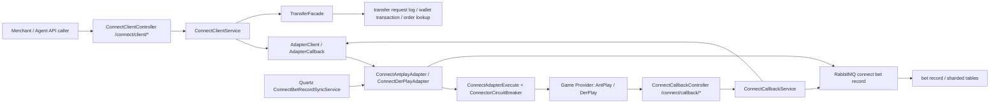

# ugsoft-connector-api Step 1 - Candidate Flows

## 閱讀定位

- Project：`ugsoft-connector-api`
- Step：Step 1 / candidate flow discovery
- 掃描等級：Level 1 Flow 掃描
- 目標：建立 project / module / upstream-downstream 地圖，篩出值得進 Step 2 比較的 production flows。
- 本輪不做：不建立單條 `flows/{flow}`、不寫 Step 3 深掃報告、不更新 05 / 08 履歷輸出版。
- 證據層級：`真實開發過 + code-backed`、`code-backed / 主管或團隊 context`、`分析素材 / 待深掃` 混合；每條候選 flow 下方分開標示。Nick 已確認 `arnold` 是主管帳號，不是 Nick direct evidence。

## 已重讀與既有文件狀態

已重讀：

- `AGENTS.md`
- `senior-owner-playbook/00-operating-rules.md`
- `senior-owner-playbook/03-flow-learning-package-template.md`
- `senior-owner-playbook/09-ai-prompt-manual.md`
- `projects/source-repo-flow-audit.md`
- `projects/ugsoft/README.md`
- `projects/ugsoft/ugsoft-connector-api/README.md`
- `projects/ugsoft/ugsoft-connector-api/contribution-claim-consolidation.md`
- source repo：`/Users/nick/Git/ugsoft/ugsoft-connector-api`

既有文件判斷：

| 文件 | 狀態 | 判斷 |
| --- | --- | --- |
| `README.md` | 可沿用，需同步 Step 1 狀態 | project 定位、履歷邊界清楚，但本輪前仍標為 Flow Track 缺口。 |
| `contribution-claim-consolidation.md` | 可沿用 | Career Track rolling consolidation 已完成，可支撐保守履歷；但不能代表 flow 完整。 |
| `step1-candidate-flows.md` | 本輪新增 | 補 Flow Track 第一層缺口。 |
| `step2-flow-comparison.md` | 已完成 / 2026-05-26 | 已比較候選 flow，第一順位是 `transfer-wallet-in-out-query`。 |
| `flows/` | 已建立部分代表 flow | `transfer-wallet-in-out-query` 已完成 Step 5；`provider-callback-bet-settle-to-mq` 已完成 Step 5；`request-bet-record-mq-sync` 已完成 Step 3；其他候選仍未建立完整面試包。 |

## Source Repo 狀態

來源 repo：

```text
/Users/nick/Git/ugsoft/ugsoft-connector-api
```

遠端狀態：

- 已執行 `git fetch --all --prune`。
- local branch：`Nick_Test`
- local HEAD：`c2cab730c0cd6ead6d92a038ef56f97987577059`
- remote HEAD：`origin/develop`
- `origin/develop`：`079aa6603b50db3c185e383295ca5966bbe272fb`
- `origin/master`：`4bd2195e1e574978f11a1d4b5e744792f16ecad0`
- local vs `origin/master`：ahead / behind = `0 / 61`
- local vs `origin/develop`：ahead / behind = `190 / 0`
- source repo 工作樹不乾淨：有 `.DS_Store`、test、docs 等既有 local changes / untracked files。本輪只讀，不採 source repo 髒檔作正式履歷 evidence。

本輪 source 掃描範圍：

- `git log --all --author='10gt12nc|Nick|nick'`
- `git log --all -- src/main/java/com/ps/domain/connector`
- `git log --all -- src/main/java/com/ps/domain/api/game/facade/TransferFacade.java`
- `git log --all -- src/main/java/com/ps/domain/manage/service/TransferService.java`
- `git log --all -- src/main/java/com/ps/quartz/main/service/ConnectBetRecordSyncService.java`
- `pom.xml`
- `src/main/java/com/ps/domain/connector/controller`
- `src/main/java/com/ps/domain/connector/service`
- `src/main/java/com/ps/domain/connector/adapter`
- `src/main/java/com/ps/domain/connector/vo`
- `src/main/java/com/ps/domain/api/game/facade/TransferFacade.java`
- `src/main/java/com/ps/domain/manage/service/TransferService.java`
- `src/main/java/com/ps/common/config/RabbitMQConfig.java`
- `src/main/java/com/ps/common/constant/RabbitMq.java`
- `src/main/java/com/ps/quartz/main/service/ConnectBetRecordSyncService.java`
- `src/main/java/com/ps/datasource/SchemaRouteAspect.java`

未掃範圍：

- 未逐檔逐行 Level 3。
- 未讀所有 provider adapter 每一個 method。
- 未讀完整 DB migration / DDL。
- 未讀 production incident / ticket。
- Nick 已確認 `arnold` 是主管帳號；本檔將 `arnold` commits 視為主管 / 團隊 context，不直接當 Nick 本人 commits。

## Project / Module Map

`ugsoft-connector-api` 是 Java 21 / Spring Boot 3.2 的 runtime service，主體不是單純後台，而是 merchant connector + provider adapter + callback + async / job + schema route 的混合服務。

| Module / package | 角色 | Step 1 判斷 |
| --- | --- | --- |
| `domain/connector/controller` | 商戶端 API 與 provider callback HTTP 入口 | 核心入口。`ConnectClientController` 對外提供 login、transfer、bet_record、games；`ConnectCallbackController` 接 provider callback。 |
| `domain/connector/service` | connector business flow、adapter 實作、callback service、MQ mapper、circuit breaker wrapper | 核心 business 層。候選 flow 多數從這裡展開。 |
| `domain/connector/adapter` | provider dispatch facade | `AdapterClient` / `AdapterCallback` 把通用 connector API 導向 AntPlay / DerPlay adapter。 |
| `domain/connector/data` | connector 狀態資料 | 目前看到 provider position、DerPlay auth token 等。 |
| `domain/api/game/facade` | transfer wallet transaction facade | `TransferFacade` 處理 request log、冪等、transaction insert、lookup、afterTransaction。 |
| `domain/manage/service` | agent / key / transfer / cache / config | 驗簽、agent enable、wallet type、transfer DB access。 |
| `domain/game/main` | game config / cache / transfer request log | login / games / request log 會用到。 |
| `domain/game/slot` | bet record entity / repository / schema table | callback / sync 最終要落到 bet record / partition 類資料。 |
| `common/rabbitMq` / `RabbitMQConfig` | RabbitMQ exchange / queue / listeners | connect bet record MQ 與 request log MQ 的基礎。 |
| `quartz` | job trigger / scheduled sync | DerPlay / AntPlay bet record sync、table maintenance。 |
| `datasource` | schema route / read-only routing | `@UseSchema` 依 agent / table / fixed schema route 到不同 DB group。 |

## 最小系統圖



## 候選 Production Flows

### 1. provider-client-login-launch-game

白話：商戶呼叫 `/connect/client/login`，connector 驗 signTime / sign / currency / game / agent 狀態後，依 game provider 路由到 AntPlay 或 DerPlay adapter，回傳 gameUrl / html；transfer wallet agent 還會維護 provider position，必要時做跨 provider 內轉。

核心 code：

- `ConnectClientController#login`
- `ConnectClientService#login`
- `AdapterClient#login`
- `ConnectAntplayAdapter#login`
- `ConnectDerPlayAdapter#login`
- `AgTransferProviderPositionService`
- `ConnectClientService#innerTransferOther`

價值：

- 能講 gateway API contract、驗簽、game/provider routing、wallet type、provider position。
- 牽涉 provider switch 的 transfer risk，但 Step 3 要小心不要把它包成完整 wallet owner。

Evidence：

- `10gt12nc` commits：`9913ed2`、`261e1a2`、`5e4448a` 等 AntPlay login / info 系列。
- `arnold` commits：login v3、subAgentId、lang allow list、innerTransferOther 等；Nick 已確認 `arnold` 是主管帳號，只作主管 / 團隊 context。

證據層級：

- AntPlay adapter login：`真實開發過 + code-backed`
- provider position / inner transfer：`code-backed / 主管或團隊 context`

### 2. transfer-wallet-in-out-query

白話：商戶呼叫 transfer in / out / out-all / get-single-transaction，connector 先驗簽、檢查 agent / subAgent、用 Redis 做短時間重複提交擋板，再透過 `beforeTransaction -> provider adapter -> afterTransaction` 記錄 request log、wallet transaction 與 lookup。

核心 code：

- `ConnectClientController#transferIn`
- `ConnectClientController#transferOut`
- `ConnectClientController#transferOutAll`
- `ConnectClientController#transferGetSingleTransaction`
- `ConnectClientService#transferIn`
- `ConnectClientService#transferOut`
- `ConnectClientService#transferOutAll`
- `ConnectClientService#transferGetSingleTransaction`
- `TransferFacade#beforeTransaction`
- `TransferFacade#afterTransaction`
- `TransferService#isTransferReferenceIdExist`
- `TransferService#insertTransferPlayerWalletTransaction`
- `TransferService#insertOrderLookup`
- `AdapterClient#transferIn`
- `AdapterClient#transferOut`
- `ConnectDerPlayAdapter#transferIn`
- `ConnectDerPlayAdapter#transferOut`

價值：

- 最接近 Senior Backend 的 transaction correctness / idempotency / failure window。
- 可講 Redis 3 秒 request guard、DB transaction record、provider transaction id、order lookup、query transaction。
- 是 Step 2 最可能排第一的 flow。

Evidence：

- `10gt12nc` commits：AntPlay transfer API / DerPlay transfer / single transaction 系列，例如 `575996d`、`80828c1`、`04473d5`、`48ee13b`、`04e2c84`、`1a1c0b1`、`92b6a1f`。
- `arnold` commits：`beforeTransaction` / `afterTransaction`、lookup、idempotency replay、subAgentId 修正；Nick 已確認 `arnold` 是主管帳號，只作主管 / 團隊 context。

證據層級：

- Provider adapter transfer：`真實開發過 + code-backed`
- transaction facade / idempotency / lookup：`code-backed / 主管或團隊 context`

### 3. provider-callback-bet-settle-to-mq

白話：AntPlay / DerPlay provider callback 進來後，connector 驗簽、檢查 wallet type、把 info / balance / bet-settle 轉成本系統 callback 格式；bet-settle 成功後送 connect bet record MQ，讓注單資料後續非同步入庫或補齊。

核心 code：

- `ConnectCallbackController`
- `ConnectCallbackService#antplayInfo`
- `ConnectCallbackService#antplayBalance`
- `ConnectCallbackService#betSettle`
- `ConnectCallbackService#derplay`
- `CallbackDerplayService`
- `AdapterCallback`
- `ConnectBetRecordMqService#sendAntplayBetSettle`
- `ConnectBetRecordMqService#sendDerplayBetSettle`
- `RabbitMQConfig#connectBetRecordExchange`

價值：

- 能講 callback idempotency、wallet type boundary、MQ eventual consistency、provider payload normalization、BigDecimal / cents conversion。
- 比純 API forwarding 更貼近 money correctness / bet-settle。

Evidence：

- `10gt12nc` commits：callback 寫 MQ、DerPlay / AntPlay bet record MQ，例如 `e95b353`、`120c0fb`、`a173cf3`、`df1fdcf`、`b6329a8`。
- `10gt12nc` commits：AntPlay callback / balance / bet-settle 早期 adapter path，例如 `842a3df`、`59121a3`。
- 後續 amount / subAgent 修正多為 `arnold` commits；Nick 已確認 `arnold` 是主管帳號，只作主管 / 團隊 context。

證據層級：

- callback -> MQ 初版與修正：`真實開發過 + code-backed`
- 最新 callback amount / subAgent 行為：`code-backed / 主管或團隊 context`

### 4. request-bet-record-mq-sync

白話：對 transfer wallet 或 callback 不完整的 provider，系統透過 Quartz job 拉 provider bet record，做時間窗查詢、查重、跨日分組、批次判斷既有 provider bet id，最後把缺的資料送進 MQ。

核心 code：

- `ConnectBetRecordSyncService#syncAllDerplay`
- `ConnectBetRecordSyncService#syncAllAntplay`
- `ConnectBetRecordSyncService#handleResponse`
- `ConnectBetRecordSyncService#findExistingKeysByDay`
- `ConnectBetRecordSyncService#findExistingKeysForOneDay`
- `ConnectBetRecordMqService#send`
- `AntplayBetRecordSyncJob`
- `DerplayBetRecordSyncJob`

價值：

- 可講 eventual consistency、late data、duplicate prevention、跨日 `pt_day`、批次查重、job window。
- 與 iwin / antplay job 類 flow 可以互相映照，補非 iwin 廣度。

Evidence：

- `10gt12nc` commits：`a173cf3`、`3e9d0d0`、`2369690`、`5747ff3`、`ac6d25c`、`edf8f26` 等 MQ / pt_day / currency / job 修正。
- 部分 sync service 結構需 Step 2 / Step 3 確認 author 與 path history。

證據層級：

- MQ / pt_day / currency 修正：`真實開發過 + code-backed`
- 完整 sync service owner：`分析素材 / 待深掃`

### 5. provider-circuit-breaker-fast-fail

白話：connector 呼叫第三方 provider 時，不直接把所有 HTTP call 裸奔出去，而是用 `ConnectAdapterExecute` 統一記 request / response / elapsed time，並透過 `ConnectorCircuitBreaker` 包 Resilience4j circuit breaker；provider 不穩時 fast-fail，避免每個請求都卡 timeout。

核心 code：

- `ConnectAdapterExecute#executeJson`
- `ConnectAdapterExecute#executeForm`
- `ConnectAdapterExecute#execute`
- `ConnectorCircuitBreaker#execute`
- `ConnectAntplayAdapter`
- `ConnectDerPlayAdapter`
- `pom.xml` Resilience4j dependency

價值：

- 補 Platform / reliability 面向。
- 適合面試被問 provider timeout、上游不穩、fallback / retry / fast-fail 時拿來講。

Evidence：

- code-backed 存在；但本輪未確認 Nick / `10gt12nc` 是否主導此設計。
- contribution consolidation 已標示只能當 code-backed 分析 / 維護理解，不放主導設計。

證據層級：

- `code-backed / 主管或團隊 context`

### 6. schema-route-partition-transfer-record

白話：transfer / bet record 類高量資料依 agent / schema / table route 寫入不同資料庫或分表；`@UseSchema` aspect 會從 method argument / entity / tableName 推導 agentId，切換 schema context。這支撐 transfer transaction、request log、bet record query 與 table creation job。

核心 code：

- `UseSchema`
- `SchemaRouteAspect`
- `SchemaContextUtils`
- `TransferService`
- `TransferRequestLogService`
- `CreateTableRepository`
- `RequestLogTableCreator`
- `UpdateAgentDailyTable`

價值：

- 可作 high-volume data / partition / schema route case。
- 但它比 transfer / callback 更偏 supporting architecture，Step 2 不一定優先。

Evidence：

- `10gt12nc` commits：DB partition / schema route / request log / bet record 類 commits 已在 consolidation 記錄。
- 本輪只做 Level 1 path scan，未逐檔追完整 DDL / migration。

證據層級：

- `真實開發過 + code-backed` 到 `分析素材 / 待深掃` 混合；Step 2 要再拆。

## Step 1 排序建議

| 排名 | Flow | 建議 | 理由 |
| --- | --- | --- | --- |
| 1 | `transfer-wallet-in-out-query` | Step 2 首選 | transaction correctness、idempotency、provider adapter、wallet transaction、lookup 都集中，最像 Senior Backend 主力 case。 |
| 2 | `provider-callback-bet-settle-to-mq` | Step 2 強候選 | callback + bet-settle + MQ eventual consistency，履歷與面試價值高。 |
| 3 | `request-bet-record-mq-sync` | Step 2 強候選 | job / MQ / duplicate / pt_day / currency，可補 async pipeline。 |
| 4 | `provider-client-login-launch-game` | Step 2 中高候選 | gateway / sign / provider routing 很重要，但比 transfer / callback 少 money state。 |
| 5 | `provider-circuit-breaker-fast-fail` | 可選 reliability 補強 | 好講 Platform / upstream reliability，但 Nick direct ownership 待確認。 |
| 6 | `schema-route-partition-transfer-record` | 可選 architecture 補強 | 分表 / schema route 有深度，但應依 Step 2 看是否併入 transfer 或 MQ flow。 |

## 不建議本批深入

- `official-web-v3` / `ugsoft-admin-web`：官網或前端，不是本 project。
- 全部 controller / service 平均 class summary：違反 KB，且會把焦點從 production flow 拉散。
- 直接做 contribution consolidation refresh：Career Track 已有 rolling 結論，本輪先補 Flow Track。
- 直接更新 05 / 08：Step 1 只找到候選 flow，尚未產生新的 project-level claim。

## Step 2 已回答的問題

2026-05-26 Step 2 已比較：

- 哪 1-2 條 flow 最能補非 iwin 廣度。
- 哪些候選有 Nick / `10gt12nc` direct commits，哪些只是 code-backed / 主管或團隊 context。
- `transfer-wallet-in-out-query` 要不要拆成 transfer in/out 與 get-single-transaction。
- `provider-callback-bet-settle-to-mq` 和 `request-bet-record-mq-sync` 是否同屬 bet record eventual consistency domain，還是分成 callback path / job path 兩條。
- `schema-route-partition-transfer-record` 是否獨立做，或併入 transfer / MQ 的 supporting architecture。
- Nick 已確認 `arnold` 是主管帳號；不可把 `arnold` commits 寫成 Nick 真實開發。

## Claim Boundary

可保守說：

- `ugsoft-connector-api` 是 Nick / `10gt12nc` 有 direct commits 的 provider connector / gateway project。
- Nick / `10gt12nc` 在 AntPlay / DerPlay adapter、transfer API、bet record / MQ、pt_day / currency / job 修正上有 code evidence。
- 此 project 值得補 1-2 條 Flow Track 作非 iwin Senior Backend 廣度。

不可誇大：

- 不說 Nick 主導完整 UGSoft connector architecture。
- 不說 Nick 是全部 provider owner。
- 不說 Nick 完整 owner wallet / ledger / reconciliation。
- 不把 `arnold` commits 自動算成 Nick 本人 commits。
- 不說 Step 1 已完成完整 flow 深掃。

## 下一步

Step 1 已完成。2026-05-26 已完成 Step 2，比較 candidate flows、技術點、風險、module / service 邊界與 evidence 強度。2026-05-27 已完成第一順位單條 flow `transfer-wallet-in-out-query Step 5`，第二順位 `provider-callback-bet-settle-to-mq Step 5`，以及第三順位 `request-bet-record-mq-sync Step 3`。後續若繼續同 project Flow Track，應把第三順位 flow 推進到 Step 4。

```text
ugsoft ugsoft-connector-api request-bet-record-mq-sync Step 4
```
