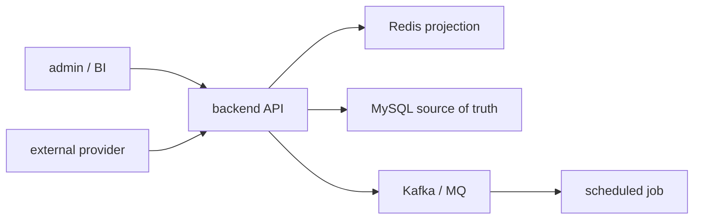

# 大專案 / 子專案地圖與架構圖系統

這份文件補第三層：全局地圖。

只做 flow 會有一個問題：每條 flow 都懂一點，但不知道它在整個產品裡的位置。Senior / Owner 需要先知道：

- 整個產品有哪些子系統。
- 每個 repo 負責什麼。
- 哪些是 API、job、admin、client、deploy、library。
- 哪些 repo 之間有上下游關係。
- 哪些 flow 橫跨多個 repo。
- 哪些地方只是入口，不是核心後端。

所以 `projects/` 之後要分三層：

```text
產品 / domain 地圖
-> 子專案 / repo 地圖
-> 單條 production flow
```

注意：地圖是入口，不是主菜。

地圖只做到能回答「這條 flow 應該去哪個 repo 讀」即可。不要為了完整而畫過度抽象、沒有 evidence 的架構圖。當地圖已足夠定位 flow，就要回到單條 flow 深挖。

## 收斂後必須回補大地圖

Domain / system map 不是可有可無的口頭建議。當某個 domain 已經累積足夠代表 project、representative flows 或 contribution consolidation 後，AI 必須主動檢查並回補最外層總結圖。

觸發條件：

- 某 domain 已完成多個 project-level contribution consolidation。
- 某 domain 的代表 flows 已足以支撐履歷或面試主敘事。
- Nick 問「整個系統怎麼協作」、「大地圖」、「大結構」、「各子模組怎麼配合」、「做完後怎麼總結」。
- rolling resume package 已吃進多個 project-level claims，但 domain-level architecture / integration map 還不存在或過舊。

必須檢查的位置：

```text
projects/{domain}/README.md
projects/{domain}/architecture-map.md
projects/{domain}/integration-map.md
projects/{domain}/career-interview.md
```

如果不存在，要列為待辦或直接建立；如果存在但沒有吸收最新 completed flows / contribution consolidation，要標為需 refresh。

大地圖的責任：

- 說明整個 domain 的 repo / 子專案分工。
- 說明 API、job、admin、client、deploy、library、workspace 的協作關係。
- 把 money flow、bet / settle flow、provider callback、report / BI、MQ / job、deploy / rollout 分開。
- 標清楚哪些是 Nick 真實開發過，哪些是 code-backed / interview-only / supporting。
- 把已完成代表 flows 放在正確位置，避免單條 flow 看懂但不知道它屬於整個系統哪一段。

大地圖不是履歷 claim 自動升級器。沒有 project-level consolidation 或本人 / commit evidence，不得因為畫在 system map 上就寫成 Nick 主導整個系統。

目前已知缺口例子：

- `projects/iwin/` 已有 README，但尚未建立 domain-level `architecture-map.md` / `integration-map.md`；之後 iwin 代表 project 收斂後，應補 `iwin system map v1`。
- `projects/antplay/` 與 `projects/ugsoft/` 也應在代表 project / flows 足夠後檢查是否需要 domain-level map，不要只停在各 repo 的 flow 文件。

## 建議結構

```text
projects/{domain}/
  README.md
  architecture-map.md
  integration-map.md
  career-interview.md

  {project}/
    README.md
    architecture-map.md
    flows/
      {flow-name}/
        flow.md
        career-interview.md
        materials/
          evidence.md
          decision-notes.md
          interview.md
          claim-boundary.md
```

## Domain 地圖

位置：

```text
projects/{domain}/architecture-map.md
```

用途：

- 看整個 domain 的產品組成。
- 看每個 repo 的責任。
- 看哪些 repo 是核心後端，哪些只是後台 / 前端 / 部署。
- 看跨 repo flow 應該從哪裡開始讀。

應包含：

1. 產品定位
2. repo 清單
3. repo 類型
4. 技術棧
5. 上下游關係
6. 核心 production flows
7. 高風險邊界
8. Nick 可主張 / 不可主張

Repo 類型建議：

- `backend-api`
- `backend-job`
- `admin-api`
- `admin-web`
- `frontend`
- `client`
- `library`
- `deploy`
- `observability`
- `simulator`
- `workspace`
- `unknown`

## Integration 地圖

位置：

```text
projects/{domain}/integration-map.md
```

用途：

- 看跨 repo / 跨服務資料怎麼流。
- 找 money flow、MQ flow、callback flow、report flow。
- 避免只看單一 repo 就誤判完整系統。

應包含：

1. API 呼叫關係
2. DB / Redis / MQ / external provider 關係
3. callback / notify 關係
4. job / batch / report 關係
5. admin / control plane 入口
6. 下游 runtime service
7. 未確認邊界

可以用 Mermaid，但不要為了畫圖而腦補。沒有 evidence 就標「待確認」。

範例：



## Project 地圖

位置：

```text
projects/{domain}/{project}/architecture-map.md
```

用途：

- 看單一 repo 的 module 結構。
- 看入口在哪裡。
- 看哪些 module 值得深挖成 flow。
- 看哪些 module 只是 CRUD / support，不優先。

應包含：

1. repo 定位
2. module / package / directory map
3. 入口類型
4. 主要資料來源
5. external integration
6. scheduled jobs / consumers
7. high-value candidate flows
8. 不值得深挖的低價值區域

## 和 Step 1 / Step 2 / Flow 的關係

建議順序：

1. 先做 domain architecture-map。
2. 再做 project architecture-map。
3. 再做 Step 1 candidate flows。
4. 再做 Step 2 ranking。
5. 再選一條 flow 做 Step 3。
6. flow 讀清楚後補 decision-notes。

但如果 Nick 已經指定單一 flow，可以先做 flow；之後再回補地圖。

回補規則：

- Step 1 / Step 2 時的 map 是粗版定位圖。
- 單條 flow Step 3-5 會修正 map 的細節。
- Project contribution consolidation 會補 Nick claim / interview boundary。
- 如果已有 active flow 做到 Step 3 / Step 4 但尚未 Step 5，下一步必須先讓該 flow 收口，domain / system map 只能列為收口後待辦；除非 Nick 明確說暫停 flow、先做大地圖。
- 當同一 domain 有多個 project 已完成代表 flow 或 contribution consolidation，下一輪「下一步 / 總結 / 大地圖」不得只繼續推新 flow；必須先檢查 domain map 是否缺漏或過期。
- 若 domain map 缺漏，下一步要建議 `{domain} system map v1`，除非 Nick 明確指定先做其他 flow。

## 地圖不等於履歷

地圖是理解系統用，不是履歷 claim。

可以寫：

- 此 repo 在系統中扮演 admin / control plane。
- 此 repo 可能呼叫下游 backend。
- 此 flow 需要再掃 payment / game_api / game_job 才能確認完整路徑。

不能寫：

- Nick 主導整個 domain 架構。
- Nick 是完整系統 owner。
- Nick 設計所有跨服務關係。

除非有正式證據。

## 提示詞

### Domain Map

```text
請建立 {domain} 的大專案地圖。

請深掃：
- /Users/nick/Git/{domain 或對應目錄}
- nick-vault 既有 projects/{domain}
- archive 相關舊資料

只能動 nick-vault。
公司專案只能讀，不能改。
不要複製舊檔。
不要寫 secret、token、內網 IP、production URL、客戶資料。

請輸出到：
- projects/{domain}/README.md
- projects/{domain}/architecture-map.md
- projects/{domain}/integration-map.md

請包含：
1. domain 產品定位
2. repo 清單與中文名稱
3. 每個 repo 類型
4. 每個 repo 可能負責的 production 能力
5. repo 之間的上下游關係
6. 已確認 / 推測 / 待確認
7. 哪些 repo 適合先做 flow
8. 哪些只是後台 / 前端 / deploy / workspace，不要誇大
9. 下一步只推薦一件事
```

### Project Map

```text
請建立 {domain}/{project} 的子專案地圖。

請深掃該 repo：
- README
- route / controller / service / repository / model / config
- job / consumer / scheduler
- git branch / recent log / path-specific log

請輸出到：
- projects/{domain}/{project}/README.md
- projects/{domain}/{project}/architecture-map.md

請包含：
1. project 定位
2. module / directory map
3. 入口類型
4. 主要資料來源
5. external integration
6. high-value candidate flows
7. 低價值或暫不深挖區域
8. 已確認 / 推測 / 待確認
9. 下一步只推薦一件事
```
